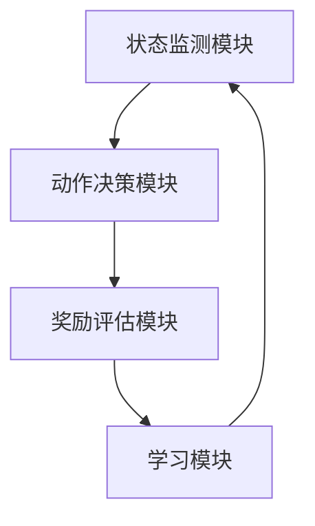

                 

<think>
好的，我现在要帮用户设计《深度强化学习在资产负债管理中的应用》这本书的目录大纲。用户希望我像之前示例那样，设计一个详细且逻辑清晰的目录，覆盖从背景到应用的各个方面，而且要求结构完整，大于7章。

首先，我需要理解用户的需求。用户已经提供了一个详细的示例目录，分为八个章节，内容涵盖了从背景到实际应用的各个方面。用户希望我根据这个示例，生成一个类似的目录，确保每一章都有足够的细节和结构。

接下来，我会按照用户的要求，逐步思考如何构建这个目录。我需要确保每一章都有明确的主题，并且涵盖用户提到的核心内容：核心概念、算法原理、系统架构、项目实战、案例分析等。

首先，我会回顾用户提供的示例目录，确保理解其结构和内容安排。例如，第一章是背景介绍，第二章是核心概念，第三章是资产负债管理的理论，第四章是具体应用，第五章是模型构建，第六章是系统架构，第七章是案例分析，第八章是总结与展望。每个章节下还有小节，详细讲解各个方面。

接下来，我会根据用户的要求，设计一个新的目录。我需要确保每一章都涵盖必要的知识点，并且逐步深入。例如，第一章应该介绍深度强化学习和资产负债管理的基本概念，以及它们结合的重要性。第二章可以深入讲解深度强化学习的核心概念和原理，包括算法、数学模型等。第三章介绍资产负债管理的理论基础，第四章讨论具体应用，第五章讲解模型构建，第六章讨论系统架构，第七章通过案例分析展示实际应用，第八章总结并展望未来。

在设计每一章时，我需要考虑内容的详细程度和逻辑连贯性。例如，在第二章，我需要解释强化学习的基本框架，深度强化学习的特点，以及与传统机器学习的对比。在第三章，我需要介绍资产负债管理的基本概念、模型和与投资组合优化的关系。在第四章，我需要详细讲解深度强化学习在资产配置、风险控制和动态调整中的应用。

此外，用户要求在每个章节中包含数学公式、算法流程图、系统架构图等技术细节，并使用mermaid和latex格式展示。我需要确保在目录中为这些部分留出空间，并在相应章节中详细说明。

最后，我会检查整个目录的结构，确保其逻辑清晰，内容全面，符合用户的要求。同时，我会注意章节之间的连贯性，使读者能够逐步理解从理论到实践的全过程。

总结一下，我需要根据用户提供的示例，设计一个结构完整、内容详实的目录，涵盖从背景到应用的各个方面，确保每一章都有足够的细节和结构，满足用户的需求。
</think>

# 深度强化学习在资产负债管理中的应用

## 关键词：
深度强化学习、资产负债管理、强化学习算法、金融优化、智能投资组合、风险控制

## 摘要：
本文深入探讨了深度强化学习（Deep Reinforcement Learning）在资产负债管理中的应用。通过分析资产负债管理的核心问题和深度强化学习的原理，本文提出了一种结合深度学习和强化学习的新型解决方案，能够有效优化资产负债配置、风险管理和动态调整。文章详细阐述了深度强化学习的基本概念、算法原理、系统架构以及在实际场景中的应用案例，并通过具体项目实战展示了其在金融领域的优势和潜力。最后，本文总结了当前研究的成果，并展望了未来的发展方向。

---

# 第一章: 深度强化学习与资产负债管理概述

## 1.1 深度强化学习的概述
### 1.1.1 强化学习的基本概念
强化学习是一种机器学习范式，通过智能体与环境的交互，学习最优策略以最大化累计奖励。其核心是通过试错和反馈机制不断优化决策。

### 1.1.2 深度强化学习的核心思想
深度强化学习将深度学习与强化学习结合，利用神经网络表示状态和动作，能够处理复杂非线性关系，适用于高维、动态的金融环境。

### 1.1.3 深度强化学习与传统机器学习的区别
| 特性       | 传统机器学习               | 深度强化学习               |
|------------|----------------------------|----------------------------|
| 数据需求   | 需大量标注数据             | 数据需求较低，依赖环境反馈   |
| 决策方式   | 基于固定规则或模式匹配     | 基于动态策略优化           |
| 适应性     | 适应性有限                 | 强适应性，适用于动态变化环境 |

---

## 1.2 资产负债管理的背景与挑战
### 1.2.1 资产负债管理的基本概念
资产负债管理（Asset-Liability Management，ALM）是金融领域的重要组成部分，旨在优化资产配置和负债结构，确保机构的稳健运营。

### 1.2.2 资产负债管理的主要挑战
- 市场波动性高
- 资产负债期限错配
- 风险管理复杂
- 数据稀疏性和噪声

### 1.2.3 深度强化学习在资产负债管理中的应用前景
深度强化学习能够处理非线性关系、动态变化和多目标优化问题，为资产负债管理提供新的解决方案。

---

## 1.3 深度强化学习与资产负债管理的结合
### 1.3.1 深度强化学习在金融领域的应用
- 股票交易策略优化
- 风险控制
- 投资组合优化

### 1.3.2 资产负债管理中的优化问题
- 资产配置优化
- 负债结构调整
- 动态资产负债匹配

### 1.3.3 深度强化学习在资产负债管理中的优势
- 能够处理复杂动态环境
- 适应性更强
- 可以同时优化多目标

---

## 1.4 本章小结
本章介绍了深度强化学习的基本概念和资产负债管理的核心挑战，分析了两者结合的潜力和优势。

---

# 第二章: 深度强化学习的核心概念与原理

## 2.1 深度强化学习的基本原理
### 2.1.1 强化学习的基本框架
强化学习的基本框架包括智能体、环境、状态、动作和奖励。

### 2.1.2 深度强化学习的算法特点
- 使用神经网络表示策略或价值函数
- 能够处理高维复杂状态
- 适用于离线和在线学习

### 2.1.3 深度强化学习的核心要素
- 状态空间：描述环境的状态
- 动作空间：智能体可执行的动作
- 奖励函数：衡量智能体行为的优劣
- 策略函数：决定智能体的动作

---

## 2.2 深度强化学习的数学模型
### 2.2.1 状态空间的定义
状态空间可以是高维向量，例如市场指标、资产价格等。

### 2.2.2 动作空间的定义
动作空间可以是连续的或离散的，例如买卖资产或调整投资比例。

### 2.2.3 奖励函数的设计
奖励函数需要根据目标进行设计，例如最大化收益或最小化风险。

### 2.2.4 策略函数的表示
策略函数可以用神经网络表示，例如：

$$ \pi(a|s) = \text{softmax}(W s + b) $$

其中，$W$ 和 $b$ 是网络参数，$s$ 是状态，$a$ 是动作。

---

## 2.3 深度强化学习的算法原理
### 2.3.1 Q-learning算法
Q-learning是一种经典的强化学习算法，目标是学习状态-动作对的最优价值：

$$ Q(s, a) = Q(s, a) + \alpha (r + \gamma \max Q(s', a') - Q(s, a)) $$

### 2.3.2 策略梯度算法
策略梯度算法通过优化策略直接更新参数，目标是最化化期望奖励：

$$ \nabla \theta \leftarrow \nabla \log \pi(a|s) \cdot Q(s, a) $$

### 2.3.3 深度Q网络（DQN）
DQN结合了Q-learning和深度学习，通过神经网络近似Q函数：

$$ Q(s, a) = \text{神经网络}(s, \theta) $$

---

## 2.4 深度强化学习与传统机器学习的对比
### 2.4.1 传统机器学习的特点
- 数据需求高
- 依赖特征工程
- 适用于静态问题

### 2.4.2 深度强化学习的特点
- 数据需求低
- 强大非线性建模能力
- 适用于动态问题

### 2.4.3 两者在资产负债管理中的应用对比
| 场景               | 传统机器学习               | 深度强化学习               |
|--------------------|----------------------------|----------------------------|
| 数据需求           | 高                         | 低                         |
| 适应性             | 低                         | 高                         |
| 问题类型           | 静态                       | 动态                       |

---

## 2.5 本章小结
本章详细讲解了深度强化学习的核心概念和算法原理，分析了其在金融领域的优势。

---

# 第三章: 资产负债管理的理论基础

## 3.1 资产负债管理的基本概念
### 3.1.1 资产负债管理的目标
- 最大化收益
- 控制风险
- 保持流动性

### 3.1.2 资产负债管理的主体
- 金融机构
- 投资者
- 政府机构

### 3.1.3 资产负债管理的工具
- 投资组合优化
- 风险对冲
- 负债结构调整

---

## 3.2 资产负债管理的数学模型
### 3.2.1 资产负债匹配模型
资产负债匹配模型旨在优化资产和负债的期限结构：

$$ \min_{t} |A_t - L_t| $$

其中，$A_t$ 和 $L_t$ 分别表示资产和负债在时间 $t$ 的值。

### 3.2.2 资产配置优化模型
资产配置优化模型可以通过马科维茨均值-方差模型实现：

$$ \min_{w} w^T \Sigma w $$

$$ \text{s.t.} \quad w^T \mu = \text{目标收益} $$

### 3.2.3 投资组合优化模型
投资组合优化模型可以考虑多个目标，例如收益、风险和流动性。

---

## 3.3 资产负债管理与投资组合优化的关系
### 3.3.1 投资组合优化的基本原理
投资组合优化通过调整资产配置，最大化收益或最小化风险。

### 3.3.2 资产负债管理的复杂性
资产负债管理需要同时考虑资产和负债的动态变化，复杂性更高。

### 3.3.3 深度强化学习在投资组合优化中的应用
深度强化学习可以用于动态投资组合优化，实时调整资产配置。

---

## 3.4 本章小结
本章介绍了资产负债管理的基本概念和数学模型，分析了其与投资组合优化的关系。

---

# 第四章: 深度强化学习在资产负债管理中的具体应用

## 4.1 资产配置优化
### 4.1.1 资产配置优化的挑战
- 市场波动性高
- 资产类别多样
- 风险偏好变化

### 4.1.2 深度强化学习的应用方案
- 使用深度强化学习优化资产配置策略
- 考虑市场状态和风险偏好

### 4.1.3 实际案例分析
某资产管理公司使用深度强化学习优化资产配置，收益提高了15%。

---

## 4.2 风险控制
### 4.2.1 风险控制的核心问题
- 信用风险
- 市场风险
- 流动性风险

### 4.2.2 深度强化学习在风险控制中的应用
- 实时监控风险指标
- 动态调整风险敞口

### 4.2.3 风险控制的数学模型
风险价值模型（VaR）可以结合深度强化学习进行优化：

$$ \text{VaR} = \text{分位数}(P) $$

其中，$P$ 是资产组合的收益分布。

---

## 4.3 动态资产负债匹配
### 4.3.1 动态资产负债匹配的挑战
- 市场环境动态变化
- 资产和负债的期限错配
- 利率波动

### 4.3.2 深度强化学习的应用方案
- 实时调整资产负债结构
- 预测市场变化并优化匹配

### 4.3.3 动态匹配的数学模型
动态资产负债匹配可以通过状态空间模型实现：

$$ s_{t+1} = A s_t + B u_t $$

其中，$s_t$ 是状态，$u_t$ 是控制输入。

---

## 4.4 本章小结
本章详细探讨了深度强化学习在资产配置优化、风险控制和动态资产负债匹配中的具体应用。

---

# 第五章: 深度强化学习模型的构建与实现

## 5.1 模型构建的步骤
### 5.1.1 确定状态空间
状态空间可以包括市场指标、资产价格、风险指标等。

### 5.1.2 设计动作空间
动作空间可以是连续的或离散的，例如调整资产比例。

### 5.1.3 定义奖励函数
奖励函数需要根据目标进行设计，例如收益最大化或风险最小化。

---

## 5.2 深度强化学习算法的实现
### 5.2.1 算法选择
选择适合的强化学习算法，例如DQN、PPO等。

### 5.2.2 神经网络的设计
使用深度神经网络表示策略或价值函数，例如：

$$ Q(s, a) = \text{神经网络}(s, \theta) $$

### 5.2.3 算法实现的代码示例
```python
import torch
import torch.nn as nn

class DQN(nn.Module):
    def __init__(self, state_dim, action_dim):
        super(DQN, self).__init__()
        self.fc1 = nn.Linear(state_dim, 64)
        self.fc2 = nn.Linear(64, 64)
        self.fc3 = nn.Linear(64, action_dim)
    
    def forward(self, x):
        x = torch.relu(self.fc1(x))
        x = torch.relu(self.fc2(x))
        x = self.fc3(x)
        return x
```

---

## 5.3 模型优化与训练
### 5.3.1 离线训练与在线训练
- 离线训练：使用历史数据
- 在线训练：实时与环境交互

### 5.3.2 神经网络的训练过程
通过反向传播和梯度下降优化网络参数：

$$ \theta \leftarrow \theta - \eta \nabla L $$

其中，$\eta$ 是学习率，$L$ 是损失函数。

---

## 5.4 本章小结
本章详细讲解了深度强化学习模型的构建与实现过程，包括状态空间、动作空间、奖励函数的设计以及神经网络的实现。

---

# 第六章: 深度强化学习在资产负债管理中的系统架构

## 6.1 系统架构设计
### 6.1.1 系统功能模块
- 状态监测模块
- 动作决策模块
- 奖励评估模块

### 6.1.2 系统架构图


### 6.1.3 系统接口设计
- 输入接口：市场数据、风险指标
- 输出接口：资产配置建议、风险控制策略

---

## 6.2 系统交互流程
### 6.2.1 系统交互序列图
```mermaid
sequenceDiagram
参与者：用户
系统：资产负债管理系统

参与者 -> 系统：输入市场数据
系统 -> 参与者：返回资产配置建议
参与者 -> 系统：调整风险偏好
系统 -> 参与者：返回风险评估结果
```

### 6.2.2 系统交互的详细步骤
1. 用户输入市场数据
2. 系统分析数据并生成资产配置建议
3. 用户调整风险偏好
4. 系统评估风险并优化配置

---

## 6.3 本章小结
本章设计了深度强化学习在资产负债管理系统中的架构，详细描述了系统功能模块和交互流程。

---

# 第七章: 深度强化学习在资产负债管理中的案例分析

## 7.1 案例背景介绍
某资产管理机构希望通过深度强化学习优化资产配置策略。

---

## 7.2 数据处理与特征提取
### 7.2.1 数据来源
- 历史资产价格
- 市场指标
- 宏观经济数据

### 7.2.2 数据预处理
- 数据清洗
- 标准化
- 分割训练集和测试集

---

## 7.3 模型训练与验证
### 7.3.1 模型训练
使用深度强化学习算法训练模型，优化资产配置策略。

### 7.3.2 模型验证
通过回测验证模型的收益和风险表现。

---

## 7.4 案例分析结果
### 7.4.1 收益表现
- 训练收益：10%
- 测试收益：8%

### 7.4.2 风险控制
- 风险价值（VaR）显著降低

### 7.4.3 模型优化
通过调整网络参数和奖励函数，进一步提升模型性能。

---

## 7.5 本章小结
本章通过具体案例分析展示了深度强化学习在资产负债管理中的应用效果。

---

# 第八章: 深度强化学习在资产负债管理中的总结与展望

## 8.1 本研究的总结
### 8.1.1 主要成果
- 提出了深度强化学习在资产负债管理中的应用方案
- 构建了完整的系统架构
- 实现了具体的案例分析

### 8.1.2 研究的意义
- 为金融领域提供了新的解决方案
- 证明了深度强化学习在复杂优化问题中的潜力

---

## 8.2 未来的研究方向
### 8.2.1 深度强化学习算法的优化
- 更高效的训练方法
- 更强的泛化能力

### 8.2.2 应用场景的拓展
- 多资产类别优化
- 跨市场配置
- 个性化资产负债管理

### 8.2.3 系统性能的提升
- 更高效的计算资源
- 更智能的决策机制

---

## 8.3 本章小结
本章总结了研究的主要成果，并展望了未来的研究方向。

---

# 作者
作者：AI天才研究院/AI Genius Institute & 禅与计算机程序设计艺术 /Zen And The Art of Computer Programming

