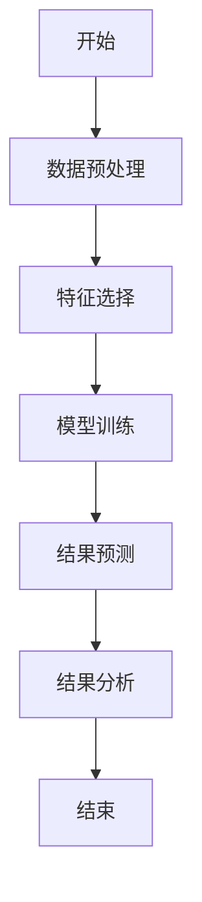
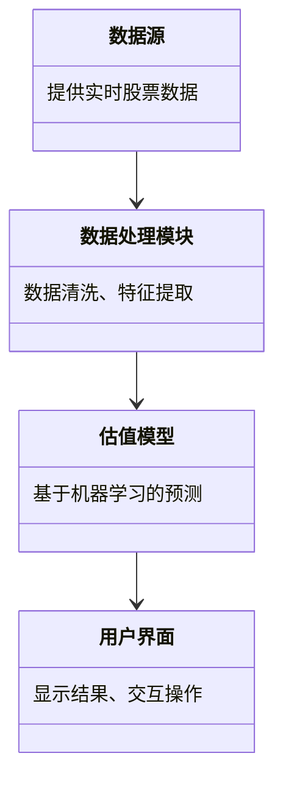

                 


# 澳大利亚股市估值:资源丰富国家的市场特点

## 关键词：澳大利亚股市, 股市估值, 资源丰富国家, 矿业, 能源, 宏观经济

## 摘要：
本文深入分析澳大利亚股市的估值方法，结合其作为资源丰富国家的独特市场特点，探讨矿业、农业和能源等行业对股市的影响。通过宏观经济分析和国际比较，揭示澳大利亚股市的独特性，并提供实用的估值算法和系统架构设计，帮助投资者更好地理解和把握市场动态。

---

# 目录

## 第一部分: 澳大利亚股市估值概述

### 第1章: 澳大利亚股市估值的背景与特点

#### 1.1 澳大利亚股市的基本概况
- 1.1.1 澳大利亚股市的历史与发展
- 1.1.2 澳大利亚股市的市场结构
- 1.1.3 澳大利亚股市的独特特点

#### 1.2 资源丰富国家的市场特点
- 1.2.1 矿业对澳大利亚股市的影响
- 1.2.2 农业与能源对股市的推动作用
- 1.2.3 资源型经济与股市的互动关系

#### 1.3 澳大利亚股市的估值方法
- 1.3.1 市盈率（P/E）的计算与应用
- 1.3.2 市净率（P/B）的计算与应用
- 1.3.3 股息率的计算与应用

### 第2章: 澳大利亚股市的行业分析

#### 2.1 资源行业的市场地位
- 2.1.1 矿业在澳大利亚股市中的比重
- 2.1.2 矿业公司的估值方法
- 2.1.3 矿业周期对股市的影响

#### 2.2 农业与能源行业的市场分析
- 2.2.1 农业在澳大利亚经济中的地位
- 2.2.2 能源行业的市场表现
- 2.2.3 农业与能源行业的估值差异

#### 2.3 其他主要行业的表现
- 2.3.1 金融行业的市场地位
- 2.3.2 零售行业的市场表现
- 2.3.3 制造业的市场影响

### 第3章: 澳大利亚股市的宏观经济分析

#### 3.1 宏观经济指标对股市的影响
- 3.1.1 GDP增长与股市的关系
- 3.1.2 失业率对股市的影响
- 3.1.3 消费者价格指数（CPI）对股市的影响

#### 3.2 货币政策与股市的关系
- 3.2.1 利率政策对股市的影响
- 3.2.2 货币政策的传导机制
- 3.2.3 中央银行对股市的干预

#### 3.3 财政政策对股市的影响
- 3.3.1 政府支出对股市的影响
- 3.3.2 税收政策对股市的影响
- 3.3.3 财政赤字对股市的影响

### 第4章: 澳大利亚股市的国际比较

#### 4.1 全球主要股市的对比分析
- 4.1.1 美国股市的市场特点
- 4.1.2 欧洲股市的市场特点
- 4.1.3 亚洲股市的市场特点

#### 4.2 澳大利亚股市的独特性
- 4.2.1 资源型经济对股市的影响
- 4.2.2 澳大利亚股市的国际化程度
- 4.2.3 澳大利亚股市的风险与机遇

#### 4.3 跨国公司对澳大利亚股市的影响

---

## 第二部分: 澳大利亚股市估值的算法与系统架构

### 第5章: 股市估值的核心算法

#### 5.1 常见的估值方法
- 市盈率（P/E）计算公式：
$$ P/E = \frac{Price}{Earnings} $$
- 市净率（P/B）计算公式：
$$ P/B = \frac{Price}{Book\ Value} $$
- 股息率计算公式：
$$ Dividend\ Yield = \frac{Dividend}{Price} $$

#### 5.2 机器学习在估值中的应用
- 简单线性回归模型：
$$ y = a x + b $$
- 算法流程图（使用 Mermaid）：


### 第6章: 系统架构设计

#### 6.1 系统需求分析
- 用户需求：实时数据获取、估值模型计算、市场趋势分析
- 功能需求：数据采集、清洗、分析、可视化

#### 6.2 系统架构设计（使用 Mermaid）


#### 6.3 系统接口设计
- 数据接口：API调用
- 用户接口：Web界面

### 第7章: 项目实战

#### 7.1 环境安装
- Python 3.8+
- 必需库：Pandas、NumPy、Scikit-learn

#### 7.2 核心代码实现
```python
import pandas as pd
from sklearn.linear_model import LinearRegression

# 示例数据加载
data = pd.read_csv('stock_data.csv')

# 特征选择
features = ['P/E', 'P/B']
target = 'Price'

# 模型训练
model = LinearRegression()
model.fit(data[features], data[target])

# 预测结果
predicted_price = model.predict([[20, 2.5]])
print(predicted_price)
```

#### 7.3 案例分析
- 数据来源：ASX200指数成分股
- 分析步骤：数据清洗、特征选择、模型训练、结果可视化

---

## 第三部分: 结论与展望

### 第8章: 结论与展望

#### 8.1 核心结论
- 资源行业对澳大利亚股市的显著影响
- 综合估值方法的重要性
- 机器学习在股市分析中的潜力

#### 8.2 未来展望
- 更复杂的模型开发
- 多因子模型的应用
- 全球市场的进一步对比研究

---

## 作者：AI天才研究院 & 禅与计算机程序设计艺术

