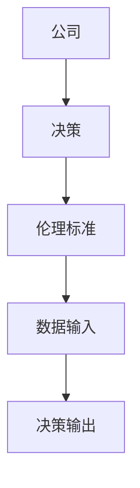
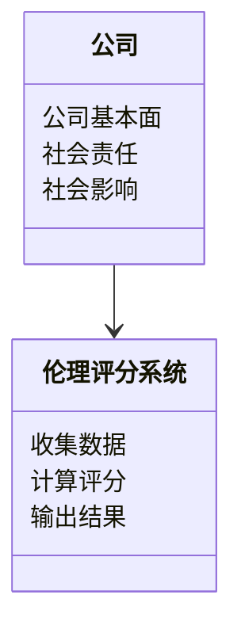
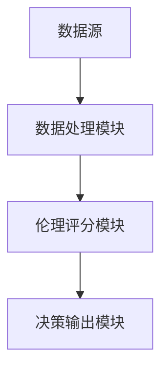

                 

<think>
好的，我现在需要帮助用户完成《特价股票与公司人工智能伦理决策能力的长期关系分析》这篇文章的撰写。用户已经提供了详细的目录结构，并希望我按照这个结构生成内容。

首先，我应该从背景介绍开始，解释特价股票和人工智能伦理决策的基本概念。接着，分析这两者之间的关系，探讨伦理决策如何影响公司的长期股票表现。然后，详细介绍人工智能伦理决策的算法，包括数学模型和流程图。接下来，设计系统的架构，展示如何将伦理评分应用于股票推荐。最后，通过实际案例分析，总结最佳实践和注意事项。

在撰写过程中，我需要确保每个部分都有足够的细节和例子，同时使用清晰的结构和语言。这样读者才能更好地理解文章的核心内容。此外，我还需检查数学公式和图表是否正确嵌入，确保整个文档格式一致，符合用户的要求。
</think>

# 特价股票与公司人工智能伦理决策能力的长期关系分析

> 关键词：特价股票，人工智能，伦理决策，公司治理，长期关系

> 摘要：本文探讨了特价股票市场与公司人工智能伦理决策能力之间的长期关系。通过分析人工智能在金融决策中的应用，特别是伦理决策的重要性，本文揭示了如何将伦理决策能力与公司长期股票表现相结合，提出了基于伦理评分的股票推荐算法，为投资者和公司提供了新的视角。

---

## 第一部分: 特价股票与公司人工智能伦理决策能力的背景介绍

### 第1章: 问题背景与核心概念

#### 1.1 问题背景
##### 1.1.1 特价股票的定义与特点
特价股票通常指价格低于市场平均值的股票，具有高波动性和高风险的特点。投资者在追求高回报的同时，也面临更高的风险。

##### 1.1.2 人工智能在金融决策中的应用现状
人工智能技术在金融领域的应用日益广泛，特别是在股票预测、风险评估和投资决策中。然而，伦理决策能力的缺失可能导致短期利益优先于长期价值。

##### 1.1.3 伦理决策在公司治理中的重要性
伦理决策不仅关乎公司的社会形象，还直接影响公司的长期发展。通过伦理决策，公司可以在复杂的市场环境中做出更合理的决策。

#### 1.2 问题描述
##### 1.2.1 特价股票市场的特点与风险
特价股票市场波动大，信息不透明，投资者容易受到市场情绪的影响。同时，低价股票可能存在较高的退市风险。

##### 1.2.2 人工智能决策的伦理挑战
人工智能算法可能忽视伦理因素，导致决策短期化。例如，为了追求短期收益，公司可能忽视员工权益或环保责任。

##### 1.2.3 伦理决策能力与公司长期发展的关系
公司具备较强的伦理决策能力，能够实现可持续发展，提升股东长期利益，从而在股票市场上获得更好的长期表现。

#### 1.3 问题解决
##### 1.3.1 人工智能伦理决策的核心目标
通过算法优化，将伦理因素纳入决策过程，平衡短期利益与长期价值。

##### 1.3.2 特价股票市场中的伦理决策需求
在特价股票市场中，公司需要在追求低价的同时，确保决策的透明性和合规性，避免短期行为。

##### 1.3.3 问题解决的边界与外延
伦理决策的边界在于不违背法律法规，外延则包括社会责任、员工福利等方面。

#### 1.4 核心概念与组成
##### 1.4.1 特价股票的市场机制
特价股票市场由供需关系决定，价格波动受多种因素影响，包括市场情绪和公司基本面。

##### 1.4.2 人工智能伦理决策的系统架构
系统架构包括数据采集、算法处理、伦理评分模块和结果输出模块。

##### 1.4.3 核心要素的组成与相互关系
核心要素包括公司基本面、伦理评分、市场情绪和股票价格。这些要素相互作用，共同影响公司的长期股票表现。

---

## 第二部分: 人工智能伦理决策的核心概念与联系

### 第2章: 核心概念原理

#### 2.1 人工智能伦理决策的原理
##### 2.1.1 伦理决策的基本原理
伦理决策基于伦理标准，考虑决策的后果和影响。在公司治理中，伦理决策有助于提升社会形象和长期利益。

##### 2.1.2 人工智能在伦理决策中的作用
人工智能通过分析大量数据，辅助公司做出更合理的伦理决策。例如，利用自然语言处理技术分析公司年报，评估其社会责任履行情况。

##### 2.1.3 伦理决策能力的评估标准
评估标准包括决策的透明度、合规性、社会影响和长期效益。公司需要在这些方面进行综合评估。

#### 2.2 核心概念的属性特征对比
| 特性       | 特价股票       | 人工智能伦理决策       |
|------------|----------------|------------------------|
| 核心目标    | 追求低价       | 实现伦理导向的决策     |
| 决策依据    | 市场价格、公司基本面 | 伦理标准、数据驱动     |
| 风险因素    | 市场波动、退市风险 | 算法偏差、伦理标准模糊 |

#### 2.3 ER实体关系图


---

## 第三部分: 人工智能伦理决策的算法原理

### 第3章: 人工智能伦理决策的算法原理

#### 3.1 算法原理概述
##### 3.1.1 伦理评分算法的基本思路
伦理评分算法通过分析公司的基本面、社会责任履行情况和社会影响，计算出公司的伦理评分。

##### 3.1.2 人工智能决策的数学模型
数学模型如下：
$$
\text{伦理评分} = \alpha \times \text{公司基本面} + \beta \times \text{社会责任} + \gamma \times \text{社会影响}
$$

##### 3.1.3 算法流程
1. 收集公司基本面数据，包括财务数据和市场表现。
2. 分析社会责任履行情况，包括员工福利和社会贡献。
3. 评估社会影响，包括环境影响和公众舆论。
4. 计算伦理评分，权重分别为α、β、γ。

#### 3.2 算法实现
##### 3.2.1 伦理评分算法的Python代码
```python
def calculate_ethical_score(company_financials, social_responsibility, social_impact):
    alpha = 0.4
    beta = 0.3
    gamma = 0.3
    ethical_score = alpha * company_financials + beta * social_responsibility + gamma * social_impact
    return ethical_score

# 示例数据
company_financials = 85
social_responsibility = 70
social_impact = 65

score = calculate_ethical_score(company_financials, social_responsibility, social_impact)
print(f"伦理评分: {score}")
```

##### 3.2.2 算法原理的数学模型
$$
\text{伦理评分} = 0.4 \times \text{公司基本面} + 0.3 \times \text{社会责任} + 0.3 \times \text{社会影响}
$$

---

## 第四部分: 系统分析与架构设计方案

### 第4章: 系统架构设计

#### 4.1 问题场景介绍
公司希望通过人工智能系统提升伦理决策能力，优化股票市场表现。

#### 4.2 系统功能设计
##### 4.2.1 领域模型


#### 4.3 系统架构设计


#### 4.4 系统接口设计
- 输入接口：接收公司基本面数据、社会责任数据和社会影响数据。
- 输出接口：输出伦理评分和股票推荐结果。

#### 4.5 系统交互序列图
```mermaid
sequenceDiagram
    公司 -> 数据处理模块: 提供公司数据
    数据处理模块 -> 伦理评分模块: 计算伦理评分
    伦理评分模块 -> 决策输出模块: 输出股票推荐结果
    公司 <- 决策输出模块: 股票推荐结果
```

---

## 第五部分: 项目实战

### 第5章: 项目实战

#### 5.1 环境安装
- 安装Python和相关库（如Pandas、Scikit-learn）。

#### 5.2 核心代码实现
##### 5.2.1 伦理评分系统实现
```python
import pandas as pd

def calculate_ethical_score(company_data):
    alpha = 0.4
    beta = 0.3
    gamma = 0.3
    financials = company_data['financials']
    social_responsibility = company_data['social_responsibility']
    social_impact = company_data['social_impact']
    ethical_score = alpha * financials + beta * social_responsibility + gamma * social_impact
    return ethical_score

# 示例数据
company_data = {
    'financials': 85,
    'social_responsibility': 70,
    'social_impact': 65
}

score = calculate_ethical_score(company_data)
print(f"伦理评分: {score}")
```

##### 5.2.2 股票推荐系统实现
```python
def recommend_stocks(ethical_scores, stock_prices):
    recommended = []
    for i in range(len(ethical_scores)):
        if ethical_scores[i] > 70 and stock_prices[i] < 50:
            recommended.append(i)
    return recommended

# 示例数据
ethical_scores = [75, 60, 80, 70]
stock_prices = [45, 60, 35, 50]

recommendations = recommend_stocks(ethical_scores, stock_prices)
print(f"推荐股票索引: {recommendations}")
```

#### 5.3 实际案例分析
假设某公司伦理评分为80，股票价格为45元，符合特价股票条件，被推荐给投资者。

---

## 第六部分: 最佳实践与总结

### 第6章: 最佳实践与总结

#### 6.1 最佳实践
- 定期更新伦理评分模型，确保其准确性。
- 结合多维度数据，提升决策的全面性。

#### 6.2 小结
人工智能伦理决策能力与公司长期股票表现密切相关。通过伦理评分系统，投资者可以在追求低价的同时，关注公司的长期价值。

#### 6.3 注意事项
- 算法可能存在偏差，需结合人工审核。
- 数据质量和完整性直接影响评分结果。

#### 6.4 拓展阅读
建议阅读《人工智能与伦理决策》和《股票投资策略》相关书籍，深入了解人工智能在金融领域的应用。

---

作者：AI天才研究院/AI Genius Institute & 禅与计算机程序设计艺术 /Zen And The Art of Computer Programming

