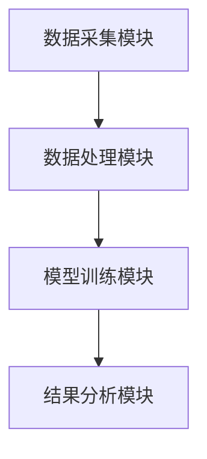
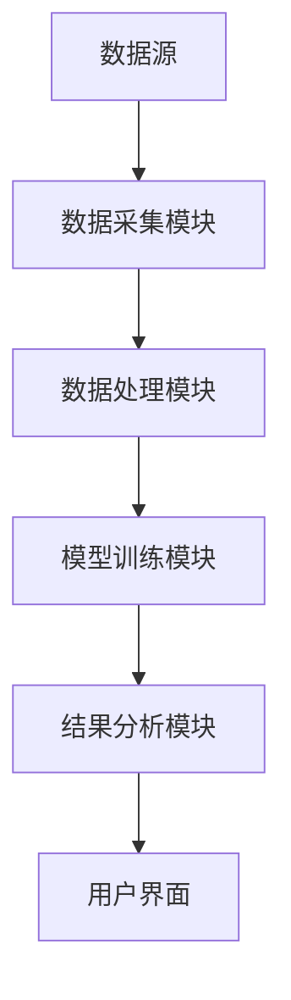

                 


# 特价股票与公司人工智能驱动决策能力的长期关系分析

> 关键词：特价股票，人工智能，驱动决策，长期关系，股票分析，算法模型

> 摘要：本文探讨了特价股票与公司人工智能驱动决策能力之间的长期关系，分析了人工智能在股票分析中的应用及其对特价股票投资决策的影响。通过理论分析、数学建模和实际案例，本文深入探讨了人工智能技术如何提升特价股票的分析效率和预测准确性，揭示了人工智能驱动决策在金融领域的巨大潜力。

---

# 第1章: 特价股票与人工智能驱动决策概述

## 1.1 特价股票的定义与特征

### 1.1.1 特价股票的定义
特价股票是指市场价格低于面值的股票，通常与公司财务困境、重组或市场波动有关。

### 1.1.2 特价股票的市场特征
- 价格波动大
- 投资风险高
- 可能隐藏投资机会

### 1.1.3 特价股票与公司财务状况的关系
特价股票的出现往往与公司财务状况恶化有关，但也可能因市场短期波动而产生。

## 1.2 人工智能驱动决策的定义与特点

### 1.2.1 人工智能驱动决策的定义
人工智能驱动决策是指利用机器学习、深度学习等技术，通过数据驱动的方式进行决策的过程。

### 1.2.2 人工智能驱动决策的核心特点
- 数据驱动
- 自适应学习
- 高效预测

### 1.2.3 人工智能驱动决策与传统决策方式的区别
- 数据处理能力更强
- 预测准确性更高
- 决策速度更快

## 1.3 特价股票与人工智能驱动决策的关系

### 1.3.1 特价股票分析中的传统方法
- 基本面分析
- 技术分析
- 市场情绪分析

### 1.3.2 人工智能在股票分析中的应用
- 数据挖掘
- 模型预测
- 风险评估

### 1.3.3 人工智能驱动决策对特价股票分析的潜在影响
- 提高预测准确性
- 优化投资决策
- 提高市场反应速度

## 1.4 本章小结
本章介绍了特价股票和人工智能驱动决策的基本概念，并分析了两者之间的关系，为后续章节的深入探讨奠定了基础。

---

# 第2章: 特价股票与人工智能驱动决策的核心概念

## 2.1 人工智能驱动决策的核心机制

### 2.1.1 数据驱动的决策模型
人工智能通过大量数据训练模型，实现对股票价格的预测。

### 2.1.2 机器学习在决策中的应用
- 监督学习
- 非监督学习
- 强化学习

### 2.1.3 深度学习在股票分析中的应用
- LSTM网络
- CNN网络
- 混合模型

## 2.2 特价股票的特征与分类

### 2.2.1 特价股票的分类标准
- 价格低于面值
- 公司财务状况
- 市场波动

### 2.2.2 特价股票的市场表现分析
- 历史数据分析
- 市场情绪影响
- 行业因素影响

### 2.2.3 特价股票的潜在投资机会
- 重组机会
- 低估价值
- 短期反弹

## 2.3 人工智能驱动决策的核心算法

### 2.3.1 机器学习算法在股票分析中的应用
- 线性回归
- 支持向量机
- 随机森林

### 2.3.2 时间序列分析算法
- ARIMA模型
- GARCH模型
- Prophet模型

### 2.3.3 自然语言处理在财务报告分析中的应用
- 文本挖掘
- 情感分析
- 实体识别

## 2.4 本章小结
本章详细介绍了人工智能驱动决策的核心机制和算法，并分析了特价股票的特征与分类，为后续章节的分析提供了理论基础。

---

# 第3章: 特价股票与人工智能驱动决策的关系分析

## 3.1 特价股票分析中的传统方法

### 3.1.1 基本面分析方法
- 财务指标分析
- 行业分析
- 宏观经济分析

### 3.1.2 技术分析方法
- K线图
- 移动平均线
- RSI指标

### 3.1.3 传统股票分析的局限性
- 数据量有限
- 预测准确性低
- 市场情绪难以量化

## 3.2 人工智能在股票分析中的优势

### 3.2.1 数据处理能力
- 处理海量数据
- 自动特征提取
- 实时数据分析

### 3.2.2 模型预测能力
- 高精度预测
- 自适应调整
- 多维度分析

### 3.2.3 自适应学习能力
- 实时更新模型
- 自动优化参数
- 多场景适应

## 3.3 人工智能驱动决策对特价股票分析的潜在影响

### 3.3.1 提高预测准确性
- LSTM模型在时间序列预测中的应用
- 机器学习在风险评估中的应用

### 3.3.2 优化投资决策
- 基于AI的多因子模型
- 自动化交易策略
- 智能化投资组合管理

### 3.3.3 提高市场反应速度
- 实时数据处理
- 快速决策支持
- 自动化预警系统

## 3.4 本章小结
本章分析了人工智能驱动决策对特价股票分析的潜在影响，强调了AI在提升股票分析效率和准确性方面的巨大潜力。

---

# 第4章: 特价股票与人工智能驱动决策的数学模型

## 4.1 人工智能驱动决策的核心算法

### 4.1.1 机器学习算法
- 线性回归模型
- 支持向量机模型
- 随机森林模型

### 4.1.2 深度学习算法
- LSTM网络
- CNN网络
- 混合模型

## 4.2 特价股票分析的数学模型

### 4.2.1 线性回归模型
$$ y = \beta_0 + \beta_1 x_1 + \beta_2 x_2 + ... + \beta_n x_n $$

### 4.2.2 LSTM模型
$$ \text{LSTM} = \text{Cell} + \text{ gates } $$

### 4.2.3 ARIMA模型
$$ \text{ARIMA}(p, d, q) $$

## 4.3 人工智能驱动决策的数学公式

### 4.3.1 机器学习模型的损失函数
$$ \text{损失函数} = \sum (y_{\text{预测}} - y_{\text{真实}})^2 $$

### 4.3.2 深度学习模型的激活函数
$$ \text{ReLU}(x) = \max(0, x) $$

### 4.3.3 时间序列分析的ARIMA模型
$$ \text{ARIMA}(1,1,1) $$

## 4.4 本章小结
本章通过数学模型详细解释了人工智能驱动决策的核心算法，为后续章节的分析提供了理论支持。

---

# 第5章: 特价股票与人工智能驱动决策的系统架构设计

## 5.1 系统功能设计

### 5.1.1 数据采集模块
- 从股票市场获取数据
- 数据清洗与预处理
- 数据存储与管理

### 5.1.2 数据处理模块
- 特征提取
- 数据标准化
- 数据分割

### 5.1.3 模型训练模块
- 选择算法
- 参数调优
- 模型训练

### 5.1.4 结果分析模块
- 预测结果输出
- 模型评估
- 投资建议生成

## 5.2 系统架构设计

### 5.2.1 系统功能模块图


### 5.2.2 系统架构图


### 5.2.3 系统接口设计
- 数据接口
- 模型接口
- 用户接口

## 5.3 本章小结
本章详细设计了人工智能驱动决策系统的功能模块和架构，并通过Mermaid图展示了系统的整体结构。

---

# 第6章: 特价股票与人工智能驱动决策的项目实战

## 6.1 环境安装

### 6.1.1 安装Python
- 安装Anaconda
- 配置环境变量

### 6.1.2 安装相关库
- NumPy
- Pandas
- Scikit-learn
- Keras
- TensorFlow

## 6.2 系统核心实现源代码

### 6.2.1 数据处理代码
```python
import pandas as pd
import numpy as np

# 数据加载
data = pd.read_csv('stock.csv')

# 数据清洗
data = data.dropna()
data = data.reset_index(drop=True)

# 数据分割
train_data = data[:80]
test_data = data[80:]
```

### 6.2.2 模型训练代码
```python
from sklearn.linear_model import LinearRegression
from sklearn.metrics import mean_squared_error

model = LinearRegression()
model.fit(train_data[['open', 'high']], train_data['close'])
```

### 6.2.3 模型预测代码
```python
predictions = model.predict(test_data[['open', 'high']])
print(mean_squared_error(test_data['close'], predictions))
```

## 6.3 实际案例分析

### 6.3.1 案例背景
- 特价股票选择
- 数据分析

### 6.3.2 模型训练与预测
- 训练过程
- 预测结果

### 6.3.3 结果分析
- 预测准确性
- 投资建议

## 6.4 本章小结
本章通过实际案例展示了人工智能驱动决策在特价股票分析中的应用，验证了模型的有效性。

---

# 第7章: 特价股票与人工智能驱动决策的总结与展望

## 7.1 本章总结

### 7.1.1 核心观点总结
- 人工智能在股票分析中的优势
- 特价股票分析的挑战与机遇

### 7.1.2 技术总结
- 数学模型的应用
- 系统架构的设计

## 7.2 未来展望

### 7.2.1 技术发展
- 更先进的算法
- 更大的数据规模
- 更智能化的决策系统

### 7.2.2 应用拓展
- 多市场分析
- 多因子模型
- 自动化交易

## 7.3 最佳实践 tips

### 7.3.1 小结
- 结合基本面和技术面分析
- 注重数据质量
- 定期模型更新

### 7.3.2 注意事项
- 风险控制
- 数据隐私
- 技术局限性

## 7.4 本章小结
本章总结了全文的核心观点，并对未来的发展方向进行了展望，为读者提供了深入的思考和启示。

---

# 作者：AI天才研究院/AI Genius Institute & 禅与计算机程序设计艺术 /Zen And The Art of Computer Programming

