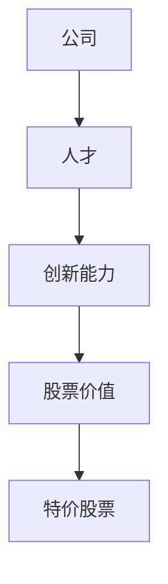
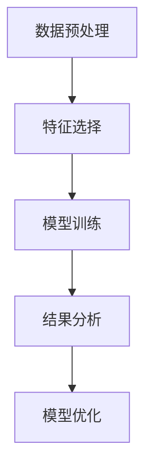

                 

<think>
好的，我需要按照用户的要求，详细设计《特价股票与公司人才创新能力的关系探讨》这本书的目录大纲。这本书需要结合金融和人力资源管理，探讨两者之间的关系。首先，我需要理解用户的需求，确保目录涵盖背景介绍、核心概念、算法原理、数学模型、系统架构、项目实战和总结等部分，并且每部分都要细化到三级目录。

首先，我会从背景介绍开始，解释特价股票和公司人才创新能力的定义、问题背景、描述以及解决方法。然后，分析核心概念，使用表格和ER图展示它们之间的关系。接下来，讲解算法原理，包括预测和评估模型的选择，以及优缺点对比。数学模型部分，我需要构建线性回归模型，并用Latex公式表示。系统架构设计部分，我会设计数据采集、处理和分析模块，并用Mermaid图展示。项目实战部分，会给出具体的Python代码，展示如何从数据处理到模型应用。最后，总结最佳实践和注意事项。

在撰写过程中，我需要确保每章内容连贯，逻辑清晰，使用专业术语，同时保持易懂。可能会遇到如何将金融和管理领域结合起来的挑战，但通过详细的结构设计和图表辅助，可以有效传达内容。
</think>

# 特价股票与公司人才创新能力的关系探讨

## 关键词：
- 特价股票
- 公司人才创新能力
- 股票价格
- 创新能力评估
- 金融市场

## 摘要：
本文探讨特价股票与公司人才创新能力之间的关系，分析公司创新能力如何影响股票价格，尤其是在特价股票市场中的表现。通过构建数学模型和算法，本文详细阐述了创新能力评估对股票价值的影响，并结合实际案例进行分析，为投资者和企业管理者提供理论支持和实践指导。

---

# 目录大纲

## 第一部分：特价股票与公司人才创新能力的背景与核心概念

### 第1章：特价股票与公司人才创新能力的背景介绍

#### 1.1 问题背景
- 1.1.1 特价股票的定义与特点
  - 特价股票的市场定位
  - 特价股票与普通股票的区别
- 1.1.2 公司人才创新能力的定义与特点
  - 创新能力的核心要素
  - 人才在创新能力中的作用
- 1.1.3 问题背景的演进与现状
  - 金融市场中创新能力的演变
  - 特价股票市场的现状分析

#### 1.2 问题描述
- 1.2.1 特价股票与公司创新能力的关系
  - 特价股票市场的波动性
  - 创新能力对股票价值的影响
- 1.2.2 问题的核心要素与边界
  - 关键变量的定义与范围
  - 问题的边界条件
- 1.2.3 问题的外延与扩展
  - 创新能力的多维度分析
  - 特价股票市场的多样性

#### 1.3 问题解决
- 1.3.1 研究方法的选择
  - 定量分析与定性分析的结合
- 1.3.2 数据来源与处理
  - 数据的获取与清洗
- 1.3.3 研究目标与框架
  - 研究的核心目标
  - 研究框架的构建

### 第2章：特价股票与公司人才创新能力的核心概念与联系

#### 2.1 核心概念的原理
- 2.1.1 特价股票的市场行为分析
  - 特价股票的波动机制
  - 市场参与者的行为模式
- 2.1.2 公司人才创新能力的构成要素
  - 人才结构分析
  - 创新能力的评估指标
- 2.1.3 核心概念的相互作用机制
  - 创新能力对股票价值的影响路径
  - 市场反馈对创新能力的促进作用

#### 2.2 核心概念的属性对比
- 2.2.1 特价股票与普通股票的对比分析
  - 价格波动性对比
  - 投资风险对比
- 2.2.2 公司人才创新能力与财务绩效的关系
  - 财务指标与创新能力的关联
  - 创新能力对股价的影响
- 2.2.3 核心概念的对比表格
  - 表格展示核心概念的属性对比

#### 2.3 ER实体关系图


---

## 第二部分：特价股票与公司人才创新能力的算法原理

### 第3章：特价股票与公司人才创新能力的算法原理

#### 3.1 算法原理概述
- 3.1.1 特价股票预测的算法选择
  - 时间序列分析
  - 机器学习算法（如随机森林、神经网络）
- 3.1.2 公司创新能力评估的算法选择
  - 层次分析法（AHP）
  - 主成分分析（PCA）
- 3.1.3 算法的优缺点对比
  - 各种算法的适用场景与局限性

#### 3.2 算法实现步骤
- 3.2.1 数据预处理
  - 数据清洗与标准化
  - 特征选择
- 3.2.2 模型训练
  - 算法参数调优
  - 模型验证与评估
- 3.2.3 结果分析
  - 模型预测结果解读
  - 结果与实际数据的对比

#### 3.3 算法流程图


#### 3.4 算法代码示例
```python
import pandas as pd
from sklearn.ensemble import RandomForestRegressor
from sklearn.metrics import mean_squared_error

# 数据加载与处理
data = pd.read_csv('stock_data.csv')
features = data[['创新指标1', '创新指标2', '创新指标3']]
target = data['股票价格']

# 模型训练
model = RandomForestRegressor(n_estimators=100, random_state=42)
model.fit(features, target)

# 模型预测
predicted_prices = model.predict(features)
mse = mean_squared_error(target, predicted_prices)
print(f"均方误差：{mse}")
```

---

## 第三部分：特价股票与公司人才创新能力的数学模型

### 第4章：特价股票与公司人才创新能力的数学模型

#### 4.1 数学模型概述
- 4.1.1 模型的构建目的
  - 解释创新能力对股票价格的影响
  - 预测特价股票的价格波动
- 4.1.2 模型的假设条件
  - 数据的独立性与相关性
  - 模型的线性假设

#### 4.2 线性回归模型
- 4.2.1 模型的数学表达
  - $y = \beta_0 + \beta_1x_1 + \beta_2x_2 + \epsilon$
  - 其中，$y$为股票价格，$x_1$、$x_2$为创新能力指标，$\epsilon$为误差项
- 4.2.2 模型的假设检验
  - 检验模型的显著性
  - 检验变量的显著性
- 4.2.3 模型的优度分析
  - R²值的解释

#### 4.3 逻辑回归模型
- 4.3.1 模型的数学表达
  - $P(y=1|x) = \frac{1}{1 + e^{-(\beta_0 + \beta_1x_1 + \beta_2x_2)}}$
  - 其中，$y$为二分类变量（如股票是否为特价）
- 4.3.2 模型的应用场景
  - 预测股票是否为特价
  - 分析创新能力对股票成为特价的影响

#### 4.4 模型的对比分析
- 4.4.1 线性回归与逻辑回归的对比
  - 模型假设的差异
  - 适用场景的差异
- 4.4.2 模型的优缺点
  - 线性回归的优点与局限性
  - 逻辑回归的优点与局限性

---

## 第四部分：特价股票与公司人才创新能力的系统分析与架构设计

### 第5章：特价股票与公司人才创新能力的系统分析与架构设计

#### 5.1 系统分析
- 5.1.1 问题场景介绍
  - 特价股票市场的数据获取
  - 创新能力数据的收集
- 5.1.2 项目介绍
  - 项目目标
  - 项目范围
- 5.1.3 系统功能设计
  - 数据采集模块
  - 数据处理模块
  - 模型训练模块
  - 结果展示模块

#### 5.2 系统架构设计
- 5.2.1 领域模型设计
  ```mermaid
  classDiagram
      class 公司 {
          创新能力指标
          人才结构
      }
      class 股票数据 {
          特价股票标识
          股票价格
      }
      class 模型 {
          输入特征
          输出预测
      }
      公司 --> 股票数据
      股票数据 --> 模型
      模型 --> 结果展示
  ```

- 5.2.2 系统架构设计
  ```mermaid
  graph TD
      A[数据源] --> B[数据采集]
      B --> C[数据处理]
      C --> D[模型训练]
      D --> E[结果展示]
  ```

#### 5.3 系统接口设计
- 5.3.1 数据接口
  - 数据输入接口
  - 数据输出接口
- 5.3.2 模型接口
  - 模型输入接口
  - 模型输出接口
- 5.3.3 用户接口
  - 界面设计
  - 功能模块

#### 5.4 系统交互设计
- 5.4.1 交互流程
  ```mermaid
  sequenceDiagram
      用户 -> 数据采集模块: 请求数据
      数据采集模块 -> 数据处理模块: 提供数据
      数据处理模块 -> 模型训练模块: 提供处理后的数据
      模型训练模块 -> 结果展示模块: 提供预测结果
      结果展示模块 -> 用户: 显示结果
  ```

---

## 第五部分：特价股票与公司人才创新能力的项目实战

### 第6章：特价股票与公司人才创新能力的项目实战

#### 6.1 环境安装与配置
- 6.1.1 安装Python
  - 安装步骤
  - 环境配置
- 6.1.2 安装相关库
  - NumPy、Pandas、Scikit-learn的安装
- 6.1.3 数据获取
  - 数据来源
  - 数据格式

#### 6.2 系统核心实现
- 6.2.1 数据处理
  ```python
  import pandas as pd
  data = pd.read_csv('stock_data.csv')
  features = data[['创新指标1', '创新指标2', '创新指标3']]
  target = data['股票价格']
  ```
- 6.2.2 模型训练
  ```python
  from sklearn.linear_model import LinearRegression
  model = LinearRegression()
  model.fit(features, target)
  ```
- 6.2.3 结果展示
  ```python
  predicted_prices = model.predict(features)
  print(predicted_prices)
  ```

#### 6.3 实际案例分析
- 6.3.1 案例背景
  - 某公司的创新能力分析
  - 相关股票的市场表现
- 6.3.2 数据分析
  - 数据的预处理与特征选择
  - 模型的训练与验证
- 6.3.3 模型应用
  - 预测结果的解读
  - 投资建议的提出

#### 6.4 项目小结
- 6.4.1 项目成果
  - 模型的准确率
  - 模型的实际应用价值
- 6.4.2 经验总结
  - 数据处理的关键性
  - 模型选择的重要性
- 6.4.3 问题与改进
  - 模型的局限性
  - 进一步优化的方向

---

## 第六部分：特价股票与公司人才创新能力的关系探讨总结

### 第7章：总结与展望

#### 7.1 总结
- 7.1.1 核心结论
  - 创新能力对股票价格的影响
  - 特价股票市场的特殊性
- 7.1.2 研究成果
  - 数学模型的构建
  - 算法的实现与验证
- 7.1.3 实践意义
  - 对投资者的启示
  - 对企业管理者的启示

#### 7.2 展望
- 7.2.1 研究展望
  - 更多变量的引入
  - 更复杂的模型构建
- 7.2.2 应用展望
  - 个性化投资策略的制定
  - 企业创新能力的持续优化

#### 7.3 注意事项
- 7.3.1 数据的局限性
  - 数据的代表性
  - 数据的时效性
- 7.3.2 模型的局限性
  - 模型的泛化能力
  - 模型的适用场景
- 7.3.3 实践中的注意事项
  - 风险控制
  - 投资策略的多样性

#### 7.4 拓展阅读
- 7.4.1 相关书籍推荐
  - 《股票技术分析实战技巧》
  - 《创新管理：从理论到实践》
- 7.4.2 网络资源推荐
  - 特价股票分析的在线资源
  - 创新能力评估的学术论文

---

## 作者：AI天才研究院/AI Genius Institute & 禅与计算机程序设计艺术 /Zen And The Art of Computer Programming

