                 


# 特价股票与公司人才留存率的关系探讨

## 关键词：特价股票、人才留存率、公司发展、股票价格波动、员工激励

## 摘要：
本文通过分析特价股票对公司财务状况的影响，以及人才留存率对公司发展的关键作用，探讨了特价股票与公司人才留存率之间的关系。通过构建数学模型和回归分析，本文揭示了特价股票价格波动对人才留存率的影响机制，并提出了优化建议。

---

## 第一部分：特价股票与公司人才留存率关系的背景介绍

### 第1章：特价股票的定义与特点

#### 1.1 特价股票的定义
- **1.1.1 特价股票的定义与分类**
  - 特价股票是指公司为了激励员工或吸引人才而发行的股票，通常以低于市场价的形式授予员工。
  - 分类：员工股票期权（ESO）、限制性股票单元（RSU）、股票奖励（Stock Bonus）等。
- **1.1.2 特价股票的特点与优势**
  - 特价股票能够绑定员工利益，增强员工对公司长期发展的关注。
  - 通过股权激励，公司可以吸引和留住高素质人才，提升团队稳定性。
- **1.1.3 特价股票的市场环境与影响**
  - 特价股票的价格波动受公司业绩、市场环境和宏观经济因素影响。
  - 特价股票的流动性较低，通常需满足 vesting 期限后方可流通。

#### 图1.1 特价股票的价格波动特征（Mermaid 图表）
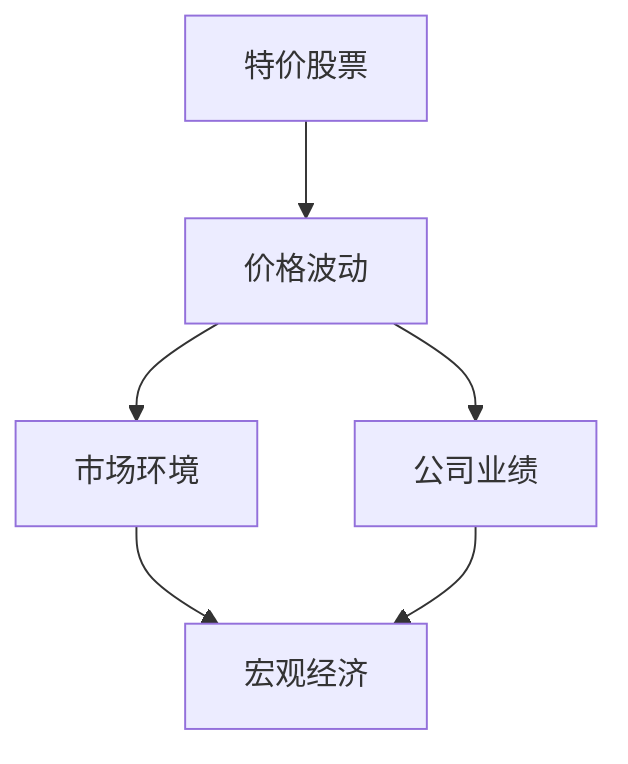

---

### 第2章：公司人才留存率的定义与影响因素

#### 2.1 人才留存率的定义
- **2.1.1 人才留存率的定义与计算方法**
  - 人才留存率 = （期满留任的员工数 / 初始员工数）× 100%
- **2.1.2 人才留存率的重要性与意义**
  - 高留存率意味着公司能够保持核心团队稳定，降低招聘成本。
  - 留存率低可能导致团队动荡，影响公司创新能力和竞争力。
- **2.1.3 人才留存率与公司发展的关系**
  - 人才留存率是公司长期发展的关键指标，直接影响公司的市场地位和创新能力。

#### 图2.1 人才留存率的影响因素（Mermaid 图表）
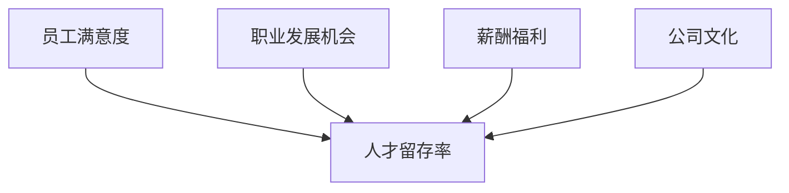

---

### 第3章：特价股票与公司人才留存率关系的背景

#### 3.1 问题背景与研究意义
- **3.1.1 特价股票对公司财务状况的影响**
  - 特价股票的发行可能稀释现有股东权益，影响公司市值。
  - 特价股票的市场流动性较低，可能影响员工变现能力。
- **3.1.2 人才留存率对公司发展的关键作用**
  - 高留存率能够保证公司核心团队的稳定性，降低管理成本。
  - 留存率低可能导致公司创新能力下降，影响市场竞争力。
- **3.1.3 两者关系的研究价值与意义**
  - 研究特价股票对人才留存率的影响，有助于优化公司激励机制。
  - 通过分析两者关系，可以为公司制定更有效的股权激励政策提供参考。

#### 图3.1 特价股票与人才留存率的关系模型（Mermaid 图表）
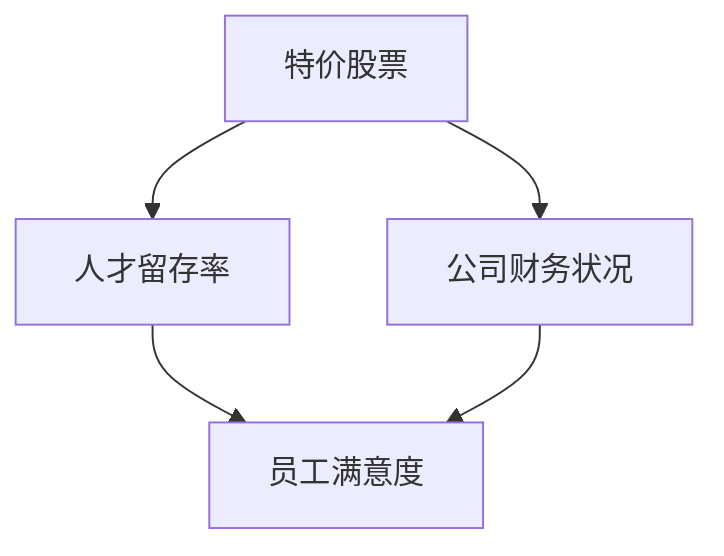

---

## 第二部分：特价股票与公司人才留存率关系的核心概念与联系

### 第4章：特价股票与人才留存率的核心概念

#### 4.1 特价股票的核心属性
- **4.1.1 特价股票的价格波动特征**
  - 特价股票的价格受公司业绩和市场环境影响，波动较大。
  - 特价股票的流动性较低，员工变现能力受限。
- **4.1.2 特价股票的市场流动性分析**
  - 特价股票通常需满足 vesting 期限后方可流通。
  - 特价股票的流动性较低，可能影响员工激励效果。
- **4.1.3 特价股票的投资者行为特征**
  - 特价股票的投资者通常为公司内部员工，投资行为受公司文化影响较大。

#### 图4.1 特价股票的市场流动性分析（Mermaid 图表）
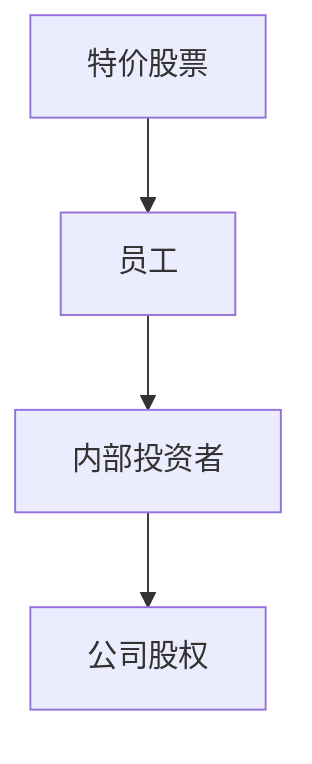

---

#### 4.2 人才留存率的核心要素
- **4.2.1 人才留存率的影响因素分析**
  - 员工满意度：员工对公司的薪酬、福利和工作环境的满意度直接影响留存率。
  - 职业发展机会：员工是否有清晰的职业晋升路径是影响留存率的重要因素。
  - 公司文化：公司文化是否开放、包容，是否注重员工成长，直接影响员工的归属感。
- **4.2.2 人才留存率的驱动机制**
  - 员工满意度：员工对公司的认可度和归属感是留存率的核心驱动因素。
  - 职业发展机会：员工是否有明确的职业规划和成长空间是影响留存率的关键因素。
  - 公司文化：公司文化是否能够吸引和留住人才是影响留存率的重要因素。
- **4.2.3 人才留存率的评估指标**
  - 留存率：期满留任的员工数占初始员工数的比例。
  - 留职时间：员工在公司工作的平均年限。
  - 转职率：员工转岗或离职的比例。

#### 图4.2 人才留存率的核心要素（Mermaid 图表）
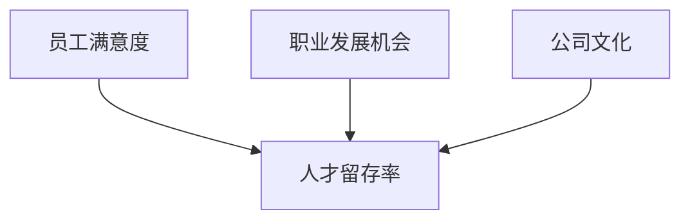

---

### 第5章：特价股票与人才留存率的关系分析

#### 5.1 特价股票对公司财务状况的影响
- **5.1.1 特价股票对公司盈利能力的影响**
  - 特价股票的发行可能稀释公司每股收益（EPS），影响公司盈利能力。
  - 特价股票的发行成本较高，可能增加公司财务负担。
- **5.1.2 特价股票对公司现金流的影响**
  - 特价股票的发行通常需要公司投入大量资金用于员工激励，可能影响公司现金流。
  - 特价股票的变现能力较低，可能影响公司短期现金流。
- **5.1.3 特价股票对公司市场价值的影响**
  - 特价股票的市场流动性较低，可能影响公司市值。
  - 特价股票的价格波动较大，可能影响投资者对公司价值的评估。

#### 图5.1 特价股票对公司财务状况的影响（Mermaid 图表）
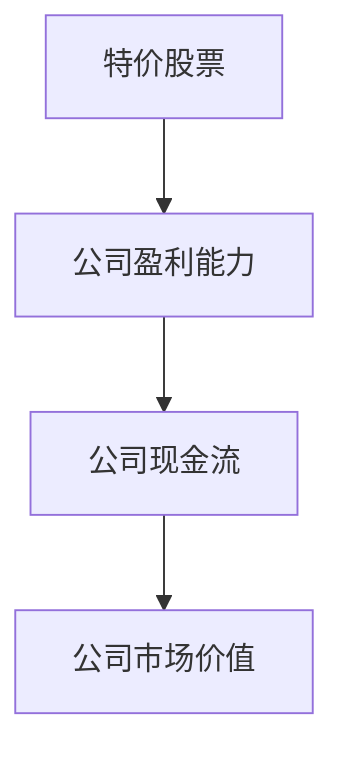

---

#### 5.2 人才留存率与公司发展的关系
- **5.2.1 人才留存率对公司创新能力的影响**
  - 高留存率的员工更有可能与公司长期合作，推动公司技术创新。
  - 高留存率的员工更有可能为公司贡献更多创意和想法，推动公司创新发展。
- **5.2.2 人才留存率对公司竞争优势的影响**
  - 高留存率的员工更有可能为公司创造更多价值，增强公司竞争优势。
  - 高留存率的员工更有可能为公司带来更多的客户和业务机会，增强公司市场地位。
- **5.2.3 人才留存率对公司长期发展的战略意义**
  - 高留存率的员工是公司长期发展的核心资源。
  - 高留存率的员工能够为公司带来更多的创新和竞争优势，推动公司长期发展。

#### 图5.2 人才留存率对公司发展的关系（Mermaid 图表）
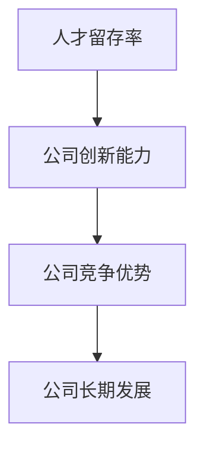

---

## 第三部分：特价股票与人才留存率关系的算法原理与数学模型

### 第6章：特价股票与人才留存率关系的算法原理

#### 6.1 算法原理概述
- **6.1.1 数据预处理与特征提取**
  - 数据预处理：清洗数据，处理缺失值，标准化数据。
  - 特征提取：从公司财务数据、员工满意度数据中提取相关特征。
- **6.1.2 模型选择与训练**
  - 模型选择：选择合适的回归模型，如线性回归、逻辑回归等。
  - 模型训练：使用历史数据训练模型，优化模型参数。
- **6.1.3 模型评估与优化**
  - 模型评估：使用测试数据评估模型性能，计算准确率、召回率等指标。
  - 模型优化：调整模型参数，优化模型性能。

#### 图6.1 算法原理流程图（Mermaid 图表）
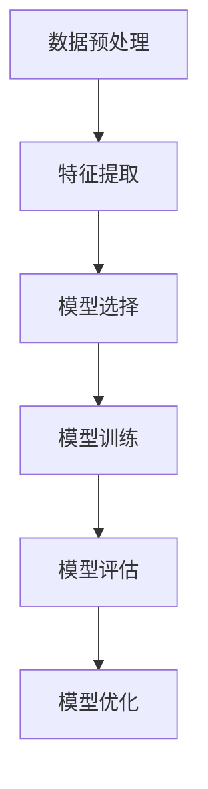

---

#### 6.2 算法原理的数学模型
- **6.2.1 线性回归**
  - 线性回归模型：\( y = \beta_0 + \beta_1 x_1 + \beta_2 x_2 + \ldots + \beta_n x_n + \epsilon \)
  - 其中，\( y \) 为人才留存率，\( x_i \) 为影响留存率的特征变量，\( \beta_i \) 为回归系数，\( \epsilon \) 为误差项。
  - 使用最小二乘法（OLS）优化模型参数，最小化预测值与实际值之间的平方差之和。

#### 图6.2 线性回归模型（Mermaid 图表）
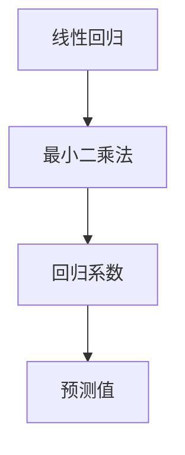

---

### 第7章：系统分析与架构设计方案

#### 7.1 问题场景介绍
- 问题场景：公司希望分析特价股票对人才留存率的影响，优化股权激励政策。
- 项目目标：构建一个分析系统，能够量化特价股票对人才留存率的影响，为公司制定股权激励政策提供依据。

#### 7.2 系统功能设计
- **领域模型（Mermaid 类图）**
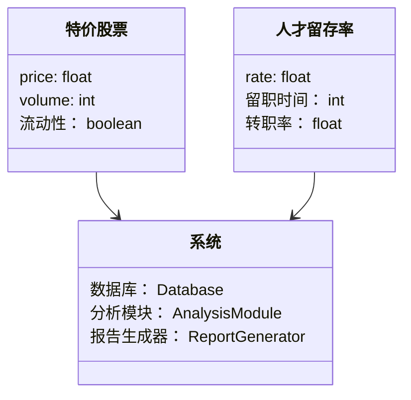

#### 7.3 系统架构设计
- **系统架构（Mermaid 架构图）**
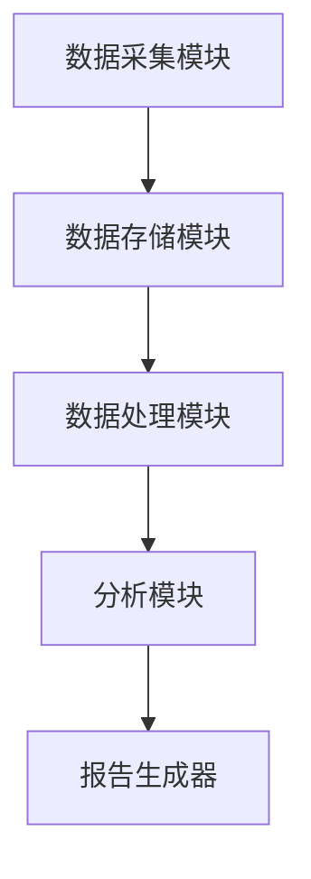

#### 7.4 系统接口设计
- **API 接口**
  - 数据采集模块：提供接口采集公司财务数据和员工数据。
  - 数据处理模块：提供接口对数据进行清洗和转换。
  - 分析模块：提供接口调用回归模型进行预测。
  - 报告生成器：提供接口生成分析报告。

#### 7.5 系统交互设计
- **交互流程（Mermaid 序列图）**
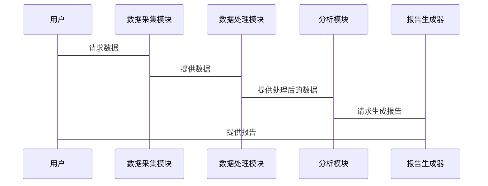

---

## 第四部分：项目实战

### 第8章：环境安装与系统核心实现

#### 8.1 环境安装
- 安装 Python 和相关库：
  ```bash
  pip install numpy pandas scikit-learn
  ```

#### 8.2 核心代码实现
- **数据预处理与特征提取**
  ```python
  import pandas as pd
  import numpy as np
  from sklearn.linear_model import LinearRegression
  from sklearn.metrics import mean_squared_error

  # 数据加载
  data = pd.read_csv('data.csv')

  # 数据清洗
  data.dropna(inplace=True)

  # 特征提取
  X = data[['price', 'volume', '流动性']]
  y = data['rate']
  ```

- **模型训练与评估**
  ```python
  # 模型训练
  model = LinearRegression()
  model.fit(X, y)

  # 模型预测
  y_pred = model.predict(X)

  # 模型评估
  mse = mean_squared_error(y, y_pred)
  print(f'MSE: {mse}')
  ```

- **案例分析**
  ```python
  # 案例分析
  new_data = pd.DataFrame({
      'price': [100],
      'volume': [1000],
      '流动性': [True]
  })
  prediction = model.predict(new_data)
  print(f'预测留存率: {prediction[0]:.2f}')
  ```

---

### 第9章：项目小结与最佳实践

#### 9.1 最佳实践
- **员工激励机制**
  - 特价股票的发行需要结合公司实际情况，确保员工利益与公司利益一致。
  - 特价股票的流动性设计需要合理，避免影响员工激励效果。
- **公司文化管理**
  - 公司需要营造良好的文化氛围，增强员工归属感。
  - 公司需要注重员工职业发展，提供更多的职业机会。

#### 9.2 小结
- 通过分析特价股票对人才留存率的影响，我们可以得出以下结论：
  - 特价股票能够有效激励员工，提升人才留存率。
  - 公司需要综合考虑财务状况和员工利益，制定合理的股权激励政策。
  - 通过回归分析，我们可以量化特价股票对人才留存率的影响，为公司制定激励政策提供科学依据。

#### 9.3 注意事项
- **数据质量**
  - 数据来源需要可靠，数据清洗需要彻底。
- **模型优化**
  - 模型需要不断优化，确保预测准确性。
- **公司实际情况**
  - 公司需要根据自身情况，灵活调整激励政策。

#### 9.4 拓展阅读
- 《股票市场分析与预测》
- 《公司治理与人才管理》
- 《股权激励机制设计》

---

## 作者：
AI天才研究院  
禅与计算机程序设计艺术

