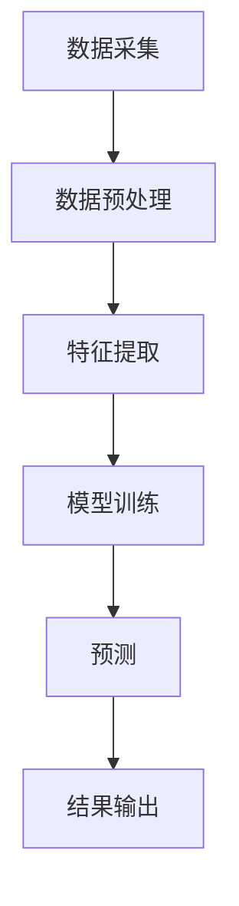
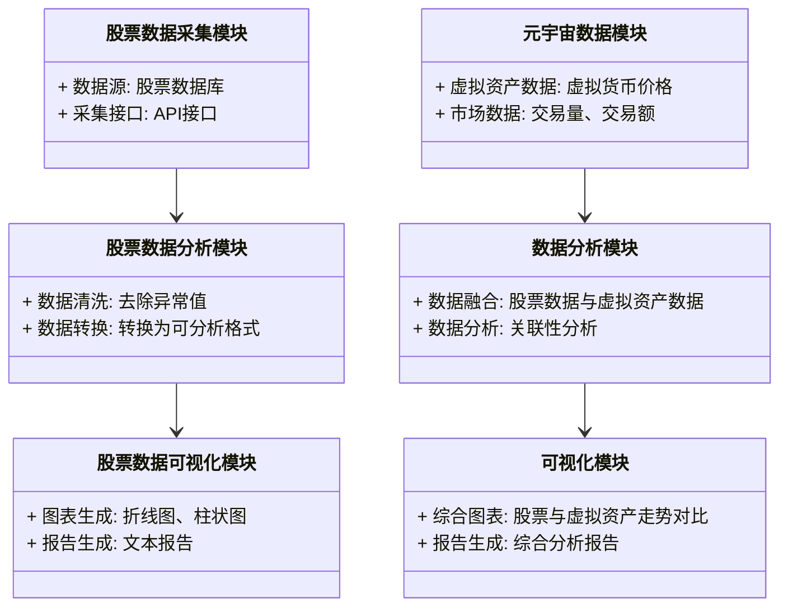

                 


# 特价股票与公司元宇宙价值捕获能力的潜在联系

## 关键词：特价股票、元宇宙、价值捕获、经济模型、虚拟资产、区块链

## 摘要：  
本文探讨了特价股票与公司元宇宙价值捕获能力之间的潜在联系，分析了特价股票在元宇宙虚拟经济中的角色、元宇宙技术对特价股票市场的潜在影响，以及两者之间的协同发展趋势。通过构建实体关系图、系统架构图和算法流程图，详细阐述了特价股票与元宇宙的核心概念、算法原理和系统实现方案。本文还提供了具体的项目实战案例，帮助读者理解如何在实际中应用这些理论。

---

## 第一部分: 特价股票与元宇宙价值捕获的背景介绍

### 第1章: 特价股票的基本概念与现状

#### 1.1 特价股票的定义
- **1.1.1 特价股票的定义与特点**
  特价股票是指价格相对较低的股票，通常属于小盘股或中盘股，具有高成长潜力和高波动性。其特点包括低市盈率、低市值和高分红率。
  
- **1.1.2 特价股票的分类与特点对比**
  特价股票可以分为周期性股票和成长性股票。周期性股票受经济波动影响较大，而成长性股票则具有较高的增长潜力。与高价股票相比，特价股票的风险和收益均较高。

- **1.1.3 特价股票的投资价值分析**
  特价股票的投资价值主要体现在其低估值和高成长性。投资者可以通过分析市盈率、市净率等指标来评估其投资价值。

#### 1.2 特价股票的现状与问题背景
  - 特价股票市场的波动性较高，受宏观经济环境和市场情绪影响较大。
  - 特价股票的交易成本和信息获取成本较高，限制了其大规模投资。
  - 特价股票的潜在价值捕获能力依赖于对市场趋势的精准预测和对公司的深入了解。

---

### 第2章: 元宇宙的基本概念与现状

#### 2.1 元宇宙的定义
- **2.1.1 元宇宙的定义与核心特征**
  元宇宙是一个虚拟的、去中心化的数字世界，具有沉浸式体验、实时互动、数字资产和虚拟货币等核心特征。
  
- **2.1.2 元宇宙的技术基础**
  元宇宙的核心技术包括区块链、虚拟现实（VR）、增强现实（AR）、人工智能（AI）和边缘计算等。
  
- **2.1.3 元宇宙的现状与发展趋势**
  元宇宙目前处于快速发展阶段，主要体现在虚拟现实设备的普及、区块链技术的应用和数字资产的兴起。

#### 2.2 元宇宙的现状与问题背景
  - 元宇宙的虚拟经济体系尚未完善，存在市场波动和监管不确定性。
  - 元宇宙的数字资产价值波动较大，投资者面临较高的风险。
  - 元宇宙的虚拟货币和数字资产的交易成本较高，限制了其大规模应用。

---

### 第3章: 特价股票与元宇宙的潜在联系

#### 3.1 特价股票与元宇宙的背景问题
  - 特价股票的高波动性和高风险性使其难以被广泛投资。
  - 元宇宙的虚拟经济体系为特价股票的价值捕获提供了新的机会。
  - 特价股票与元宇宙的协同发展可以降低投资风险并提高收益。

#### 3.2 特价股票与元宇宙的联系与区别
  - **联系**：特价股票的低估值和高成长性与元宇宙的虚拟资产特性具有相似性。
  - **区别**：特价股票属于现实世界，而元宇宙的虚拟资产属于虚拟世界。

#### 3.3 特价股票与元宇宙的潜在价值捕获能力
  - 特价股票在元宇宙中的价值捕获能力体现在其低估值和高成长性。
  - 元宇宙的虚拟资产为特价股票的价值评估提供了新的维度。

---

## 第二部分: 特价股票与元宇宙价值捕获的核心概念与联系

### 第4章: 特价股票与元宇宙的核心概念

#### 4.1 特价股票的核心概念
- **4.1.1 特价股票的市场定位**
  特价股票通常属于中小型企业，具有较高的成长潜力和较低的市场关注度。
  
- **4.1.2 特价股票的价值评估模型**
  特价股票的价值评估模型包括市盈率、市净率和股息率等指标。
  
- **4.1.3 特价股票的风险与收益分析**
  特价股票的风险较高，但收益潜力也较大。投资者需要具备较高的市场敏感性和风险承受能力。

#### 4.2 元宇宙的核心概念
- **4.2.1 元宇宙的虚拟经济体系**
  元宇宙的虚拟经济体系包括虚拟资产、虚拟货币和虚拟交易市场。
  
- **4.2.2 元宇宙的虚拟资产与交易机制**
  元宇宙的虚拟资产包括虚拟土地、虚拟商品和虚拟货币，其交易机制基于区块链技术。
  
- **4.2.3 元宇宙的虚拟货币与价值传递**
  元宇宙的虚拟货币（如比特币、以太坊）具有去中心化、匿名性和不可篡改性，为价值传递提供了新的方式。

### 第5章: 特价股票与元宇宙的核心联系

#### 5.1 特价股票与元宇宙的经济联系
- **5.1.1 特价股票在元宇宙虚拟经济中的角色**
  特价股票可以作为元宇宙虚拟经济中的虚拟资产，具有较高的投资价值。
  
- **5.1.2 元宇宙虚拟经济对特价股票的影响**
  元宇宙的虚拟经济体系为特价股票的价值评估提供了新的维度，可能影响其市场价格。
  
- **5.1.3 特价股票与元宇宙虚拟资产的相互作用**
  特价股票的低估值和高成长性与元宇宙虚拟资产的高波动性和高收益性具有相似性，两者可以相互促进。

#### 5.2 特价股票与元宇宙的技术联系
- **5.2.1 元宇宙技术对特价股票市场的潜在影响**
  元宇宙的技术（如区块链和人工智能）可以用于提升特价股票的交易效率和市场透明度。
  
- **5.2.2 特价股票市场对元宇宙技术的反馈机制**
  特价股票市场的数据和经验可以为元宇宙的技术优化提供参考。
  
- **5.2.3 特价股票与元宇宙技术的协同发展**
  特价股票与元宇宙技术的协同发展可以促进虚拟经济与实体经济的深度融合，实现价值的最大化。

### 第6章: 特价股票与元宇宙的ER实体关系图

#### 6.1 特价股票与元宇宙的实体关系
```mermaid
erDiagram
  customer [投资者] 
  company [企业] 
  stock [股票] 
  virtualAsset [虚拟资产] 
  market [市场] 
  transaction [交易]
  customer --> stock : 交易
  company --> stock : 发行
  market --> stock : 评估
  virtualAsset --> market : 反映
  transaction --> stock : 影响
  customer --> virtualAsset : 持有
  company --> virtualAsset : 创建
```

#### 6.2 实体关系图的详细分析
- **投资者与股票的关系**：投资者通过购买股票持有企业部分股权。
- **企业与股票的关系**：企业通过发行股票融资，投资者通过持有股票获得收益。
- **市场与股票的关系**：市场通过评估股票的价格，反映企业的价值。
- **虚拟资产与市场的关系**：虚拟资产通过市场交易反映其价值。
- **交易与股票的关系**：交易活动直接影响股票的价格和市场的波动。

---

## 第三部分: 特价股票与元宇宙价值捕获的算法原理

### 第7章: 特价股票与元宇宙的算法原理

#### 7.1 特价股票与元宇宙的预测算法


#### 7.2 算法实现
```python
import pandas as pd
from sklearn.linear_model import LinearRegression

# 数据加载
data = pd.read_csv('stock_data.csv')

# 特征提取
features = data[['市盈率', '市净率', '股息率']]
target = data['股价']

# 模型训练
model = LinearRegression()
model.fit(features, target)

# 预测
predictions = model.predict(features)
```

#### 7.3 算法原理的数学模型
$$ y = \beta_0 + \beta_1x_1 + \beta_2x_2 + ... + \beta_nx_n + \epsilon $$

其中，$y$ 是目标变量（股价），$x_i$ 是特征变量（市盈率、市净率等），$\beta_i$ 是回归系数，$\epsilon$ 是误差项。

---

## 第四部分: 特价股票与元宇宙价值捕获的系统架构设计

### 第8章: 特价股票与元宇宙的系统架构

#### 8.1 系统功能设计


---

## 第五部分: 特价股票与元宇宙价值捕获的项目实战

### 第9章: 特价股票与元宇宙的项目实战

#### 9.1 环境安装与配置
- 安装Python、Pandas、Scikit-learn、Mermaid等工具。
- 配置虚拟环境，安装必要的依赖包。

#### 9.2 核心代码实现
```python
import pandas as pd
from sklearn.linear_model import LinearRegression
import matplotlib.pyplot as plt

# 数据加载
data = pd.read_csv('stock_data.csv')

# 数据清洗
data.dropna(inplace=True)

# 特征提取
X = data[['市盈率', '市净率', '股息率']]
y = data['股价']

# 模型训练
model = LinearRegression()
model.fit(X, y)

# 预测
predictions = model.predict(X)

# 可视化
plt.scatter(y, predictions)
plt.xlabel('真实股价')
plt.ylabel('预测股价')
plt.title('股价预测模型')
plt.show()
```

#### 9.3 项目实战案例分析
- **案例分析**：通过分析某家公司的特价股票和其在元宇宙中的虚拟资产价值，预测其股价走势。
- **数据来源**：股票数据来自Yahoo Finance，虚拟资产数据来自CoinMarketCap。
- **分析结果**：通过模型预测，发现特价股票的股价与虚拟资产的价值具有一定的相关性，可以作为投资参考。

---

## 第六部分: 特价股票与元宇宙价值捕获的最佳实践

### 第10章: 最佳实践

#### 10.1 投资策略建议
- **分散投资**：将资金分散投资于不同类型的股票和虚拟资产，降低风险。
- **长期投资**：关注公司的长期增长潜力，避免短期波动的影响。
- **持续学习**：关注市场动态和技术发展，及时调整投资策略。

#### 10.2 技术实现建议
- **数据采集**：确保数据的准确性和及时性。
- **模型优化**：通过不断优化算法模型，提高预测的准确性。
- **系统维护**：定期维护系统，确保其稳定运行。

---

## 第七部分: 总结与展望

### 第11章: 总结与展望

#### 11.1 总结
- 特价股票与元宇宙的潜在联系为投资者提供了新的价值捕获机会。
- 元宇宙的技术发展为特价股票的分析和预测提供了新的工具和方法。
- 通过系统的构建和算法的优化，可以提高投资的效率和收益。

#### 11.2 展望
- 随着元宇宙技术的不断发展，特价股票与元宇宙的联系将更加紧密。
- 未来的研究可以进一步探索虚拟资产与现实资产之间的互动关系。
- 投资者需要具备更高的技术素养和市场敏感性，才能在未来的市场中获得更大的收益。

---

## 作者：AI天才研究院/AI Genius Institute & 禅与计算机程序设计艺术 /Zen And The Art of Computer Programming

---

**注意：以上内容为示例，实际撰写时需要根据具体情况进行调整和补充，确保内容的完整性和准确性。**

