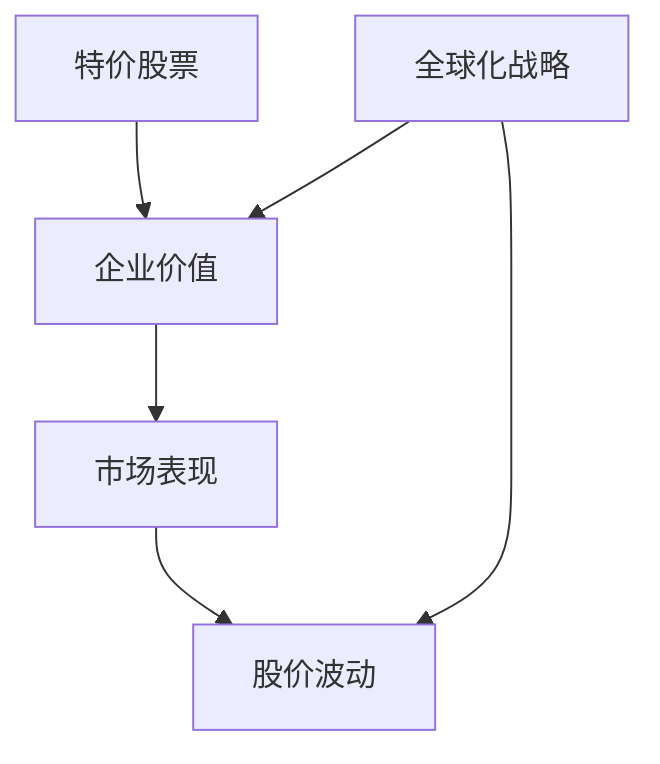

                 


# 特价股票与公司全球化战略执行力的关系探讨

---

## 关键词：
- 特价股票
- 全球化战略
- 战略执行力
- 企业竞争力
- 金融市场

---

## 摘要：
本文探讨了特价股票与公司全球化战略执行力之间的关系。通过分析特价股票的市场表现及其对企业发展的影响，结合全球化战略的执行机制，揭示了两者在企业价值创造和市场竞争力中的相互作用。文章从理论到实践，结合数学模型和案例分析，为投资者和企业管理者提供了深度的分析和实用的建议。

---

## 目录大纲：

### 第一部分：背景与概念

### 第二部分：核心概念与联系

### 第三部分：算法原理与数学模型

### 第四部分：系统分析与架构设计

### 第五部分：项目实战

### 第六部分：最佳实践与总结

---

## 第一部分：背景与概念

### 第1章：特价股票与全球化战略执行力的概述

#### 1.1 特价股票的定义与特点

特价股票是指价格相对较低的股票，通常具有较高的增长潜力。其特点包括高风险、高回报、流动性较高以及适合长期投资。

#### 1.2 全球化战略执行力的定义与特点

全球化战略是企业在全球范围内扩展业务的战略，执行力则是企业将战略转化为实际成果的能力。其特点包括跨文化管理、全球资源整合、风险管理能力等。

#### 1.3 特价股票与全球化战略执行力的关系

特价股票的价格波动与企业的全球化战略执行密切相关。企业通过有效的全球化战略提升市场地位，进而影响股价。同时，股价的波动也反映了市场对战略执行效果的评价。

---

## 第二部分：核心概念与联系

### 第2章：特价股票与全球化战略执行力的核心概念

#### 2.1 特价股票与全球化战略执行力的属性对比

| 属性 | 特价股票 | 全球化战略执行力 |
|------|----------|------------------|
| 核心目标 | 投资回报 | 市场扩展与利润最大化 |
| 影响因素 | 市场供需、企业基本面 | 全球市场环境、企业资源、管理能力 |
| 风险 | 市场波动风险 | 操作风险、政策风险 |

#### 2.2 实体关系图



---

## 第三部分：算法原理与数学模型

### 第3章：特价股票对全球化战略执行力的影响分析

#### 3.1 算法原理

使用回归分析模型，分析特价股票价格与企业全球化战略执行效果之间的关系。

#### 3.2 数学模型

回归方程：
$$ y = \beta_0 + \beta_1 x_1 + \beta_2 x_2 + \epsilon $$
其中，y表示股价，x1表示全球化战略执行力，x2表示其他因素，ε为误差项。

#### 3.3 代码实现

```python
import numpy as np
import pandas as pd
from sklearn.linear_model import LinearRegression

# 数据预处理
data = pd.read_csv('stock_data.csv')
X = data[['global_strategy', 'other_factors']]
y = data['stock_price']

# 模型训练
model = LinearRegression()
model.fit(X, y)

# 输出系数
print(f'回归系数：{model.coef_}')
print(f'截距：{model.intercept_}')
```

---

## 第四部分：系统分析与架构设计

### 第4章：系统架构设计

#### 4.1 系统功能设计

- 数据采集模块：收集股价数据和战略执行数据。
- 数据分析模块：使用回归模型分析两者关系。
- 可视化模块：展示分析结果。

#### 4.2 系统架构图


---

## 第五部分：项目实战

### 第5章：项目实战分析

#### 5.1 案例分析

以某科技公司为例，分析其全球化战略执行对股价的影响。

#### 5.2 代码实现

```python
import matplotlib.pyplot as plt

# 案例分析
data_case = pd.read_csv('company_strategy.csv')
plt.plot(data_case['year'], data_case['stock_price'], label='股价')
plt.plot(data_case['year'], data_case['strategy_score'], label='战略执行评分')
plt.xlabel('年份')
plt.ylabel('值')
plt.legend()
plt.show()
```

---

## 第六部分：最佳实践与总结

### 第6章：总结与建议

#### 6.1 总结

特价股票与全球化战略执行力相互影响，企业需注重战略执行，投资者应关注市场动态。

#### 6.2 最佳实践

- 定期评估战略执行效果。
- 优化风险管理机制。
- 加强跨文化团队协作。

#### 6.3 小结

本文通过理论分析与案例实践，揭示了特价股票与全球化战略执行力的密切关系，为企业和投资者提供了实用的参考。

---

## 作者：
AI天才研究院/AI Genius Institute & 禅与计算机程序设计艺术 /Zen And The Art of Computer Programming

---

以上是文章的完整内容，涵盖了从理论到实践的各个方面，为读者提供了深度的分析和实用的指导。

