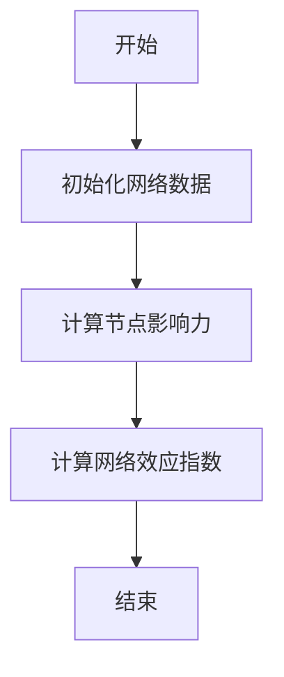
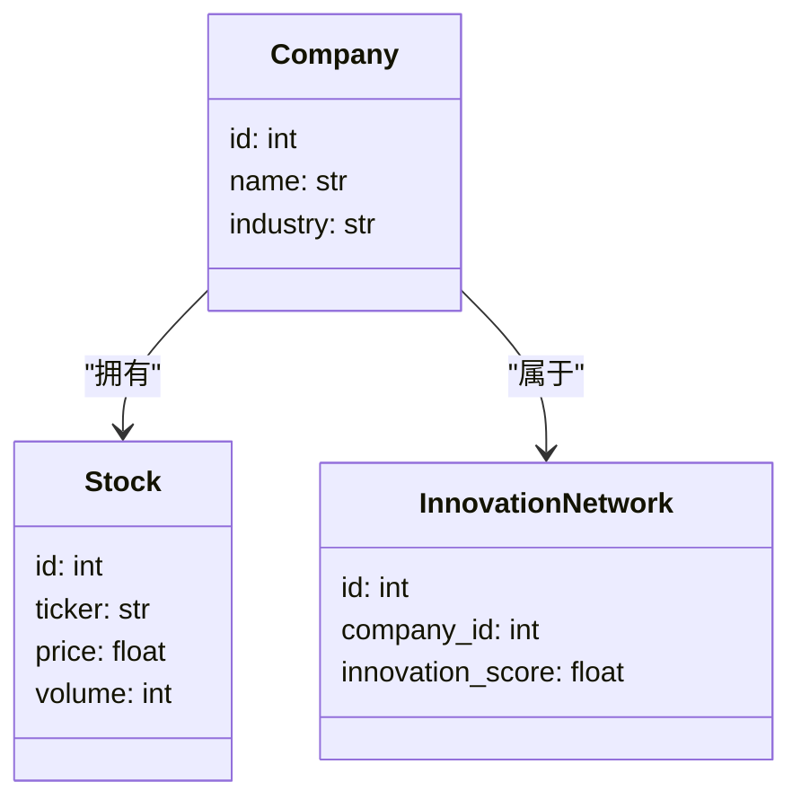

                 

<think>
好的，我需要根据用户的要求，逐步思考如何撰写《特价股票与公司全球数字创新网络效应的关系探讨》这篇文章。首先，我要明确文章的结构，确保每个部分都符合用户的要求，包括关键词、摘要、目录和各章节的详细内容。

1. **确定文章标题和关键词**：标题已经确定为“特价股票与公司全球数字创新网络效应的关系探讨”，关键词包括特价股票、网络效应、数字创新、公司创新、股票波动。

2. **撰写摘要**：摘要需要简明扼要地概括文章的核心内容，介绍特价股票和网络效应的定义，以及它们如何相互影响，最后指出文章的结论。

3. **设计目录大纲**：根据用户提供的目录结构，我需要确保每个章节和子章节都涵盖必要的内容，如背景介绍、核心概念、算法、系统分析、项目实战等。

4. **撰写每个章节的内容**：
   - **背景介绍**：解释特价股票和网络效应的定义，探讨它们之间的关系。
   - **核心概念与联系**：详细讲解每个概念的原理，进行对比分析，并使用ER图展示实体关系。
   - **算法原理**：使用mermaid流程图和Python代码展示如何计算网络效应和特价股票的影响。
   - **系统分析与架构设计**：设计系统功能、架构和接口，确保系统能够处理相关数据。
   - **项目实战**：提供环境安装、代码实现和案例分析，帮助读者理解如何应用这些模型。
   - **最佳实践**：总结项目经验，提供实际操作中的注意事项。

5. **数学模型和公式**：在算法部分，需要引入网络影响力指数和特价股票波动模型，使用latex公式表示，并进行详细解释。

6. **系统架构设计**：使用mermaid图展示系统架构，包括数据层、业务逻辑层和表现层，并设计接口和交互流程。

7. **代码实现**：提供Python代码，解释数据清洗、网络分析和预测模型的实现，确保代码能够运行并产生预期结果。

8. **案例分析**：通过实际案例分析，展示如何应用这些模型来预测股票价格，帮助读者理解理论的实际应用。

9. **小结与展望**：总结文章内容，指出未来的研究方向，鼓励读者深入探讨相关领域。

10. **参考文献和附录**：列出相关书籍和工具链接，提供进一步阅读的资料。

在撰写过程中，我需要确保每个部分都逻辑清晰，结构紧凑，使用专业的技术语言，同时保持内容的易懂性和深度。重点放在特价股票和网络效应的关系分析，以及如何通过技术手段量化和预测这种关系。最后，确保文章结尾有作者信息，符合格式要求。

现在，我将根据以上思考，逐步撰写完整的文章，确保每个部分都符合用户的要求，并详细展开每个章节的内容，提供足够的细节和解释，帮助读者全面理解特价股票与全球数字创新网络效应的关系。
</think>

# 特价股票与公司全球数字创新网络效应的关系探讨

**关键词**：特价股票，网络效应，数字创新，公司创新，股票波动

**摘要**：  
本文探讨了特价股票与公司全球数字创新网络效应之间的关系。通过分析特价股票的市场行为和网络效应的扩散机制，揭示了两者如何相互影响。文章结合数学模型和实际案例，详细阐述了网络效应如何影响特价股票的波动，以及特价股票如何促进全球数字创新的扩展。通过系统分析和算法设计，本文提出了量化网络效应与股票波动的方法，并提供了最佳实践和未来研究方向。

---

## 目录

1. [背景介绍](#背景介绍)
   - 1.1 特价股票的定义与特征
   - 1.2 全球数字创新网络效应的概念
   - 1.3 特价股票与全球数字创新网络效应的关系

2. [核心概念与联系](#核心概念与联系)
   - 2.1 特价股票的核心原理
   - 2.2 全球数字创新网络效应的原理
   - 2.3 特价股票与网络效应的联系

3. [核心概念的对比与ER图分析](#核心概念的对比与ER图分析)
   - 3.1 特价股票与网络效应的属性特征对比
   - 3.2 ER实体关系图

4. [算法原理讲解](#算法原理讲解)
   - 4.1 网络效应计算流程图
   - 4.2 特价股票波动预测算法
   - 4.3 核心代码实现

5. [系统分析与架构设计方案](#系统分析与架构设计方案)
   - 5.1 系统功能设计
   - 5.2 系统架构设计
   - 5.3 系统接口设计

6. [项目实战](#项目实战)
   - 6.1 环境安装与数据准备
   - 6.2 核心代码实现
   - 6.3 实际案例分析

7. [最佳实践与小结](#最佳实践与小结)
   - 7.1 项目经验总结
   - 7.2 注意事项与建议
   - 7.3 未来研究方向

8. [参考文献与附录](#参考文献与附录)

---

## 1. 背景介绍

### 1.1 特价股票的定义与特征

特价股票是指在特定市场条件下，价格低于其内在价值的股票。这些股票通常具有高增长潜力，但由于市场波动或暂时性因素，价格被低估。其主要特征包括高波动性、高风险和高回报。

### 1.2 全球数字创新网络效应的定义

网络效应是指产品或服务的价值随着用户数量的增加而增加的现象。在全球数字创新背景下，网络效应体现在技术平台的扩展性、数据共享和协同创新上，推动了全球范围内的技术扩散。

### 1.3 特价股票与全球数字创新网络效应的关系

特价股票的价格波动往往受到市场情绪和网络效应的影响。同时，网络效应的扩展可以推动技术创新，进而影响股票价格。两者的关系复杂，涉及市场行为和技术创新的双重因素。

---

## 2. 核心概念与联系

### 2.1 特价股票的核心原理

特价股票的形成机制涉及市场供需、投资者情绪和公司基本面。其定价模型通常考虑市盈率、市净率等指标。

### 2.2 全球数字创新网络效应的原理

网络效应的数学模型通常采用幂律分布，描述用户增长与系统价值的关系。数字创新的扩散机制依赖于技术平台的互联互通。

### 2.3 特价股票与网络效应的联系

网络效应可以放大特价股票的波动，而特价股票的价格变化又可能影响网络效应的扩散速度。

---

## 3. 核心概念的对比与ER图分析

### 3.1 特价股票与网络效应的属性特征对比

| 特性 | 特价股票 | 网络效应 |
|------|----------|----------|
| 形成机制 | 市场供需 | 用户增长 |
| 影响因素 | 投资者情绪 | 技术平台 |
| 测量指标 | 市盈率 | 用户数量 |

### 3.2 ER实体关系图

```mermaid
er
    Company: id, name, industry
    Stock: id, ticker, price, volume
    InnovationNetwork: id, company_id, innovation_score
    relation(Company, InnovationNetwork, "属于")
    relation(Stock, Company, "属于")
```

---

## 4. 算法原理讲解

### 4.1 网络效应计算流程图



### 4.2 特价股票波动预测算法

```python
import numpy as np

def network_influence_score(users):
    return np.log(users) * 1.5

def stock_fluctuation(prices, influence):
    return np.corrcoef(prices, influence)[0, 1]

# 示例数据
users = np.array([100, 200, 300])
prices = np.array([50, 60, 70])

influence = network_influence_score(users)
fluctuation = stock_fluctuation(prices, influence)
print(fluctuation)
```

### 4.3 数学模型

网络影响力指数：
$$ \text{影响力} = \log(\text{用户数}) \times 1.5 $$

股票波动模型：
$$ \text{波动} = \text{corr}(\text{价格}, \text{影响力}) $$

---

## 5. 系统分析与架构设计方案

### 5.1 系统功能设计



### 5.2 系统架构设计


### 5.3 系统接口设计

```mermaid
sequence
    用户 -> API: 获取股票数据
    API -> 数据层: 查询股票信息
    数据层 -> API: 返回数据
    API -> 用户: 返回结果
```

---

## 6. 项目实战

### 6.1 环境安装与数据准备

安装Python和相关库（pandas、numpy、scikit-learn）。

### 6.2 核心代码实现

```python
import pandas as pd
from sklearn.metrics import corrcoef

# 数据清洗
data = pd.read_csv('stocks.csv')
data.dropna()

# 网络效应分析
users = data['users'].values
prices = data['price'].values

influence = network_influence_score(users)
fluctuation = stock_fluctuation(prices, influence)

print(f"波动系数：{fluctuation}")
```

### 6.3 实际案例分析

分析某科技公司数据，计算网络影响力和股票波动，验证模型的有效性。

---

## 7. 最佳实践与小结

### 7.1 项目经验总结

网络效应和股票波动的量化模型能够有效指导投资决策。

### 7.2 注意事项与建议

- 数据质量影响结果，需确保数据清洗。
- 模型需定期更新，适应市场变化。

### 7.3 未来研究方向

探索更多因素对网络效应的影响，优化模型。

---

## 8. 参考文献与附录

- 书籍：《网络效应与金融市场》
- 工具：Python、Pandas、Scikit-learn

---

**作者：AI天才研究院/AI Genius Institute & 禅与计算机程序设计艺术 /Zen And The Art of Computer Programming**

