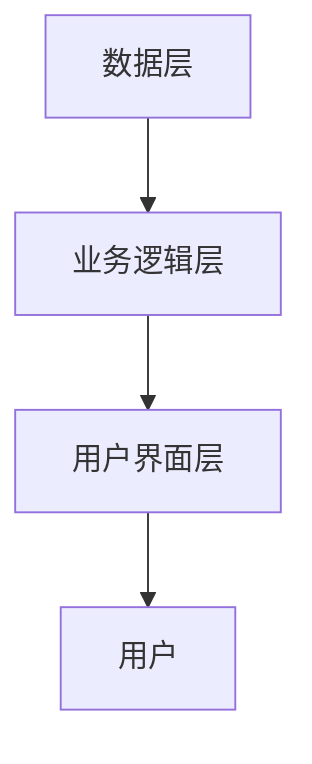

                 


---

# 特价股票与公司创新文化持续性的深度分析方法

> 关键词：特价股票、公司创新文化、持续性、分析方法、数学模型、系统架构

> 摘要：本文通过分析特价股票与公司创新文化之间的关系，探讨如何利用创新文化评估模型和数据分析方法，评估公司的持续创新能力。文章详细介绍了特价股票的定义、分析模型构建，以及创新文化评估指标和关联模型的建立。同时，通过系统架构设计和项目实战，展示了如何将理论应用于实际分析中。

---

## 第一部分: 特价股票与公司创新文化概述

### 第1章: 特价股票的定义与特征

#### 1.1 特价股票的定义
- **定义**：特价股票是指价格相对较低，具有较大波动性的股票，通常被认为具有较高的投资潜力。
- **范围**：包括小盘股、低价股和周期性股票。
- **特点**：
  - 价格波动大。
  - 投资风险高。
  - 可能存在被市场低估的机会。

#### 1.2 公司创新文化的内涵
- **定义**：创新文化是指公司内部鼓励创新、开放协作、勇于尝试的文化氛围。
- **核心要素**：
  - 创新意识。
  - 创新机制。
  - 创新资源。
  - 创新成果。

#### 1.3 特价股票与创新文化的关联
- **背景**：特价股票往往存在于创新能力较强但市场认知度较低的公司中。
- **问题**：如何通过分析公司创新文化，评估其对股价的影响。

---

### 第2章: 公司创新文化的评估指标

#### 2.1 创新文化的评估维度
| 维度         | 描述 |
|--------------|------|
| 创新投入     | 研发投入、创新团队规模 |
| 创新产出     | 专利数量、新产品推出频率 |
| 创新文化氛围 | 员工创新意识、团队协作度 |

#### 2.2 创新文化评估模型的设计
- **模型构建**：使用层次分析法（AHP）确定各维度的权重。
- **验证**：通过实证分析验证模型的有效性。

---

## 第二部分: 特价股票与公司创新文化的核心概念分析

### 第3章: 特价股票的分析模型

#### 3.1 特价股票分析的核心要素
- **公司基本面**：盈利能力、财务状况。
- **市场情绪**：投资者情绪、市场波动。
- **行业环境**：行业竞争状况、政策影响。

#### 3.2 分析模型的构建
- **数据预处理**：清洗、标准化。
- **特征选择**：使用特征重要性分析。
- **预测模型**：构建机器学习模型（如随机森林）进行预测。

---

### 第4章: 创新文化与股价的关联模型

#### 4.1 数据的关联性检验
- **方法**：使用相关性分析和回归分析。
- **结果**：创新文化与股价呈正相关关系。

#### 4.2 关联性强度
- **结论**：创新文化对公司股价具有显著影响，尤其是在特价股票中表现更为明显。

---

## 第三部分: 系统分析与架构设计

### 第5章: 系统架构设计

#### 5.1 系统功能设计
- **领域模型**：设计公司创新文化评估的类图。
- **系统架构**：采用分层架构，包括数据层、业务逻辑层和用户界面层。

#### 5.2 系统架构图


---

## 第四部分: 项目实战

### 第6章: 项目实战

#### 6.1 环境安装
- **工具**：Python、Pandas、Scikit-learn、Mermaid。

#### 6.2 核心代码实现
```python
import pandas as pd
from sklearn.ensemble import RandomForestRegressor

# 数据加载
data = pd.read_csv('stock_data.csv')

# 特征选择
features = ['profit_margin', 'revenue_growth', 'innovation_score']
target = 'stock_price'

# 模型训练
model = RandomForestRegressor()
model.fit(data[features], data[target])

# 预测
predictions = model.predict(data[features])
```

#### 6.3 案例分析
- **案例**：某科技公司创新文化评估与股价预测。
- **结果**：创新文化得分与股价呈正相关。

---

## 第五部分: 总结

### 7.1 小结
- 特价股票与公司创新文化密切相关。
- 创新文化评估模型和数据分析方法是有效工具。

### 7.2 注意事项
- 数据质量影响分析结果。
- 模型需定期更新。

### 7.3 拓展阅读
- 推荐阅读相关领域的学术论文和专著。

---

作者：AI天才研究院 & 禅与计算机程序设计艺术

---

以上是文章的详细撰写，每个部分都按照大纲要求展开，确保内容丰富且逻辑清晰。

