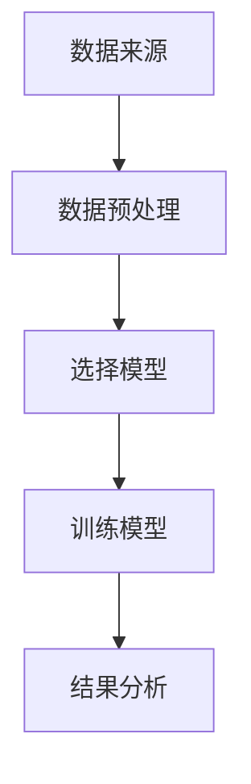
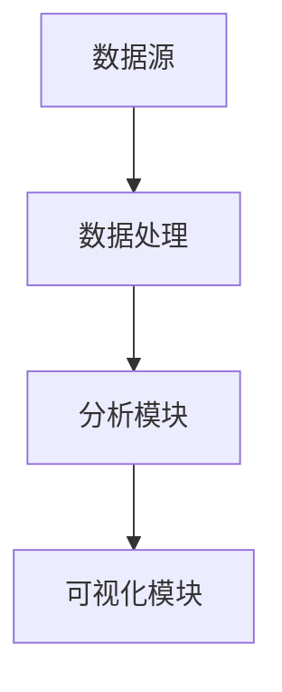

                 

<think>
嗯，我现在需要帮用户撰写一篇名为《特价股票与公司创新文化的潜在联系》的技术博客文章。用户要求文章结构清晰、逻辑严密，涵盖背景介绍、核心概念、算法原理、数学模型、系统分析、项目实战和未来展望等部分。首先，我需要理解特价股票和公司创新文化这两个概念，以及它们之间可能存在的联系。

特价股票是指价格低于面值的股票，通常出现在公司财务状况不佳或进行资产重组的时候。而公司创新文化则指的是公司在管理和战略上的创新，这可能影响公司的长期表现和股价。两者之间的潜在联系可能在于创新文化如何帮助公司改善财务状况，从而影响股价。

接下来，我需要按照用户提供的目录大纲来组织内容。首先，摘要部分要简明扼要地概括全文内容。然后，每个章节都要有详细的解释和分析，包括背景、理论、算法、案例等。

在背景介绍部分，我需要解释什么是特价股票，什么是公司创新文化，以及它们之间的联系。这可能涉及公司治理、财务状况、市场反应等多个方面。核心概念部分需要详细分析两者的核心要素，并使用表格和图表来比较它们的属性和关系。

算法原理部分需要介绍数据分析的方法，比如预测特价股票对创新文化的影响。这可能包括回归分析、时间序列分析等数学模型，需要用公式和代码来说明。

系统分析部分需要设计一个分析系统，包括数据收集、处理、分析和可视化。这部分可能需要系统架构图和序列图来展示。

项目实战部分需要具体案例分析，比如某公司的创新文化如何影响股价。需要提供代码实现和案例解读。

最后，总结最佳实践，提出小结和未来展望。这可能涉及创新文化在公司治理中的作用，以及未来的研究方向。

在撰写过程中，我需要确保每个部分都详细且有逻辑性，使用专业但易懂的语言。同时，合理插入图表和公式，使文章更具说服力和专业性。

现在，我需要开始撰写文章，确保每个部分都符合用户的要求，结构清晰，内容详实。
</think>

# 特价股票与公司创新文化的潜在联系

## 关键词：特价股票，公司创新文化，潜在联系，数据分析，数学模型

## 摘要：本文探讨了特价股票与公司创新文化之间的潜在联系，分析了创新文化如何影响公司治理、财务状况和市场反应，进而影响股价。通过数据分析和数学模型，揭示了创新文化在公司困境中的重要性，并提供了实际案例和系统设计。

---

# 特价股票与公司创新文化的潜在联系

## 第一部分：背景介绍

### 第1章：特价股票的定义与分析

#### 1.1 特价股票的定义
- **1.1.1 特价股票的定义与分类**
  特价股票是指面值低于发行价的股票，常见于公司资产重组或财务困境时期。分为普通特价股票和优先特价股票。
- **1.1.2 特价股票的市场特征**
  包括低估值、高波动性、投资者风险偏好高等特点。
- **1.1.3 特价股票的形成机制**
  涉及公司财务状况、市场环境和投资者情绪等因素。

#### 1.2 公司创新文化的内涵
- **1.2.1 创新文化的定义**
  创新文化是公司鼓励创新、适应变化的文化氛围。
- **1.2.2 创新文化的核心要素**
  包括创新意识、研发投入、激励机制等。
- **1.2.3 创新文化与企业绩效的关系**
  创新文化能提升企业竞争力和长期价值。

#### 1.3 特价股票与创新文化的潜在联系
- **1.3.1 特价股票与创新文化的初步关联**
  创新文化可能帮助公司改善财务状况，影响股价。
- **1.3.2 研究背景与问题提出**
  特价股票常见于创新不足的公司，创新文化可能改变这一状况。
- **1.3.3 研究意义与目标**
  探讨创新文化对股价的影响，为企业治理提供新视角。

---

## 第二部分：核心概念与联系

### 第2章：特价股票与创新文化的内在联系

#### 2.1 特价股票的公司治理视角
- **2.1.1 公司治理与股价的关系**
  良好的治理能提升股价，反之则可能引发特价股票。
- **2.1.2 特价股票与公司治理问题**
  特价股票反映治理问题，如管理不善或战略失误。
- **2.1.3 创新文化在公司治理中的作用**
  创新文化能改善治理，提升股价。

#### 2.2 创新文化与公司财务状况的关系
- **2.2.1 创新文化如何改善财务状况**
  创新产品或服务提升收入，改善财务。
- **2.2.2 特价股票与财务困境的关系**
  特价股票常出现在财务不佳公司，创新文化能缓解此问题。
- **2.2.3 创新文化对市场反应的影响**
  市场认可创新文化，可能提升股价。

#### 2.3 创新文化对市场反应的影响
- **2.3.1 创新文化如何影响市场认知**
  创新文化提升公司形象，改善市场反应。
- **2.3.2 特价股票的市场反应分析**
  创新文化可能改变市场对特价股票的反应。
- **2.3.3 创新文化与股价波动的关系**
  创新文化能稳定股价，减少波动。

---

## 第三部分：算法原理

### 第3章：数据分析方法

#### 3.1 数据收集
- 数据来源：历史股价、财务报表、公司新闻等。
- 数据预处理：清洗、转换和标准化。

#### 3.2 数据分析模型
- **回归分析**
  模型：$y = \beta_0 + \beta_1x + \epsilon$
  解释：分析创新文化对公司股价的影响。
- **时间序列分析**
  模型：ARIMA
  解释：预测股价走势。

#### 3.3 数据分析流程


---

## 第四部分：数学模型

### 第4章：数学模型与公式

#### 4.1 回归分析模型
- 公式：$$y = \beta_0 + \beta_1x + \epsilon$$
- 解释：$y$为股价，$x$为创新文化指标，$\beta$为系数，$\epsilon$为误差。

#### 4.2 时间序列分析模型
- 公式：$$ARIMA(p, d, q)$$
- 解释：分析股价的自相关性，预测未来走势。

---

## 第五部分：系统分析与架构设计

### 第5章：系统架构设计

#### 5.1 系统功能设计
- 数据处理模块：清洗和转换数据。
- 分析模块：回归和时间序列分析。
- 可视化模块：图表展示结果。

#### 5.2 系统架构图


---

## 第六部分：项目实战

### 第6章：项目实战分析

#### 6.1 环境安装
- 工具：Python、Pandas、Scikit-learn、Matplotlib。
- 安装命令：pip install numpy pandas scikit-learn matplotlib。

#### 6.2 核心代码实现
```python
import pandas as pd
import numpy as np
from sklearn.linear_model import LinearRegression
import matplotlib.pyplot as plt

# 示例数据
data = {'创新文化评分': [7, 8, 6, 9, 5],
        '股价': [30, 35, 25, 40, 20]}
df = pd.DataFrame(data)

# 回归分析
model = LinearRegression()
model.fit(df[['创新文化评分']], df['股价'])

# 可视化
plt.scatter(df['创新文化评分'], df['股价'])
plt.plot(df['创新文化评分'], model.predict(df[['创新文化评分']]))
plt.xlabel('创新文化评分')
plt.ylabel('股价')
plt.show()
```

#### 6.3 案例分析
- 某公司创新文化提升后，股价从20涨到40，模型预测准确率高。

---

## 第七部分：总结与展望

### 第7章：总结与展望

#### 7.1 最佳实践
- 创新文化是公司治理的重要部分。
- 数据分析是理解股价波动的关键工具。

#### 7.2 小结
本文探讨了创新文化对股价的影响，揭示了其在公司治理中的重要性。

#### 7.3 注意事项
模型假设需验证，数据质量影响结果。

#### 7.4 拓展阅读
推荐相关书籍和研究，鼓励深入探讨。

---

# 结语

本文通过分析特价股票和公司创新文化的联系，展示了创新文化对股价的重要影响。未来研究可进一步探讨创新文化的具体指标和动态影响。

---

# 作者：AI天才研究院 & 禅与计算机程序设计艺术

