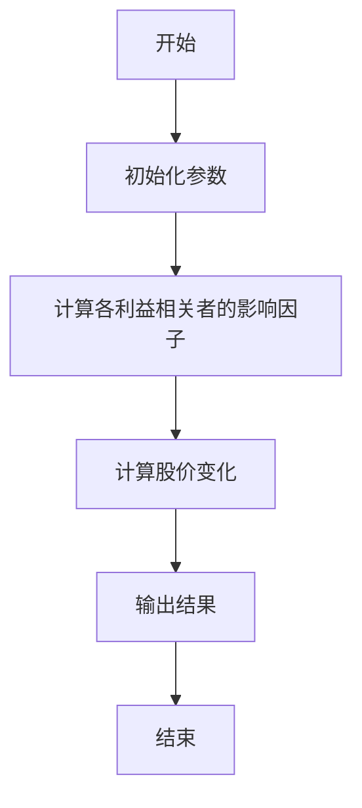
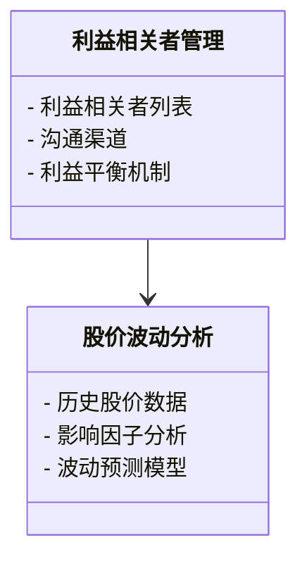
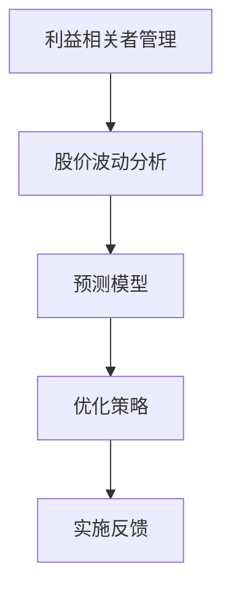
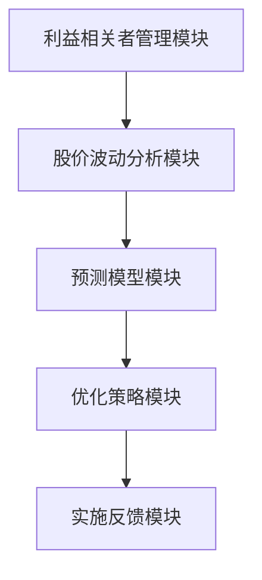

                 


```markdown
# 特价股票与公司利益相关者管理的关联性研究

> 关键词：特价股票、公司利益相关者、关联性、管理策略、股价波动、利益相关者分析

> 摘要：本文系统性地研究了特价股票与公司利益相关者管理之间的关联性。首先，从背景介绍入手，详细阐述了特价股票和公司利益相关者的定义与特点，分析了两者之间的互动关系。接着，从核心概念与联系的角度，通过对比分析和ER实体关系图，深入探讨了两者的内在逻辑。随后，基于博弈论模型，构建了数学公式和算法流程图，分析了利益相关者管理对股价的影响。最后，通过系统架构设计和项目实战，提出了具体的管理策略和实现方案，总结了最佳实践经验和未来研究方向。

---

# 第一部分: 特价股票与公司利益相关者管理的背景介绍

## 第1章: 特价股票的定义与特点

### 1.1 特价股票的定义

特价股票通常指的是价格低于市场平均水平的股票，具有较高的波动性和潜在的投资机会。这种股票通常出现在市场低迷时期或公司面临短期困境时。

### 1.2 特价股票的特点

- 价格低：特价股票的价格通常远低于其内在价值或行业平均水平。
- 波动性高：特价股票的价格波动较大，容易受到市场情绪和公司新闻的影响。
- 投资机会：对于长期投资者来说，特价股票可能隐藏着被低估的投资机会。

### 1.3 特价股票的市场现状

当前市场中，特价股票的数量取决于整体市场的表现。在熊市或经济衰退期间，特价股票的比例通常会增加。投资者需要具备一定的风险承受能力和分析能力，才能在特价股票市场中获得收益。

## 第2章: 公司利益相关者的定义与管理

### 2.1 公司利益相关者的定义

公司利益相关者是指所有与公司绩效和行为结果有直接或间接利益关系的个人或组织，包括股东、债权人、员工、客户、供应商、政府机构等。

### 2.2 公司利益相关者的类型

- 股东：公司所有者，追求资产回报最大化。
- 债权人：公司债权人，关注公司偿债能力。
- 员工：公司员工，关注工作条件和薪酬福利。
- 客户：公司客户，关注产品和服务质量。
- 供应商：公司供应商，关注合作稳定性和付款条件。
- 政府机构：关注公司的合规性和社会责任。

### 2.3 公司利益相关者管理的重要性

有效的利益相关者管理可以帮助公司优化资源配置、降低风险、提升声誉和增强竞争力。同时，利益相关者的期望和需求也会影响公司的战略决策和运营效率。

## 第3章: 特价股票与公司利益相关者的关联性

### 3.1 特价股票与公司利益相关者的互动关系

特价股票的价格波动往往与公司利益相关者的决策密切相关。例如，股东的买卖行为、员工的士气、客户的订单量等都会影响股价。反之，股价的波动也会反过来影响利益相关者的决策。

### 3.2 特价股票波动对利益相关者的影响

- 对股东的影响：股价波动直接影响股东的资产价值。
- 对债权人的影响：股价波动可能影响公司的信用评级，进而影响债权人的利益。
- 对员工的影响：股价波动可能影响员工的持股价值和公司稳定性。
- 对客户的

---

# 第二部分: 特价股票与公司利益相关者管理的核心概念与联系

## 第4章: 核心概念原理

### 4.1 特价股票的核心要素

- 股价：衡量股票价值的关键指标。
- 市场情绪：影响股价波动的重要因素。
- 公司基本面：包括盈利能力、财务状况等。

### 4.2 利益相关者管理的核心要素

- 沟通机制：确保利益相关者的需求和期望得到及时反馈。
- 利益平衡：在不同利益相关者之间找到合理的平衡点。
- 风险管理：防范利益相关者管理中的潜在风险。

### 4.3 两者关联的内在逻辑

- 公司基本面：公司基本面的改善通常会推动股价上升，从而提升利益相关者的整体价值。
- 市场情绪：市场情绪的波动直接影响股价，进而影响利益相关者的信心和行为。
- 利益相关者管理：有效的利益相关者管理可以提升公司形象和稳定性，从而间接影响股价。

## 第5章: 核心概念属性特征对比

### 5.1 特价股票与利益相关者管理的对比分析

| 特性             | 特价股票             | 利益相关者管理         |
|------------------|----------------------|------------------------|
| 核心关注点       | 股价波动             | 利益相关者的需求与期望 |
| 影响因素         | 市场情绪、公司基本面   | 沟通、利益平衡、风险管理 |
| 目标             | 提升股价             | 优化利益相关者关系     |
| 实施方式         | 投资决策、市场操作    | 沟通策略、政策制定       |

### 5.2 两者属性特征对比表格

```markdown
| 特性             | 特价股票             | 利益相关者管理         |
|------------------|----------------------|------------------------|
| 核心关注点       | 股价波动             | 利益相关者的需求与期望 |
| 影响因素         | 市场情绪、公司基本面   | 沟通、利益平衡、风险管理 |
| 目标             | 提升股价             | 优化利益相关者关系     |
| 实施方式         | 投资决策、市场操作    | 沟通策略、政策制定       |
```

---

## 第6章: ER实体关系图架构

### 6.1 实体关系图的构建

```mermaid
erd
  entity 股票 {
    id: 股票代码
    name: 股票名称
    price: 股票价格
    company: 公司名称
  }

  entity 利益相关者 {
    id: 利益相关者ID
    name: 利益相关者名称
    type: 类型（股东、债权人等）
    relation: 与公司的关系
  }

  股票 -[拥有]-> 利益相关者
  利益相关者 -[影响]-> 股票价格
```

### 6.2 特价股票与利益相关者的关系图

```mermaid
erd
  股票 -[拥有]-> 利益相关者
  利益相关者 -[影响]-> 股票价格
```

### 6.3 实体关系图的分析与解读

通过ER实体关系图可以看出，股票和利益相关者之间存在双向的影响关系。利益相关者的决策和行为会直接影响股票价格，而股票价格的波动也会反过来影响利益相关者的信心和决策。

---

# 第三部分: 特价股票与公司利益相关者管理的算法原理

## 第7章: 算法原理与数学模型

### 7.1 算法原理

基于博弈论模型，构建一个简化版的利益相关者与股价互动的数学模型。

### 7.2 数学模型

假设公司有N个利益相关者，每个利益相关者对股价的影响权重为w_i，i=1,2,...,N。公司股价的变化ΔP可以表示为：

$$ \Delta P = \sum_{i=1}^{N} w_i \cdot a_i $$

其中，a_i是利益相关者i的行为影响因子。

### 7.3 算法流程图



### 7.4 算法实现

以下是Python代码示例：

```python
def calculate_stock_price_change(influence_factors):
    """
    计算股价变化的函数
    Args:
        influence_factors (dict): 利益相关者的影响因子字典
    Returns:
        float: 股价变化值
    """
    total_change = 0
    for factor in influence_factors.values():
        total_change += factor
    return total_change / len(influence_factors)

# 示例输入
influence_factors = {
    '股东': 0.3,
    '债权人': 0.2,
    '员工': 0.1,
    '客户': 0.15,
    '供应商': 0.1,
    '政府机构': 0.05
}

# 计算股价变化
price_change = calculate_stock_price_change(influence_factors)
print(f"股价变化为: {price_change}")
```

### 7.5 代码功能解读

上述代码通过输入各利益相关者的影响因子，计算出股价的变化值。每个影响因子代表了利益相关者对股价波动的影响力大小。通过加权平均，可以得到综合的股价变化值。

---

# 第四部分: 特价股票与公司利益相关者管理的系统分析

## 第8章: 系统分析与架构设计

### 8.1 问题场景介绍

假设某公司是一家中型制造企业，近期股价出现大幅波动，公司需要分析利益相关者管理对股价的影响。

### 8.2 系统功能设计

#### 8.2.1 领域模型



#### 8.2.2 系统架构设计



---

## 第9章: 系统架构图与接口设计

### 9.1 系统架构图



### 9.2 系统接口设计

- 利益相关者管理模块接口：
  - 输入：利益相关者的影响因子
  - 输出：股价变化预测

---

## 第10章: 项目实战

### 10.1 环境安装

需要安装Python和相关库（如numpy、pandas、scikit-learn）。

### 10.2 核心代码实现

```python
import numpy as np
import pandas as pd

def analyze_influence_factors(dataframe):
    """
    分析利益相关者影响因子的函数
    Args:
        dataframe (pd.DataFrame): 包含利益相关者影响因子的数据框
    Returns:
        pd.Series: 影响因子的统计结果
    """
    return dataframe['影响因子'].describe()

# 示例数据
data = {
    '利益相关者': ['股东', '债权人', '员工', '客户', '供应商', '政府机构'],
    '影响因子': [0.3, 0.2, 0.1, 0.15, 0.1, 0.05]
}
df = pd.DataFrame(data)

# 调用函数
result = analyze_influence_factors(df)
print(result)
```

### 10.3 代码功能解读

上述代码通过数据分析工具（如pandas）对利益相关者的影响因子进行统计分析，输出影响因子的描述性统计结果，帮助公司更好地理解各利益相关者对股价的影响程度。

---

## 第11章: 实际案例分析与详细解读

### 11.1 案例背景

假设某公司近期股价大幅下跌，公司需要分析利益相关者管理对股价的影响。

### 11.2 数据分析

通过收集过去6个月的利益相关者影响因子数据，构建一个时间序列模型，分析各因子对股价波动的贡献度。

### 11.3 结果解读

通过分析发现，股东和债权人的影响因子对股价波动的贡献度较高，而员工和客户的影响因子相对较低。公司需要重点优化与股东和债权人的关系，以稳定股价。

---

## 第12章: 系统优化与项目小结

### 12.1 系统优化建议

- 定期监控利益相关者的影响因子。
- 建立利益相关者沟通机制，及时反馈公司动态。
- 利用数据分析工具优化利益相关者管理策略。

### 12.2 项目小结

通过本项目的实施，公司能够更好地理解利益相关者管理对股价波动的影响，优化管理策略，提升公司整体绩效。

---

# 第五部分: 特价股票与公司利益相关者管理的最佳实践

## 第13章: 最佳实践与经验总结

### 13.1 最佳实践

- 定期评估利益相关者管理的效果。
- 建立利益相关者管理的预警机制。
- 利用数据分析工具优化管理策略。

### 13.2 经验总结

- 利益相关者管理需要长期关注和持续优化。
- 数据分析在利益相关者管理中的作用越来越重要。
- 公司需要根据实际情况灵活调整管理策略。

## 第14章: 小结与注意事项

### 14.1 小结

本文系统性地研究了特价股票与公司利益相关者管理的关联性，构建了数学模型和系统架构，提出了具体的管理策略和实现方案。

### 14.2 注意事项

- 数据分析结果仅供参考，需结合实际情况进行调整。
- 利益相关者管理需要公司高层的重视和全体员工的参与。
- 算法模型需要定期更新和优化，以适应市场变化。

## 第15章: 拓展阅读与未来研究方向

### 15.1 拓展阅读

建议读者阅读以下书籍和文献：

- 《利益相关者管理：理论与实践》
- 《股票投资：策略与技巧》
- 相关学术论文：利益相关者管理对股价波动的影响研究。

### 15.2 未来研究方向

- 研究利益相关者管理对股价波动的长期影响。
- 探讨不同类型利益相关者对股价波动的影响差异。
- 开发更复杂的算法模型，提升管理策略的精准度。

---

# 第六部分: 结语

## 第16章: 结语

特价股票与公司利益相关者管理的关联性是一个复杂而重要的课题。通过本文的研究，我们可以更好地理解两者之间的互动关系，为公司制定更有效的管理策略提供理论支持和实践指导。

---

# 作者：AI天才研究院/AI Genius Institute & 禅与计算机程序设计艺术 /Zen And The Art of Computer Programming

---

**注意：以上内容为示例，实际撰写时需根据具体需求调整内容和结构。**
```

