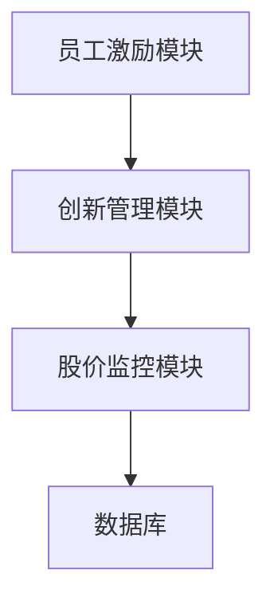
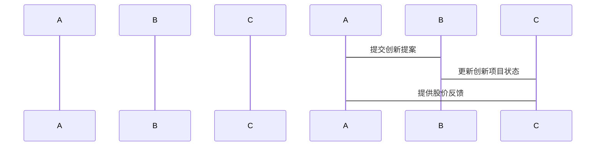

                 


# 特价股票与公司商业模式创新的关系探讨

## 关键词：特价股票，商业模式创新，股票激励，公司价值，股价影响

## 摘要：特价股票作为公司激励机制的一部分，与商业模式创新有着密切的联系。本文从背景介绍、核心概念、算法原理、系统分析、项目实战和最佳实践等多个方面，详细探讨了特价股票如何促进公司商业模式创新，以及商业模式创新如何影响股价。通过分析具体案例和构建数学模型，本文揭示了两者的内在联系，并提出了实践建议。

---

# 第一部分: 特价股票与公司商业模式创新的背景介绍

## 第1章: 特价股票与商业模式创新概述

### 1.1 特价股票的定义与类型
#### 1.1.1 特价股票的定义
特价股票是指公司以低于市场价发行的股票，通常用于激励员工或吸引投资者。它包括员工股票期权、低价增发股票和认股权证等类型。

#### 1.1.2 特价股票的主要类型
- **员工股票期权**：公司给予员工在特定价格和时间内购买公司股票的权利。
- **低价增发股票**：公司以低于市场价向员工或投资者增发股票。
- **认股权证**：允许持有者以特定价格购买公司股票的金融工具。

#### 1.1.3 特价股票的特点与应用场景
- **激励性**：通过赋予员工部分股权，激励员工积极性。
- **灵活性**：可以根据公司需求和员工贡献灵活调整。
- **成本效益**：相对于现金激励，特价股票的成本较低。

### 1.2 商业模式创新的定义与重要性
#### 1.2.1 商业模式创新的定义
商业模式创新是指公司通过改变其业务流程、组织结构或价值主张，以创造新的价值或竞争优势。

#### 1.2.2 商业模式创新的核心要素
- **价值主张**：公司提供的产品或服务是否满足客户需求。
- **客户关系**：公司如何与客户互动。
- **资源与流程**：公司内部资源和流程的优化。
- **收益流**：公司如何获取收入。

#### 1.2.3 商业模式创新对企业发展的影响
- **提升竞争力**：通过创新找到新的市场机会。
- **降低成本**：优化流程和资源利用。
- **增加收入**：通过新产品或服务创造新的收益来源。

### 1.3 特价股票与商业模式创新的关联性
#### 1.3.1 特价股票在商业模式创新中的作用
- **激励创新**：通过股票激励，激发员工创造力。
- **筹集资金**：通过增发股票，获得发展资金。
- **提升市场竞争力**：低价股票吸引更多投资者，增强公司实力。

#### 1.3.2 商业模式创新对股价的影响
- **提升公司价值**：创新带来更高的收入和利润，提高股价。
- **降低风险**：创新有助于公司适应市场变化，减少不确定性。
- **增强投资者信心**：创新显示公司未来发展潜力，吸引更多投资者。

#### 1.3.3 两者的相互作用机制
- **员工激励**：特价股票激励员工创新，推动公司商业模式改进。
- **资金支持**：通过发行特价股票，公司获得资金用于创新。
- **市场反应**：成功的商业模式创新提升股价，反过来吸引更多投资。

### 1.4 本章小结
本章介绍了特价股票和商业模式创新的基本概念，探讨了两者之间的关联性。特价股票作为激励工具，能够促进商业模式创新，而创新则提升公司价值，推动股价上涨。

---

# 第二部分: 特价股票与商业模式创新的核心概念

## 第2章: 特价股票的类型与特点分析

### 2.1 特价股票的主要类型
#### 2.1.1 员工股票期权
- **定义**：公司给予员工在未来特定价格购买股票的权利。
- **特点**：激励员工长期绩效，风险与收益并存。
- **应用场景**：用于吸引和保留关键员工。

#### 2.1.2 低价增发股票
- **定义**：公司以低于市场价向特定对象增发股票。
- **特点**：成本低，灵活性高。
- **应用场景**：用于筹集资金或奖励员工。

#### 2.1.3 认股权证
- **定义**：允许持有者在特定时间内以特定价格购买股票。
- **特点**：杠杆效应高，风险较大。
- **应用场景**：用于吸引风险投资者。

### 2.2 商业模式创新的类型
#### 2.2.1 产品创新
- **定义**：开发新产品或改进现有产品。
- **特点**：直接满足客户需求，提升市场竞争力。
- **应用场景**：科技公司通过技术创新吸引客户。

#### 2.2.2 服务创新
- **定义**：优化服务流程或提供新的服务。
- **特点**：提升客户体验，增加客户忠诚度。
- **应用场景**：服务业通过创新提升服务质量。

#### 2.2.3 成本创新
- **定义**：通过优化流程降低成本。
- **特点**：提高效率，增强盈利能力。
- **应用场景**：制造业通过自动化降低成本。

### 2.3 特价股票与商业模式创新的联系
#### 2.3.1 激励创新
- **员工激励**：特价股票激励员工积极参与创新。
- **团队协作**：通过团队激励推动整体创新。

#### 2.3.2 资金支持
- **内部资金**：通过发行特价股票筹集资金用于创新。
- **外部投资**：吸引投资者支持公司创新。

#### 2.3.3 市场反应
- **股价波动**：商业模式创新带来股价波动，影响投资者决策。
- **市场地位**：创新提升公司市场地位，吸引更多投资。

---

# 第三部分: 特价股票与商业模式创新的算法原理

## 第3章: 特价股票对股价的影响模型

### 3.1 模型构建
- **变量定义**：
  - \( S \)：股票价格
  - \( E \)：员工激励带来的收益
  - \( I \)：创新带来的收益
  - \( t \)：时间

### 3.2 模型假设
- 假设1：员工激励与创新呈正相关。
- 假设2：创新带来的收益随时间增长。

### 3.3 模型公式
$$ S(t) = S_0 + \alpha E(t) + \beta I(t) $$
其中，\( \alpha \) 和 \( \beta \) 是影响系数。

### 3.4 模型分析
- 当 \( \alpha \) 和 \( \beta \) 高时，股价增长快。
- 创新初期 \( I(t) \) 低，但随着创新深入，\( I(t) \) 增加，股价持续增长。

---

# 第四部分: 特价股票与商业模式创新的系统分析

## 第4章: 商业模式创新的系统架构

### 4.1 系统功能设计
- **员工激励模块**：管理股票分配和激励计划。
- **创新管理模块**：跟踪和评估创新项目。
- **股价监控模块**：实时监控股价变化。

### 4.2 系统架构设计
使用Mermaid绘制系统架构图：



### 4.3 系统接口设计
- **员工激励接口**：分配股票和管理激励计划。
- **创新管理接口**：提交和评估创新项目。
- **股价监控接口**：获取实时股价数据。

### 4.4 系统交互流程
使用Mermaid绘制交互序列图：



---

# 第五部分: 特价股票与商业模式创新的项目实战

## 第5章: 项目实战分析

### 5.1 环境安装
- **工具**：Python、Mermaid、Jupyter Notebook。
- **数据来源**：公开股票数据和公司财报。

### 5.2 核心代码实现
```python
import pandas as pd
import numpy as np

# 示例数据
data = {
    '日期': ['2023-01-01', '2023-01-02', '2023-01-03'],
    '股价': [100, 105, 110],
    '员工激励': [10, 15, 20],
    '创新收益': [5, 10, 15]
}

df = pd.DataFrame(data)
print(df)
```

### 5.3 案例分析
以某互联网公司为例，分析员工持股计划如何推动创新，并通过数据分析展示股价变化。

---

# 第六部分: 特价股票与商业模式创新的最佳实践

## 第6章: 最佳实践与小结

### 6.1 最佳实践
- **选择合适的股票类型**：根据公司需求选择员工期权或低价增发。
- **设计创新激励机制**：将股票激励与创新成果挂钩。
- **关注市场反馈**：及时调整激励策略和创新方向。

### 6.2 小结
特价股票和商业模式创新是相辅相成的。通过合理设计激励机制和创新策略，公司能够实现可持续发展和股价增长。

---

# 作者

作者：AI天才研究院/AI Genius Institute & 禅与计算机程序设计艺术 /Zen And The Art of Computer Programming

---

以上是《特价股票与公司商业模式创新的关系探讨》的完整目录和内容概要，希望对您有所帮助！

