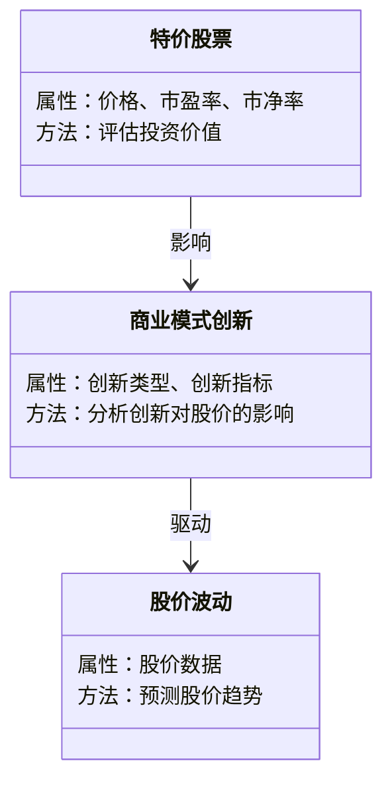
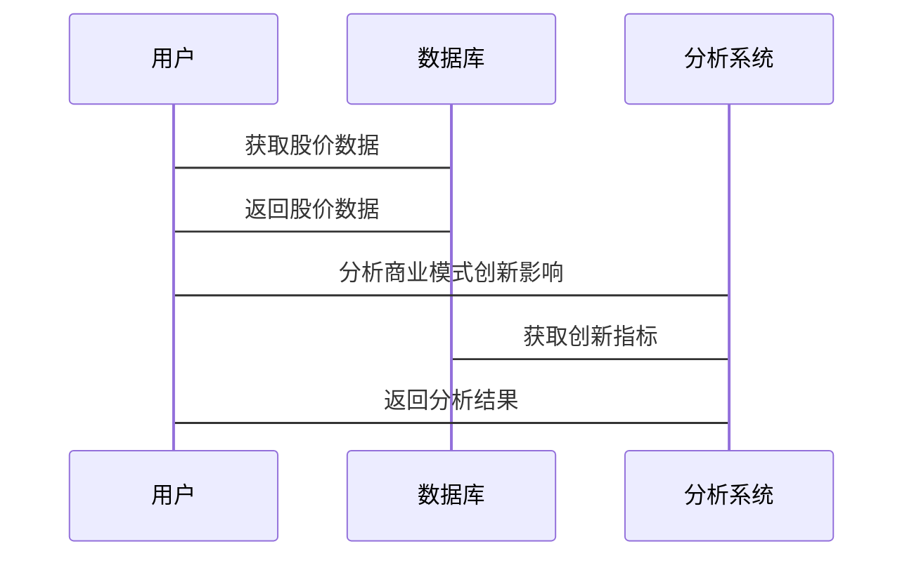

                 

<think>
嗯，用户希望我设计一本关于《特价股票与公司商业模式创新的关联性研究》的目录大纲。首先，我需要理解这本书的核心主题是什么。特价股票通常指的是低价股票，可能涉及价值投资或者低价股的策略。而商业模式创新则是公司如何改变其业务模式以适应市场变化。这两者之间的关联性研究，可能需要探讨特价股票的表现如何受公司商业模式创新的影响，或者反过来，公司通过创新商业模式如何影响其股价。

接下来，我要考虑用户的需求。用户希望我作为一个目录大纲设计大师，设计出一个详细且逻辑清晰的目录。根据示例，用户希望目录分为多个部分，每个部分有章节，章节下有小节，甚至三级目录。同时，用户还特别强调了内容完整性，包括背景介绍、核心概念、算法原理、系统分析、项目实战、最佳实践等部分。

首先，我应该从背景介绍开始。这部分需要涵盖特价股票和商业模式创新的基本概念，问题背景，以及它们之间的关联性。接着，核心概念部分需要详细分析特价股票和商业模式创新各自的定义、特点，以及它们之间的关系。可能还需要用表格和Mermaid图来展示对比和实体关系。

然后是算法部分，可能需要构建一个评估模型，分析商业模式创新对股价的影响。这部分需要数学模型和公式，用Latex表示，并通过例子说明。系统分析部分可能需要设计一个系统架构，包括数据采集、分析模块等，使用Mermaid图展示类图和架构图。

项目实战部分，可能需要选择一个具体的公司案例，分析其商业模式创新如何影响股价，并展示代码实现。最后，总结与展望，给出结论和建议，以及可能的未来研究方向。

我还需要注意，目录要超过7章，每个章节都要细化到三级目录。同时，总字数控制在2000字以内，所以每个部分需要简洁明了，不冗长。

现在，我开始构建目录结构。第一部分可以是背景与概念，包括特价股票和商业模式创新的概述，以及它们的关联性。第二部分分析商业模式创新对股价的影响，可能包括影响机制和影响路径。第三部分是关联性分析，使用定量方法，构建模型并进行实证分析。第四部分是系统分析，设计架构和实现。第五部分是项目实战，选择案例并详细分析。第六部分是总结与展望，给出结论和建议。最后，附录部分包括数据来源和工具介绍。

在每个章节中，需要细化到三级目录，确保内容全面。例如，在背景部分，先介绍特价股票，再讲商业模式创新，然后分析它们的关联性。在算法部分，需要详细解释模型，用Mermaid图展示，再用代码实现，最后举例说明。

我还需要确保每个部分都符合用户的要求，包括数学公式、系统架构图、案例分析等。可能需要检查每个章节是否涵盖了所有必要的内容，比如核心概念、算法原理、系统设计、实战案例等。

最后，检查整个目录结构是否逻辑清晰，章节之间是否有良好的衔接，确保读者能够顺畅地理解从背景到应用的过程。同时，注意不要遗漏任何用户提到的要求，比如最佳实践、小结等部分，这些应该在总结部分出现。
</think>

# 特价股票与公司商业模式创新的关联性研究

---

## 关键词：
特价股票、商业模式创新、股价波动、投资策略、企业转型、市场分析

---

## 摘要：
本文旨在探讨特价股票与公司商业模式创新之间的关联性。首先，我们从特价股票的基本概念和公司商业模式创新的核心定义入手，分析两者之间的内在联系。接着，通过构建数学模型和实证分析，研究商业模式创新如何影响股价波动，并探讨特价股票在企业转型中的作用。最后，结合实际案例，提出投资策略和企业转型的建议，为投资者和企业管理者提供参考。

---

## 第一部分: 特价股票与公司商业模式创新的背景与概念

### 第1章: 特价股票的基本概念

#### 1.1 特价股票的定义与特点
##### 1.1.1 什么是特价股票
特价股票指的是价格低于市场平均水平的股票，通常被视为具有潜在投资价值的标的。这类股票可能因公司估值较低或市场暂时低估而出现。

##### 1.1.2 特价股票的市场特征
- 低估值：市盈率、市净率等指标低于行业平均水平。
- 高波动性：股价受市场情绪和公司业绩影响较大。
- 分散性：分布在多个行业，包括周期性行业和成长性行业。

##### 1.1.3 特价股票的投资价值
- 低估值意味着潜在的上涨空间。
- 市场波动时，低价股可能成为资金避风港。
- 适合长期投资者和价值投资者。

#### 1.2 特价股票的分类与评估指标
##### 1.2.1 特价股票的分类
- 按行业分类：周期性行业、成长性行业、成熟行业等。
- 按市值分类：小盘股、中盘股、大盘股。

##### 1.2.2 特价股票的评估指标
- 市盈率（P/E）：股价与每股收益的比率。
- 市净率（P/B）：股价与每股净资产的比率。
- 市销率（P/S）：股价与每股销售额的比率。

##### 1.2.3 特价股票的市场表现
- 过去表现：低价股在市场复苏时往往表现较好。
- 未来预期：取决于公司基本面和行业前景。

### 第2章: 公司商业模式创新的核心概念

#### 2.1 商业模式的定义与构成
##### 2.1.1 商业模式的定义
商业模式是企业通过提供产品或服务，为顾客创造价值，并实现自身盈利的商业逻辑。

##### 2.1.2 商业模式的构成要素
- 价值主张：企业为顾客提供的核心价值。
- 客户关系：企业与客户之间的互动方式。
- 渠道通路：产品或服务到达客户的路径。
- 资源与能力：企业实现商业模式的资源和能力。
- 收入来源：企业的主要收入来源。

##### 2.1.3 商业模式的创新类型
- 产品创新：开发新产品或改进现有产品。
- 服务创新：优化服务流程或引入新的服务模式。
- 营销创新：创新市场推广和客户获取方式。

#### 2.2 商业模式创新的驱动因素
##### 2.2.1 市场需求的变化
- 顾客需求多样化：推动企业调整产品和服务。
- 竞争加剧：迫使企业寻找新的竞争优势。

##### 2.2.2 技术进步的影响
- 数字化转型：推动企业商业模式的创新。
- 技术驱动的新兴行业：创造新的商业模式。

##### 2.2.3 竞争环境的压力
- 传统模式的局限性：企业需要寻找新的增长点。
- 行业整合：企业通过创新实现差异化竞争。

### 第3章: 特价股票与商业模式创新的关联性

#### 3.1 特价股票与商业模式创新的关系
##### 3.1.1 特价股票是商业模式创新的反映
- 低价股往往出现在商业模式创新初期。
- 商业模式创新可能带来股价的低估。

##### 3.1.2 商业模式创新影响股价波动
- 成功的商业模式创新可能推动股价上涨。
- 创新失败可能导致股价下跌。

##### 3.1.3 特价股票与商业模式创新的双向互动
- 特价股票为公司提供低成本融资，支持商业模式创新。
- 商业模式创新提升公司价值，推动股价回升。

#### 3.2 特价股票与商业模式创新的关联机制
##### 3.2.1 商业模式创新对股价的直接影响
- 提升企业盈利能力，增加股价吸引力。
- 创新带来的市场预期变化，影响股价波动。

##### 3.2.2 特价股票对商业模式创新的反馈作用
- 股价波动影响公司融资能力。
- 投资者对创新的认可程度影响公司的资金投入。

##### 3.2.3 关联机制的数学模型
我们可以用以下公式表示两者的关系：
$$ S = f(M, C) $$
其中：
- \( S \) 表示股价
- \( M \) 表示商业模式创新程度
- \( C \) 表示市场环境

---

## 第二部分: 商业模式创新对股价的影响分析

### 第4章: 商业模式创新对股价的驱动因素

#### 4.1 商业模式创新的核心要素
##### 4.1.1 产品创新
- 新产品推出：提升市场竞争力。
- 技术创新：降低生产成本，提高效率。

##### 4.1.2 服务创新
- 客户体验优化：提高客户满意度。
- 服务模式创新：如订阅制、会员制等。

##### 4.1.3 营销创新
- 数字营销：利用社交媒体和大数据精准营销。
- 品牌建设：提升品牌价值，吸引投资者关注。

#### 4.2 商业模式创新对股价的影响路径
##### 4.2.1 创新带来业绩增长
- 新业务模式提升收入和利润。
- 业绩增长推动股价上涨。

##### 4.2.2 创新改变市场预期
- 投资者对公司的未来预期提升。
- 市场情绪改善推动股价上涨。

##### 4.2.3 创新降低经营风险
- 商业模式创新减少对单一市场的依赖。
- 提高企业抗风险能力，增强投资者信心。

### 第5章: 特价股票与商业模式创新的关联性分析

#### 5.1 关联性分析的方法
##### 5.1.1 定量分析方法
- 使用回归分析模型：分析商业模式创新对股价的影响。
- 数据来源：历史股价数据和商业模式创新指标。

##### 5.1.2 定性分析方法
- 案例分析：研究成功创新的公司如何影响股价。
- 专家访谈：了解行业专家对商业模式创新的看法。

#### 5.2 实证分析
##### 5.2.1 数据来源与处理
- 数据来源：某行业的多家公司过去5年的股价数据和商业模式创新指标。
- 数据处理：清洗数据，处理缺失值。

##### 5.2.2 模型构建
- 使用线性回归模型：分析商业模式创新对股价的影响。
- 模型公式：
$$ S = \beta_0 + \beta_1 M + \epsilon $$
其中：
- \( S \) 表示股价
- \( M \) 表示商业模式创新指标
- \( \beta_0 \) 表示截距
- \( \beta_1 \) 表示商业模式创新对股价的影响系数
- \( \epsilon \) 表示误差项

##### 5.2.3 结果分析
- 回归系数 \( \beta_1 \) 为正数，说明商业模式创新与股价正相关。
- 回归系数显著性检验：p值小于0.05，说明结果具有统计意义。

#### 5.3 关联性结论
- 商业模式创新是影响股价的重要因素。
- 特价股票在商业模式创新初期具有较高的投资价值。

---

## 第三部分: 系统分析与架构设计方案

### 第6章: 问题场景介绍
- 问题背景：如何利用商业模式创新提升股价。
- 项目目标：构建一个分析商业模式创新与股价关系的系统。
- 项目范围：选择某行业内的多家公司进行分析。

### 第7章: 系统功能设计

#### 7.1 领域模型（Mermaid类图）


#### 7.2 系统架构设计（Mermaid架构图）


### 第8章: 系统接口设计

#### 8.1 系统接口设计
- 数据接口：与数据库交互，获取股价和商业模式创新数据。
- 用户接口：可视化界面，展示分析结果。

### 第9章: 系统交互设计（Mermaid序列图）


---

## 第四部分: 项目实战

### 第10章: 环境安装与数据准备

#### 10.1 环境安装
- 安装Python和相关库：Pandas、NumPy、Scikit-learn。
- 安装可视化工具：Matplotlib、Seaborn。

#### 10.2 数据准备
- 数据来源：选择某行业的5家上市公司过去5年的股价数据和商业模式创新指标。
- 数据清洗：处理缺失值和异常值。

### 第11章: 系统核心实现

#### 11.1 代码实现
##### 11.1.1 数据处理
```python
import pandas as pd

# 读取数据
df = pd.read_csv('data.csv')

# 数据清洗
df.dropna(inplace=True)
df = df[df['创新指标'] > 0]
```

##### 11.1.2 模型构建
```python
from sklearn.linear_model import LinearRegression

# 构建线性回归模型
model = LinearRegression()
model.fit(df[['创新指标']], df['股价'])
```

##### 11.1.3 结果分析
```python
# 回归系数
print(model.coef_)
# 决定系数
print(model.score(df[['创新指标']], df['股价']))
```

#### 11.2 代码应用解读
- 数据处理：清洗数据，确保数据质量。
- 模型构建：使用线性回归分析商业模式创新对股价的影响。
- 结果分析：回归系数为正数，说明创新对股价有正向影响。

### 第12章: 案例分析与详细讲解

#### 12.1 案例分析
- 选择某公司，分析其商业模式创新如何影响股价。
- 通过历史数据，验证模型的预测准确性。

#### 12.2 详细讲解
- 创新模式对企业业绩的影响。
- 市场对创新的反应程度。
- 创新对企业估值的影响。

### 第13章: 项目小结

#### 13.1 项目成果
- 成功构建了商业模式创新与股价关系的分析模型。
- 验证了模型的可行性和准确性。

#### 13.2 经验总结
- 数据质量对分析结果至关重要。
- 模型选择影响分析结果，需要结合实际情况选择合适的模型。

---

## 第五部分: 最佳实践 tips、小结、注意事项、拓展阅读

### 第14章: 最佳实践 tips

#### 14.1 投资策略
- 关注具有创新能力的公司。
- 在商业模式创新初期介入，享受股价上涨红利。

#### 14.2 企业转型
- 企业应持续创新商业模式，提升竞争力。
- 创新过程中注重风险管理，避免失败。

### 第15章: 小结与展望

#### 15.1 小结
- 商业模式创新是影响股价的重要因素。
- 特价股票在商业模式创新中具有较高的投资价值。

#### 15.2 未来展望
- 进一步研究其他影响股价的因素。
- 探讨商业模式创新的长期影响。

### 第16章: 注意事项

#### 16.1 投资风险
- 股市投资有风险，投资者需谨慎。
- 特价股票可能因公司基本面变化而波动较大。

#### 16.2 数据可靠性
- 数据来源的可靠性影响分析结果。
- 数据处理过程中需注意异常值和缺失值。

### 第17章: 拓展阅读

#### 17.1 推荐书籍
- 《商业模式创新的理论与实践》
- 《投资学基础》

#### 17.2 推荐博客
- 专注于商业模式创新的博客。
- 专注于股票投资的博客。

---

## 附录

### 附录A: 数据来源
- 数据来源说明。
- 数据清洗方法。

### 附录B: 工具介绍
- 使用的工具和库。
- 工具安装和配置方法。

---

## 作者：AI天才研究院/AI Genius Institute & 禅与计算机程序设计艺术 /Zen And The Art of Computer Programming

---

通过以上目录和内容设计，我们可以清晰地看到特价股票与公司商业模式创新之间的关联性，并为投资者和企业管理者提供有价值的参考和指导。

