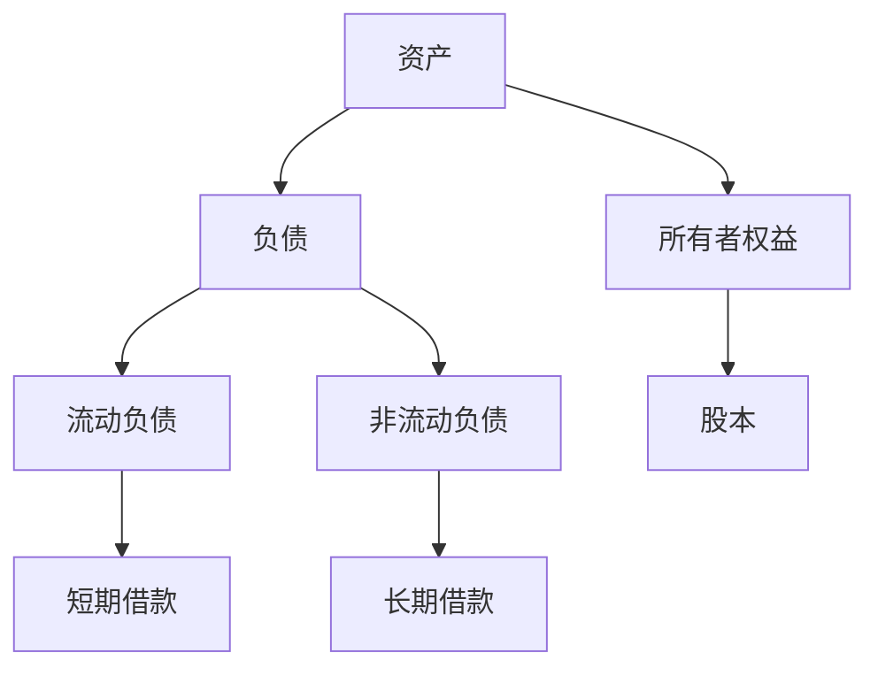
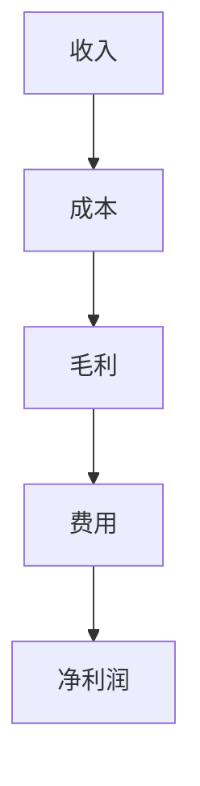
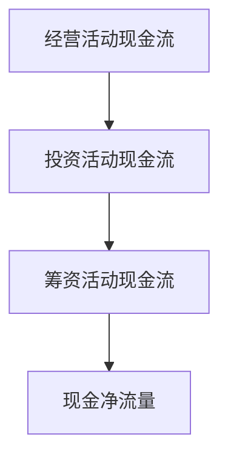
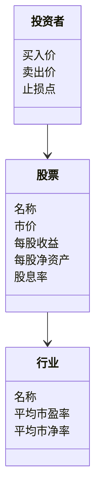
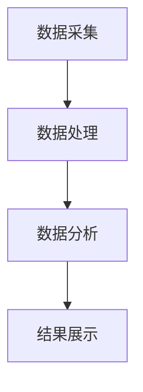
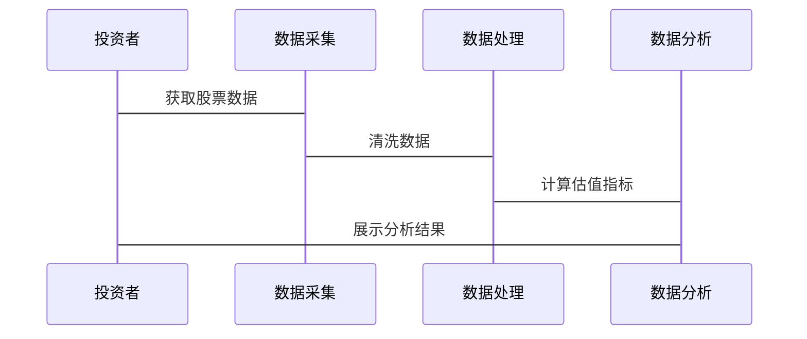

                 


# 特价股票与公司基本面分析的结合

> 关键词：特价股票，基本面分析，财务报表，估值方法，投资策略

> 摘要：本文详细探讨了如何将公司基本面分析与寻找特价股票相结合。通过分析财务报表、评估估值指标、制定投资策略，帮助投资者识别出具有投资价值的特价股票。文章从基本概念、分析方法到实际操作，层层深入，提供了一套系统的分析框架。

---

# 第一部分: 特价股票与公司基本面分析的基础

## 第1章: 特价股票与基本面分析的概述

### 1.1 特价股票的基本概念

#### 1.1.1 特价股票的定义
特价股票指的是市场价格低于其内在价值的股票。这种股票通常被视为被市场低估，具有较大的上涨潜力。内在价值可以通过对公司基本面的分析来评估。

#### 1.1.2 特价股票的特点
- **低估值**：市场价格低于合理估值。
- **潜在回报高**：由于价格被低估，未来的上涨空间较大。
- **风险较低**：通常出现在市场低迷时期，风险相对较小。

#### 1.1.3 特价股票的投资价值
投资者通过识别特价股票，可以在市场底部布局，获取超额收益。然而，识别特价股票需要对公司的基本面有深入的了解。

### 1.2 公司基本面分析的定义与重要性

#### 1.2.1 公司基本面分析的定义
基本面分析是通过研究公司的财务报表、行业地位、管理团队等因素，评估其内在价值的方法。

#### 1.2.2 公司基本面分析的核心要素
- **财务状况**：包括资产、负债、所有者权益等。
- **盈利能力**：如净利润率、毛利率等。
- **成长能力**：收入和利润的增速。
- **偿债能力**：如流动比率、速动比率等。

#### 1.2.3 公司基本面分析在投资中的作用
通过基本面分析，投资者可以评估公司的财务健康状况、盈利能力以及未来成长潜力，从而做出更明智的投资决策。

### 1.3 特价股票与基本面分析的关系

#### 1.3.1 特价股票与基本面分析的联系
基本面分析为识别特价股票提供了理论基础。通过分析公司基本面，投资者可以判断其内在价值，进而发现市场价格低于内在价值的股票。

#### 1.3.2 通过基本面分析寻找特价股票的方法
- **评估公司价值**：通过财务报表分析公司的真实价值。
- **比较市场价格**：将市场价格与内在价值进行比较，寻找低估的股票。

#### 1.3.3 特价股票分析的边界与外延
基本面分析的边界在于其假设市场的非完全有效性。外延则包括宏观经济分析、行业分析等更广泛的因素。

### 1.4 本章小结
本章介绍了特价股票的基本概念及其与基本面分析的关系，强调了基本面分析在识别特价股票中的重要性。

---

## 第2章: 公司基本面分析的核心指标

### 2.1 财务报表分析基础

#### 2.1.1 资产负债表
资产负债表反映了公司在某一特定时点的财务状况，包括资产、负债和所有者权益。

**Mermaid 图：资产负债表结构**


#### 2.1.2 利润表
利润表展示了公司在一定会计期间内的收入和支出，以及最终的净利润。

**Mermaid 图：利润表结构**


#### 2.1.3 现金流量表
现金流量表记录了公司现金的流入和流出情况，反映了公司的流动性。

**Mermaid 图：现金流量表结构**


### 2.2 财务比率分析

#### 2.2.1 偿债能力比率
- **流动比率**：流动资产 / 流动负债。
- **速动比率**：(流动资产 - 存货) / 流动负债。

#### 2.2.2 营运能力比率
- **存货周转率**：成本 of goods sold / 平均存货。
- **应收账款周转率**：收入 / 平均应收账款。

#### 2.2.3 盈利能力比率
- **净利率**：净利润 / 收入。
- **ROE**：净利润 / 所有者权益。

### 2.3 行业分析与公司竞争力

#### 2.3.1 行业分析的基本方法
- **行业生命周期**：处于成长期的行业更具投资潜力。
- **行业集中度**：高集中度行业竞争压力较小。

#### 2.3.2 公司在行业中的竞争力分析
- **市场份额**：公司市场份额越大，竞争力越强。
- **技术优势**：技术创新能力强的公司更具竞争优势。

#### 2.3.3 行业趋势对股票价格的影响
行业整体趋势向好时，行业内股票价格通常会上涨。

### 2.4 本章小结
本章详细介绍了公司基本面分析的核心指标，包括财务报表分析和财务比率分析，并探讨了行业分析对股票投资的影响。

---

## 第3章: 特价股票的估值方法

### 3.1 市盈率法

#### 3.1.1 市盈率的定义与计算公式
市盈率（P/E）= 股价 / 每股收益（EPS）。

**公式：**
$$ P/E = \frac{\text{股价}}{\text{EPS}} $$

#### 3.1.2 市盈率与股票价值的关系
市盈率低的股票可能被低估，具有较高的投资价值。

#### 3.1.3 市盈率法在寻找特价股票中的应用
- 选择市盈率低于行业平均水平的股票。

### 3.2 市净率法

#### 3.2.1 市净率的定义与计算公式
市净率（P/B）= 股价 / 每股净资产。

**公式：**
$$ P/B = \frac{\text{股价}}{\text{每股净资产}} $$

#### 3.2.2 市净率与股票价值的关系
市净率低的股票可能被低估，尤其适用于银行、地产等资产密集型行业。

#### 3.2.3 市净率法在寻找特价股票中的应用
- 选择市净率低于行业平均水平的股票。

### 3.3 股息率法

#### 3.3.1 股息率的定义与计算公式
股息率 = 每股股息 / 股价。

**公式：**
$$ \text{股息率} = \frac{\text{每股股息}}{\text{股价}} $$

#### 3.3.2 股息率与股票价值的关系
高股息率的股票通常被视为稳定的投资，尤其适用于价值投资者。

#### 3.3.3 股息率法在寻找特价股票中的应用
- 选择股息率高于行业平均水平的股票。

### 3.4 本章小结
本章介绍了几种常用的股票估值方法，包括市盈率法、市净率法和股息率法，并探讨了它们在寻找特价股票中的应用。

---

## 第4章: 特价股票的筛选与投资策略

### 4.1 特价股票的筛选标准

#### 4.1.1 基本面分析标准
- 公司财务状况健康，盈利能力稳定。
- 行业前景良好，公司竞争力强。

#### 4.1.2 估值指标的筛选标准
- 市盈率、市净率低于行业平均水平。
- 股息率高于行业平均水平。

#### 4.1.3 市场情绪与流动性分析
- 市场情绪低迷时，更容易出现特价股票。
- 流动性充足的股票更容易被市场发现其低估价值。

### 4.2 投资策略的制定

#### 4.2.1 长期投资策略
- 买入并持有，等待市场回归合理估值。

#### 4.2.2 短期投资策略
- 快速买入低估股票，待价格上涨后卖出。

### 4.3 风险管理策略

#### 4.3.1 设置止损点
- 当股价下跌至一定幅度时，立即卖出。

#### 4.3.2 分批买入
- 分多次买入，降低单次买入的风险。

### 4.4 本章小结
本章探讨了如何筛选特价股票，并制定了相应的投资策略，强调了风险管理的重要性。

---

# 第五部分: 项目实战与进阶策略

## 第5章: 项目实战分析

### 5.1 实战背景介绍
假设当前市场低迷，寻找具有较好基本面但被低估的股票。

### 5.2 系统功能设计

#### 5.2.1 领域模型设计
**Mermaid 图：领域模型类图**


### 5.3 系统架构设计

#### 5.3.1 架构设计
**Mermaid 图：系统架构图**


### 5.4 系统接口设计

#### 5.4.1 数据接口
- 数据源：股票数据API。
- 数据处理：清洗和转换数据。

### 5.5 系统交互设计

#### 5.5.1 交互流程
**Mermaid 图：系统交互序列图**


### 5.6 项目实现

#### 5.6.1 环境安装
- Python 3.8+
- 数据分析库：Pandas、NumPy。
- 可视化库：Matplotlib、Seaborn。

#### 5.6.2 核心实现代码
```python
import pandas as pd

# 示例数据
data = {
    '股票名称': ['A', 'B', 'C'],
    '市价': [10, 15, 20],
    '每股收益': [2, 3, 4],
    '每股净资产': [5, 6, 7],
    '股息率': [0.05, 0.06, 0.07]
}

df = pd.DataFrame(data)

# 计算市盈率
df['市盈率'] = df['市价'] / df['每股收益']

# 计算市净率
df['市净率'] = df['市价'] / df['每股净资产']

print(df)
```

### 5.7 实际案例分析

#### 5.7.1 案例背景
假设市场低迷，寻找市盈率和市净率低于行业平均水平的股票。

#### 5.7.2 分析过程
1. 收集行业数据，计算行业平均市盈率和市净率。
2. 筛选市盈率和市净率低于行业平均的股票。
3. 结合股息率进行综合评估。

### 5.8 项目小结
通过实战分析，验证了基本面分析在寻找特价股票中的有效性，并展示了如何通过系统化的方法进行投资决策。

---

# 第六部分: 进阶策略与风险管理

## 第6章: 进阶策略

### 6.1 多因素分析

#### 6.1.1 综合评估模型
结合市盈率、市净率、股息率等多种指标进行综合评估。

#### 6.1.2 宏观经济分析
考虑宏观经济指标如GDP增长率、利率等对股票价格的影响。

### 6.2 技术分析与基本面分析结合

#### 6.2.1 技术指标的应用
- 移动平均线（MA）。
- 相对强弱指数（RSI）。

### 6.3 行业轮动策略

#### 6.3.1 行业轮动的基本概念
根据行业周期变化，调整投资组合。

#### 6.3.2 行业轮动的实施步骤
1. 分析行业周期。
2. 选择处于上升期的行业。
3. 调整投资组合。

### 6.4 风险管理策略

#### 6.4.1 分散投资
通过投资多个行业和公司，降低投资风险。

#### 6.4.2 定期评估
定期重新评估投资组合，及时调整。

### 6.5 本章小结
本章探讨了进阶策略，包括多因素分析、技术分析与基本面分析的结合、行业轮动策略以及风险管理策略。

---

# 作者：AI天才研究院 & 禅与计算机程序设计艺术

