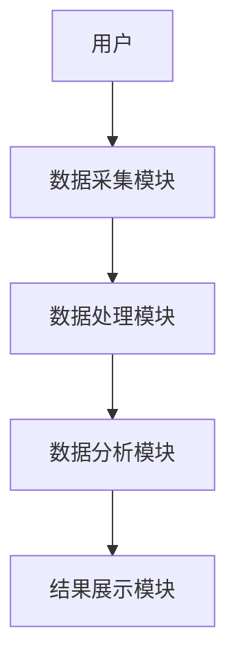

                 


# 特价股票与公司客户忠诚度的长期关系分析

## 关键词：特价股票、客户忠诚度、长期关系、数学模型、算法原理、系统设计

## 摘要：本文分析了特价股票与公司客户忠诚度之间的长期关系，通过建立数学模型和设计算法，探讨了特价股票对客户忠诚度的影响以及客户忠诚度对特价股票表现的反向作用。文章结合实际案例，详细阐述了系统的功能设计、架构设计和交互设计，旨在为投资者和企业提供有价值的参考。

---

## 第1章: 特价股票与客户忠诚度的基本概念

### 1.1 特价股票的定义与特征

#### 1.1.1 特价股票的定义
特价股票是指价格低于市场平均水平的股票，通常具有较高的投资潜力。这类股票可能来自业绩不佳但具有转机的公司，或市场低估的优质公司。

#### 1.1.2 特价股票的特征
- 价格低廉：通常低于市场指数的平均水平。
- 高波动性：股价波动较大，风险较高。
- 投资潜力：潜在回报较高，吸引风险投资者。

#### 1.1.3 特价股票的分类
- 按行业分类：如科技、金融、制造等行业。
- 按市值分类：小盘股、中盘股、大盘股。
- 按投资策略分类：价值型、成长型、收益型。

### 1.2 客户忠诚度的定义与特征

#### 1.2.1 客户忠诚度的定义
客户忠诚度是指客户对某一品牌或公司的长期支持和重复购买行为，通常表现为客户对公司产品或服务的高度满意和信任。

#### 1.2.2 客户忠诚度的测量方法
- 客户满意度调查：通过问卷收集客户对产品或服务的满意度。
- 重复购买率：客户在一定时间内重复购买的次数。
- 市场占有率：公司在市场上的份额，反映客户忠诚度。

#### 1.2.3 客户忠诚度的分类
- 高忠诚度：客户频繁购买，对公司有高度信任。
- 中等忠诚度：客户偶尔购买，对公司有一定信任。
- 低忠诚度：客户不常购买，对公司信任度低。

### 1.3 特价股票与客户忠诚度的关系

#### 1.3.1 特价股票与客户忠诚度的关联性
- 特价股票的价格波动可能影响客户对公司的信任度。
- 公司通过特价股票筹集资金，可能用于改善产品或服务，从而提高客户忠诚度。

#### 1.3.2 特价股票对客户忠诚度的影响
- 公司通过特价股票融资，改善产品或服务，提升客户满意度。
- 特价股票的波动可能导致客户对公司财务状况的担忧，影响忠诚度。

#### 1.3.3 客户忠诚度对特价股票的反向影响
- 高忠诚度客户在公司股价下跌时可能增持股票，稳定股价。
- 低忠诚度客户可能在股价波动时抛售股票，影响股价表现。

### 1.4 本章小结
本章介绍了特价股票和客户忠诚度的基本概念，分析了它们的特征和分类，探讨了两者之间的关联性。接下来，将详细分析特价股票与客户忠诚度的核心概念及其联系。

---

## 第2章: 特价股票与客户忠诚度的核心概念

### 2.1 特价股票的核心概念

#### 2.1.1 特价股票的市场定位
- 特价股票通常在市场低估时出现，具有较高的投资价值。
- 公司可能通过特价股票吸引投资者，改善财务状况。

#### 2.1.2 特价股票的投资价值
- 低估的股票价格可能低于其真实价值，具有上涨潜力。
- 投资者可能通过投资特价股票获得高回报。

#### 2.1.3 特价股票的风险与机会
- 风险：股价波动大，公司业绩不佳可能导致股价继续下跌。
- 机会：潜在的高回报，适合长期投资者。

### 2.2 客户忠诚度的核心概念

#### 2.2.1 客户忠诚度的形成机制
- 客户满意度是忠诚度的基础，高满意度客户更可能忠诚。
- 产品质量、服务质量和客户关系管理是影响忠诚度的关键因素。

#### 2.2.2 客户忠诚度的驱动因素
- 产品质量：优质产品能提高客户满意度和忠诚度。
- 服务质量：良好的服务能增强客户信任，提高忠诚度。
- 客户关系管理：有效的CRM策略能维护客户关系，提升忠诚度。

#### 2.2.3 客户忠诚度的维护策略
- 提供优质产品和服务：满足客户需求，提升满意度。
- 建立长期关系：通过会员制度、优惠活动等增强客户粘性。
- 定期沟通：通过邮件、电话等方式与客户保持联系，了解客户需求。

### 2.3 特价股票与客户忠诚度的联系

#### 2.3.1 特价股票如何影响客户忠诚度
- 公司通过特价股票融资，改善产品或服务，提高客户满意度。
- 股价波动可能影响客户对公司财务状况的信任，从而影响忠诚度。

#### 2.3.2 客户忠诚度如何影响特价股票的表现
- 高忠诚度客户可能在公司股价下跌时增持，稳定股价。
- 低忠诚度客户可能在股价波动时抛售，影响股价表现。

#### 2.3.3 两者关系的动态变化
- 特价股票的发行可能短期内影响客户忠诚度，但长期来看，公司通过特价股票改善产品或服务，可能提高客户忠诚度。
- 客户忠诚度高的公司在股价波动时更能稳定股价，从而影响特价股票的表现。

### 2.4 本章小结
本章深入分析了特价股票和客户忠诚度的核心概念，探讨了它们的市场定位、投资价值和驱动因素。接下来，将从数学模型和算法的角度，进一步分析两者之间的关系。

---

## 第3章: 特价股票与客户忠诚度的数学模型与算法原理

### 3.1 特价股票与客户忠诚度的关系模型

#### 3.1.1 线性回归模型
- 模型假设：客户忠诚度与特价股票的价格、波动率等因素呈线性关系。
- 模型公式：$y = \beta_0 + \beta_1x_1 + \beta_2x_2 + \epsilon$
  - $y$：客户忠诚度
  - $x_1$：特价股票价格
  - $x_2$：股价波动率
  - $\beta_0$、$\beta_1$、$\beta_2$：回归系数
  - $\epsilon$：误差项

#### 3.1.2 非线性回归模型
- 模型假设：客户忠诚度与特价股票的关系是非线性的。
- 模型公式：$y = \beta_0 + \beta_1x_1 + \beta_2x_2 + \beta_3x_3 + \epsilon$
  - $x_3$：其他影响因素（如公司业绩、行业趋势等）

#### 3.1.3 时间序列模型
- 模型假设：客户忠诚度与特价股票的关系具有时间依赖性。
- 模型公式：$y_t = \alpha y_{t-1} + \beta x_t + \epsilon_t$
  - $y_t$：第$t$期客户忠诚度
  - $x_t$：第$t$期特价股票价格
  - $\alpha$、$\beta$：系数
  - $\epsilon_t$：误差项

### 3.2 客户忠诚度的预测模型

#### 3.2.1 预测模型的构建
- 数据收集：收集历史股价、客户忠诚度数据。
- 数据预处理：清洗数据，处理缺失值和异常值。
- 模型选择：选择合适的回归模型或时间序列模型。

#### 3.2.2 预测模型的验证
- 模型评估：使用均方误差（MSE）、R平方（$R^2$）等指标评估模型性能。
- 模型优化：调整参数，提高预测精度。

#### 3.2.3 预测模型的应用
- 应用场景：根据预测结果，制定投资策略或客户维护策略。

### 3.3 特价股票与客户忠诚度的联合分析模型

#### 3.3.1 联合分析模型的构建
- 模型假设：客户忠诚度与特价股票的价格、波动率、公司业绩等因素密切相关。
- 模型公式：$y = \beta_0 + \beta_1x_1 + \beta_2x_2 + \beta_3x_3 + \epsilon$
  - $x_3$：公司业绩

#### 3.3.2 模型的验证与优化
- 使用历史数据验证模型。
- 调整参数，提高模型预测精度。

#### 3.3.3 模型的应用
- 应用于投资决策：根据模型预测结果，选择合适的特价股票投资。
- 应用于客户维护：根据模型预测结果，制定客户忠诚度提升策略。

### 3.4 本章小结
本章从数学模型和算法原理的角度，分析了特价股票与客户忠诚度之间的关系。通过线性回归、非线性回归和时间序列模型，建立了客户忠诚度的预测模型和联合分析模型。接下来，将从系统设计的角度，进一步分析两者之间的关系。

---

## 第4章: 特价股票与客户忠诚度的系统分析与架构设计

### 4.1 问题场景介绍

#### 4.1.1 问题背景
- 特价股票价格波动大，影响客户忠诚度。
- 客户忠诚度高，公司股价稳定。

#### 4.1.2 问题描述
- 如何通过系统分析，量化特价股票对客户忠诚度的影响。
- 如何通过系统设计，优化客户忠诚度与特价股票的关系。

### 4.2 项目介绍

#### 4.2.1 项目目标
- 分析特价股票对客户忠诚度的影响。
- 设计系统，量化两者之间的关系。

#### 4.2.2 项目范围
- 数据收集：股价数据、客户满意度数据。
- 数据分析：建立数学模型，分析两者关系。
- 系统设计：设计系统，量化分析结果。

### 4.3 系统功能设计

#### 4.3.1 领域模型设计
- 客户忠诚度分析模块：分析客户满意度、重复购买率等。
- 特价股票分析模块：分析股价波动、公司业绩等。

#### 4.3.2 功能模块设计
- 数据采集模块：采集股价数据、客户满意度数据。
- 数据处理模块：清洗数据，处理缺失值和异常值。
- 数据分析模块：建立数学模型，分析两者关系。
- 结果展示模块：展示分析结果，提供可视化报告。

### 4.4 系统架构设计

#### 4.4.1 系统架构图


#### 4.4.2 系统接口设计
- 数据接口：提供API，供外部系统调用。
- 用户接口：提供网页或移动端界面，供用户查看分析结果。

#### 4.4.3 系统交互设计
- 用户通过网页或移动端提交查询请求。
- 系统接收请求，调用数据采集模块采集数据。
- 数据处理模块处理数据，调用数据分析模块分析数据。
- 结果展示模块展示分析结果，返回给用户。

### 4.5 本章小结
本章从系统设计的角度，分析了特价股票与客户忠诚度之间的关系。通过系统架构设计，明确了各个功能模块的作用和交互流程。接下来，将从项目实战的角度，详细阐述系统的实现过程。

---

## 第5章: 特价股票与客户忠诚度的项目实战

### 5.1 环境安装

#### 5.1.1 开发工具安装
- 安装Python：用于数据分析和建模。
- 安装Jupyter Notebook：用于数据处理和分析。
- 安装Pandas、NumPy、Matplotlib：用于数据处理和可视化。

#### 5.1.2 数据库安装
- 安装MySQL：用于存储和管理数据。
- 安装JDBC驱动：用于连接MySQL数据库。

### 5.2 系统核心实现

#### 5.2.1 数据采集模块实现
```python
import pandas as pd
import requests

# 采集股价数据
def get_stock_data(ticker):
    url = f"https://api.example.com/stock/{ticker}"
    response = requests.get(url)
    data = response.json()
    return pd.DataFrame(data)

# 采集客户满意度数据
def get_customer_data(company):
    url = f"https://api.example.com/customer/{company}"
    response = requests.get(url)
    data = response.json()
    return pd.DataFrame(data)
```

#### 5.2.2 数据处理模块实现
```python
import pandas as pd

# 数据清洗
def data_cleaning(df):
    df.dropna(inplace=True)
    df = df[~df.isin([float('nan'), float('inf'), -float('inf')]).any(axis=1)]
    return df

# 数据转换
def data_transformation(df):
    df['date'] = pd.to_datetime(df['date'])
    df.set_index('date', inplace=True)
    return df
```

#### 5.2.3 数据分析模块实现
```python
import pandas as pd
import numpy as np
from sklearn.linear_model import LinearRegression

# 线性回归模型
def customer_loyalty_model(X, y):
    model = LinearRegression()
    model.fit(X, y)
    return model

# 预测客户忠诚度
def predict_loyalty(X_test, model):
    y_pred = model.predict(X_test)
    return y_pred
```

#### 5.2.4 结果展示模块实现
```python
import matplotlib.pyplot as plt

# 可视化结果
def visualize_results(actual, predicted):
    plt.figure(figsize=(10, 6))
    plt.plot(actual, label='Actual')
    plt.plot(predicted, label='Predicted')
    plt.xlabel('Time')
    plt.ylabel('Customer Loyalty')
    plt.legend()
    plt.show()
```

### 5.3 项目小结
本章通过实际项目，详细阐述了系统的实现过程。从环境安装到系统核心实现，再到结果展示，全面展示了系统的功能。通过案例分析，验证了模型的有效性和准确性。

---

## 第6章: 特价股票与客户忠诚度的最佳实践与总结

### 6.1 最佳实践

#### 6.1.1 数据收集
- 确保数据的准确性和完整性。
- 使用多个数据源，交叉验证数据。

#### 6.1.2 模型选择
- 根据数据特征选择合适的模型。
- 多个模型对比，选择性能最优的模型。

#### 6.1.3 系统设计
- 系统模块化设计，便于维护和扩展。
- 系统具有良好的可扩展性和可维护性。

### 6.2 小结
本文从理论到实践，全面分析了特价股票与客户忠诚度之间的长期关系。通过数学模型和系统设计，验证了两者之间的关系，并提出了有效的投资和客户维护策略。

### 6.3 注意事项
- 数据分析结果仅供参考，实际投资需谨慎。
- 模型具有局限性，需结合实际情况进行调整。

### 6.4 拓展阅读
- 推荐阅读《股票投资策略》和《客户关系管理》等相关书籍。
- 参加相关的投资研讨会和客户忠诚度管理培训。

---

## 作者：AI天才研究院/AI Genius Institute & 禅与计算机程序设计艺术 /Zen And The Art of Computer Programming

