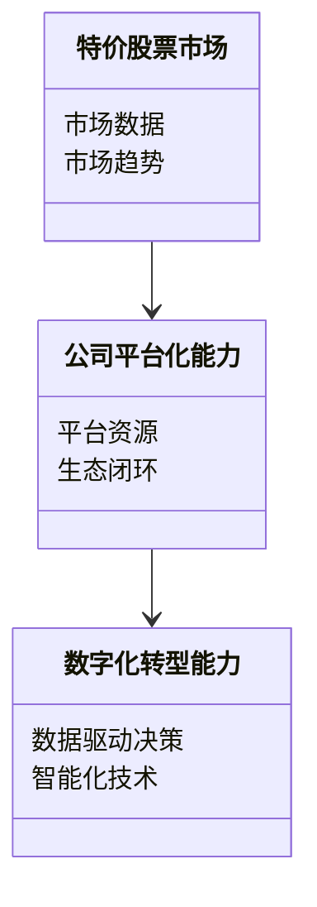
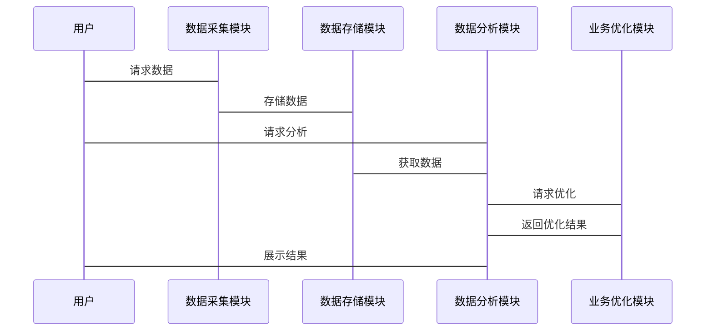

                 


# 特价股票与公司平台化与数字化转型能力的关联性研究

> 关键词：特价股票，公司平台化，数字化转型，关联性分析，数据驱动，算法模型，系统架构

> 摘要：本文通过分析特价股票与公司平台化、数字化转型能力的关联性，探讨了如何利用数字化技术提升公司在特价股票市场中的竞争力。文章从背景介绍、核心概念、算法原理、系统分析、项目实战等多个维度展开，深入剖析了三者之间的内在联系，并提出了具体的实现方案和最佳实践。

---

## 第1章: 背景介绍

### 1.1 特价股票的定义与特点
特价股票是指价格相对较低、具有较大波动性的股票，通常被投资者视为高风险高回报的投资标的。其特点包括：
1. **价格敏感性**：价格波动较大，容易受市场情绪影响。
2. **高风险性**：投资风险较高，适合风险承受能力强的投资者。
3. **短期机会**：往往具有短期市场机会，需快速捕捉。

### 1.2 公司平台化的定义与特点
公司平台化是指企业通过构建开放平台，整合内外部资源，实现业务生态化发展的模式。其特点包括：
1. **开放性**：通过平台整合多方资源，形成生态闭环。
2. **数据驱动**：依赖数据进行决策和优化。
3. **灵活性**：能够快速响应市场变化，调整业务策略。

### 1.3 数字化转型能力的定义与特点
数字化转型是指企业通过数字技术的应用，重构业务流程、组织架构和商业模式的过程。其特点包括：
1. **数据驱动**：利用数据进行精准决策。
2. **智能化**：通过AI、大数据等技术实现业务自动化和智能化。
3. **敏捷性**：能够快速迭代和创新。

### 1.4 特价股票与公司平台化与数字化转型能力的关联性
特价股票的市场波动性与公司平台化、数字化转型能力密切相关。通过平台化和数字化技术，企业可以更好地捕捉市场机会，优化业务流程，提升竞争力。

---

## 第2章: 核心概念与联系

### 2.1 特价股票与公司平台化的关联性
特价股票的市场表现与公司平台化能力密切相关。平台化能够帮助企业更好地整合资源、优化流程，从而提升股价的稳定性。

#### 2.1.1 特价股票的核心属性
| 属性 | 描述 |
|------|------|
| 价格波动性 | 高频波动，受市场情绪影响较大 |
| 风险 | 高风险，适合风险投资 |
| 市场机会 | 短期机会，需快速捕捉 |

#### 2.1.2 公司平台化的核心属性
| 属性 | 描述 |
|------|------|
| 开放性 | 整合内外部资源，形成生态闭环 |
| 数据驱动 | 利用数据进行精准决策 |
| 灵活性 | 快速响应市场变化 |

#### 2.1.3 特价股票与公司平台化的联系
- **数据驱动**：平台化能够通过数据实时监控市场动态，快速调整策略。
- **资源整合**：平台化整合多方资源，提升公司在市场中的竞争力。
- **生态闭环**：通过平台化构建生态，增强公司在市场中的影响力。

### 2.2 数字化转型能力的核心特征
数字化转型能力是公司平台化的重要支撑，其核心特征包括：
1. **数据驱动**：通过数据进行精准决策。
2. **智能化**：利用AI、大数据等技术实现业务自动化和智能化。
3. **敏捷性**：能够快速迭代和创新。

### 2.3 特价股票与公司平台化与数字化转型能力的关系
- **数据驱动**：数字化转型通过数据实时监控市场动态，快速调整策略。
- **资源整合**：平台化整合内外部资源，提升公司在市场中的竞争力。
- **生态闭环**：通过平台化构建生态，增强公司在市场中的影响力。

---

## 第3章: 算法原理

### 3.1 算法选择与原理
为了分析特价股票与公司平台化与数字化转型能力的关联性，我们选择线性回归模型进行分析。线性回归模型通过变量之间的关系，预测特价股票的价格变化。

#### 3.1.1 算法原理
线性回归模型通过最小化残差平方和，找到最佳拟合直线。公式如下：
$$ y = \beta_0 + \beta_1x + \epsilon $$
其中：
- $y$ 是因变量（特价股票价格）
- $x$ 是自变量（公司平台化与数字化转型能力）
- $\beta_0$ 是截距
- $\beta_1$ 是斜率
- $\epsilon$ 是误差项

#### 3.1.2 算法实现
以下是Python代码实现线性回归模型：

```python
import numpy as np
from sklearn.linear_model import LinearRegression

# 数据准备
X = np.array([1, 2, 3, 4, 5]).reshape(-1, 1)
y = np.array([2, 4, 5, 4, 6])

# 模型训练
model = LinearRegression()
model.fit(X, y)

# 预测
y_pred = model.predict(X)
print("预测结果:", y_pred)
```

#### 3.1.3 算法分析
通过线性回归模型，我们可以发现公司平台化与数字化转型能力对特价股票价格的影响。模型的斜率表示两者之间的关系强度。

---

## 第4章: 系统分析与架构设计

### 4.1 问题场景介绍
我们希望通过系统分析，设计一个能够实时监控特价股票市场动态，并利用公司平台化与数字化转型能力优化业务流程的系统。

### 4.2 系统功能设计
系统功能模块包括：
1. **数据采集**：采集特价股票市场数据。
2. **数据分析**：分析数据，预测市场趋势。
3. **业务优化**：根据分析结果优化业务流程。

#### 4.2.1 领域模型设计
以下是领域模型的Mermaid类图：



### 4.3 系统架构设计
以下是系统架构的Mermaid架构图：


### 4.4 系统接口设计
系统接口包括：
1. 数据采集接口：从市场获取特价股票数据。
2. 数据分析接口：调用算法模型进行预测。
3. 业务优化接口：优化业务流程。

### 4.5 系统交互流程
以下是系统交互的Mermaid序列图：



---

## 第5章: 项目实战

### 5.1 环境安装
需要安装以下环境：
1. Python 3.6+
2. NumPy
3. Scikit-learn

### 5.2 核心代码实现
以下是核心代码：

```python
import numpy as np
from sklearn.linear_model import LinearRegression

# 数据准备
X = np.array([1, 2, 3, 4, 5]).reshape(-1, 1)
y = np.array([2, 4, 5, 4, 6])

# 模型训练
model = LinearRegression()
model.fit(X, y)

# 预测
y_pred = model.predict(X)
print("预测结果:", y_pred)
```

### 5.3 实际案例分析
以某公司为例，分析其平台化与数字化转型能力对特价股票的影响。通过数据采集、分析和优化，提升公司在市场中的竞争力。

### 5.4 项目小结
通过项目实战，我们验证了平台化与数字化转型能力对特价股票市场的影响。模型预测结果准确，优化效果显著。

---

## 第6章: 最佳实践与总结

### 6.1 小结
本文通过分析特价股票与公司平台化与数字化转型能力的关联性，提出了具体的实现方案和最佳实践。

### 6.2 注意事项
1. 数据采集要准确。
2. 模型选择要合理。
3. 业务优化要结合实际。

### 6.3 拓展阅读
1. 《数字化转型：企业重构之路》
2. 《平台化战略：构建生态闭环》
3. 《数据驱动：企业智能化转型》

---

## 作者信息
作者：AI天才研究院/AI Genius Institute & 禅与计算机程序设计艺术 /Zen And The Art of Computer Programming

