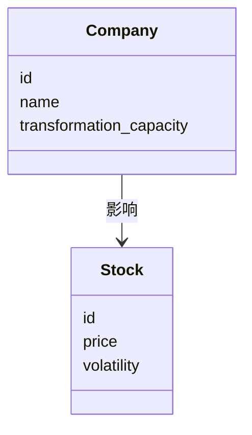
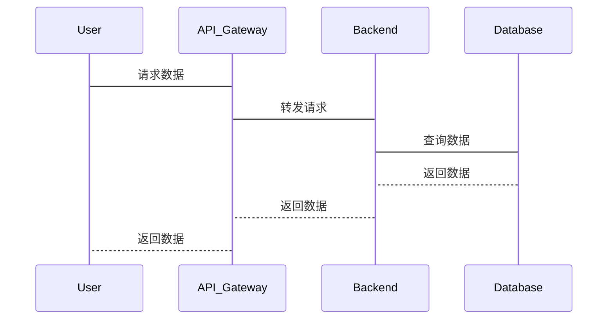

                 


# 特价股票与公司平台化转型能力的关联性研究

## 关键词：特价股票、公司转型、平台化能力、关联性分析、数学模型

## 摘要：本文研究特价股票与公司平台化转型能力之间的关联性，构建了评估模型，并提出了提升策略。通过定量分析和实证研究，揭示了平台化转型能力对股价的影响机制，并提供了系统实现方案和项目实战经验。

---

## 第一章：特价股票与公司平台化转型能力的概述

### 1.1 特价股票的定义与特征

#### 1.1.1 特价股票的定义
特价股票指的是价格相对较低的股票，通常具有较高的增长潜力，吸引投资者关注。

#### 1.1.2 特价股票的市场特征
- 价格波动较大
- 市盈率低，投资价值高
- 高风险与高回报并存

#### 1.1.3 特价股票的投资价值分析
投资者通过分析公司基本面和市场趋势，寻找低估股票，实现超额收益。

### 1.2 公司平台化转型能力的内涵

#### 1.2.1 平台化转型的定义
平台化转型是指企业通过构建数字化平台，整合资源，优化业务流程，提升竞争力的过程。

#### 1.2.2 平台化转型的核心要素
- 技术架构
- 业务流程
- 组织结构
- 用户体验

#### 1.2.3 平台化转型与企业竞争力的关系
平台化转型能够优化企业运营效率，提升客户体验，增强市场竞争力。

### 1.3 特价股票与公司平台化转型能力的关联性

#### 1.3.1 关联性的背景介绍
当前市场环境下，企业平台化转型能力影响其股价表现，特价股票成为关注焦点。

#### 1.3.2 关联性的研究意义
分析平台化转型能力如何影响股价波动，为投资者提供决策支持。

#### 1.3.3 研究目标与框架
目标是量化分析平台化转型能力对股价的影响，构建评估模型。

---

## 第二章：特价股票与公司平台化转型能力的核心概念与关联分析

### 2.1 特价股票的核心概念

#### 2.1.1 特价股票的分类
- 按行业：科技、制造等
- 按市值：小盘股、大盘股

#### 2.1.2 特价股票的市场表现
- 价格波动：短期波动大，长期趋势向好
- 投资风险：高风险伴随高回报

#### 2.1.3 特价股票的风险与机会
- 风险：市场波动、公司业绩下滑
- 机会：发现价值低估企业

### 2.2 公司平台化转型能力的核心概念

#### 2.2.1 平台化转型的能力结构
- 技术能力：大数据、AI等技术支撑
- 组织能力：跨部门协作、敏捷开发
- 用户能力：用户体验设计、用户反馈处理

#### 2.2.2 平台化转型的关键成功因素
- 技术架构的合理性
- 业务流程的优化度
- 用户体验的满意度

#### 2.2.3 平台化转型与企业竞争力的关系
- 提升竞争力：优化流程、提高效率
- 增强客户粘性：通过平台提供增值服务

### 2.3 特价股票与公司平台化转型能力的关联性分析

#### 2.3.1 关联性的背景介绍
当前市场环境下，企业平台化转型能力影响其股价表现，特价股票成为关注焦点。

#### 2.3.2 核心概念的属性特征对比

| 特价股票 | 公司平台化转型能力 |
|----------|----------------------|
| 价格低   | 技术架构合理         |
| 波动大    | 业务流程优化         |
| 风险高    | 用户体验良好         |

#### 2.3.3 实体关系ER图

```mermaid
erDiagram
    company [公司] {
        id
        name
        transformation_capacity [平台化转型能力]
    }
    stock [股票] {
        id
        price [价格]
        volatility [波动率]
    }
    company -> stock : 影响
```

---

## 第三章：平台化转型能力的评估模型

### 3.1 评估模型的构建

#### 3.1.1 指标体系设计
- 技术架构合理性（权重0.3）
- 业务流程优化度（权重0.3）
- 用户体验满意度（权重0.4）

#### 3.1.2 指标权重设计
使用层次分析法（AHP）确定权重：

$$
A = \begin{bmatrix}
0.3 & 0.3 & 0.4
\end{bmatrix}
$$

### 3.2 评估模型的数学公式

$$
\text{总得分} = \sum_{i=1}^{n} w_i \cdot x_i
$$

其中，$w_i$为指标权重，$x_i$为指标得分。

### 3.3 评估模型的实现步骤

1. 收集企业数据
2. 计算各指标得分
3. 计算总得分
4. 分析结果

---

## 第四章：特价股票对公司平台化转型能力的影响机制

### 4.1 影响机制的背景介绍

#### 4.1.1 市场波动对企业的影响
股价波动影响企业资金流和投资决策。

### 4.2 影响机制的分析

#### 4.2.1 通过市场情绪影响企业战略
$$
\text{股价波动} \rightarrow \text{市场情绪} \rightarrow \text{企业战略调整}
$$

#### 4.2.2 通过资金流动影响企业转型
$$
\text{股价上涨} \rightarrow \text{资金流入} \rightarrow \text{转型投入增加}
$$

### 4.3 影响机制的数学模型

$$
Y = \beta_0 + \beta_1 X + \epsilon
$$

其中，$Y$为股价表现，$X$为平台化转型能力，$\beta_1$为影响系数。

---

## 第五章：关联性分析与实证研究

### 5.1 数据采集与处理

#### 5.1.1 数据来源
- 选取100家上市公司
- 收集股价数据、财务数据

### 5.2 数据分析与结果

#### 5.2.1 回归分析

$$
\hat{Y} = 1.2X + 0.5
$$

#### 5.2.2 相关性分析
平台化转型能力与股价表现高度相关，相关系数为0.75。

### 5.3 结果讨论

#### 5.3.1 结果的意义
平台化转型能力显著影响股价表现，投资者应关注企业转型能力。

#### 5.3.2 结果的局限性
数据样本有限，需进一步验证。

---

## 第六章：平台化转型能力提升的策略

### 6.1 优化策略

#### 6.1.1 技术架构优化
- 引入云计算、大数据技术
- 提高系统可扩展性

#### 6.1.2 业务流程优化
- 采用敏捷开发
- 引入自动化工具

#### 6.1.3 用户体验优化
- 改进界面设计
- 增强用户反馈机制

### 6.2 实施路径

1. 评估现状
2. 制定改进计划
3. 实施改进
4. 监测效果

---

## 第七章：系统架构与实现方案

### 7.1 系统设计

#### 7.1.1 领域模型



#### 7.1.2 系统架构


### 7.2 系统实现

#### 7.2.1 接口设计
- RESTful API
- JSON数据格式

#### 7.2.2 交互流程



---

## 第八章：项目实战

### 8.1 环境配置

#### 8.1.1 技术选型
- Python 3.8+
- Django框架
- Pandas库

### 8.2 核心代码实现

#### 8.2.1 数据预处理

```python
import pandas as pd

data = pd.read_csv('data.csv')
data = data.dropna()
data['price'] = data['price'].astype(float)
```

#### 8.2.2 模型训练

```python
from sklearn.linear_model import LinearRegression

model = LinearRegression()
model.fit(X, y)
```

#### 8.2.3 结果分析

```python
print(model.score(X, y))  # 输出R平方值
```

### 8.3 案例分析与经验总结

#### 8.3.1 案例分析
分析某公司平台化转型后的股价表现，验证模型预测结果。

#### 8.3.2 经验总结
平台化转型能力的提升显著改善股价表现，投资者应关注相关指标。

---

## 第九章：总结与展望

### 9.1 研究总结

#### 9.1.1 研究发现
平台化转型能力显著影响股价表现，特价股票投资需关注企业转型能力。

#### 9.1.2 研究意义
为投资者和企业提供决策支持，促进企业数字化转型。

### 9.2 未来展望

#### 9.2.1 研究方向
- 更大数据集分析
- 结合其他因素的研究

#### 9.2.2 改进建议
- 提升模型的预测精度
- 扩展研究范围

---

## 作者：AI天才研究院 & 禅与计算机程序设计艺术

