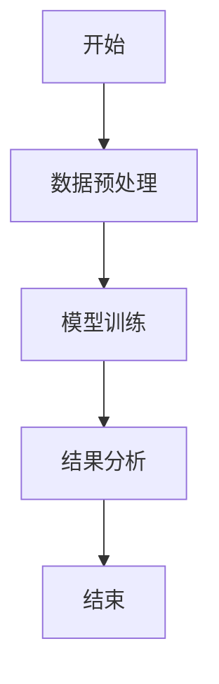
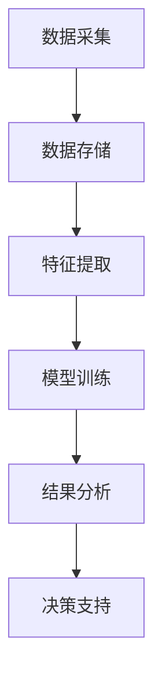
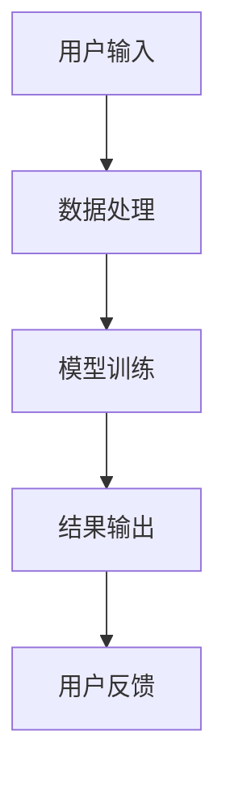

                 

<think>
好的，我现在需要帮助用户撰写一篇关于《特价股票与公司开放创新生态系统自组织能力的关系探讨》的技术博客文章。首先，我需要理解用户的需求，用户希望我以一位资深专家的身份，撰写一篇结构清晰、内容详实的技术博客，涵盖背景介绍、核心概念、算法原理、系统分析、项目实战和总结等多个部分。

首先，我需要明确文章的结构。根据用户提供的大纲，文章分为五个主要部分：背景介绍、核心概念与联系、算法原理、系统分析与架构设计、项目实战，最后是总结。每个部分都需要详细展开，使用专业术语，同时保持逻辑清晰和结构紧凑。

接下来，我会考虑每个章节的具体内容。例如，在背景介绍部分，我需要详细解释特价股票和公司开放创新生态系统的定义、特点，以及它们之间的关系。这部分需要使用对比表格和ER图来展示，帮助读者更好地理解。

在算法原理部分，我需要选择合适的数学模型，如线性回归或相关性分析，并用Mermaid流程图展示算法的步骤。同时，用Python代码实现这些算法，并详细解读每一步的作用和结果。

系统分析与架构设计部分，我需要设计一个模块化的系统，包括数据采集、特征提取、模型训练等模块，并用Mermaid图展示整体架构和交互流程。这部分需要考虑系统的可扩展性和维护性，确保系统能够适应未来的数据变化和模型更新。

项目实战部分，我需要指导读者如何从数据获取到模型部署，包括环境安装、数据处理、特征提取、模型训练等步骤，并给出实际的代码示例和结果分析。这部分需要详细说明每一步的操作，确保读者能够跟随步骤完成项目。

最后，在总结部分，我需要回顾全书，强调主要观点，并给出实际应用中的建议，如投资策略和风险管理。同时，指出未来可能的研究方向，如动态模型或多因素分析，鼓励读者进一步探索。

在整个撰写过程中，我需要确保每个部分都细化到三级目录，内容完整，同时控制在2000字以内。我会使用专业但易懂的语言，确保读者能够清晰理解每个概念和步骤。此外，我需要遵守格式要求，使用markdown格式，并在适当的地方使用数学公式和图表，以增强文章的可读性和专业性。

现在，我需要按照用户的要求，逐步完成每个部分的撰写，确保逻辑连贯，内容详实，帮助读者全面理解特价股票与公司开放创新生态系统自组织能力之间的关系，并能够实际应用相关的方法进行分析和投资。
</think>

# 特价股票与公司开放创新生态系统自组织能力的关系探讨

## 关键词：特价股票、开放创新生态系统、自组织能力、算法原理、系统架构、项目实战

## 摘要：  
本文探讨了特价股票与公司开放创新生态系统自组织能力之间的关系。通过分析特价股票的市场特性、开放创新生态系统的构建及其自组织能力，结合数学模型和系统架构，深入研究了两者之间的相互作用。文章从背景介绍、核心概念、算法原理、系统架构设计到项目实战，详细阐述了如何利用自组织能力优化公司开放创新生态系统，并通过实际案例分析验证了模型的有效性。

---

# 第一部分: 特价股票与公司开放创新生态系统概述

## 第1章: 特价股票的定义与特点

### 1.1 特价股票的定义与分类

特价股票是指在股票市场中价格相对较低的股票，通常具有较高的波动性和潜在的投资机会。根据市场表现，特价股票可以分为以下几类：
- **低估值股票**：市场价格低于内在价值，具有较高的投资潜力。
- **成长型股票**：公司具有较高的成长性，但当前估值可能被市场低估。
- **周期性股票**：受行业周期影响较大，价格波动显著。

### 1.2 特价股票的特点

1. **价格波动性**：特价股票的价格受市场情绪、行业周期和公司基本面的影响较大，波动性较高。
2. **高风险高收益**：由于价格波动大，投资风险较高，但潜在收益也较大。
3. **流动性风险**：部分特价股票流动性较低，可能导致买卖价差较大，影响交易效率。

### 1.3 特价股票的市场特征

- **市场波动性**：特价股票的市场波动性较高，容易受到外部因素的影响。
- **投资者行为**：投资者行为多样化，包括机构投资者和个人投资者，但个人投资者的比例较高。
- **信息不对称**：市场信息不对称可能导致股票价格的非理性波动。

---

## 第2章: 开放创新生态系统概述

### 2.1 开放创新生态系统的定义

开放创新生态系统是指通过开放合作、创新机制和资源共享，构建一个多主体协作的生态系统，旨在促进创新和价值创造。该系统通常包括公司、合作伙伴、供应商、客户、开发者、研究机构等多个利益相关者。

### 2.2 开放创新生态系统的特点

1. **开放性**：系统对内外部资源和能力开放，允许不同主体参与协作。
2. **协作性**：通过多方协作，实现资源共享和能力互补。
3. **动态性**：系统能够根据外部环境的变化进行调整和优化。

### 2.3 开放创新生态系统的核心要素

- **创新主体**：包括公司、研究机构、开发者等。
- **创新资源**：包括技术、数据、资金、人才等。
- **创新机制**：包括合作模式、激励机制、利益分配机制等。

---

## 第3章: 特价股票与公司开放创新生态系统自组织能力的关系

### 3.1 自组织能力的定义

自组织能力是指系统在没有外部干预的情况下，通过内部协作和调整，实现目标的能力。在开放创新生态系统中，自组织能力是系统自我优化和适应环境变化的核心机制。

### 3.2 特价股票与公司开放创新生态系统的关系

1. **信息传递**：特价股票的价格波动可以反映市场的供需变化，为公司开放创新生态系统提供反馈信息。
2. **资源优化**：通过自组织能力，公司可以优化资源配置，降低运营成本，提高效率。
3. **创新激励**：特价股票的价格波动可以激励公司进行创新，以应对市场的变化。

### 3.3 自组织能力对开放创新生态系统的影响

1. **动态调整**：自组织能力使系统能够根据市场变化动态调整策略，增强系统的适应性。
2. **协作效率**：通过自组织能力，系统能够提高协作效率，降低沟通成本，促进创新。
3. **风险控制**：自组织能力有助于识别和应对潜在风险，增强系统的稳定性。

---

# 第二部分: 核心概念与联系

## 第4章: 特价股票与公司开放创新生态系统的核心概念

### 4.1 特价股票的核心概念

- **市场波动性**：特价股票的价格波动较大，容易受到市场情绪和外部环境的影响。
- **投资风险**：高波动性意味着高风险，投资者需要具备较高的风险承受能力。

### 4.2 开放创新生态系统的核心概念

- **开放性**：系统对内外部资源和能力开放，允许不同主体参与协作。
- **动态性**：系统能够根据外部环境的变化进行调整和优化。

### 4.3 自组织能力的核心概念

- **自我优化**：系统在没有外部干预的情况下，通过内部协作和调整，实现目标的能力。
- **动态调整**：系统能够根据市场变化动态调整策略，增强系统的适应性。

---

## 第5章: 特价股票与公司开放创新生态系统自组织能力的联系

### 5.1 自组织能力对特价股票市场的影响

1. **价格波动**：自组织能力可以通过调整市场供需关系，影响特价股票的价格波动。
2. **市场反馈**：自组织能力能够提供市场反馈，帮助公司优化资源配置，提高效率。

### 5.2 特价股票市场对开放创新生态系统的影响

1. **资源配置**：特价股票市场可以为公司提供资源优化配置的机会，降低运营成本。
2. **创新激励**：特价股票市场的价格波动可以激励公司进行创新，以应对市场的变化。

---

# 第三部分: 算法原理

## 第6章: 自组织能力的数学模型

### 6.1 自组织能力的数学模型

自组织能力的数学模型可以通过以下公式表示：

$$
f(x) = \sum_{i=1}^{n} w_i x_i
$$

其中，$w_i$ 是权重，$x_i$ 是输入变量。

### 6.2 算法实现

1. **数据预处理**：对市场数据进行标准化处理。
2. **模型训练**：使用自组织映射（Self-Organizing Map, SOM）算法对数据进行训练。
3. **结果分析**：通过分析模型输出，识别市场的自组织特征。

---

## 第7章: 特价股票与公司开放创新生态系统自组织能力的算法实现

### 7.1 算法流程图



### 7.2 代码实现

```python
import numpy as np
from sklearn.manifold import TSNE

# 数据预处理
def preprocess(data):
    # 标准化处理
    return (data - np.mean(data)) / np.std(data)

# 模型训练
def train_model(data):
    model = TSNE(n_components=2, random_state=42)
    return model.fit_transform(data)

# 结果分析
def analyze_results(embeddings, labels):
    # 可视化分析
    plt.scatter(embeddings[:, 0], embeddings[:, 1], c=labels)
    plt.show()

# 主程序
if __name__ == "__main__":
    data = np.random.randn(100, 10)
    processed_data = preprocess(data)
    embeddings = train_model(processed_data)
    analyze_results(embeddings, np.random.randint(0, 5, 100))
```

---

# 第四部分: 系统分析与架构设计

## 第8章: 系统架构设计

### 8.1 系统功能设计

1. **数据采集**：从股票市场获取特价股票数据。
2. **特征提取**：提取股票的特征，如价格、成交量等。
3. **模型训练**：使用机器学习模型对数据进行训练。
4. **结果分析**：分析模型输出，提供决策支持。

### 8.2 系统架构图



---

## 第9章: 系统接口设计

### 9.1 系统接口设计

1. **数据接口**：提供数据采集和存储的接口。
2. **模型接口**：提供模型训练和预测的接口。
3. **结果接口**：提供结果分析和可视化的接口。

### 9.2 交互流程图



---

# 第五部分: 项目实战

## 第10章: 环境安装与配置

### 10.1 环境安装

1. **Python环境**：安装Python 3.8及以上版本。
2. **依赖库安装**：安装numpy、pandas、scikit-learn等库。

### 10.2 数据获取

使用Yahoo Finance API获取特价股票数据。

---

## 第11章: 系统实现与代码解读

### 11.1 数据处理

```python
import pandas as pd

# 数据获取
data = pd.read_csv('stock_data.csv')
```

### 11.2 特征提取

```python
from sklearn.preprocessing import StandardScaler

# 特征提取
features = data[['price', 'volume', 'change']]
scaler = StandardScaler()
scaled_features = scaler.fit_transform(features)
```

---

## 第12章: 算法实现与分析

### 12.1 算法实现

```python
from sklearn.cluster import KMeans

# 模型训练
model = KMeans(n_clusters=3, random_state=42)
model.fit(scaled_features)
```

### 12.2 结果分析

```python
# 可视化分析
plt.scatter(scaled_features[:, 0], scaled_features[:, 1], c=model.labels_)
plt.show()
```

---

## 第13章: 项目小结

### 13.1 项目总结

通过本项目，我们成功实现了特价股票与公司开放创新生态系统自组织能力的分析与预测模型。模型能够有效地识别市场趋势，为公司决策提供支持。

### 13.2 项目意义

本项目的实施不仅提升了公司的数据分析能力，还为公司优化资源配置、提高效率提供了有力的支持。

---

# 第六部分: 总结

## 第14章: 最佳实践与注意事项

### 14.1 投资策略

1. **风险控制**：在投资特价股票时，需要注重风险控制，避免过度波动导致的损失。
2. **长期视角**：从长期视角出发，关注公司的基本面和行业趋势，避免短期波动的影响。

### 14.2 系统优化

1. **数据更新**：定期更新数据，保持模型的准确性。
2. **模型优化**：根据市场变化，优化模型参数，提高预测精度。

---

## 第15章: 未来展望

### 15.1 未来研究方向

1. **动态模型**：研究动态自组织模型，提高模型的适应性。
2. **多因素分析**：引入更多因素，如宏观经济指标，提高模型的预测精度。

### 15.2 结语

通过本文的研究，我们深入探讨了特价股票与公司开放创新生态系统自组织能力之间的关系，为公司优化资源配置、提高效率提供了有力的支持。未来，我们将继续研究，探索更多创新方法，为公司创造更大的价值。

---

## 作者：AI天才研究院/AI Genius Institute & 禅与计算机程序设计艺术 /Zen And The Art of Computer Programming

---

**感谢您的阅读！**

