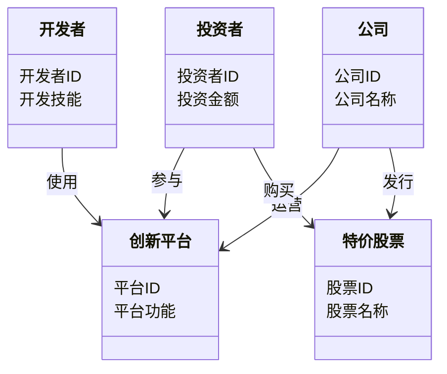
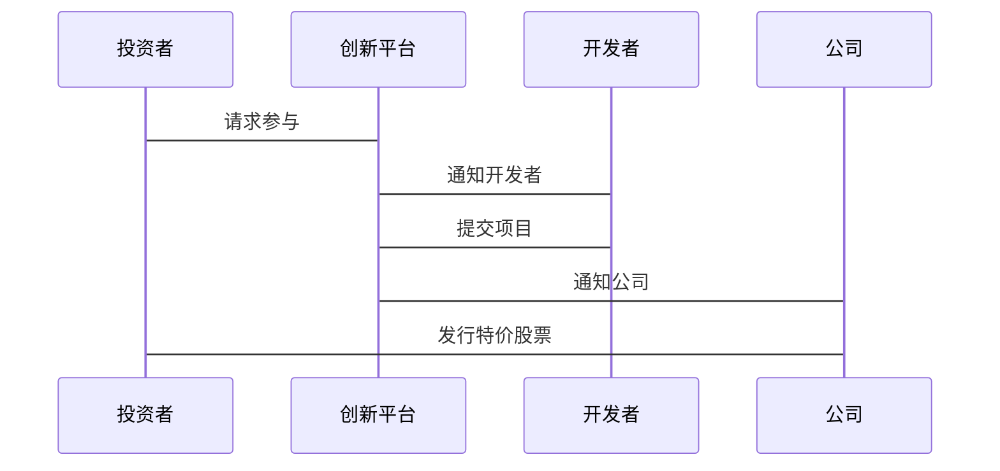

                 


# 特价股票与公司开放式创新平台生态系统的潜在关联研究

## 关键词：特价股票、公司开放式创新平台、生态系统、潜在关联、协同过滤推荐系统

## 摘要：本文探讨了特价股票与公司开放式创新平台之间的潜在关联，通过分析两者的定义、特点及生态系统构建，揭示了协同过滤推荐系统在其中的应用，为投资者和企业管理者提供了理论和实践指导。

---

# 第一部分：特价股票与公司开放式创新平台的背景介绍

## 第1章：特价股票的定义与特点

### 1.1 特价股票的定义
特价股票是指在特定市场条件下，公司为了快速获取资金或优化资本结构而发行的股票。与普通股票相比，特价股票通常具有更高的风险和回报潜力。

### 1.2 特价股票的特点
- **高风险高回报**：特价股票的价格波动较大，但潜在收益也更高。
- **短期性**：通常有明确的期限，到期后需偿还本金或转换为其他形式。
- **灵活性**：公司可以根据市场情况调整特价股票的发行条件。

### 1.3 特价股票与普通股票的区别
| 特性 | 特价股票 | 普通股票 |
|------|----------|----------|
| 风险 | 高       | 中等     |
| 收益 | 高       | 稳定     |
| 期限 | 短期     | 长期     |
| 发行目的 | 资金筹集 | 股权分配 |

## 第2章：公司开放式创新平台的定义与特点

### 2.1 开放式创新平台的定义
开放式创新平台是指公司通过开放其技术和资源，吸引外部开发者、合作伙伴和用户共同参与创新的生态系统。这种模式打破了传统的封闭创新模式，促进了跨领域合作。

### 2.2 开放式创新平台的特点
- **开放性**：允许外部开发者访问公司的API、数据和资源。
- **协作性**：鼓励多方合作，共同解决问题。
- **动态性**：平台可以根据市场需求快速调整功能。

### 2.3 开放式创新平台与传统创新模式的区别
| 特性 | 开放式创新平台 | 传统创新模式 |
|------|----------------|---------------|
| 参与者 | 外部开发者、用户 | 内部研发团队 |
| 资源共享 | 开放 | 封闭 |
| 创新速度 | 快速 | 较慢 |

## 第3章：特价股票与公司开放式创新平台的关联背景

### 3.1 特价股票的市场现状
随着市场的波动，越来越多的公司选择发行特价股票来应对资金需求。然而，这种股票的风险较高，投资者需要具备一定的市场敏感性和风险承受能力。

### 3.2 公司开放式创新平台的发展趋势
开放式创新平台在全球范围内迅速崛起，成为企业创新的重要手段。通过平台，企业能够快速获取外部资源，降低创新成本。

### 3.3 两者关联的研究意义
研究特价股票与公司开放式创新平台的关联，有助于企业更好地管理风险，优化资本结构，同时也能为投资者提供新的投资机会。

---

# 第二部分：特价股票与公司开放式创新平台的核心概念与联系

## 第4章：特价股票的核心概念原理

### 4.1 特价股票的市场机制
特价股票的发行通常基于市场的需求和公司的资金需求。市场机制决定了其价格波动和风险水平。

### 4.2 特价股票的价格波动规律
特价股票的价格受多种因素影响，包括市场波动、公司业绩和宏观经济环境。其波动性通常高于普通股票。

### 4.3 特价股票的投资者行为分析
投资者在购买特价股票时，通常具有较高的风险承受能力和市场敏感性。他们的行为直接影响股票的价格和市场的稳定性。

## 第5章：公司开放式创新平台的核心概念原理

### 5.1 开放式创新平台的运作模式
开放式创新平台通过提供API和开发工具，吸引外部开发者参与创新。这种模式不仅降低了创新成本，还加速了产品开发。

### 5.2 开放式创新平台的生态系统构建
生态系统构建是开放式创新平台成功的关键。通过吸引多方参与者，平台能够形成良性循环，推动持续创新。

### 5.3 开放式创新平台的资源整合机制
资源整合机制决定了平台能够高效地利用外部资源，实现创新目标。这通常涉及合作伙伴的协作和资源的共享。

## 第6章：特价股票与公司开放式创新平台的属性特征对比

### 6.1 特价股票与开放式创新平台的属性对比
| 特性 | 特价股票 | 开放式创新平台 |
|------|----------|-----------------|
| 核心目标 | 资金筹集 | 创新协作       |
| 参与者 | 投资者 | 开发者、用户     |
| 资源共享 | 有限 | 全面开放       |

### 6.2 两者的核心要素组成
- 特价股票：资金需求、市场风险、投资者行为。
- 开放式创新平台：API、开发工具、协作机制。

### 6.3 两者之间的关联性分析
特价股票为公司提供快速资金，而开放式创新平台则为公司提供技术支持和创新资源。两者在资源分配和风险控制方面存在潜在的协同效应。

## 第7章：特价股票与公司开放式创新平台的ER实体关系图

```mermaid
erDiagram
    investor "投资者" {
        <属性> 投资者ID
        <属性> 投资金额
        <属性> 投资类型
    }
    developer "开发者" {
        <属性> 开发者ID
        <属性> 开发技能
        <属性> 开发项目
    }
    company "公司" {
        <属性> 公司ID
        <属性> 公司名称
        <属性> 公司规模
    }
    special_stock "特价股票" {
        <属性> 股票ID
        <属性> 股票名称
        <属性> 股票价格
    }
    innovation_platform "创新平台" {
        <属性> 平台ID
        <属性> 平台功能
        <属性> 平台用户
    }
    relationship "投资者参与创新平台" {
        投资者 -> 创新平台 : 参与
    }
    relationship "开发者使用创新平台" {
        开发者 -> 创新平台 : 使用
    }
    relationship "公司运营创新平台" {
        公司 -> 创新平台 : 运营
    }
    relationship "公司发行特价股票" {
        公司 -> 特价股票 : 发行
    }
    relationship "投资者购买特价股票" {
        投资者 -> 特价股票 : 购买
    }
```

---

# 第三部分：算法原理讲解

## 第8章：协同过滤推荐系统在特价股票与创新平台中的应用

### 8.1 协同过滤推荐系统的定义
协同过滤推荐系统是一种基于用户行为和偏好推荐相关内容的技术。在本文中，我们将它应用于股票推荐和创新平台的用户匹配。

### 8.2 协同过滤推荐系统的数学模型

#### 8.2.1 相似度计算
$$ sim(i,j) = \frac{\sum_{k} r_{ik} \times r_{jk}}{\sqrt{\sum_{k} r_{ik}^2} \times \sqrt{\sum_{k} r_{jk}^2}} $$

其中，$sim(i,j)$ 表示用户i和用户j之间的相似度，$r_{ik}$ 和 $r_{jk}$ 分别表示用户i和用户j对项目的评分。

#### 8.2.2 推荐计算
$$ rec(i) = \sum_{j} w_{ij} \times r_j $$

其中，$rec(i)$ 表示用户i的推荐评分，$w_{ij}$ 表示用户i和用户j之间的权重，$r_j$ 表示用户j的评分。

### 8.3 协同过滤推荐系统的实现

#### 8.3.1 环境安装
```bash
pip install numpy
pip install scikit-learn
```

#### 8.3.2 核心代码实现
```python
from sklearn.metrics.pairwise import cosine_similarity

# 示例数据
users = ['investor1', 'investor2', 'investor3']
prefs = {
    'investor1': {'developer1': 4, 'developer2': 3},
    'investor2': {'developer1': 2, 'developer3': 4},
    'investor3': {'developer2': 3, 'developer3': 5}
}

# 计算相似度矩阵
pref_matrix = []
for user in users:
    user_vector = []
    for dev in prefs[user]:
        user_vector.append(prefs[user][dev])
    pref_matrix.append(user_vector)

similarity_matrix = cosine_similarity(pref_matrix)
print(similarity_matrix)
```

#### 8.3.3 代码解读
上述代码通过计算用户与开发者之间的相似度，构建推荐系统。cosine_similarity函数用于计算余弦相似度，结果矩阵中的每个值表示对应用户之间的相似度。

---

# 第四部分：系统分析与架构设计

## 第9章：问题场景介绍

### 9.1 问题场景
公司希望通过开放式创新平台吸引外部开发者，同时通过发行特价股票筹集资金。如何将两者有效结合，优化资源配置，是本文的核心问题。

## 第10章：系统功能设计

### 10.1 领域模型


### 10.2 系统架构设计


### 10.3 系统接口设计
- API接口：投资者和开发者通过API访问平台功能。
- 数据接口：公司通过数据库接口管理特价股票发行和创新平台运营。

### 10.4 系统交互设计


---

# 第五部分：项目实战

## 第11章：环境安装与核心代码实现

### 11.1 环境安装
```bash
pip install flask
pip install pymysql
pip install scikit-learn
```

### 11.2 核心代码实现

#### 11.2.1 投资者与创新平台的接口
```python
from flask import Flask
import pymysql

app = Flask(__name__)

@app.route('/join_platform', methods=['POST'])
def join_platform():
    # 获取投资者信息
    investor_id = request.form['investor_id']
    investment = request.form['investment']
    
    # 更新数据库
    cursor.execute("INSERT INTO investors (id, investment) VALUES (%s, %s)", (investor_id, investment))
    db.commit()
    return "Success"
```

#### 11.2.2 开发者的项目提交
```python
from flask import Flask, request
import pymysql

app = Flask(__name__)

@app.route('/submit_project', methods=['POST'])
def submit_project():
    # 获取开发者信息
    developer_id = request.form['developer_id']
    project = request.form['project']
    
    # 更新数据库
    cursor.execute("INSERT INTO projects (developer_id, project) VALUES (%s, %s)", (developer_id, project))
    db.commit()
    return "Success"
```

### 11.3 代码解读与分析
上述代码展示了如何通过Flask框架构建接口，实现投资者参与创新平台和开发者提交项目的功能。数据库的使用确保了数据的持久化存储。

---

# 第六部分：最佳实践与小结

## 第12章：最佳实践 tips

### 12.1 小结
通过本文的研究，我们发现特价股票与公司开放式创新平台之间存在潜在的协同效应。协同过滤推荐系统的应用，为投资者和开发者提供了新的互动方式。

### 12.2 注意事项
- 投资者需谨慎评估风险。
- 开发者需确保项目质量。
- 公司需合理管理平台资源。

### 12.3 拓展阅读
建议读者进一步研究协同过滤算法的优化方法，以及开放式创新平台的长期发展模式。

---

# 作者：AI天才研究院/AI Genius Institute & 禅与计算机程序设计艺术 /Zen And The Art of Computer Programming

---

以上是《特价股票与公司开放式创新平台生态系统的潜在关联研究》的技术博客文章的详细大纲和内容。文章按照逻辑顺序展开，从背景介绍到系统设计，再到项目实战，层层深入，确保读者能够全面理解两者的关联及其应用。

