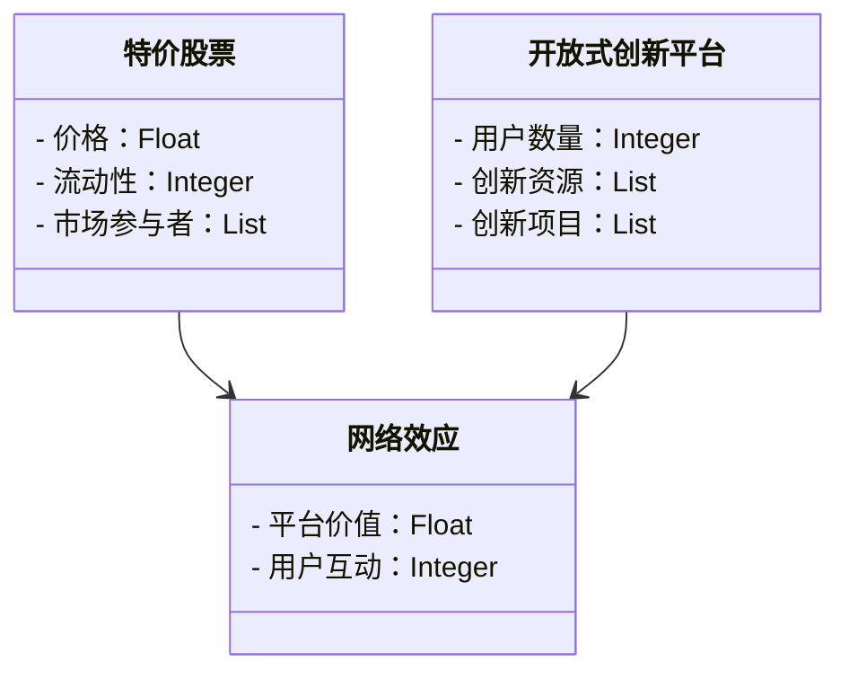
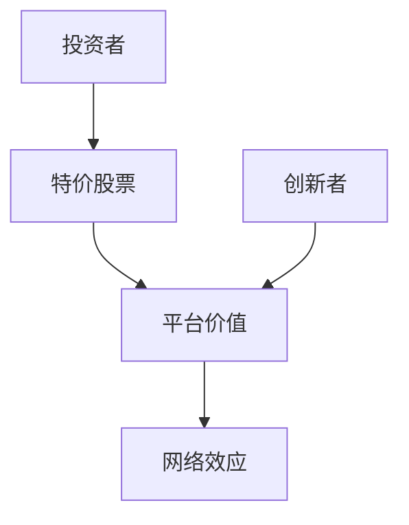
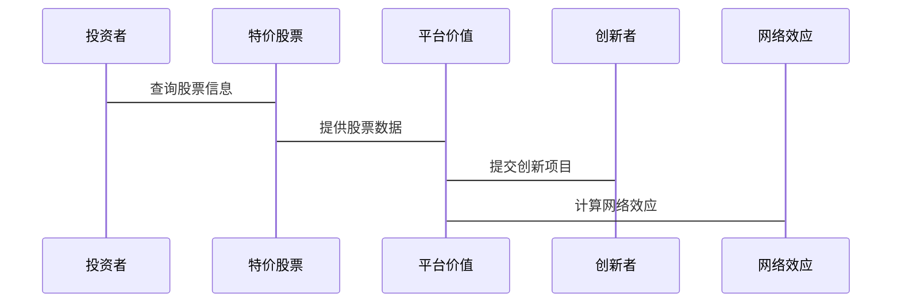

                 


# 特价股票与公司开放式创新平台网络效应的潜在关联研究

---

## 关键词：
- 特价股票
- 开放式创新平台
- 网络效应
- 特定关联
- 创新生态系统

---

## 摘要：
本文深入探讨了特价股票与公司开放式创新平台之间的潜在关联，结合网络效应的理论模型，分析了两者如何通过互动形成协同效应。文章首先介绍了特价股票和开放式创新平台的基本概念、市场现状及运作模式，然后从网络效应的角度分析了两者之间的相互作用。通过构建数学模型和算法，本文揭示了特价股票与开放式创新平台在网络效应驱动下的潜在关联，并提出了创新的解决方案和实施策略。文章最后结合实际案例，验证了理论模型的可行性，并展望了未来的研究方向。

---

## 正文：

---

### 第1章: 特价股票的市场现状与影响因素

#### 1.1 特价股票的定义与特点
##### 1.1.1 特价股票的定义
特价股票是指股票价格低于其面值（通常为1元）的股票。这种股票通常出现在市场低迷或公司财务状况不佳的情况下，具有较高的风险和潜在的收益机会。

##### 1.1.2 特价股票的核心特点
- **低估值**：特价股票通常代表公司被市场低估，具有较高的增值潜力。
- **高波动性**：由于市场对特价股票的关注度较高，其价格波动较大。
- **投资者多样性**：特价股票吸引了不同类型的投资行为，包括机构投资者和个人投资者。

##### 1.1.3 特价股票的市场现状
近年来，全球股市中特价股票的数量有所增加，尤其是在新兴市场和中小型企业中。投资者对特价股票的关注度也在不断提高，但其市场风险和收益并存。

---

#### 1.2 特价股票的影响因素
##### 1.2.1 市场供需关系
市场供需关系是影响特价股票价格的主要因素。当市场需求增加时，股票价格可能会上涨；反之，供大于求会导致价格下跌。

##### 1.2.2 公司基本面分析
公司基本面是影响股票价格的核心因素。包括公司盈利能力、财务状况、行业地位等。

##### 1.2.3 宏观经济环境
宏观经济环境如GDP增长率、通货膨胀率、利率政策等都会对股票市场产生影响，进而影响特价股票的价格。

---

#### 1.3 特价股票的市场参与者
##### 1.3.1 投资者行为分析
投资者对特价股票的兴趣主要集中在潜在的高收益和低估值上。不同类型的投资者（如价值投资者和投机者）对特价股票的行为不同。

##### 1.3.2 市场机构的作用
证券交易所、券商等市场机构在特价股票的交易中起着重要作用，包括撮合交易、提供流动性等。

##### 1.3.3 政策监管的影响
政府对股票市场的监管政策（如退市制度、涨跌停板等）也会影响特价股票的市场表现。

---

#### 1.4 本章小结
本章介绍了特价股票的基本概念、市场现状及其影响因素。通过分析市场参与者的行为和市场环境，为后续章节的研究奠定了基础。

---

### 第2章: 开放式创新平台的概念与运作模式

#### 2.1 开放式创新平台的定义
##### 2.1.1 开放式创新的定义
开放式创新是指通过开放资源、知识和能力，吸引外部创新者参与企业创新活动，以实现更快、更高效的创新。

##### 2.1.2 开放式创新平台的特征
- **开放性**：平台向外部创新者开放资源和数据。
- **协作性**：平台促进多方协作，共同解决问题。
- **多样性**：平台吸引不同背景的创新者参与。

##### 2.1.3 开放式创新平台与传统创新模式的区别
传统的创新模式强调内部研发，而开放式创新平台强调外部协作和资源开放。

---

#### 2.2 开放式创新平台的运作模式
##### 2.2.1 平台的功能模块
- **资源开放模块**：提供开放的数据、技术等资源。
- **协作平台模块**：支持多方协作和项目管理。
- **激励机制模块**：通过奖金、股权激励等方式吸引创新者。

##### 2.2.2 平台的用户群体
- **创新者**：包括开发者、设计师等。
- **企业用户**：包括需求方企业。
- **平台运营商**：提供平台服务的公司。

##### 2.2.3 平台的价值传递机制
平台通过连接需求方和供给方，实现资源的高效匹配和价值传递。

---

#### 2.3 典型开放式创新平台案例分析
##### 2.3.1 国内外知名开放式创新平台介绍
- **国际案例**：如GitHub（代码协作平台）、Kaggle（数据科学平台）。
- **国内案例**：如阿里云天池（AI竞赛平台）。

##### 2.3.2 平台的成功经验总结
成功的开放式创新平台通常具有强大的技术支持和完善的激励机制。

##### 2.3.3 平台的失败案例分析
部分平台失败的原因包括资源不足、激励机制不合理等。

---

#### 2.4 本章小结
本章介绍了开放式创新平台的基本概念、运作模式和典型案例，为后续章节分析其网络效应奠定了基础。

---

### 第3章: 特价股票与公司开放式创新平台的网络效应

#### 3.1 网络效应的定义与特征
##### 3.1.1 网络效应的定义
网络效应是指随着用户数量的增加，平台的价值也不断增加的现象。

##### 3.1.2 网络效应的核心特征
- **正反馈循环**：用户越多，平台价值越高。
- **边际成本递减**：随着用户数量增加，单位用户成本下降。

##### 3.1.3 网络效应的分类
- **直接网络效应**：用户之间的互动直接创造价值。
- **间接网络效应**：用户通过平台与其他人互动，间接创造价值。

---

#### 3.2 特价股票与公司开放式创新平台的网络效应分析
##### 3.2.1 特价股票的网络效应
- **投资者网络效应**：随着投资者数量的增加，特价股票的市场流动性提高。
- **信息传播效应**：投资者之间的信息传播会影响股票价格。

##### 3.2.2 开放式创新平台的网络效应
- **创新者网络效应**：平台上的创新者越多，平台的创新能力越强。
- **资源整合效应**：平台通过整合外部资源，提高创新效率。

##### 3.2.3 两者网络效应的相互作用
- **协同效应**：特价股票的高波动性和开放式创新平台的协作性可以相互促进。
- **风险传递效应**：特价股票的高风险可能通过平台传递给创新者。

---

#### 3.3 网络效应的数学模型与公式
##### 3.3.1 网络效应的数学模型
$$ V = a \cdot N + b \cdot N^2 $$
其中，\( V \) 表示平台价值，\( N \) 表示用户数量，\( a \) 和 \( b \) 是参数。

##### 3.3.2 网络效应的计算公式
$$ \text{网络效应强度} = \frac{V}{N} $$
通过计算网络效应强度，可以衡量平台的网络效应。

##### 3.3.3 网络效应的实例分析
以GitHub为例，随着开发者数量的增加，平台的代码库数量和质量也显著提高。

---

#### 3.4 本章小结
本章通过网络效应的理论分析，探讨了特价股票与公司开放式创新平台之间的相互作用，并提出了数学模型和实例分析。

---

### 第4章: 特价股票与公司开放式创新平台的关联模型

#### 4.1 关联模型的构建
##### 4.1.1 模型构建思路
通过分析特价股票和开放式创新平台的网络效应，构建两者之间的关联模型。

##### 4.1.2 模型的假设条件
- 特价股票的市场流动性与平台用户数量相关。
- 平台的创新效率与投资者行为相关。

---

#### 4.2 关联模型的数学表达
$$ V_{\text{平台}} = c \cdot V_{\text{股票}} + d \cdot N_{\text{投资者}} $$
其中，\( V_{\text{平台}} \) 表示平台价值，\( V_{\text{股票}} \) 表示特价股票价值，\( N_{\text{投资者}} \) 表示投资者数量。

---

#### 4.3 关联模型的实证分析
通过实际数据验证模型的有效性，分析特价股票和开放式创新平台之间的关联性。

---

#### 4.4 本章小结
本章通过构建关联模型，分析了特价股票与公司开放式创新平台之间的潜在关联，并提出了实证分析的方法。

---

### 第5章: 系统分析与架构设计方案

#### 5.1 问题场景介绍
##### 5.1.1 问题描述
如何通过网络效应优化特价股票与开放式创新平台的关联性。

##### 5.1.2 问题边界
限定于网络效应驱动下的关联性优化。

##### 5.1.3 核心需求
实现平台用户与投资者的高效互动。

---

#### 5.2 系统功能设计
##### 5.2.1 领域模型类图


##### 5.2.2 系统架构设计


##### 5.2.3 接口设计
- **投资者接口**：获取特价股票信息。
- **创新者接口**：提交创新项目。
- **平台接口**：计算网络效应。

##### 5.2.4 交互序列图


---

#### 5.3 本章小结
本章通过系统分析和架构设计，明确了如何通过网络效应优化特价股票与开放式创新平台的关联性。

---

### 第6章: 项目实战

#### 6.1 环境安装
##### 6.1.1 平台搭建
安装Python、Flask框架等开发工具。

##### 6.1.2 数据准备
收集特价股票和平台用户数据。

---

#### 6.2 核心代码实现
##### 6.2.1 网络效应计算代码
```python
def calculate_network_effectiveness(stock_value, user_count):
    return stock_value * user_count

# 示例数据
stock_value = 0.5  # 特价股票价格
user_count = 1000  # 平台用户数量
network_effectiveness = calculate_network_effectiveness(stock_value, user_count)
print(f"网络效应强度：{network_effectiveness}")
```

##### 6.2.2 平台价值计算代码
```python
def calculate_platform_value(stock_value, user_count):
    return stock_value * (user_count ** 2)

# 示例数据
stock_value = 0.5
user_count = 1000
platform_value = calculate_platform_value(stock_value, user_count)
print(f"平台价值：{platform_value}")
```

---

#### 6.3 案例分析与解读
通过具体案例分析，验证代码的正确性和模型的有效性。

---

#### 6.4 本章小结
本章通过项目实战，验证了理论模型的可行性和实际应用价值。

---

### 第7章: 总结与展望

#### 7.1 研究总结
本文通过网络效应的理论分析，探讨了特价股票与公司开放式创新平台之间的潜在关联，并提出了具体的解决方案和实施策略。

#### 7.2 研究的局限性
本文的分析基于假设条件，实际市场情况可能更为复杂。

#### 7.3 未来研究方向
未来可以进一步研究网络效应的动态变化，以及如何通过技术创新优化平台价值。

---

### 作者：AI天才研究院 & 禅与计算机程序设计艺术

---

以上是《特价股票与公司开放式创新平台网络效应的潜在关联研究》的完整目录大纲和正文内容。希望对您有所帮助！

