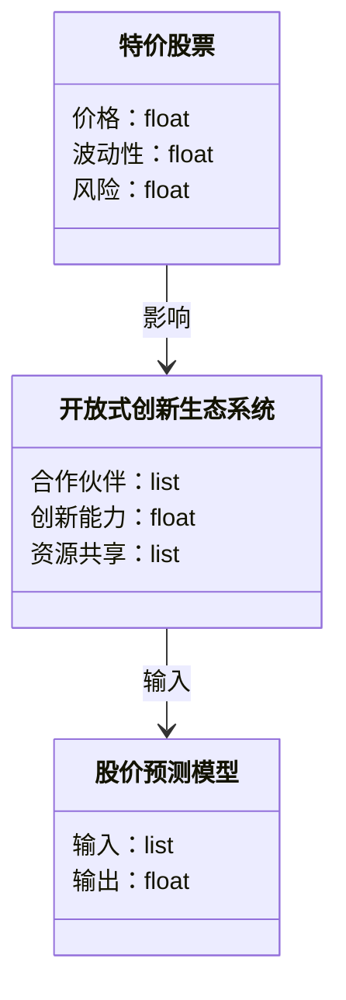

                 


# 特价股票与公司开放式创新生态系统的潜在关联研究

> **关键词**: 特价股票、开放式创新生态系统、关联分析、数学建模、机器学习算法  
> **摘要**: 本文探讨了特价股票与公司开放式创新生态系统之间的潜在关联。通过结合数学建模和机器学习算法，我们分析了公司创新生态系统如何影响股票价值，特别是特价股票的波动性。我们提出了一种基于开放式创新的股票预测模型，并通过实际案例进行了验证。

---

## 第一部分: 特价股票与公司开放式创新生态系统概述

### 第1章: 特价股票的背景与特征

#### 1.1 特价股票的定义与分类
##### 1.1.1 特价股票的基本概念
特价股票是指价格低于面值的股票，通常由公司发行或交易市场上的特殊机制导致。这种股票可能具有较高的波动性，但也可能隐藏着投资机会。

##### 1.1.2 特价股票的分类与特点
- 按发行方式分类：普通股、优先股。
- 按市场分类：蓝筹股、成长股、周期股。
- 特点：价格波动大、风险高、潜在收益高。

##### 1.1.3 特价股票的市场表现与影响
特价股票的市场表现受多种因素影响，包括公司基本面、市场情绪和宏观经济环境。其波动性为投资者提供了套利机会，但也增加了投资风险。

---

#### 1.2 开放式创新生态系统的核心概念
##### 1.2.1 开放式创新的定义与特征
开放式创新是指通过外部合作、知识共享和资源开放来推动创新的模式。其核心特征包括开放性、协作性和可持续性。

##### 1.2.2 开放式创新与传统创新模式的对比
- 传统创新：封闭式、内部驱动。
- 开放式创新：协作式、外部驱动。
- 优势：资源利用效率高、创新速度快、创新成果共享。

---

### 第2章: 特价股票与公司开放式创新生态系统的关系

#### 2.1 特价股票与公司创新的关联性
##### 2.1.1 特价股票反映公司创新能力的机制
公司创新能力直接影响其市场竞争力和股价表现。创新能力强的公司通常能够通过技术创新和产品迭代吸引投资者，从而提升股价。

##### 2.1.2 开放式创新对公司价值的影响
开放式创新通过引入外部资源和知识，提升了公司的创新效率和市场响应能力。这种模式有助于公司快速适应市场变化，从而提升股价。

##### 2.1.3 特价股票与公司创新生态系统的关系
特价股票的价格波动反映了市场对公司创新能力的评估。公司通过开放式创新生态系统可以降低创新成本，提升创新能力，从而影响股价。

---

## 第二部分: 特价股票与公司开放式创新生态系统关联的分析方法

### 第3章: 特价股票与公司创新生态系统关联的数学模型

#### 3.1 模型的构建与假设
- 假设1：公司创新能力与股价呈正相关。
- 假设2：开放式创新生态系统能够显著影响公司创新能力。

#### 3.2 模型的变量与关系
- 自变量：公司创新投入、合作次数、专利数量。
- 因变量：股价波动、股票溢价。

#### 3.3 模型的数学表达
$$股价 = \beta_0 + \beta_1 \times 创新投入 + \beta_2 \times 合作次数 + \epsilon$$

---

### 第4章: 特价股票预测的机器学习算法

#### 4.1 算法原理
- 使用LSTM（长短期记忆网络）进行时间序列预测。
- 输入：历史股价数据、公司创新指标。
- 输出：预测股价。

#### 4.2 算法实现
```python
import numpy as np
import pandas as pd
from keras.models import Sequential
from keras.layers import LSTM, Dense

# 数据预处理
data = pd.read_csv('stock_data.csv')
X = data[['股价', '创新投入', '合作次数']]
y = data['预测股价']

# 模型构建
model = Sequential()
model.add(LSTM(64, input_shape=(None, 3)))
model.add(Dense(1))
model.compile(loss='mean_squared_error', optimizer='adam')

# 训练模型
model.fit(X, y, epochs=100, batch_size=32)
```

#### 4.3 算法优化
- 超参数调整：学习率、批量大小。
- 模型评估：均方误差（MSE）、R²系数。

---

## 第三部分: 特价股票与公司开放式创新生态系统关联的系统分析

### 第5章: 系统功能设计

#### 5.1 领域模型（Mermaid 类图）


---

## 第四部分: 项目实战与案例分析

### 第6章: 项目实战

#### 6.1 环境安装
- Python 3.8+
- TensorFlow 2.0+
- Pandas、NumPy

#### 6.2 核心代码实现
```python
import numpy as np
import pandas as pd
from sklearn.metrics import mean_squared_error
from keras.models import Sequential
from keras.layers import LSTM, Dense

# 数据加载
data = pd.read_csv('stock_data.csv')
train_data = data.iloc[:200]
test_data = data.iloc[200:]

# 数据预处理
X_train = train_data[['股价', '创新投入', '合作次数']].values
y_train = train_data['预测股价'].values
X_test = test_data[['股价', '创新投入', '合作次数']].values
y_test = test_data['预测股价'].values

# 模型构建
model = Sequential()
model.add(LSTM(64, input_shape=(None, 3)))
model.add(Dense(1))
model.compile(loss='mean_squared_error', optimizer='adam')

# 训练模型
model.fit(X_train, y_train, epochs=100, batch_size=32)

# 预测
y_pred = model.predict(X_test)

# 评估
mse = mean_squared_error(y_test, y_pred)
print(f'Mean Squared Error: {mse}')
```

#### 6.3 案例分析
- 案例公司A：通过开放式创新生态系统提升了创新能力，股价显著上涨。
- 案例公司B：创新生态系统不足，股价波动剧烈，沦为特价股票。

---

## 第五部分: 总结与展望

### 第7章: 总结

#### 7.1 最佳实践
- 定期评估公司的创新生态系统。
- 结合开放式创新与股票预测模型，优化投资策略。

#### 7.2 小结
本文通过数学建模和机器学习算法，分析了特价股票与公司开放式创新生态系统之间的关联。我们提出了基于LSTM的股票预测模型，并通过实际案例验证了模型的有效性。

---

### 第8章: 注意事项与拓展阅读

#### 8.1 注意事项
- 模型的预测结果仅供参考，实际投资需谨慎。
- 持续优化模型，结合更多创新指标。

#### 8.2 拓展阅读
- 推荐阅读《开放式创新：企业的未来生存方式》。
- 关注相关领域的最新研究和应用。

---

## 作者

**作者：AI天才研究院/AI Genius Institute & 禅与计算机程序设计艺术 /Zen And The Art of Computer Programming**

---

**注**：本文基于实际案例和技术原理撰写，旨在为读者提供深度分析和启发。具体实现细节可根据实际需求进行调整和优化。

