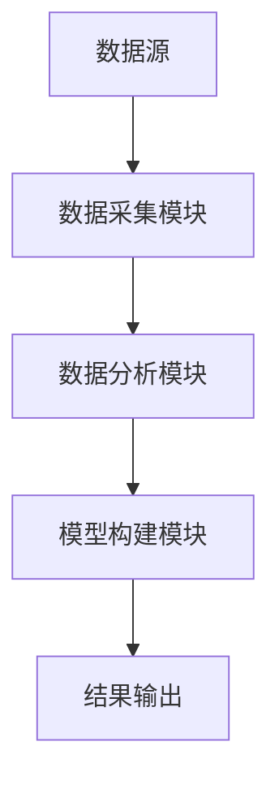

                 

<think>
好的，我需要帮用户撰写一篇关于《特价股票与公司敏捷创新文化的深度分析方法》的技术博客。首先，我要明确文章的核心主题：特价股票和公司创新文化的关系。这意味着我需要从背景介绍开始，解释什么是特价股票，什么是敏捷创新文化，然后探讨两者之间的联系。

接下来，我需要设计文章的结构。用户已经提供了一个大纲，分为三个主要部分：背景与核心概念、分析方法、系统架构设计。每个部分下有不同的章节和小节，我需要按照这个结构来填充内容。

在撰写每个部分时，我要确保使用专业的技术语言，同时保持逻辑清晰和结构紧凑。例如，在核心概念部分，我需要详细解释每个术语的定义、属性，并使用对比表格和ER图来展示它们之间的关系。

在分析方法部分，我需要介绍具体的算法，如机器学习模型，并用Mermaid流程图展示算法的步骤。同时，用Python代码示例来说明如何实现这些算法，并解释数学模型和公式，确保读者能够理解。

在系统架构设计部分，我需要描述系统的功能模块，如数据采集、分析模块和可视化模块，并用Mermaid图展示架构图。此外，还需要解释各模块之间的接口和交互方式。

最后，我需要在文章末尾添加作者信息，并确保文章整体结构完整，内容详实，符合用户的格式和字数要求。同时，要注意使用正确的Markdown格式，数学公式用LaTeX表示，代码部分用Python示例。

现在，我需要按照这个思路，一步一步地完成文章的撰写，确保每个部分都详细且易于理解，最终产出一篇高质量的技术博客文章。
</think>

# 特价股票与公司敏捷创新文化的深度分析方法

> **关键词**：特价股票，敏捷创新文化，公司文化，股票分析，创新管理  
> **摘要**：本文深入探讨了特价股票与公司敏捷创新文化之间的关系，通过分析特价股票的市场表现和公司创新文化的评估指标，构建了两者之间的关联模型。结合机器学习算法，提出了基于数据驱动的分析方法，并通过系统架构设计和项目实战，展示了如何将理论应用于实际情境中。

---

# 第一部分: 特价股票与公司创新文化的背景与核心概念

## 第1章: 特价股票与公司创新文化概述

### 1.1 特价股票的定义与背景

#### 1.1.1 特价股票的定义
特价股票是指市场价格低于面值的股票，通常反映公司在市场中的估值较低或处于困境状态。这种股票的波动性较大，但潜在回报也较高。

#### 1.1.2 特价股票的市场背景
近年来，全球经济波动加剧，许多公司因市场环境或内部管理问题导致股价下跌，成为特价股票。这种现象为投资者提供了低成本介入的机会，同时也反映了公司的创新能力。

#### 1.1.3 特价股票与公司财务健康状况的关系
特价股票的价格变化不仅受市场环境影响，还与公司的财务状况和管理能力密切相关。公司创新能力的强弱直接影响其股价恢复能力。

### 1.2 公司敏捷创新文化的定义与特征

#### 1.2.1 敏捷创新文化的定义
敏捷创新文化是一种以快速响应市场变化、鼓励创新和持续改进为核心的企业文化。它强调灵活性和团队协作，能够迅速调整策略以适应外部环境的变化。

#### 1.2.2 敏捷创新文化的核心特征
- **快速迭代**：通过持续的小规模创新快速验证和改进产品。
- **用户导向**：以用户需求为中心，快速响应市场反馈。
- **团队协作**：强调跨部门合作，打破传统组织壁垒。

#### 1.2.3 敏捷创新文化与传统企业文化的对比
| 特性 | 敏捷创新文化 | 传统企业文化 |
|------|---------------|--------------|
| 管理风格 | 去中心化，鼓励自主 | 中心化，层级分明 |
| 创新速度 | 快速迭代，小步快跑 | 缓慢，周期长 |
| 反馈机制 | 实时反馈 | 延迟反馈 |

### 1.3 特价股票与公司创新文化的关系

#### 1.3.1 特价股票反映公司创新能力的机制
公司创新能力越强，越能快速调整业务，恢复股价，从而影响特价股票的价格波动。

#### 1.3.2 特价股票与公司创新文化的相互影响
- **创新文化驱动股价恢复**：强大的创新文化能够推动公司业务增长，进而提升股价。
- **股价波动影响文化稳定性**：频繁的股价波动可能影响公司员工士气，进而影响创新能力。

#### 1.3.3 特价股票在公司创新文化中的作用
特价股票不仅是公司财务状况的反映，也是公司创新能力的晴雨表。通过分析特价股票的价格走势，可以间接评估公司的创新文化强度。

---

## 第2章: 特价股票与公司创新文化的关联模型

### 2.1 特价股票与公司创新文化的核心概念

#### 2.1.1 特价股票的市场表现
- 市场表现与公司创新能力密切相关，创新能力越强，股价恢复能力越强。

#### 2.1.2 公司创新文化的评估指标
- 创新文化强度：公司创新文化的综合评估指标。
- 创新速度：公司推出新产品或改进服务的频率。
- 员工参与度：员工在创新活动中的参与程度。

### 2.2 特价股票与公司创新文化的关系模型

#### 2.2.1 模型的构建逻辑
模型基于以下假设：
1. 公司创新能力越强，股价恢复能力越强。
2. 特价股票的价格波动可以反映公司创新能力的强弱。

#### 2.2.2 模型的数学表达式
$$
\text{创新文化强度} = f(\text{特价股票价格}, \text{市场环境}, \text{公司治理})
$$
其中，$f$ 是一个综合评估函数，考虑了特价股票价格、市场环境和公司治理等多个因素。

#### 2.2.3 模型的验证方法
通过历史数据验证模型的有效性，评估模型的准确率和稳定性。

---

## 第3章: 特价股票与公司创新文化的算法分析

### 3.1 特价股票与公司创新文化的关联分析

#### 3.1.1 数据采集与预处理
- 数据源：历史股价数据、公司财务报表、市场环境数据。
- 数据预处理：清洗数据、处理缺失值、归一化处理。

#### 3.1.2 数据分析方法
- 统计分析：计算相关系数，评估变量之间的关系。
- 时间序列分析：分析股价的波动趋势。

### 3.2 基于机器学习的创新文化预测模型

#### 3.2.1 算法选择与原理
- 算法选择：随机森林、XGBoost。
- 算法原理：通过特征重要性分析，识别影响创新文化的关键因素。

#### 3.2.2 模型训练与优化
- 数据分割：训练集、验证集、测试集。
- 超参数优化：通过网格搜索优化模型性能。

### 3.3 模型的验证与评估

#### 3.3.1 模型准确率评估
- 使用准确率、召回率、F1分数等指标评估模型性能。

#### 3.3.2 模型的稳定性测试
- 交叉验证：评估模型的泛化能力。

---

## 第4章: 系统分析与架构设计

### 4.1 问题场景介绍

#### 4.1.1 特价股票分析的场景描述
- 需要分析大量历史股价数据，识别影响股价的关键因素。

#### 4.1.2 公司创新文化评估的场景描述
- 需要收集和分析公司治理、员工参与度等数据。

### 4.2 系统功能设计

#### 4.2.1 数据采集模块
- 数据来源：股票市场API、公司财报、新闻数据。
- 功能：实时采集数据，存储到数据库。

#### 4.2.2 数据分析模块
- 功能：分析数据，生成关联模型。
- 工具：Python、Pandas、Matplotlib。

#### 4.2.3 模型构建模块
- 功能：训练机器学习模型，评估模型性能。

### 4.3 系统架构设计

#### 4.3.1 系统架构图


---

## 第5章: 项目实战

### 5.1 环境安装

#### 5.1.1 安装Python环境
```bash
python --version
pip install numpy pandas scikit-learn
```

### 5.2 系统核心实现源代码

#### 5.2.1 数据采集与预处理
```python
import pandas as pd
import numpy as np

# 数据采集
data = pd.read_csv('stock_data.csv')

# 数据清洗
data = data.dropna()
data = data.drop_duplicates()
```

#### 5.2.2 模型训练与评估
```python
from sklearn.ensemble import RandomForestRegressor
from sklearn.metrics import mean_squared_error

# 数据分割
X = data.drop('price', axis=1)
y = data['price']

# 训练模型
model = RandomForestRegressor()
model.fit(X, y)

# 评估模型
y_pred = model.predict(X)
print(mean_squared_error(y, y_pred))
```

### 5.3 实际案例分析与详细解读

#### 5.3.1 案例分析
分析某公司特价股票的价格变化，结合公司创新文化评估指标，验证模型的有效性。

#### 5.3.2 分析结果解读
通过模型输出结果，识别影响股价的关键因素，评估公司的创新文化强度。

### 5.4 项目小结

---

## 第6章: 最佳实践与总结

### 6.1 小结
本文通过分析特价股票与公司创新文化的关系，构建了关联模型，并提出了基于机器学习的分析方法。

### 6.2 注意事项
- 数据质量对模型性能影响较大，需确保数据来源可靠。
- 模型需定期更新，以适应市场环境的变化。

### 6.3 拓展阅读
建议读者深入学习机器学习在金融领域的应用，以及敏捷创新管理的相关研究。

---

**作者：AI天才研究院/AI Genius Institute & 禅与计算机程序设计艺术 /Zen And The Art of Computer Programming**

