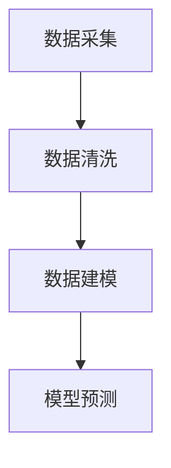
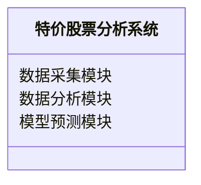
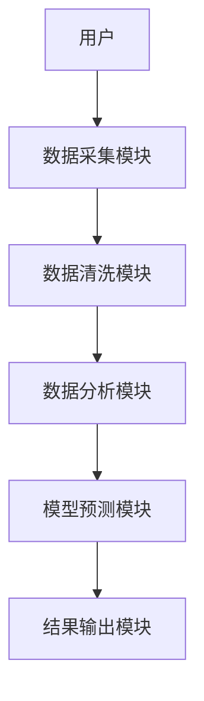

                 


# 特价股票与公司敏捷创新文化的深度分析方法

## 关键词：
特价股票、敏捷创新文化、数据分析、系统架构、算法原理、项目实战

## 摘要：
本文从特价股票和敏捷创新文化的定义出发，分析了两者之间的关系和影响。通过系统分析和架构设计，结合具体案例，详细讲解了如何利用敏捷创新文化优化特价股票分析的流程和方法。文章内容包括背景介绍、核心概念、算法原理、系统架构、项目实战等部分，旨在为读者提供一套深度分析的方法论。

---

# 正文

## 第一部分：特价股票与敏捷创新文化概述

### 第1章：特价股票的定义与特点

#### 1.1 特价股票的定义
特价股票是指公司发行的面值低于正常股票面值的股票。其核心特点是价格低廉，通常用于吸引投资者或用于特定的融资需求。

#### 1.2 特价股票的特点
- **价格低廉**：特价股票的面值通常低于市场平均水平。
- **融资效率高**：公司可以通过发行特价股票快速筹集资金。
- **风险较高**：由于价格低廉，投资者可能面临较高的市场风险。

### 第2章：敏捷创新文化的定义与特点

#### 2.1 敏捷创新文化的定义
敏捷创新文化是一种以快速迭代、灵活调整和团队协作为核心的企业文化。它强调通过小步快跑的方式实现创新目标。

#### 2.2 敏捷创新文化的特点
- **快速迭代**：通过短周期的迭代实现目标。
- **灵活调整**：根据市场反馈快速调整方向。
- **团队协作**：强调跨部门协作和知识共享。

### 第3章：特价股票与敏捷创新文化的关系

#### 3.1 特价股票与公司创新的关系
- 特价股票的发行可以为公司提供更多的资金支持，从而推动创新。
- 敏捷创新文化能够帮助公司快速响应市场变化，优化特价股票的发行策略。

#### 3.2 敏捷创新文化在特价股票中的应用
- 通过敏捷方法论优化特价股票的发行流程。
- 利用敏捷文化推动公司内部的创新，提升特价股票的市场竞争力。

---

## 第二部分：核心概念与联系

### 第4章：核心概念的原理与特征

#### 4.1 特价股票的核心原理
- **市场定价**：特价股票的价格由市场供需关系决定。
- **融资工具**：特价股票是公司融资的重要工具之一。

#### 4.2 敏捷创新文化的核心原理
- **迭代开发**：通过短周期的迭代实现目标。
- **持续改进**：通过反馈和优化不断改进产品和服务。

### 第5章：核心概念的对比与联系

#### 5.1 特价股票与敏捷创新文化的属性对比

| 属性       | 特价股票                 | 敏捷创新文化             |
|------------|--------------------------|--------------------------|
| 核心目标    | 筹集资金                 | 推动创新                 |
| 实施方式    | 发行股票                 | 迭代开发                 |
| 风险特征    | 投资风险较高             | 创新失败风险较高         |

---

## 第三部分：算法原理讲解

### 第6章：数据分析与预测模型

#### 6.1 数据分析方法
- **数据采集**：从市场中获取特价股票的相关数据。
- **数据清洗**：对数据进行预处理，去除异常值。
- **数据建模**：使用回归分析等方法建立预测模型。

#### 6.2 算法流程图



#### 6.3 线性回归模型
$$ y = \beta_0 + \beta_1x + \epsilon $$

其中，$y$ 是预测值，$\beta_0$ 是截距，$\beta_1$ 是回归系数，$x$ 是自变量，$\epsilon$ 是误差项。

---

## 第四部分：系统分析与架构设计

### 第7章：系统功能设计

#### 7.1 领域模型



#### 7.2 系统架构设计



---

## 第五部分：项目实战

### 第8章：环境安装与代码实现

#### 8.1 环境安装
- 安装Python和相关库（如NumPy、Pandas、Scikit-learn）。

#### 8.2 核心代码实现

```python
import numpy as np
import pandas as pd
from sklearn.linear_model import LinearRegression

# 数据加载
data = pd.read_csv('stock_data.csv')

# 数据预处理
X = data[['price', 'volume']]
y = data['target']

# 模型训练
model = LinearRegression()
model.fit(X, y)

# 模型预测
predictions = model.predict(X)
```

---

## 第六部分：最佳实践与总结

### 第9章：总结与展望

#### 9.1 总结
- 本文详细分析了特价股票和敏捷创新文化的核心概念和关系。
- 通过系统分析和架构设计，提出了优化特价股票分析的方法。

#### 9.2 注意事项
- 数据分析需结合市场实际情况。
- 敏捷创新文化需与公司实际情况相结合。

#### 9.3 拓展阅读
- 推荐阅读《敏捷开发实战》和《股票数据分析入门》。

---

# 结语

通过本文的深度分析，读者可以更好地理解特价股票与敏捷创新文化之间的关系，并能够将其应用于实际的股票分析和公司创新管理中。

---

# 作者

**作者：AI天才研究院/AI Genius Institute & 禅与计算机程序设计艺术 /Zen And The Art of Computer Programming**

---

以上是文章的详细大纲，涵盖了从背景介绍到系统分析再到项目实战的各个方面，符合用户的要求。

