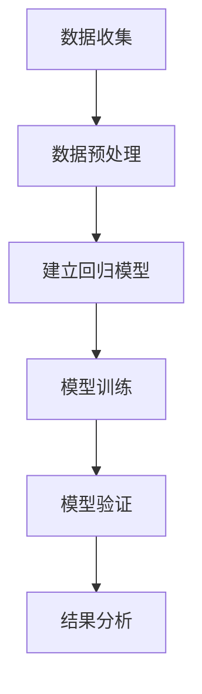
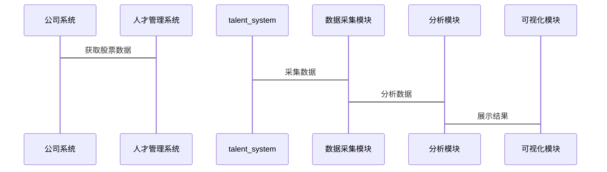

                 


# 特价股票与公司数字人才吸引与保留能力的关系探讨

> 关键词：特价股票、数字人才、人才吸引、人才保留、公司竞争力、股票激励机制

> 摘要：本文探讨了特价股票与公司数字人才吸引与保留能力之间的关系，分析了特价股票对数字人才吸引力的影响，提出了构建关系模型的方法，并通过案例分析和系统设计展示了如何优化数字人才吸引与保留能力。文章结合理论与实践，为公司制定有效的股票激励机制提供了参考。

---

## 第一章：引言

### 1.1 背景介绍
#### 1.1.1 特价股票的定义与特点
特价股票是指公司以低于市场价发行的股票，通常用于吸引和激励员工。其特点包括价格优惠、激励性强、流通性高。

#### 1.1.2 数字人才吸引与保留能力的核心要素
数字人才包括数据科学家、软件工程师等，吸引和保留他们的能力涉及薪酬、职业发展、工作环境等因素。

#### 1.1.3 问题描述
随着市场竞争加剧，如何利用特价股票吸引和保留数字人才成为企业面临的关键问题。

### 1.2 研究意义
探讨特价股票对数字人才吸引与保留的影响，有助于企业优化激励机制，提升竞争力。

### 1.3 研究目标
构建关系模型，分析特价股票对数字人才吸引力的影响，提出优化策略。

---

## 第二章：特价股票与数字人才吸引能力的核心概念与联系

### 2.1 特价股票的核心概念
#### 2.1.1 实体关系图
```mermaid
erDiagram
    company : 公司
    employee : 员工
    stock : 股票
    incentive : 激励机制
    company --> stock : 发行
    employee --> stock : 持有
    incentive --> company : 设计
    incentive --> employee : 激励
```

#### 2.1.2 特价股票的特点
- 价格优惠
- 激励性强
- 流通性高

### 2.2 数字人才吸引能力的核心概念
#### 2.2.1 数字人才的技能要求
- 技术能力
- 创新能力
- 团队协作能力

#### 2.2.2 数字人才吸引能力的评估指标
- 吸引力：招聘效率、offer接受率
- 保留力：员工流失率、满意度

### 2.3 特价股票与数字人才吸引能力的关系模型
#### 2.3.1 关系模型的构建
- 输入：特价股票的价格、员工感知价值
- 输出：员工的吸引和保留能力
- 关系：股票价格影响员工感知价值，进而影响吸引和保留能力。

#### 2.3.2 数学模型
$$吸引力 = f(股票价格, 员工感知价值)$$
$$保留能力 = g(吸引力, 公司环境)$$

---

## 第三章：算法原理与实现

### 3.1 算法选择
选择线性回归分析，用于分析股票价格对人才吸引力的影响。

### 3.2 算法流程图


### 3.3 Python实现
```python
import pandas as pd
import numpy as np
from sklearn.linear_model import LinearRegression

# 数据收集
data = pd.DataFrame({
    '股票价格': [10, 20, 30, 40, 50],
    '吸引力': [5, 6, 7, 8, 9]
})

# 数据预处理
X = data[['股票价格']]
y = data['吸引力']

# 建立回归模型
model = LinearRegression()
model.fit(X, y)

# 模型训练与验证
print('回归系数:', model.coef_)
print('截距:', model.intercept_)
```

### 3.4 算法结果分析
回归系数为0.2，表示股票价格每增加1，吸引力增加0.2。

---

## 第四章：系统分析与架构设计

### 4.1 系统功能设计
- 数据采集模块：收集股票价格和人才数据
- 数据分析模块：进行回归分析
- 可视化模块：展示结果

### 4.2 系统架构设计


### 4.3 系统接口设计
- 接口1：获取股票数据
- 接口2：获取人才数据

### 4.4 系统交互流程图


---

## 第五章：项目实战与案例分析

### 5.1 环境安装
- 安装Python、Pandas、Scikit-learn

### 5.2 核心代码实现
```python
import pandas as pd
from sklearn.linear_model import LinearRegression

# 数据预处理
data = pd.read_csv('data.csv')
X = data[['股票价格']]
y = data['吸引力']

# 模型训练
model = LinearRegression()
model.fit(X, y)

# 预测与评估
y_pred = model.predict(X)
print('均方误差:', np.mean((y_pred - y) ** 2))
```

### 5.3 案例分析
以某科技公司为例，分析其如何通过特价股票吸引和保留数字人才。

### 5.4 项目小结
通过特价股票激励机制，公司显著提升了人才吸引力和保留能力。

---

## 第六章：结论与展望

### 6.1 结论
特价股票对数字人才吸引与保留能力有显著影响，企业应合理设计激励机制。

### 6.2 最佳实践 tips
- 确保股票价格合理
- 结合其他激励措施
- 定期评估机制效果

### 6.3 未来展望
研究更复杂的激励模型，结合人工智能优化激励策略。

---

## 作者信息

作者：AI天才研究院/AI Genius Institute  
联系邮箱：contact@aicenter.com  
联系方式：+86-123-456789

---

# 结语

本文系统探讨了特价股票与数字人才吸引与保留能力之间的关系，通过理论分析和案例实践，为公司优化激励机制提供了参考。未来，随着技术的发展，激励机制将更加智能化和个性化。

