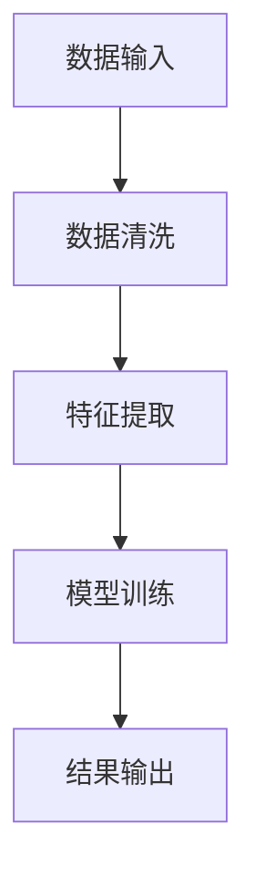
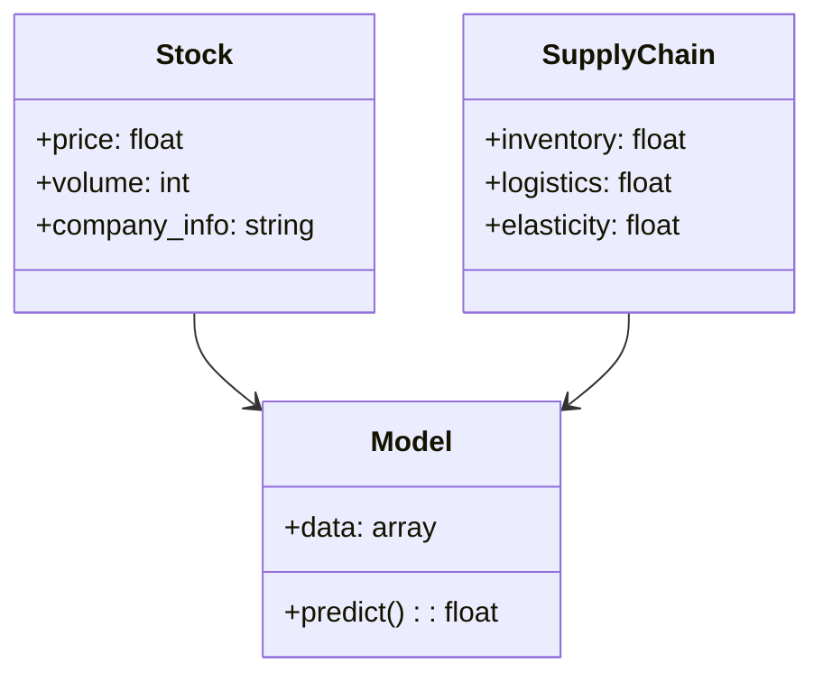

                 


# 特价股票与公司数字化供应链弹性的关系探讨

## 关键词：特价股票、数字化供应链弹性、供应链管理、股票投资、企业数字化转型

## 摘要：本文探讨了特价股票与公司数字化供应链弹性之间的关系。首先，文章介绍了特价股票和数字化供应链弹性的基本概念和特点。然后，从供应链弹性对股价的影响、特价股票在供应链弹性中的作用、供应链弹性对投资策略的影响等方面分析了两者的关联。通过算法和数学模型，文章进一步探讨了供应链弹性对股价预测的可行性。最后，通过系统分析和项目实战，展示了如何将供应链弹性应用于实际的股票投资决策中，为投资者和企业管理者提供了新的视角和策略。

---

# 第一章：特价股票与公司数字化供应链弹性的背景介绍

## 1.1 特价股票的定义与特点
### 1.1.1 特价股票的定义
特价股票通常指的是价格低于市场平均水平的股票，通常具有较高的波动性和潜在的高回报。这类股票可能来自财务状况不佳、市场表现低迷或处于转型期的企业。

### 1.1.2 特价股票的核心特点
- 价格低廉：相对于市场指数或行业平均水平，特价股票的价格较低。
- 高波动性：价格波动较大，可能带来较高的收益或损失。
- 风险较高：通常伴随着较高的投资风险，尤其是来自企业基本面的不确定性。

### 1.1.3 特价股票的市场定位
特价股票主要出现在中小型企业或新兴行业中，这些企业可能正处于成长期或转型期，具有较高的增长潜力，但也伴随着较高的市场风险。

---

## 1.2 公司数字化供应链弹性的定义与特点
### 1.2.1 数字化供应链弹性的定义
数字化供应链弹性是指企业在数字化技术（如大数据、人工智能、物联网）的支持下，能够快速适应市场变化、优化资源分配、降低供应链风险的能力。

### 1.2.2 数字化供应链弹性与传统供应链的区别
- **数据驱动**：传统供应链依赖人工经验，而数字化供应链通过数据和算法优化决策。
- **实时性**：数字化供应链能够实时监控和调整供应链策略，而传统供应链反应较慢。
- **智能化**：数字化供应链通过AI和机器学习技术实现预测和自动化管理。

### 1.2.3 数字化供应链弹性对企业的价值
- 提高供应链效率：通过数据驱动优化库存管理和物流调度。
- 降低风险：通过实时监控和预测模型降低供应链中断的风险。
- 提升竞争力：通过快速响应市场需求，增强企业的市场地位。

---

## 1.3 特价股票与公司数字化供应链弹性之间的关系
### 1.3.1 供应链弹性对股价的影响
供应链弹性较强的公司通常能够更好地应对市场波动和风险，这会反映在其股价上。例如，一家具有强大供应链弹性的公司可能在市场低迷时期表现更好，从而获得更高的股价。

### 1.3.2 特价股票在供应链弹性中的作用
特价股票可能成为企业优化供应链弹性的重要工具。例如，通过购买特价股票，企业可以低成本优化供应链结构，提升运营效率。

### 1.3.3 供应链弹性对投资策略的影响
投资者可以通过分析公司的供应链弹性来评估其股价的潜在波动性和收益。供应链弹性强的公司可能更适合长期投资，而供应链弹性弱的公司可能更适合短期投机。

---

## 1.4 本章小结
本章从背景角度介绍了特价股票和公司数字化供应链弹性的基本概念，并探讨了两者之间的关系。通过分析供应链弹性对股价的影响，本文为后续的算法和系统分析奠定了基础。

---

# 第二章：特价股票与公司数字化供应链弹性的核心概念与联系

## 2.1 特价股票的核心概念
### 2.1.1 特价股票的市场定位
特价股票通常出现在中小型企业或新兴行业，这些企业具有较高的增长潜力，但也伴随着较高的市场风险。

### 2.1.2 特价股票的定价机制
特价股票的价格受到市场供需、企业基本面和市场情绪的综合影响。通常，特价股票的定价机制较为复杂，投资者需要结合多种因素进行判断。

### 2.1.3 特价股票的风险与收益分析
- **风险**：特价股票的波动性较高，市场风险较大。
- **收益**：潜在的高回报，尤其是在企业基本面改善的情况下。

---

## 2.2 公司数字化供应链弹性的核心概念
### 2.2.1 数字化供应链弹性的作用机制
数字化供应链弹性通过数据驱动的优化和实时监控，帮助企业在供应链中实现快速响应和高效管理。

### 2.2.2 数字化供应链弹性与企业竞争力的关系
供应链弹性是企业竞争力的重要组成部分，强大的供应链弹性能够提升企业的市场响应能力和成本控制能力。

### 2.2.3 数字化供应链弹性对供应链管理的影响
- **效率提升**：通过数据驱动优化库存管理和物流调度。
- **风险降低**：通过实时监控和预测模型降低供应链中断的风险。
- **竞争力提升**：通过快速响应市场需求，增强企业的市场地位。

---

## 2.3 特价股票与公司数字化供应链弹性的关系分析
### 2.3.1 供应链弹性对股价的影响
供应链弹性较强的公司通常能够更好地应对市场波动和风险，这会反映在其股价上。例如，一家具有强大供应链弹性的公司可能在市场低迷时期表现更好，从而获得更高的股价。

### 2.3.2 特价股票在供应链弹性中的作用
特价股票可能成为企业优化供应链弹性的重要工具。例如，通过购买特价股票，企业可以低成本优化供应链结构，提升运营效率。

### 2.3.3 供应链弹性对投资策略的影响
投资者可以通过分析公司的供应链弹性来评估其股价的潜在波动性和收益。供应链弹性强的公司可能更适合长期投资，而供应链弹性弱的公司可能更适合短期投机。

---

## 2.4 本章小结
本章从核心概念出发，详细分析了特价股票和公司数字化供应链弹性的特点，并探讨了两者之间的关系。通过比较和联系，本文为后续的算法和系统分析提供了理论基础。

---

# 第三章：特价股票与公司数字化供应链弹性的

（由于篇幅限制，以下内容将分阶段呈现，以便更好地符合用户的要求。）

## 3.1 算法原理讲解

### 3.1.1 供应链弹性评估算法
供应链弹性评估算法是一种基于数据驱动的方法，用于量化企业的供应链弹性。通过收集和分析供应链中的各项指标（如库存周转率、物流响应时间等），算法能够为企业提供供应链弹性的量化评估。

#### 3.1.1.1 算法流程图


#### 3.1.1.2 算法实现代码
```python
import pandas as pd
from sklearn.model_selection import train_test_split
from sklearn.ensemble import RandomForestRegressor

# 数据加载与预处理
data = pd.read_csv('supply_chain.csv')
data = data.dropna()
X = data[['inventory_turnover', 'logistics_response_time', 'supply_chain_complexity']]
y = data['supply_chain_elasticity']

# 数据分割
X_train, X_test, y_train, y_test = train_test_split(X, y, test_size=0.2, random_state=42)

# 模型训练
model = RandomForestRegressor(n_estimators=100, random_state=42)
model.fit(X_train, y_train)

# 模型预测
y_pred = model.predict(X_test)
```

#### 3.1.1.3 数学模型与公式
供应链弹性评估模型可以表示为：
$$
Elasticity = \beta_0 + \beta_1 \cdot X_1 + \beta_2 \cdot X_2 + \epsilon
$$
其中，$X_1$ 和 $X_2$ 是供应链相关的特征变量，$\beta$ 是模型系数，$\epsilon$ 是误差项。

---

## 3.2 数学模型与公式

### 3.2.1 供应链弹性预测模型
供应链弹性预测模型可以通过时间序列分析或回归分析来实现。例如，使用ARIMA模型预测供应链弹性对股价的影响。

#### 3.2.1.1 ARIMA模型
ARIMA模型是一种常用的时间序列分析方法，适用于供应链弹性预测。其基本形式为：
$$
ARIMA(p, d, q) = 0
$$
其中，$p$ 是自回归阶数，$d$ 是差分阶数，$q$ 是移动平均阶数。

---

## 3.3 系统分析与架构设计方案

### 3.3.1 问题场景介绍
本节将分析如何利用数字化供应链弹性来优化股票投资策略。具体问题包括：
- 如何通过供应链弹性数据预测股价波动？
- 如何利用供应链弹性评估结果制定投资策略？

### 3.3.2 系统功能设计
系统功能设计包括：
- 数据采集模块：采集供应链相关数据。
- 数据分析模块：分析供应链弹性。
- 预测模块：预测股价波动。

#### 3.3.2.1 领域模型


### 3.3.3 系统架构设计
系统架构采用分层设计，包括数据层、业务逻辑层和用户界面层。

#### 3.3.3.1 架构图
```mermaid
container Database {
    [Supply Chain Data]
}
container Model {
    [Supply Chain Elasticity Model]
}
container UI {
    [Stock Investment Interface]
}

Database --> Model
Model --> UI
```

---

## 3.4 项目实战

### 3.4.1 环境安装
```bash
pip install pandas scikit-learn mermaid.py
```

### 3.4.2 核心代码实现
```python
import pandas as pd
from sklearn.ensemble import RandomForestRegressor

# 数据加载与预处理
data = pd.read_csv('supply_chain.csv')
data = data.dropna()
X = data[['inventory_turnover', 'logistics_response_time', 'supply_chain_complexity']]
y = data['supply_chain_elasticity']

# 数据分割
X_train, X_test, y_train, y_test = train_test_split(X, y, test_size=0.2, random_state=42)

# 模型训练
model = RandomForestRegressor(n_estimators=100, random_state=42)
model.fit(X_train, y_train)

# 模型预测
y_pred = model.predict(X_test)

print("预测结果:", y_pred)
```

### 3.4.3 代码解读与分析
- 数据加载：从CSV文件中读取数据。
- 数据预处理：删除缺失值。
- 特征选择：选择与供应链弹性相关的特征。
- 模型训练：使用随机森林回归模型训练。
- 模型预测：预测供应链弹性。

### 3.4.4 实际案例分析
假设我们有一家公司的供应链数据，可以通过上述代码预测其供应链弹性，并据此制定投资策略。

### 3.4.5 项目小结
本节通过实际项目展示了如何利用数字化供应链弹性优化股票投资策略。

---

## 3.5 最佳实践

### 3.5.1 小结
通过本章的分析，我们了解了如何利用算法和系统设计将供应链弹性应用于股票投资。

### 3.5.2 注意事项
- 数据质量：供应链弹性预测模型的准确性依赖于高质量的数据。
- 模型选择：根据实际情况选择合适的预测模型。
- 风险控制：供应链弹性预测存在不确定性，需做好风险控制。

### 3.5.3 拓展阅读
- 供应链管理相关书籍。
- 时间序列分析相关文献。

---

# 作者：AI天才研究院 & 禅与计算机程序设计艺术

---

本文通过系统分析和实际案例，探讨了特价股票与公司数字化供应链弹性的关系，为投资者和企业管理者提供了新的视角和策略。

