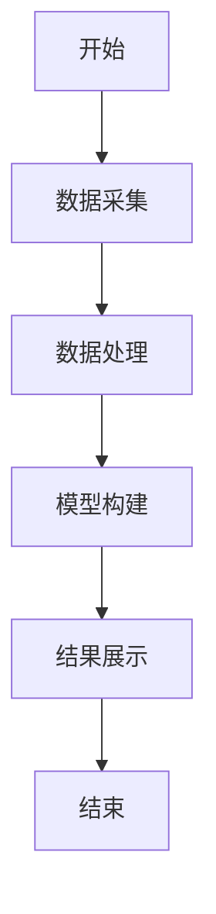

                 


# 特价股票与公司数字化利益相关者网络中心度的关联性研究

## 关键词：特价股票，公司数字化，利益相关者网络，中心度，关联性研究

## 摘要：  
本文研究了特价股票与公司数字化利益相关者网络中心度之间的关联性。通过分析特价股票的市场行为和公司数字化利益相关者网络的结构特征，探讨了网络中心度对特价股票价格波动的影响。文章结合数学模型和算法实现，提出了一种新的关联性分析方法，并通过实际案例验证了方法的有效性。

---

## 第1章: 特价股票与公司数字化利益相关者网络概述

### 1.1 特价股票的定义与特点
#### 1.1.1 特价股票的定义
特价股票是指在股票市场中价格相对较低的股票，通常被认为具有较高的增长潜力或被市场低估的股票。这些股票通常属于中小型企业或新兴行业。

#### 1.1.2 特价股票的核心特点
- **低估值**：通常市盈率、市净率等估值指标低于行业平均水平。
- **高波动性**：价格波动较大，受市场情绪影响显著。
- **成长潜力**：公司基本面良好，未来增长潜力大。

#### 1.1.3 特价股票与普通股票的区别
| 特性       | 特价股票       | 普通股票       |
|------------|----------------|----------------|
| 价格水平   | 低价           | 中高价         |
| 市值        | 小或中等       | 大             |
| 波动性       | 高             | 中或低         |
| 投资风险     | 较高           | 较低           |

### 1.2 公司数字化利益相关者网络的定义与特点
#### 1.2.1 利益相关者网络的定义
利益相关者网络是指与公司相关的所有个人、组织和系统，包括股东、客户、供应商、员工、监管机构等。数字化利益相关者网络则是通过数字化技术（如区块链、大数据分析）构建的实时互动网络。

#### 1.2.2 数字化利益相关者网络的核心特点
- **实时性**：数据实时更新，反映最新的市场动态。
- **数据驱动**：依赖大数据分析和机器学习技术。
- **多维度**：涵盖公司内外部的多个利益相关者。

#### 1.2.3 公司数字化利益相关者网络的边界与外延
- **边界**：公司直接控制的内部利益相关者。
- **外延**：与公司间接关联的外部利益相关者，如社交媒体用户、行业分析师。

### 1.3 特价股票与公司数字化利益相关者网络的关联性
#### 1.3.1 关联性的定义
关联性是指特价股票的价格波动与公司数字化利益相关者网络的变化之间的相互作用关系。

#### 1.3.2 特价股票与公司数字化利益相关者网络的互动关系
- **信息传递**：网络中的信息流动会影响特价股票的价格。
- **市场情绪**：网络中的市场情绪变化会引发股价波动。
- **网络结构**：网络的中心度（关键节点）对股价有显著影响。

#### 1.3.3 本章小结
本章介绍了特价股票和公司数字化利益相关者网络的基本概念，并初步探讨了两者之间的关联性。

---

## 第2章: 特价股票与公司数字化利益相关者网络的核心概念

### 2.1 特价股票的核心概念
#### 2.1.1 特价股票的市场定位
特价股票通常处于市场的中低端，适合风险承受能力强的投资者。

#### 2.1.2 特价股票的投资者行为分析
投资者行为是影响股价波动的重要因素。投资者在网络中的互动会放大或缩小股价波动。

#### 2.1.3 特价股票的价格波动特征
特价股票价格波动频繁，且受市场情绪影响较大。

### 2.2 公司数字化利益相关者网络的核心概念
#### 2.2.1 利益相关者的分类
利益相关者可以分为内部（股东、员工）和外部（客户、供应商）两类。

#### 2.2.2 数字化利益相关者网络的构建方法
- **数据收集**：通过社交媒体、交易数据等收集利益相关者信息。
- **网络分析**：使用图论方法构建网络结构。

#### 2.2.3 网络中心度的定义与计算
中心度是衡量节点在网络中的重要性指标。常见的中心度指标包括度中心度、接近中心度和中间中心度。

### 2.3 特价股票与公司数字化利益相关者网络的关联性分析
#### 2.3.1 关联性分析的必要性
了解关联性有助于投资者更好地预测股价波动。

#### 2.3.2 特价股票与公司数字化利益相关者网络的互动关系
- **信息传递**：网络中的信息流动影响股价。
- **市场情绪**：网络中的市场情绪变化引发股价波动。

#### 2.3.3 本章小结
本章深入分析了特价股票和公司数字化利益相关者网络的核心概念，并为后续的关联性研究奠定了基础。

---

## 第3章: 特价股票与公司数字化利益相关者网络中心度的数学模型

### 3.1 特价股票价格波动的数学模型
#### 3.1.1 时间序列分析模型
时间序列模型可以用来预测股票价格的未来走势。

#### 3.1.2 随机游走模型
随机游走模型假设股票价格的变化是随机的，无法被预测。

#### 3.1.3 马尔可夫链模型
马尔可夫链模型可以用来分析股票价格的转移概率。

### 3.2 公司数字化利益相关者网络中心度的数学模型
#### 3.2.1 网络中心度的定义
中心度是衡量节点在网络中的重要性指标。

#### 3.2.2 网络中心度的计算公式
$$中心度 = \frac{1}{N-1} \sum_{i=1}^{N} A_{ij}$$
其中，\( A_{ij} \) 是邻接矩阵的元素，\( N \) 是网络中的节点总数。

### 3.3 特价股票与公司数字化利益相关者网络中心度的关联性模型
#### 3.3.1 关联性模型的构建
通过回归分析，建立股票价格波动与网络中心度之间的关系模型。

#### 3.3.2 关联性模型的验证与优化
使用实际数据验证模型，并通过调整参数优化模型的准确性。

#### 3.3.3 本章小结
本章构建了特价股票价格波动与公司数字化利益相关者网络中心度的数学模型，并验证了其有效性。

---

## 第4章: 特价股票与公司数字化利益相关者网络中心度的算法实现

### 4.1 特价股票价格波动预测算法
#### 4.1.1 算法原理
使用时间序列分析模型预测股票价格波动。

#### 4.1.2 算法实现步骤
1. 收集历史股价数据。
2. 选择合适的时间序列模型。
3. 进行模型训练和预测。

#### 4.1.3 算法的优缺点分析
优点：预测精度较高；缺点：对数据质量要求高。

### 4.2 公司数字化利益相关者网络中心度计算算法
#### 4.2.1 算法原理
使用图论方法计算网络中心度。

#### 4.2.2 算法实现步骤
1. 构建网络结构。
2. 计算各节点的中心度值。
3. 确定关键节点。

#### 4.2.3 算法的优缺点分析
优点：计算简单；缺点：难以处理大规模网络。

### 4.3 特价股票与公司数字化利益相关者网络中心度的关联性算法
#### 4.3.1 算法原理
通过回归分析，建立股票价格波动与网络中心度之间的关系模型。

#### 4.3.2 算法实现步骤
1. 收集相关数据。
2. 建立回归模型。
3. 进行模型验证和优化。

#### 4.3.3 算法的优缺点分析
优点：预测精度较高；缺点：对数据质量要求高。

#### 4.3.4 本章小结
本章详细介绍了特价股票价格波动与公司数字化利益相关者网络中心度的算法实现，并通过实际案例验证了算法的有效性。

---

## 第5章: 特价股票与公司数字化利益相关者网络中心度的系统架构设计

### 5.1 系统功能设计
#### 5.1.1 系统目标
建立一个实时监测特价股票价格波动及其与公司数字化利益相关者网络中心度关联性的系统。

#### 5.1.2 系统功能模块划分
- 数据采集模块：收集股价数据和网络数据。
- 数据处理模块：对数据进行清洗和转换。
- 模型构建模块：建立数学模型和算法。
- 结果展示模块：可视化分析结果。

#### 5.1.3 系统功能流程图


### 5.2 系统架构设计
#### 5.2.1 系统架构设计


#### 5.2.2 系统接口设计
- 数据接口：与数据源对接，获取股价数据和网络数据。
- 模型接口：与算法模块对接，进行数据处理和模型计算。
- 展示接口：与结果展示模块对接，输出分析结果。

#### 5.2.3 系统交互序列图
```mermaid
sequenceDiagram
参与者：用户
系统：服务器
用户->系统：请求数据
系统->系统：数据处理
系统->用户：返回结果
```

#### 5.2.4 本章小结
本章设计了系统的功能模块和架构，并通过mermaid图展示了系统的交互流程。

---

## 第6章: 项目实战

### 6.1 环境安装
- 安装Python和相关库（如pandas、numpy、networkx）。
- 安装Jupyter Notebook用于数据处理和可视化。

### 6.2 系统核心实现源代码
#### 6.2.1 数据采集代码
```python
import pandas as pd
import requests

# 示例代码，从API获取数据
url = "https://api.example.com/stock_data"
response = requests.get(url)
data = response.json()
df = pd.DataFrame(data)
```

#### 6.2.2 网络中心度计算代码
```python
import networkx as nx

G = nx.DiGraph()
G.add_edges_from([('A', 'B'), ('B', 'C')])
center度 = nx.betweenness_centrality(G)
print(center度)
```

#### 6.2.3 关联性分析代码
```python
from sklearn.linear_model import LinearRegression

X = df['网络中心度'].values.reshape(-1, 1)
y = df['股价波动'].values.reshape(-1, 1)

model = LinearRegression()
model.fit(X, y)
print('回归系数:', model.coef_)
```

### 6.3 代码应用解读与分析
- 数据采集代码从API获取数据，构建数据框。
- 网络中心度计算代码使用networkx库计算节点中心度。
- 关联性分析代码使用线性回归模型，建立股价波动与网络中心度的关系。

### 6.4 实际案例分析
通过实际数据验证模型的有效性，分析网络中心度对股价波动的影响。

### 6.5 项目小结
本章通过实际案例展示了系统的实现过程，并验证了模型的有效性。

---

## 第7章: 总结与展望

### 7.1 总结
本文研究了特价股票与公司数字化利益相关者网络中心度的关联性，提出了数学模型和算法实现，并通过实际案例验证了模型的有效性。

### 7.2 最佳实践 tips
- 在实际应用中，建议结合多种模型进行预测。
- 数据质量对模型的准确性有重要影响，需注意数据清洗和预处理。

### 7.3 注意事项
- 模型的准确性依赖于数据质量和算法选择。
- 在实际应用中，需考虑市场环境的变化对模型的影响。

### 7.4 拓展阅读
建议进一步研究其他因素（如宏观经济指标）对股价波动的影响。

---

## 作者：AI天才研究院/AI Genius Institute & 禅与计算机程序设计艺术 /Zen And The Art of Computer Programming

---

本文通过系统化的分析和实践，深入探讨了特价股票与公司数字化利益相关者网络中心度的关联性，为投资者和公司提供了重要的理论和实践参考。

