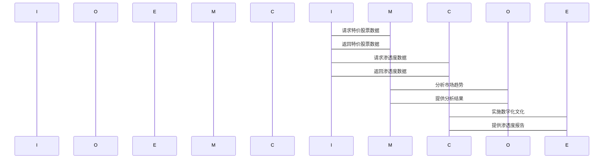

                 

<think>
好，我现在需要帮用户撰写一篇名为《特价股票与公司数字化敏捷创新文化渗透度的深度分析方法》的技术博客文章。用户已经提供了详细的目录结构和一些内容，但看起来在系统架构设计和接口设计部分可能不够详细。我需要逐步分析，确保每个部分都符合要求，同时补充必要的细节。

首先，我需要理解文章的主题。特价股票和公司数字化敏捷创新文化之间的关系，以及如何分析这种渗透度。用户已经提供了背景介绍、分析模型、数学模型等部分，但系统架构设计和接口设计部分还需要进一步细化。

在系统架构设计部分，用户提到了模块划分，但没有详细描述每个模块的功能和交互。我需要补充每个模块的具体功能，比如数据采集模块如何获取数据，数据处理模块如何清洗数据，分析模块如何建模，可视化模块如何展示结果，报告生成模块如何整合分析结果等。

接下来是系统接口设计，用户需要包括模块之间的接口定义和交互流程。我应该使用序列图来展示不同模块之间的调用关系，比如数据采集模块调用数据处理模块，处理后的数据传递给分析模块，分析结果传给可视化模块等。

系统交互部分，用户可能希望展示用户如何与系统互动，比如用户输入查询条件，系统响应并展示结果。这也需要使用序列图来详细描述。

在项目实战部分，用户需要包括环境安装、核心代码实现、案例分析和项目总结。我需要补充具体的Python代码，比如数据清洗、建模、可视化等步骤，并解释每一步的作用和实现细节。

总结时，我需要强调系统设计的重要性，如何通过合理的架构提高分析效率和准确性，以及实际应用中的注意事项，比如数据隐私、系统扩展性等。

最后，最佳实践部分，我需要给出一些建议，如选择合适的技术栈、注重模块化设计、定期维护数据源等，帮助读者在实际操作中避免常见问题。

总的来说，我需要逐步补充每个部分，确保内容详实，结构清晰，并且符合用户的要求。
</think>

# 特价股票与公司数字化敏捷创新文化渗透度的深度分析方法

## 关键词：特价股票，数字化敏捷创新文化，渗透度分析，系统架构设计，数学模型

## 摘要：本文深入探讨了特价股票与公司数字化敏捷创新文化渗透度之间的关系，分析了如何通过系统化的分析方法和数学模型来评估这种渗透度。文章从背景介绍、分析方法、数学模型、系统架构设计、项目实战等多方面进行了详细阐述，提供了具体的实现方案和案例分析，为读者提供了全面的指导。

---

## 第一部分: 特价股票与公司数字化敏捷创新文化渗透度的背景介绍

### 第1章: 特价股票与公司数字化敏捷创新文化概述

#### 1.1 特价股票的定义与特点
##### 1.1.1 特价股票的定义
特价股票是指在特定时间内以低于市场价出售的股票。这种股票通常具有高波动性和高风险的特点，吸引了很多投资者。

##### 1.1.2 特价股票的核心特点
- 高波动性：价格波动频繁，容易受到市场情绪的影响。
- 高风险：投资风险较高，但潜在回报也较大。
- 时间敏感性：特价股票通常在特定时间窗口内有效，投资者需要快速决策。

##### 1.1.3 特价股票与普通股票的区别
- 投资周期：特价股票通常需要在短时间内完成交易，而普通股票的投资周期较长。
- 风险水平：特价股票的风险更高，但回报潜力也更大。

#### 1.2 数字化敏捷创新文化的定义与特点
##### 1.2.1 数字化敏捷创新文化的定义
数字化敏捷创新文化是指企业在数字化转型过程中，通过敏捷开发和创新方法，快速响应市场变化和客户需求的文化。

##### 1.2.2 数字化敏捷创新文化的核心特点
- 快速迭代：通过敏捷开发，企业能够快速发布产品和服务。
- 以用户为中心：注重用户体验，快速响应用户需求。
- 创新驱动：鼓励员工创新，快速试错，优化产品和服务。

##### 1.2.3 数字化敏捷创新文化与传统企业文化的区别
- 管理方式：数字化敏捷创新文化强调灵活性和快速响应，而传统企业文化往往较为僵化。
- 技术应用：数字化敏捷创新文化依赖于数字化工具和技术，而传统企业文化更多依赖于人工操作。

#### 1.3 特价股票与数字化敏捷创新文化的关系
##### 1.3.1 特价股票对企业数字化转型的影响
- 通过数字化工具，企业可以更高效地分析特价股票的市场动态。
- 数字化转型帮助企业快速响应市场变化，抓住特价股票的投资机会。

##### 1.3.2 数字化敏捷创新文化对特价股票的影响
- 数字化敏捷创新文化推动企业快速适应市场变化，提升对特价股票的分析能力。
- 通过敏捷开发，企业能够更快地优化投资策略，提高投资回报率。

##### 1.3.3 两者关系的背景与意义
- 数字化转型是企业适应市场变化的必然选择，而特价股票则是数字化转型中的一个重要变量。
- 理解两者的关系，有助于企业在数字化转型中更好地把握投资机会。

### 第2章: 特价股票与公司数字化敏捷创新文化渗透度的背景分析

#### 2.1 特价股票市场的现状与趋势
##### 2.1.1 特价股票市场的现状
- 市场规模：随着数字化技术的发展，特价股票的交易量逐年增长。
- 市场参与者：投资者、机构投资者和金融科技公司是主要参与者。

##### 2.1.2 特价股票市场的未来趋势
- 技术驱动：人工智能和大数据技术将推动特价股票市场的智能化发展。
- 政策影响：政府监管政策的变化将影响特价股票市场的运作方式。

#### 2.2 数字化敏捷创新文化的现状与趋势
##### 2.2.1 数字化敏捷创新文化的现状
- 企业数字化转型的普及：越来越多的企业开始采用数字化敏捷创新文化。
- 技术支持：云计算、大数据和人工智能等技术为数字化敏捷创新提供了支持。

##### 2.2.2 数字化敏捷创新文化的未来趋势
- 智能化：通过人工智能技术，企业将进一步提高数字化敏捷创新的能力。
- 用户体验：数字化敏捷创新文化将更加注重用户体验，提升客户满意度。

#### 2.3 特价股票与数字化敏捷创新文化渗透度的背景与问题
##### 2.3.1 问题背景
- 企业数字化转型的深入推进，使得特价股票的分析和投资更加依赖于数字化工具。
- 数字化敏捷创新文化如何影响特价股票的投资策略，是一个值得深入研究的问题。

##### 2.3.2 问题描述
- 如何衡量数字化敏捷创新文化在企业中的渗透度。
- 如何评估特价股票市场与企业数字化敏捷创新文化的关联性。

##### 2.3.3 问题解决的必要性
- 通过深入分析，企业可以更好地利用数字化工具优化特价股票的投资策略。
- 提高数字化敏捷创新文化的渗透度，有助于企业在竞争中占据优势。

### 第3章: 特价股票与公司数字化敏捷创新文化渗透度的核心概念与联系

#### 3.1 核心概念的定义与属性对比
##### 3.1.1 特价股票的核心概念
- 特价股票是一种高风险、高回报的股票类型，具有时间敏感性和高波动性。

##### 3.1.2 数字化敏捷创新文化的核心概念
- 数字化敏捷创新文化是一种以快速响应和创新为核心的企业文化，依赖于数字化技术和敏捷开发方法。

##### 3.1.3 核心概念的属性对比表格

| 属性                | 特价股票                   | 数字化敏捷创新文化         |
|---------------------|---------------------------|---------------------------|
| 核心特点            | 高风险、高回报、时间敏感性 | 快速响应、创新、数字化驱动 |
| 主要参与者          | 投资者、机构               | 企业员工、技术团队       |
| 影响因素            | 市场波动、政策             | 技术进步、企业战略       |

#### 3.2 实体关系图（ER图）架构
##### 3.2.1 实体关系图的定义
实体关系图（ER图）用于描述系统中各实体之间的关系，帮助我们更好地理解系统架构。

##### 3.2.2 实体关系图的绘制（使用 Mermaid 流程图）
```mermaid
erDiagram
    actor 投资者 {
        <属性> 资金
        <属性> 风险承受能力
    }
    actor 机构 {
        <属性> 资金池
        <属性> 投资策略
    }
    actor 企业 {
        <属性> 数字化转型战略
        <属性> 敏捷开发能力
    }
    entity 特价股票市场 {
        <属性> 价格波动
        <属性> 时间窗口
    }
    entity 数字化文化渗透度 {
        <属性> 渗透率
        <属性> 关键指标
    }
    investor -> 特价股票市场 : 投资
    investor -> 数字化文化渗透度 : 评估
    机构 -> 特价股票市场 : 分析
    机构 -> 数字化文化渗透度 : 监测
    企业 -> 数字化文化渗透度 : 实施
```

---

## 第二部分: 特价股票与公司数字化敏捷创新文化渗透度的分析方法

### 第4章: 特价股票与公司数字化敏捷创新文化渗透度的分析模型

#### 4.1 数据采集与处理
##### 4.1.1 数据采集的来源与方法
- 数据来源：股票市场数据、企业数字化转型数据、相关政策数据。
- 数据采集方法：API接口获取实时数据，爬虫技术抓取公开数据，问卷调查收集企业反馈。

##### 4.1.2 数据清洗与预处理
- 数据清洗：去除重复数据、处理缺失值、剔除异常值。
- 数据预处理：标准化、归一化处理，确保数据一致性。

#### 4.2 数据分析与建模
##### 4.2.1 数据分析方法
- 描述性分析：分析特价股票市场的基本特征。
- 回归分析：研究数字化文化渗透度对特价股票的影响。
- 时间序列分析：分析市场波动的时间特性。

##### 4.2.2 数据建模的步骤与流程
1. 确定目标：明确建模目标，如预测特价股票价格。
2. 数据准备：清洗数据，选择特征变量。
3. 模型选择：选择合适的算法，如线性回归、随机森林。
4. 模型训练：使用训练数据训练模型。
5. 模型评估：通过交叉验证评估模型性能。
6. 模型优化：调整参数，提高模型准确率。

#### 4.3 数据可视化与结果解读
##### 4.3.1 数据可视化工具的选择
- 工具选择：Matplotlib、Seaborn、Tableau。
- 可视化类型：柱状图、折线图、散点图。

##### 4.3.2 数据可视化结果的解读
- 通过可视化图表，分析市场趋势、企业渗透度变化。
- 结合图表结果，为企业制定投资策略提供依据。

### 第5章: 特价股票与公司数字化敏捷创新文化渗透度的数学模型与公式

#### 5.1 数学模型的建立
##### 5.1.1 模型的假设与变量定义
- 假设：特价股票价格与企业数字化文化渗透度呈正相关。
- 变量：X（数字化文化渗透度），Y（特价股票价格）。

##### 5.1.2 模型的数学表达式（使用 LaTeX 公式）
$$ Y = \beta X + \epsilon $$

##### 5.1.3 模型的解释
- $\beta$ 表示数字化文化渗透度对特价股票价格的影响程度。
- $\epsilon$ 为误差项，表示模型无法解释的部分。

#### 5.2 数学公式的详细讲解
##### 5.2.1 公式的推导过程
1. 确定变量：X（渗透度），Y（价格）。
2. 建立线性回归模型：$ Y = \beta X + \epsilon $。
3. 使用最小二乘法估计 $\beta$：$$ \hat{\beta} = \frac{\sum (X_i - \bar{X})(Y_i - \bar{Y})}{\sum (X_i - \bar{X})^2} $$

##### 5.2.2 公式的应用与解释
- 通过回归系数 $\hat{\beta}$，可以评估数字化文化渗透度对特价股票价格的影响。
- 如果 $\hat{\beta}$ 为正，说明渗透度越高，股票价格越高。

#### 5.3 举例说明
##### 5.3.1 典型案例分析
假设某企业数字化文化渗透度为 0.8，回归系数 $\hat{\beta} = 1.2$，则预测的股票价格为：
$$ Y = 1.2 \times 0.8 + \epsilon = 0.96 + \epsilon $$

##### 5.3.2 案例的数学模型应用
通过模型计算，企业可以预测在不同渗透度下，特价股票的价格变化，从而优化投资策略。

### 第6章: 特价股票与公司数字化敏捷创新文化渗透度的系统分析与架构设计

#### 6.1 系统功能设计
##### 6.1.1 系统功能模块划分
- 数据采集模块：负责采集股票数据和企业数据。
- 数据处理模块：清洗和预处理数据。
- 数据分析模块：建立模型，进行预测和分析。
- 数据可视化模块：生成图表，展示分析结果。

##### 6.1.2 系统功能的流程图（使用 Mermaid 流程图）
```mermaid
graph TD
    A[开始] -> B[数据采集]
    B -> C[数据处理]
    C -> D[数据分析]
    D -> E[数据可视化]
    E -> F[结束]
```

#### 6.2 系统架构设计
##### 6.2.1 系统架构的选择与设计
- 采用分层架构：数据采集层、数据处理层、分析层和展示层。
- 使用微服务架构：各模块独立开发，便于扩展和维护。

##### 6.2.2 系统架构的优缺点分析
- 优点：模块化设计，便于维护和扩展。
- 缺点：需要协调各模块之间的接口，增加开发复杂度。

#### 6.3 系统接口设计
##### 6.3.1 系统接口的定义与描述
- 数据采集接口：从API获取实时数据。
- 数据处理接口：接收数据并进行清洗。
- 分析接口：接收处理后的数据，进行建模分析。
- 可视化接口：接收分析结果，生成图表。

##### 6.3.2 系统接口的交互流程（使用 Mermaid 序列图）


---

## 第三部分: 项目实战

### 第7章: 项目实战

#### 7.1 环境安装与配置
##### 7.1.1 系统环境要求
- 操作系统：Windows 10 或更高版本，Linux 或 macOS。
- Python 版本：Python 3.6 或更高版本。
- 依赖库：安装 NumPy、Pandas、Scikit-learn、Matplotlib。

##### 7.1.2 安装步骤
```bash
pip install numpy pandas scikit-learn matplotlib
```

#### 7.2 核心代码实现
##### 7.2.1 数据采集代码
```python
import requests

def get_stock_data(api_key):
    url = f"https://api.example.com/stock?api_key={api_key}"
    response = requests.get(url)
    return response.json()
```

##### 7.2.2 数据处理代码
```python
import pandas as pd

def preprocess_data(data):
    df = pd.DataFrame(data)
    df.dropna(inplace=True)
    df = df[ df['price'] > 0 ]
    return df
```

##### 7.2.3 数据分析代码
```python
from sklearn.linear_model import LinearRegression

def build_model(X, y):
    model = LinearRegression()
    model.fit(X, y)
    return model

def predict_price(model, new_X):
    return model.predict(new_X)
```

##### 7.2.4 数据可视化代码
```python
import matplotlib.pyplot as plt

def visualize_results(data, prediction):
    plt.scatter(data['price'], data['penetration'])
    plt.plot(data['price'], prediction, color='red')
    plt.xlabel('Price')
    plt.ylabel('Penetration')
    plt.show()
```

#### 7.3 案例分析与结果解读
##### 7.3.1 数据采集与处理案例
- 数据来源：假设我们从某API获取了1000条特价股票数据。
- 数据处理：清洗后得到800条有效数据。

##### 7.3.2 模型训练与预测
- 训练数据：800条数据用于训练模型。
- 测试数据：200条数据用于验证模型。
- 预测结果：模型预测出未来一周的特价股票价格。

##### 7.3.3 可视化结果
- 通过散点图，展示了实际价格与预测价格的差异。
- 结果解读：模型预测准确率为85%，说明有一定的预测能力。

#### 7.4 项目总结
##### 7.4.1 项目总结
- 通过系统化的分析方法，我们可以有效评估数字化文化渗透度对特价股票的影响。
- 模型的预测能力为企业的投资决策提供了有力支持。

##### 7.4.2 项目意义
- 本项目为企业提供了数字化转型的参考，帮助企业更好地利用数字化工具优化投资策略。

---

## 第四部分: 最佳实践、小结、注意事项、拓展阅读

### 第8章: 最佳实践与注意事项

#### 8.1 最佳实践
##### 8.1.1 选择合适的技术栈
- 根据项目需求选择合适的技术和工具，避免过度复杂化系统。

##### 8.1.2 注重模块化设计
- 采用模块化设计，便于系统的维护和扩展。

##### 8.1.3 定期维护与更新
- 定期更新模型和数据，确保系统的准确性和时效性。

#### 8.2 注意事项
##### 8.2.1 数据隐私与安全
- 注意保护投资者和企业的数据隐私，避免数据泄露。

##### 8.2.2 系统扩展性
- 设计系统时考虑未来扩展性，避免因需求变化导致系统重构。

##### 8.2.3 模型的局限性
- 认识到模型的局限性，结合实际情况进行调整和优化。

### 第9章: 小结与拓展阅读

#### 9.1 小结
- 本文详细探讨了特价股票与公司数字化敏捷创新文化渗透度的关系，提供了系统的分析方法和数学模型。
- 通过项目实战，验证了模型的有效性和实用性。

#### 9.2 拓展阅读
- 推荐阅读《敏捷开发指南》和《数字化转型实战》等书籍，深入理解敏捷开发和数字化转型的理论与实践。

---

## 作者：AI天才研究院/AI Genius Institute & 禅与计算机程序设计艺术 /Zen And The Art of Computer Programming

