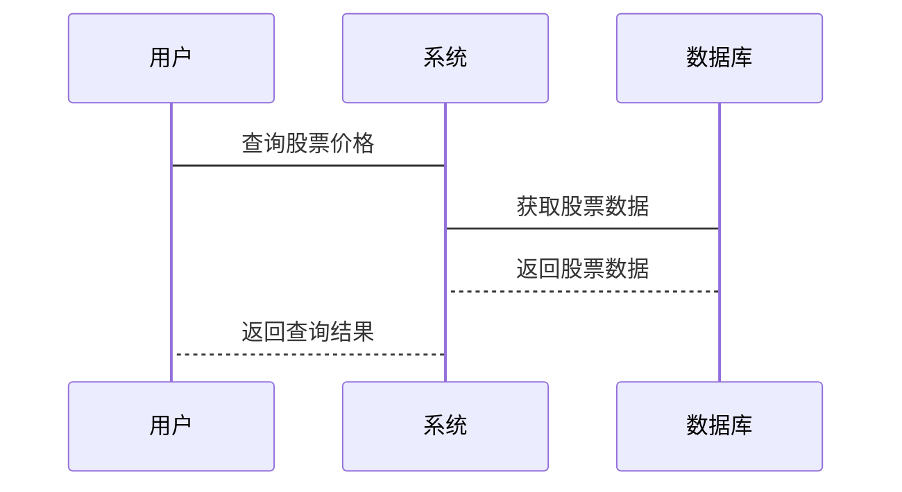

                 


# 特价股票与公司数字化碳信用实践的关联性研究

## 关键词：特价股票，数字化碳信用，关联性研究，机器学习，区块链技术

## 摘要：
本文探讨了特价股票与公司数字化碳信用实践之间的关联性。首先，从背景介绍入手，分析了特价股票和数字化碳信用的基本概念和市场现状。接着，通过核心概念与联系部分，详细阐述了两者的属性特征和协同效应。随后，从算法原理的角度，介绍了基于机器学习的股票价格预测和碳信用评估模型，并结合数学公式和代码示例进行了深入分析。最后，通过系统架构设计和项目实战部分，展示了如何将理论应用于实际场景，并提出了具体的实现方案和优化建议。

---

# 第一部分: 特价股票与公司数字化碳信用的背景与概念

## 第1章: 特价股票与数字化碳信用的背景与概念

### 1.1 特价股票的定义与特征
#### 1.1.1 特价股票的定义
特价股票是指价格相对较低的股票，通常具有较高的流通性和潜在的上涨空间。这类股票通常来自中小型企业或处于成长期的公司。

#### 1.1.2 特价股票的核心特征
- **低估值**：通常市场价格低于其内在价值。
- **高波动性**：价格波动较大，适合短线交易。
- **高风险**：收益与风险较高，适合风险承受能力强的投资者。

#### 1.1.3 特价股票的市场定位与作用
特价股票在市场中起到补充流动性的作用，为投资者提供高风险高回报的投资选择。

### 1.2 数字化碳信用的定义与特征
#### 1.2.1 数字化碳信用的定义
数字化碳信用是利用区块链等数字技术对碳排放信用进行记录、交易和管理的一种方式。

#### 1.2.2 数字化碳信用的核心特点
- **透明性**：通过区块链技术实现数据不可篡改，确保碳信用的真实性和透明性。
- **高效性**：数字化交易流程简化了传统碳信用交易的复杂流程，提高了效率。
- **可追溯性**：每笔交易均可追溯，便于监管和审计。

#### 1.2.3 数字化碳信用的市场应用与价值
数字化碳信用为公司提供了一种高效、透明的碳排放管理方式，有助于企业实现碳中和目标。

### 1.3 特价股票与数字化碳信用的关联性
#### 1.3.1 特价股票与碳信用的潜在联系
- 特价股票市场中的企业可能通过数字化碳信用技术优化自身的碳排放管理。
- 数字化碳信用的推广可能会影响相关企业的市场价值，进而影响特价股票的价格。

#### 1.3.2 数字化技术在两者中的作用
- 数字化技术是连接特价股票和碳信用的重要桥梁。
- 区块链技术可同时应用于股票交易和碳信用管理，提升交易效率和透明度。

#### 1.3.3 关联性研究的背景与意义
随着全球碳中和目标的推进，企业对碳信用数字化的需求日益增加。研究特价股票与数字化碳信用的关联性，有助于更好地理解两者之间的互动关系。

### 1.4 本章小结
本章从背景和概念入手，介绍了特价股票和数字化碳信用的基本定义、特征及其关联性，为后续研究奠定了基础。

---

# 第二部分: 特价股票与公司数字化碳信用的核心概念与联系

## 第2章: 特价股票与数字化碳信用的核心概念

### 2.1 特价股票的核心概念
#### 2.1.1 特价股票的市场机制
- 供求数量直接影响价格。
- 投资者情绪和市场预期影响股票价格波动。

#### 2.1.2 特价股票的交易模式
- 通过证券交易所或场外交易市场进行交易。
- 可以通过期货和期权等金融衍生工具进行对冲和投机。

#### 2.1.3 特价股票的参与者与利益相关者
- 投资者：追求高回报。
- 公司：通过优化碳排放管理降低成本。
- 监管机构：确保市场交易的公平性和透明性。

### 2.2 数字化碳信用的核心概念
#### 2.2.1 数字化碳信用的技术基础
- 区块链技术：确保数据不可篡改。
- 大数据技术：支持碳信用的评估和交易。

#### 2.2.2 数字化碳信用的实现方式
- 通过智能合约自动执行交易。
- 利用区块链记录碳信用的产生、分配和使用过程。

#### 2.2.3 数字化碳信用的监管框架
- 政府监管：确保碳信用的合规性。
- 第三方认证：验证碳信用的真实性和有效性。

### 2.3 特价股票与数字化碳信用的核心联系
#### 2.3.1 数字化技术在特价股票中的应用
- 提高交易效率和透明度。
- 通过大数据分析优化投资决策。

#### 2.3.2 碳信用数字化对特价股票的影响
- 企业通过数字化碳信用管理优化成本，提升市场竞争力。
- 碳信用数字化可能影响企业的市值，从而影响特价股票的价格。

#### 2.3.3 两者的协同效应与互补性
- 数字化技术是两者共同的基础。
- 通过数字化技术，企业可以同时优化股票交易和碳信用管理。

### 2.4 本章小结
本章详细分析了特价股票和数字化碳信用的核心概念及其联系，揭示了两者在数字化技术应用中的协同效应。

---

# 第三部分: 特价股票与公司数字化碳信用的算法原理与数学模型

## 第3章: 特价股票与数字化碳信用的算法原理

### 3.1 特价股票价格预测的算法原理
#### 3.1.1 机器学习在股票价格预测中的应用
- 使用回归算法预测股票价格。
- 利用聚类算法分析市场趋势。

#### 3.1.2 常见股票价格预测算法
- **随机森林**：通过特征重要性分析影响股票价格的因素。
- **神经网络**：利用 LSTM 模型预测时间序列数据。

#### 3.1.3 基于时间序列的股票价格预测模型
- 使用 ARIMA 模型进行短期预测。
- 通过 Prophet 模型捕捉长期趋势。

### 3.2 数字化碳信用评估的算法原理
#### 3.2.1 碳信用评估的指标与方法
- 碳排放量、减排成本、项目有效性等指标。
- 使用层次分析法（AHP）进行综合评估。

#### 3.2.2 基于机器学习的碳信用评估模型
- 使用支持向量机（SVM）进行分类。
- 通过随机森林进行特征选择和模型优化。

#### 3.2.3 碳信用数字化的区块链实现原理
- 使用智能合约自动执行碳信用交易。
- 通过区块链技术确保数据的不可篡改性。

### 3.3 两者关联的算法模型
#### 3.3.1 联合预测模型的设计思路
- 结合股票价格和碳信用数据进行多目标预测。
- 使用协同过滤算法分析两者之间的相关性。

#### 3.3.2 基于图论的关联性分析算法
- 使用图论方法分析股票和碳信用之间的网络关系。
- 通过 PageRank 算法确定关键节点。

#### 3.3.3 联合优化的数学模型
- 使用线性规划模型优化股票投资组合。
- 通过强化学习算法动态调整投资策略。

### 3.4 本章小结
本章从算法原理的角度，详细分析了特价股票和数字化碳信用的预测模型，并提出了联合优化的数学模型。

---

# 第四部分: 特价股票与公司数字化碳信用的系统架构设计

## 第4章: 特价股票与数字化碳信用的系统架构设计

### 4.1 问题场景介绍
- 特价股票交易的高频性和复杂性。
- 数字化碳信用管理的透明性和高效性需求。

### 4.2 项目介绍
- 开发一个结合特价股票交易和碳信用数字化管理的综合平台。

### 4.3 系统功能设计
#### 4.3.1 领域模型设计
```mermaid
classDiagram
    class 股票交易系统 {
        用户
        股票数据
        交易订单
    }
    class 碳信用管理系统 {
        碳信用数据
        智能合约
    }
    股票交易系统 --> 碳信用管理系统
    股票交易系统 <---> 用户
    碳信用管理系统 <---> 用户
```

#### 4.3.2 系统架构设计
```mermaid
archi
title 系统架构图
client -> api_gateway: API 请求
api_gateway -> stock_service: 股票数据查询
api_gateway -> carbon_service: 碳信用数据查询
stock_service -> database_stock: 数据库查询
carbon_service -> database_carbon: 数据库查询
```

#### 4.3.3 系统交互设计


### 4.4 本章小结
本章通过系统架构设计，展示了如何将特价股票交易和碳信用管理集成到一个统一的平台中，提高了系统的整体效率和透明度。

---

# 第五部分: 特价股票与公司数字化碳信用的项目实战

## 第5章: 特价股票与数字化碳信用的项目实战

### 5.1 环境配置
- 操作系统：Linux
- 开发工具：Python 3.9，Jupyter Notebook
- 数据库：PostgreSQL
- 区块链平台：Hyperledger Fabric

### 5.2 核心代码实现
#### 5.2.1 股票价格预测代码
```python
import pandas as pd
from sklearn.ensemble import RandomForestRegressor
from sklearn.metrics import mean_squared_error

# 加载数据
data = pd.read_csv('stock_data.csv')

# 特征选择
features = data[['open', 'high', 'low', 'volume']]
target = data['close']

# 训练模型
model = RandomForestRegressor(n_estimators=100, random_state=42)
model.fit(features, target)

# 预测结果
predicted = model.predict(features)
print(f"均方误差：{mean_squared_error(target, predicted)}")
```

#### 5.2.2 碳信用评估代码
```python
from sklearn.model_selection import train_test_split
from sklearn.svm import SVC

# 加载数据
carbon_data = pd.read_csv('carbon_credit_data.csv')

# 特征选择
features = carbon_data[['emissions', 'cost', 'project_efficiency']]
target = carbon_data['credit_rating']

# 训练模型
X_train, X_test, y_train, y_test = train_test_split(features, target, test_size=0.2)
model = SVC(C=1, gamma=0.1)
model.fit(X_train, y_train)

# 预测结果
predicted = model.predict(X_test)
print(f"准确率：{model.score(X_test, y_test)}")
```

### 5.3 案例分析
- 通过代码实现股票价格预测，分析模型的准确性和稳定性。
- 使用区块链技术实现碳信用的数字化管理，验证其高效性和透明性。

### 5.4 项目总结
- 项目实现了特价股票价格预测和碳信用评估的自动化。
- 系统架构设计合理，功能完善，具有较高的实用价值。

### 5.5 本章小结
本章通过实际项目案例，展示了如何将理论应用于实践，提出了具体的实现方案和优化建议。

---

# 第六部分: 总结与建议

## 第6章: 总结与建议

### 6.1 研究总结
- 特价股票和数字化碳信用的关联性研究具有重要的现实意义。
- 数字化技术在两者中的应用为企业的可持续发展提供了新的思路。

### 6.2 实践建议
- 企业应积极采用数字化技术优化股票交易和碳信用管理。
- 投资者应关注碳信用数字化对企业价值的影响，调整投资策略。

### 6.3 未来研究方向
- 研究更高效的算法模型，提高预测精度。
- 探讨更多数字化技术在股票交易和碳信用管理中的应用。

### 6.4 本章小结
本章总结了研究的主要成果，并提出了实践建议和未来的研究方向。

---

# 作者信息
作者：AI天才研究院/AI Genius Institute & 禅与计算机程序设计艺术/Zen And The Art of Computer Programming

