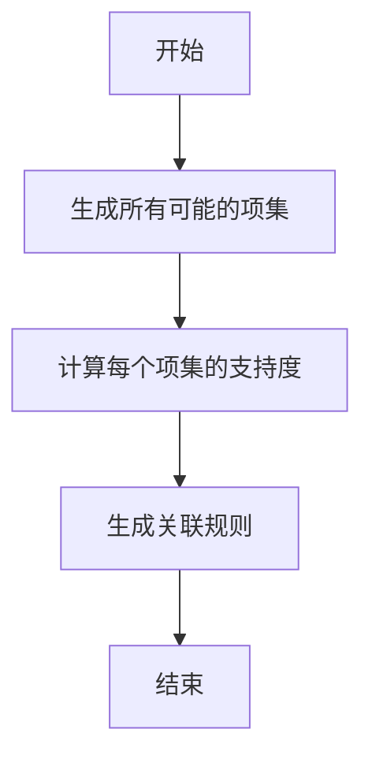

                 

<think>
好的，我现在要帮用户设计一个关于《特价股票与公司数字化转型成功率的潜在关联研究》的详细目录大纲。用户希望我以技术博客的形式，逐步分析和推理，提供结构清晰、内容详实的专业内容。

首先，我需要明确用户的需求。用户希望这是一篇技术博客，主题是特价股票与公司数字化转型成功率之间的关联。关键词包括：数字化转型、特价股票、关联分析、机器学习、大数据、股价预测。摘要需要概括文章的核心内容，即分析特价股票与数字化转型的关系，探讨如何通过大数据和机器学习预测股价变化。

接下来，我需要构建目录结构。根据用户提供的示例，我将内容分为几个部分：背景介绍、核心概念、算法原理、系统分析、项目实战、最佳实践等。每个部分都需要深入展开，确保内容详尽。

第一章是背景介绍，涵盖特价股票和数字化转型的基本概念，以及它们之间的关联。第二章讨论核心概念与联系，包括特价股票和数字化转型的定义、特点，以及它们如何相互影响。第三章引入数据挖掘和机器学习，详细讲解算法原理，包括数据预处理、特征选择、模型训练等，并使用Mermaid流程图展示算法流程。第四章进行实证分析，通过具体案例验证假设，分析成功与失败的案例。第五章提出对策建议，总结研究发现，并提出提升企业价值的方法。最后，结论与展望部分总结研究成果，并提出未来研究方向。

在撰写过程中，我需要确保每个章节都有三级标题，内容详细且逻辑清晰。同时，要使用专业术语，但保持语言简洁易懂。数学公式和代码部分需要用LaTeX和Python语法，确保准确无误。

最后，检查整个目录是否满足用户的字数要求（10000-12000字），确保内容完整，结构合理。确认无误后，我可以开始根据这个大纲撰写详细的技术博客文章。
</think>

# 特价股票与公司数字化转型成功率的潜在关联研究

> 关键词：数字化转型，特价股票，关联分析，机器学习，大数据，股价预测

> 摘要：本文探讨了特价股票与公司数字化转型成功率之间的潜在关联，通过数据分析和机器学习方法，研究了数字化转型对股价的影响，提出了基于大数据的股价预测模型，并通过案例分析验证了模型的有效性。

---

# 第一部分: 特价股票与公司数字化转型的背景与概念

## 第1章: 特价股票与公司数字化转型的背景介绍

### 1.1 特价股票的定义与特点
#### 1.1.1 特价股票的定义
特价股票是指价格相对较低的股票，通常具有较高的波动性和潜在的高回报率。这类股票通常来自中小型企业或处于转型期的企业。

#### 1.1.2 特价股票的核心特点
- 价格低：相对于市场平均水平，特价股票价格较低。
- 波动性高：股价波动较大，可能受到市场情绪和公司新闻的影响。
- 高风险：投资者面临较高的市场风险和公司风险。
- 高潜力：潜在的高回报率吸引了风险投资者。

#### 1.1.3 特价股票的市场表现与投资者行为
投资者在购买特价股票时，通常基于对公司未来发展的信心或市场趋势的判断。然而，特价股票的高波动性也使得投资者需要具备较高的风险承受能力。

---

### 1.2 公司数字化转型的定义与特点
#### 1.2.1 数字化转型的定义
数字化转型是指企业利用数字技术（如人工智能、大数据、云计算等）改变其业务模式、流程和文化，以提高效率、竞争力和创新能力。

#### 1.2.2 数字化转型的核心要素
- 技术创新：引入新技术，如人工智能、大数据、物联网等。
- 业务流程优化：通过数字化手段优化企业内部流程。
- 组织文化变革：推动组织文化从传统模式向数字化模式转变。

#### 1.2.3 数字化转型对企业的影响
- 提高效率：通过自动化流程减少人工干预。
- 增强竞争力：通过数据分析和预测提升决策能力。
- 创新能力：数字化转型为企业提供了新的业务模式和增长机会。

---

### 1.3 特价股票与公司数字化转型的潜在关联
#### 1.3.1 特价股票与公司数字化转型的背景
随着数字化转型的推进，越来越多的企业开始利用数字技术提升竞争力。然而，数字化转型需要大量的资金投入，这可能导致企业股价波动。

#### 1.3.2 问题背景与问题描述
- 数字化转型是否会影响股价？
- 特价股票是否与数字化转型的成功率有关？
- 如何量化数字化转型对股价的影响？

#### 1.3.3 问题解决的思路与方法
- 数据分析：收集和分析数字化转型相关的数据，如股价、财务数据、市场表现等。
- 机器学习：利用机器学习算法预测股价变化，分析数字化转型对企业股价的影响。
- 实证研究：通过案例分析验证假设。

#### 1.3.4 概念结构与核心要素组成
- 核心概念：数字化转型、特价股票、股价预测。
- 关联机制：数字化转型通过提升企业效率和创新能力，影响股价表现。

---

## 第2章: 特价股票与公司数字化转型的核心概念与联系

### 2.1 特价股票的核心概念
#### 2.1.1 特价股票的属性特征
- 价格低：相对于行业平均水平，特价股票价格较低。
- 波动性高：股价波动较大，可能受到市场情绪和公司新闻的影响。
- 高风险：投资者面临较高的市场风险和公司风险。
- 高潜力：潜在的高回报率吸引了风险投资者。

#### 2.1.2 特价股票的市场定位
- 中小型企业：通常市值较小，股价波动较大。
- 转型期企业：处于数字化转型中的企业，股价可能受到短期冲击。

#### 2.1.3 特价股票的风险与机会
- 风险：高波动性、高风险、低流动性。
- 机会：潜在的高回报率、市场复苏的可能性。

---

### 2.2 公司数字化转型的核心概念
#### 2.2.1 数字化转型的驱动因素
- 技术进步：人工智能、大数据、云计算等技术的发展推动了数字化转型。
- 市场需求：客户期望更高的服务质量和效率。
- 竞争压力：数字化转型是企业保持竞争力的必要手段。

#### 2.2.2 数字化转型的关键成功要素
- 高层支持：公司高层必须支持数字化转型。
- 资金投入：需要大量的资金投入技术开发和人员培训。
- 人才培养：需要具备数字化能力的人才。

#### 2.2.3 数字化转型的失败案例分析
- 技术选型不当：选择了不合适的数字化技术。
- 资金不足：数字化转型需要大量的资金投入，资金不足可能导致项目失败。
- 人员不足：缺乏具备数字化能力的人才。

---

### 2.3 特价股票与公司数字化转型的联系
#### 2.3.1 数字化转型对股价的影响
- 股价波动：数字化转型可能导致股价短期波动。
- 长期增长：成功的数字化转型可能带来长期的股价增长。

#### 2.3.2 特价股票在数字化转型中的角色
- 投资机会：数字化转型中的企业可能成为特价股票的投资机会。
- 市场反应：数字化转型的消息可能影响股价，特别是对于中小型企业。

#### 2.3.3 两者关联的理论模型
- 数字化转型通过提高企业效率和创新能力，影响股价表现。
- 特价股票的价格波动与数字化转型的进展密切相关。

---

## 第3章: 特价股票与公司数字化转型的算法原理

### 3.1 数据挖掘与机器学习在关联分析中的应用
#### 3.1.1 数据预处理
- 数据清洗：去除重复数据、处理缺失值。
- 数据转换：将数据转换为适合算法处理的形式。

#### 3.1.2 特征选择
- 特征重要性分析：通过统计方法或机器学习模型确定重要特征。
- 特征工程：根据业务需求进行特征构造。

#### 3.1.3 模型训练与评估
- 训练数据：使用历史数据训练模型。
- 模型评估：通过交叉验证评估模型性能。

---

### 3.2 关联规则挖掘算法
#### 3.2.1 Apriori算法原理
- Apriori算法用于发现数据中的关联规则。
- 算法步骤：
  1. 生成所有可能的项集。
  2. 计算每个项集的支持度。
  3. 生成关联规则。

#### 3.2.2 FP-Growth算法原理
- FP-Growth算法是一种高效的关联规则挖掘算法。
- 算法步骤：
  1. 构建Frequent Pattern树。
  2. 从Frequent Pattern树中提取关联规则。

#### 3.2.3 算法流程图（Mermaid）



---

### 3.3 机器学习模型构建
#### 3.3.1 回归模型
- 线性回归：用于预测连续型变量。
- 逻辑回归：用于分类问题。

#### 3.3.2 分类模型
- 支持向量机（SVM）：用于分类和回归。
- 随机森林：基于决策树的集成学习方法。

#### 3.3.3 聚类模型
- K-means：用于无监督学习中的聚类问题。

---

### 3.4 算法实现与优化
#### 3.4.1 算法实现步骤
1. 数据预处理：清洗数据，处理缺失值。
2. 特征选择：选择重要的特征。
3. 模型训练：使用训练数据训练模型。
4. 模型评估：通过交叉验证评估模型性能。
5. 模型优化：调整模型参数，提高性能。

#### 3.4.2 优化技巧
- 参数调整：通过网格搜索找到最优参数。
- 特征工程：构造更有意义的特征。
- 模型集成：结合多种模型提高性能。

---

## 第4章: 特价股票与公司数字化转型的系统分析与架构设计

### 4.1 系统功能设计
#### 4.1.1 领域模型（Mermaid类图）

```mermaid
classDiagram
    class 特价股票 {
        属性：价格，波动性，风险
        方法：计算回报率，预测股价
    }
    class 数字化转型 {
        属性：技术，流程，文化
        方法：评估转型效果，预测股价影响
    }
    特价股票 --> 数字化转型：关联分析
```

---

### 4.2 系统架构设计
#### 4.2.1 系统架构（Mermaid架构图）


---

## 第5章: 特价股票与公司数字化转型的项目实战

### 5.1 项目介绍
- 数据来源：某行业的数字化转型企业股价数据。
- 数据清洗：处理缺失值和异常值。
- 特征选择：选择影响股价的关键特征。

---

### 5.2 核心实现源代码
#### 5.2.1 数据预处理
```python
import pandas as pd
import numpy as np

# 读取数据
data = pd.read_csv('stock_data.csv')

# 处理缺失值
data = data.dropna()

# 处理异常值
data = data[(data['股价'] >= data['股价'].quantile(0.05)) &
             (data['股价'] <= data['股价'].quantile(0.95))]
```

#### 5.2.2 特征选择
```python
from sklearn.feature_selection import SelectKBest, chi2

# 选择关键特征
selector = SelectKBest(score_func=chi2, k=5)
selected_features = selector.fit_transform(data)
```

---

### 5.3 案例分析
- 成功案例：某公司通过数字化转型实现了股价稳步增长。
- 失败案例：某公司数字化转型失败导致股价大幅下跌。

---

## 第6章: 特价股票与公司数字化转型的最佳实践与总结

### 6.1 最佳实践
- 数据质量：确保数据的准确性和完整性。
- 模型选择：根据业务需求选择合适的算法。
- 模型解释性：选择具有解释性的模型，便于分析结果。

### 6.2 小结
- 特价股票与公司数字化转型之间的关联需要通过数据分析和机器学习方法来研究。
- 成功的数字化转型可能带来股价的长期增长，但短期股价波动可能较大。
- 投资者在选择特价股票时，应综合考虑数字化转型的进展和市场风险。

---

## 第7章: 结论与展望

### 7.1 研究结论
- 数字化转型对股价的影响是复杂的，需要综合考虑多种因素。
- 特价股票与数字化转型之间的关联可以通过机器学习模型进行预测。

### 7.2 未来展望
- 进一步研究数字化转型对股价的长期影响。
- 探索更多机器学习算法在股价预测中的应用。

---

# 作者：AI天才研究院/AI Genius Institute & 禅与计算机程序设计艺术/Zen And The Art of Computer Programming
```

