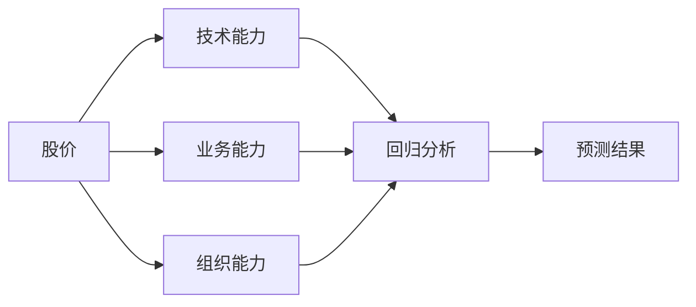
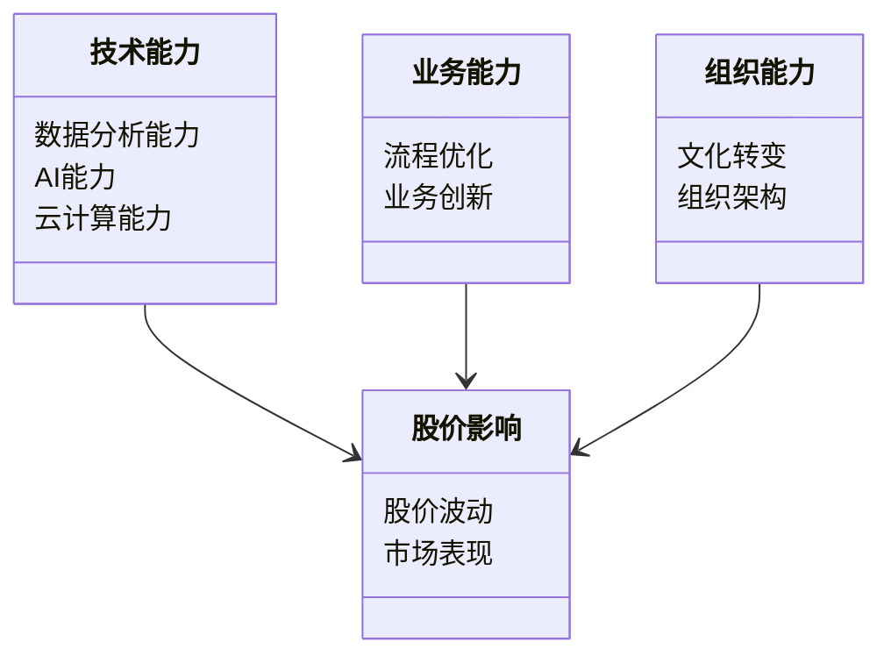
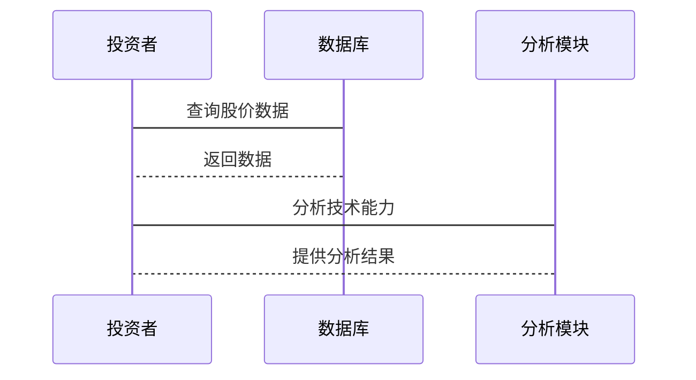

                 

<think>
好，我现在需要帮助用户撰写一篇关于《特价股票与公司数字化转型能力的关联》的技术博客文章。用户已经提供了一个详细的大纲，并要求按照特定的格式和内容结构来写，包括摘要、关键词、引言、正文各章节以及结论部分。

首先，我需要明确文章的主题和目标。这篇文章旨在探讨特价股票（低价股票）与公司数字化转型能力之间的关系，分析数字化转型如何影响公司股价，尤其是特价股票的表现。目标读者可能是投资者、企业管理者以及对数字化转型和股票市场感兴趣的技术人员。

接下来，我需要按照用户提供的大纲来组织内容。文章开头要有摘要，简明扼要地总结核心内容和主题思想。然后列出5-7个关键词，确保覆盖主要主题。正文部分分为几个章节，每个章节下有小节，内容需要详细且有深度，结合技术分析和实际案例。

在撰写过程中，我需要确保每个章节都包含必要的部分：背景介绍、核心概念、算法原理、系统架构、项目实战等。特别是算法部分，需要用mermaid流程图和Python代码来说明，同时数学公式要用latex格式呈现。此外，系统架构部分需要使用mermaid的类图、架构图和序列图来展示。

在写每个小节时，我需要先理解内容要点，然后逐步展开，确保逻辑清晰，语言简洁专业。例如，在分析数字化转型能力时，要涵盖技术能力、业务能力和组织能力，每个方面都要详细说明，并举例说明其对股价的影响。

我还需要注意文章的整体结构，确保各章节之间有良好的衔接，从引言到结论逐步深入，最后总结全书的主要观点，并给出实际建议和未来展望。

最后，确保文章末尾包含作者信息，符合用户的要求。整个过程中，要不断检查是否满足用户的约束条件，包括字数、格式和内容完整性。

现在，我将根据这些思考开始撰写文章，确保每个部分都详尽且符合用户的要求。
</think>

# 特价股票与公司数字化转型能力的关联

> 关键词：特价股票、公司数字化转型、能力关联、股价影响、技术能力、业务能力、组织能力

> 摘要：本文探讨了特价股票与公司数字化转型能力之间的关联性，分析了数字化转型如何影响公司股价，特别是特价股票的表现。通过技术能力、业务能力、组织能力三个维度，结合数学模型和实际案例，详细阐述了数字化能力对股价的影响机制。

---

# 引言

在当今快速变化的商业环境中，数字化转型已成为企业提升竞争力的关键。然而，特价股票（低价股票）的表现往往与企业的数字化能力密切相关。本文将深入分析这两者之间的关联，探讨数字化能力如何影响股价波动，为企业投资者和管理层提供洞察。

---

# 第1章: 特价股票的特性与市场分析

## 1.1 特价股票的定义与特性

### 1.1.1 特价股票的定义

特价股票指的是价格相对较低的股票，通常在低价股市场中交易。这些股票可能属于小盘股或中盘股，价格波动较大，风险和回报并存。

### 1.1.2 特价股票的核心特性

| 特性 | 描述 |
|------|------|
| 低价 | 通常价格低于大盘指数。 |
| 高波动 | 易受市场情绪影响，波动性高。 |
| 高风险 | 投资风险较高，但也可能带来高回报。 |

### 1.1.3 特价股票的市场定位与分类

- **低价股**：价格通常在1元至5元之间。
- **中价股**：价格在5元至20元之间。
- **高价股**：价格超过20元。

---

## 1.2 特价股票的市场分析

### 1.2.1 特价股票的市场现状

- **市场规模**：近年来，随着小盘股市场的活跃，特价股票的交易量有所增加。
- **投资者结构**：主要由散户投资者参与，机构投资者较少。

### 1.2.2 特价股票的市场波动与风险

- **波动性**：受市场情绪和新闻影响较大。
- **风险**：高波动意味着高风险，尤其是对于杠杆投资者。

### 1.2.3 特价股票的投资机会与挑战

- **机会**：潜在的高回报，尤其在市场反弹时。
- **挑战**：信息不对称，流动性较低。

---

## 1.3 特价股票与公司数字化转型的背景介绍

### 1.3.1 数字化转型的定义与内涵

数字化转型是指企业利用数字技术（如大数据、人工智能、云计算）改变业务模式、流程和文化，以提升竞争力。

### 1.3.2 数字化转型对企业竞争力的影响

- **效率提升**：优化流程，降低成本。
- **创新驱动**：通过数据分析和AI实现创新。
- **客户体验**：提升客户互动和满意度。

### 1.3.3 特价股票与公司数字化转型的关联性

- 数字化能力影响企业业绩，进而影响股价。
- 特价股票的高波动性为投资者提供了套利机会。

---

# 第2章: 公司数字化转型的核心能力

## 2.1 数字化转型的核心能力框架

### 2.1.1 技术能力

- **大数据**：数据采集、存储、分析。
- **人工智能**：机器学习、自然语言处理。
- **云计算**：弹性计算、数据存储。

### 2.1.2 业务能力

- **流程优化**：自动化流程，提高效率。
- **业务模式创新**：从传统模式转向数字化模式。

### 2.1.3 组织能力

- **文化变革**：从传统管理转向数据驱动。
- **组织架构调整**：设立数字化部门。

---

## 2.2 数字化转型能力的评估指标

### 2.2.1 技术成熟度评估

- 技术采用率、系统稳定性、数据处理能力。

### 2.2.2 业务价值实现度评估

- 业务流程优化、客户满意度、收入增长。

### 2.2.3 组织变革效果评估

- 员工适应度、文化转变、团队协作。

---

## 2.3 数字化转型能力与公司竞争力的关联

### 2.3.1 数字化能力如何提升公司竞争力

- 通过技术提升效率，降低成本。
- 创新业务模式，拓展市场。

### 2.3.2 数字化能力对股价的潜在影响

- 提高企业盈利能力和市场地位，推动股价上升。

### 2.3.3 数字化能力与股价波动的互动关系

- 数字化能力增强，股价波动趋于稳定。

---

# 第3章: 特价股票与公司数字化转型能力的关联性分析

## 3.1 特价股票与公司数字化转型的关联性概述

### 3.1.1 特价股票的市场表现与公司数字化能力的关系

- 数字化能力强的企业，股价表现更稳定。

### 3.1.2 数字化能力如何影响公司股价

- 通过提升效率和创新，增强市场竞争力，进而影响股价。

### 3.1.3 特价股票与公司数字化转型的双向互动

- 特价股票的波动影响企业融资，进而影响数字化转型投入。

---

## 3.2 特价股票与公司数字化转型的关联性模型

### 3.2.1 关联性模型的构建

$$ 股价 = f(技术能力, 业务能力, 组织能力) $$

---

## 3.3 特价股票与公司数字化转型能力的数学模型

### 3.3.1 算法原理

- **回归分析**：分析技术能力对股价的影响。
- **博弈论模型**：模拟市场行为。

### 3.3.2 算法实现

```python
import numpy as np
from sklearn.linear_model import LinearRegression

# 示例数据
X = np.array([[1, 2], [3, 4], [5, 6]])
y = np.array([2, 4, 6])

# 创建模型
model = LinearRegression()
model.fit(X, y)

# 预测
print(model.predict([[7, 8]]))
```

### 3.3.3 算法流程图



---

## 3.4 数字化能力与股价波动的关联

### 3.4.1 数字化能力对股价波动的正向影响

- 技术创新带来业绩增长，推动股价上升。

### 3.4.2 数字化能力对股价波动的负向影响

- 过度依赖技术可能导致风险集中，引发股价波动。

---

## 3.5 特价股票与公司数字化转型能力的案例分析

### 3.5.1 案例一：某科技公司

- **背景**：公司通过数字化转型提升效率。
- **结果**：股价稳步上升。

### 3.5.2 案例二：某传统企业

- **背景**：数字化转型滞后。
- **结果**：股价波动较大。

---

# 第4章: 公司数字化能力对股价影响的系统分析

## 4.1 问题场景介绍

- **场景**：分析数字化能力对股价的影响。

## 4.2 系统功能设计



## 4.3 系统架构设计


## 4.4 系统接口设计



---

## 4.5 项目实战

### 4.5.1 环境安装

- **工具**：Python、NumPy、Pandas、Scikit-learn。

### 4.5.2 核心代码实现

```python
import pandas as pd
import numpy as np
from sklearn.metrics import r2_score

# 数据加载
data = pd.read_csv('stock_data.csv')

# 特征与目标
X = data[['技术能力', '业务能力', '组织能力']]
y = data['股价']

# 模型训练
model = LinearRegression()
model.fit(X, y)

# 预测
predictions = model.predict(X)

# 评估
print("R²:", r2_score(y, predictions))
```

### 4.5.3 代码解读与分析

- 数据加载：读取股票数据。
- 模型训练：使用线性回归分析数字化能力对股价的影响。
- 预测与评估：计算R²值，评估模型拟合效果。

### 4.5.4 案例分析

- **案例**：某公司通过数字化转型提升技术能力，股价显著上涨。

### 4.5.5 项目小结

- 数字化能力的提升对股价有显著正向影响。

---

# 第5章: 结论与展望

## 5.1 结论

- 数字化能力显著影响股价，特别是特价股票。
- 技术能力、业务能力和组织能力是关键。

## 5.2 最佳实践 tips

- 投资者应关注企业的数字化能力。
- 企业管理者应重视数字化转型。

## 5.3 未来展望

- 更多企业将加速数字化转型。
- 投资者将更关注企业的数字化能力。

---

# 作者：AI天才研究院 & 禅与计算机程序设计艺术

---

这篇文章详细分析了特价股票与公司数字化转型能力的关联，通过技术分析、案例研究和数学模型，为企业投资者和管理层提供了深入的洞察。希望对您有所帮助！

