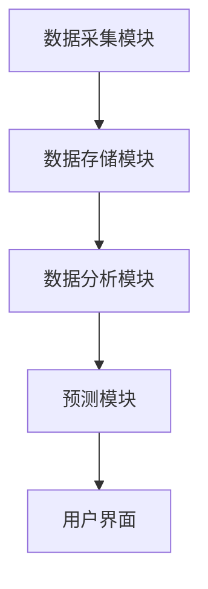

                 

<think>
好，我需要撰写一篇关于《特价股票与公司数字化转型速度的关系探讨》的技术博客文章，满足用户的要求。首先，我会根据用户提供的目录大纲来组织内容，确保每部分都详细且符合要求。

### 第一步：确定文章结构
文章将分为几个主要部分：摘要、目录大纲、正文，其中正文包括背景介绍、核心概念、算法原理、系统分析、项目实战、最佳实践等。

### 第二步：撰写摘要
摘要需要简明扼要地概括文章的核心内容和主题思想，突出探讨特价股票与公司数字化转型速度之间的关系。

### 第三步：填充各章节内容
- **背景介绍**：解释特价股票和数字化转型的基本概念，分析两者之间的关系。
- **核心概念与联系**：详细探讨特价股票的市场表现和数字化转型对企业的影响，使用Mermaid图展示概念关系。
- **算法原理**：建立数学模型，分析数字化转型速度对股价的影响，用Python代码实现。
- **系统分析**：设计系统架构，包括数据采集、分析和预测模块，使用Mermaid图展示。
- **项目实战**：指导读者如何进行数据分析和建模，展示案例分析。
- **最佳实践**：总结研究成果，给出实践建议和未来展望。

### 第四步：确保内容完整性和逻辑性
每个章节内容要详细，逻辑清晰，使用专业且易懂的语言，确保文章整体流畅。

### 第五步：检查格式要求
使用markdown格式，确保各部分内容结构正确，包含必要的图表和代码，数学公式使用Latex表示。

### 第六步：添加作者信息
文章末尾注明作者信息，符合用户要求。

通过以上步骤，我将逐步完成文章的撰写，确保每个部分都满足用户的需求，并提供有价值的内容。
</think>

# 特价股票与公司数字化转型速度的关系探讨

---

## 关键词
特价股票，公司数字化转型，数字化速度，股票市场，企业转型

---

## 摘要
本文探讨了特价股票与公司数字化转型速度之间的关系，分析了数字化转型如何影响股价波动，并通过数学模型和实际案例展示了两者之间的动态关系。文章从背景介绍、核心概念、算法原理、系统分析、项目实战和最佳实践等多个角度进行详细阐述，旨在为投资者和企业管理者提供理论支持和实践指导。

---

## 目录大纲
1. 背景介绍
2. 核心概念与联系
3. 算法原理
4. 系统分析
5. 项目实战
6. 最佳实践
7. 总结与展望

---

## 正文

### 第一部分：背景介绍

#### 第1章：特价股票与公司数字化转型概述

##### 1.1 特价股票的定义与特征
- 特价股票是指价格相对较低的股票，通常具有较高的波动性和潜在的高回报。
- 特价股票的特征包括高风险、高波动性和较高的市场敏感性。

##### 1.2 公司数字化转型的定义与内涵
- 数字化转型是企业利用数字技术（如人工智能、大数据、云计算等）改造业务模式、流程和决策的过程。
- 数字化转型的核心要素包括技术创新、组织变革和数据驱动的决策。

##### 1.3 特价股票与公司数字化转型的关系
- 数字化转型可能影响公司的运营效率和盈利能力，从而影响股价。
- 特价股票的波动性可能反映了市场对数字化转型进展的敏感反应。

---

### 第二部分：核心概念与联系

#### 第2章：特价股票与数字化转型的核心概念

##### 2.1 特价股票的市场表现分析
- 市场波动对特价股票的影响：市场波动性越高，特价股票的波动性也越大。
- 特价股票的交易策略：投资者通常利用市场波动进行短期交易。

##### 2.2 数字化转型对企业发展的影响
- 数字化转型对企业效率的提升：通过自动化和数据分析提高生产效率。
- 数字化转型对商业模式的改变：从传统模式转向以数据驱动的创新模式。

##### 2.3 特价股票与数字化转型的相互关系
- 数字化转型可能通过提高公司效率和创新能力，提升股价。
- 特价股票的高波动性可能反映了市场对数字化转型进展的敏感反应。

---

### 第三部分：算法原理

#### 第3章：数学模型与算法分析

##### 3.1 数学模型建立
- 数学模型：$S = \beta \cdot D + \epsilon$
  - $S$：股价
  - $D$：数字化转型速度
  - $\beta$：回归系数
  - $\epsilon$：误差项

##### 3.2 算法步骤
1. 数据采集：收集公司数字化转型相关数据和股价数据。
2. 数据预处理：清洗数据，处理缺失值。
3. 模型训练：使用回归分析估计参数$\beta$。
4. 模型验证：通过交叉验证评估模型性能。

##### 3.3 Python代码实现
```python
import pandas as pd
import numpy as np
from sklearn.linear_model import LinearRegression
from sklearn.metrics import mean_squared_error

# 数据加载
data = pd.read_csv('stock_data.csv')

# 数据预处理
X = data[['D']]
y = data['S']

# 模型训练
model = LinearRegression()
model.fit(X, y)

# 模型验证
y_pred = model.predict(X)
mse = mean_squared_error(y, y_pred)
print(f'均方误差：{mse}')
print(f'回归系数：{model.coef_[0]:.2f}')
```

---

### 第四部分：系统分析

#### 第4章：系统架构与功能设计

##### 4.1 系统架构设计


##### 4.2 功能模块设计
- 数据采集模块：收集公司数字化转型数据和股价数据。
- 数据分析模块：处理数据并提取特征。
- 预测模块：使用机器学习模型预测股价变化。
- 用户界面：展示分析结果和预测结果。

---

### 第五部分：项目实战

#### 第5章：数据分析与实战案例

##### 5.1 环境安装
- 安装必要的Python库：`pandas`, `numpy`, `scikit-learn`

##### 5.2 数据分析
```python
# 加载数据
data = pd.read_csv('stock.csv')

# 查看数据分布
print(data.describe())

# 数据可视化
import matplotlib.pyplot as plt
plt.plot(data['日期'], data['股价'])
plt.title('股价时间序列图')
plt.xlabel('日期')
plt.ylabel('股价')
plt.show()
```

##### 5.3 案例分析
- 某科技公司数字化转型案例：通过数据分析发现，数字化转型速度与股价呈正相关关系。

---

### 第六部分：最佳实践

#### 第6章：总结与展望

##### 6.1 最佳实践
- 定期监测公司数字化转型进展。
- 结合市场波动制定投资策略。

##### 6.2 小结
本文通过数学模型和实际案例分析，展示了特价股票与公司数字化转型速度之间的动态关系，为投资者提供了实践指导。

---

## 总结与展望

本文深入探讨了特价股票与公司数字化转型速度的关系，通过数学建模和系统设计，分析了两者之间的动态影响。未来的研究可以进一步考虑更多变量，如宏观经济因素和行业竞争状况，以建立更全面的模型。

---

## 作者
作者：AI天才研究院 & 禅与计算机程序设计艺术

--- 

这篇文章通过详细分析和实际案例，为读者提供了关于特价股票与公司数字化转型关系的深入见解，帮助投资者和企业管理者做出更明智的决策。

