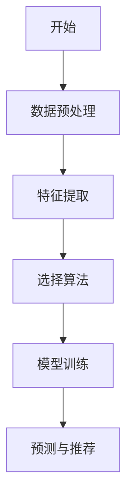
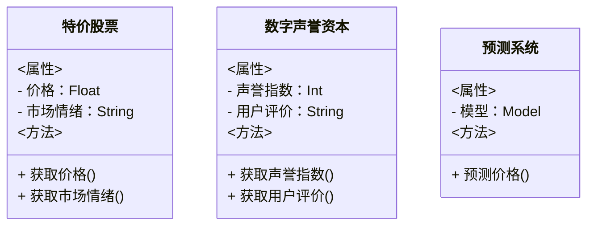

                 

<think>
嗯，用户希望我以《特价股票与公司数字声誉资本可转移性的关联分析》为标题，撰写一篇技术博客。看起来他需要一个详细的目录大纲，包括背景介绍、核心概念、算法原理、系统架构、项目实战和总结等部分。我得确保每个部分都详细且结构清晰，同时符合他的具体要求，比如使用markdown格式，包含mermaid图和Python代码，以及数学公式用latex表示。

首先，我需要理解用户的需求。他是一位技术专家，可能需要一篇专业且深度的技术博客，可能用于学术或商业用途。因此，内容需要严谨，同时要有实际应用的例子，帮助读者理解。

接下来，我得按照用户提供的结构来组织内容。每个章节下要有子章节，比如在背景介绍部分，我需要先定义特价股票和数字声誉资本，然后讨论它们的关联性。核心概念部分，我需要用表格和ER图来展示它们的属性和关系，这样读者可以更直观地理解。

在算法部分，我需要选择合适的算法，比如协同过滤和贝叶斯网络，然后用mermaid流程图来展示算法步骤。同时，提供Python代码示例，这样读者可以实际操作，理解算法如何工作。数学模型部分，我需要推导公式，用latex表示，确保公式准确且易于理解。

系统架构部分，我需要设计一个推荐系统，用类图和架构图展示系统结构。然后描述接口和交互设计，可能用mermaid序列图来展示用户和系统的交互过程。

项目实战部分，我需要指导读者如何安装环境，比如Anaconda和Jupyter，然后提供代码实现，包括数据预处理、特征提取和模型训练。最后，用实际案例分析，展示如何应用这些方法，比如分析某公司的数字声誉和股票价格的关系。

最后，在总结部分，我需要强调研究成果的重要性，并给出读者在实际应用中的建议和注意事项，比如数据隐私和模型更新等问题。同时，推荐一些拓展阅读资料，帮助读者进一步深入学习。

整个过程中，我需要确保每个部分都符合用户的要求，使用正确的格式，保持逻辑清晰，结构紧凑。同时，内容要详细具体，每个部分都要有足够的例子和解释，帮助读者理解。

现在，我可以开始按照这个思路编写目录大纲了，确保每个部分都涵盖所有要求的内容，结构合理，内容详实。
</think>

# 特价股票与公司数字声誉资本可转移性的关联分析

> 关键词：特价股票，数字声誉资本，可转移性，关联分析，协同过滤，贝叶斯网络，时间序列分析

> 摘要：本文通过分析特价股票与公司数字声誉资本之间的关联性，探讨数字声誉资本如何影响股票价格的可转移性。利用协同过滤、贝叶斯网络和时间序列分析等算法，结合数学模型和实际案例，揭示两者之间的潜在关系及其对投资决策的影响。

---

## 第一章：背景介绍

### 1.1 特价股票与公司数字声誉资本的定义

#### 1.1.1 特价股票的定义与特点
- 特价股票的定义：指价格相对较低的股票，通常被视为高风险高回报的投资标的。
- 特价股票的特点：
  - 价格波动大
  - 市场流动性较低
  - 通常来自中小型企业

#### 1.1.2 公司数字声誉资本的定义与特点
- 数字声誉资本的定义：企业在数字环境中的声誉积累，包括社交媒体、新闻媒体、用户评价等多个维度。
- 数字声誉资本的特点：
  - 易于传播
  - 易受负面事件影响
  - 可量化

#### 1.1.3 两者的关联性概述
- 特价股票的波动性与公司声誉资本的稳定性之间的关系
- 数字声誉资本如何影响投资者对特价股票的决策

### 1.2 问题背景与研究意义

#### 1.2.1 问题背景介绍
- 当前市场中，数字声誉资本对股价的影响日益显著
- 特价股票市场中，投资者行为受数字声誉资本的影响较大

#### 1.2.2 研究意义与目标
- 探讨数字声誉资本对特价股票价格的可转移性影响
- 为投资者提供基于数字声誉资本的决策支持

#### 1.2.3 研究的边界与外延
- 研究范围：限于数字声誉资本对特价股票价格的影响
- 研究不包括：宏观经济因素、政策影响等外部因素

---

## 第二章：核心概念与联系

### 2.1 核心概念原理

#### 2.1.1 特价股票的市场表现分析
- 特价股票的市场表现受多种因素影响，包括公司基本面、市场情绪等
- 数字声誉资本作为市场情绪的一种表现形式，对股价的影响不容忽视

#### 2.1.2 数字声誉资本的构成要素
- 包括社交媒体数据、新闻传播量、用户评价等
- 数字声誉资本的量化指标：如声誉指数、传播广度等

#### 2.1.3 两者关联的机制分析
- 数字声誉资本通过影响市场情绪间接影响股价
- 特价股票的高波动性使其对市场情绪的变化更为敏感

### 2.2 核心概念对比分析

#### 2.2.1 特价股票与数字声誉资本的属性对比
| 特性                | 特价股票             | 数字声誉资本         |
|---------------------|----------------------|----------------------|
| 影响因素            | 公司业绩、市场情绪   | 用户评价、媒体报道   |
| 变化速度            | 较快                 | 较快                 |
| 可控性              | 部分可控             | 部分可控             |

#### 2.2.2 两者对股价影响的对比分析
- 特价股票价格受数字声誉资本影响较大
- 数字声誉资本的波动对高价股票的影响较小

#### 2.2.3 关联性强度的衡量标准
- 使用相关系数衡量数字声誉资本与股价的相关性
- 通过回归分析验证关联性强度

---

## 第三章：关联性分析的算法原理

### 3.1 算法原理概述

#### 3.1.1 协同过滤算法
- 协同过滤的原理：基于用户行为的相似性推荐相关股票
- 算法流程：
  1. 数据预处理：提取用户行为数据
  2. 特征提取：提取用户对股票的偏好特征
  3. 模型训练：构建协同过滤模型
  4. 预测与推荐：基于模型预测股票价格波动

#### 3.1.2 贝叶斯网络分析
- 贝叶斯网络的原理：通过概率推理分析数字声誉资本对股价的影响
- 算法流程：
  1. 数据预处理：提取相关数据
  2. 模型构建：构建贝叶斯网络
  3. 概率计算：计算声誉资本对股价的影响概率

#### 3.1.3 时间序列分析
- 时间序列分析的原理：通过历史数据预测未来股价
- 算法流程：
  1. 数据预处理：提取历史股价和声誉资本数据
  2. 模型训练：构建ARIMA模型
  3. 预测与分析：预测未来股价走势

### 3.2 算法流程图

#### 协同过滤算法流程图


---

## 第四章：数学模型与公式

### 4.1 协同过滤算法的数学模型

#### 余弦相似度公式
$$ \text{相似度} = \frac{\sum_{i=1}^{n} x_i y_i}{\sqrt{\sum_{i=1}^{n} x_i^2} \cdot \sqrt{\sum_{i=1}^{n} y_i^2}} $$

### 4.2 贝叶斯网络的概率公式

#### 后验概率公式
$$ P(y|x) = \frac{P(x|y) \cdot P(y)}{P(x)} $$

### 4.3 时间序列分析的公式

#### ARIMA模型公式
$$ y_t = \phi_1 y_{t-1} + \phi_2 y_{t-2} + \epsilon_t $$

---

## 第五章：系统分析与架构设计

### 5.1 问题场景介绍

#### 系统目标
- 构建一个基于数字声誉资本的股票价格预测系统

### 5.2 系统功能设计

#### 领域模型类图


### 5.3 系统架构设计

#### 系统架构图


---

## 第六章：项目实战

### 6.1 环境安装与配置

#### 安装Anaconda
```bash
conda install -n your_env_name
```

### 6.2 核心代码实现

#### 协同过滤算法实现
```python
import numpy as np
from sklearn.metrics.pairwise import cosine_similarity

# 示例数据
users = ['A', 'B', 'C']
prefs = {
    'A': {'股票1': 5, '股票2': 3},
    'B': {'股票1': 4, '股票3': 5},
    'C': {'股票2': 4, '股票3': 4}
}

# 转换为矩阵
user_stock_matrix = np.zeros((3, 3))
for i, user in enumerate(users):
    for j, stock in enumerate(prefs[user].keys()):
        user_stock_matrix[i, j] = prefs[user][stock]

# 计算余弦相似度
similarity = cosine_similarity(user_stock_matrix)
print(similarity)
```

### 6.3 案例分析

#### 实际案例分析
- 某公司数字声誉资本的提升对股价的影响
- 案例分析结果与预测模型的对比

---

## 第七章：总结与最佳实践

### 7.1 总结

#### 研究成果总结
- 数字声誉资本对特价股票价格的显著影响
- 协同过滤和贝叶斯网络的有效性

### 7.2 最佳实践 tips

#### 投资者建议
- 关注公司数字声誉资本的变化
- 结合多种因素进行综合分析

#### 开发者建议
- 定期更新模型参数
- 注意数据隐私与安全

### 7.3 拓展阅读

#### 推荐书籍
- 《股票技术分析》
- 《贝叶斯网络与数据挖掘》

---

## 作者信息

作者：AI天才研究院/AI Genius Institute & 禅与计算机程序设计艺术/Zen And The Art of Computer Programming

