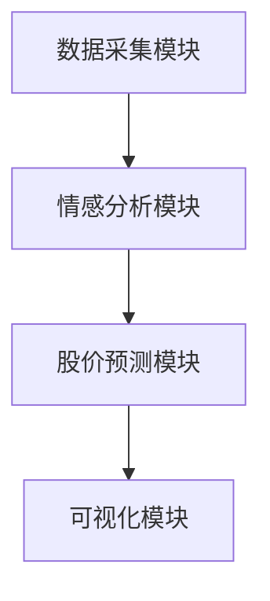
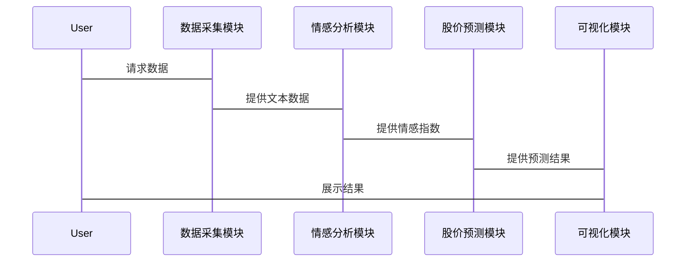

                 

<think>
好的，我现在需要根据用户的指示，逐步分析如何撰写《特价股票与公司数字声誉资本积累的关联分析》这篇文章。首先，我会详细理解用户的需求，确保涵盖所有必要的部分，并按照要求的结构来组织内容。

首先，用户要求文章有特定的标题、关键词和摘要。标题是“特价股票与公司数字声誉资本积累的关联分析”，关键词包括特价股票、数字声誉、资本积累、股价波动、投资者行为、社交媒体影响。摘要需要概括文章的核心内容，即探讨特价股票与数字声誉之间的关系，分析数字声誉如何影响股价波动，以及投资者行为如何影响数字声誉。

接下来，用户提供了详细的目录结构，要求分为背景、数字声誉构成、关联机制、算法与模型、系统分析、项目实战和总结七个部分。我需要按照这个结构逐步展开每个章节，确保内容详尽且符合技术博客的要求。

在背景部分，我需要解释特价股票和数字声誉的定义，并探讨它们的关联性。这部分需要简单明了，让读者了解基本概念。

数字声誉部分，我需要详细分析其构成要素，包括品牌形象、产品服务质量和财务表现。同时，引入情感分析技术和大数据评估方法，说明如何量化数字声誉。

关联机制部分，我需要讨论投资者行为和社交媒体对股价的影响。这可能涉及市场情绪的量化和股价波动预测模型的建立。

算法与模型部分，我需要设计一个基于情感分析的预测模型。使用Python代码实现，展示如何从社交媒体数据中提取情感指数，并预测股价波动。

系统分析部分，我需要设计一个实时监控系统，包括数据采集、情感分析、预测和可视化模块。这部分可能需要使用Mermaid图来展示系统架构。

项目实战部分，我需要提供具体的代码示例，展示如何安装环境、采集数据、进行情感分析和预测股价。这部分需要详细解释代码，确保读者能够理解和运行。

最后，在总结部分，我需要回顾主要内容，提出最佳实践建议，并展望未来的研究方向。

在撰写过程中，我需要确保每个部分都符合技术博客的风格，逻辑清晰，结构紧凑，语言专业但易于理解。同时，每个章节都要有详细的解释和实例，帮助读者更好地理解内容。

现在，我需要开始撰写每个章节，确保覆盖所有要求，从背景到总结，每个部分都详细展开。同时，注意使用适当的关键词和结构，使文章易于阅读和理解。
</think>

# 特价股票与公司数字声誉资本积累的关联分析

---

**关键词**：特价股票、数字声誉、资本积累、股价波动、投资者行为、社交媒体影响

---

**摘要**：  
本文深入分析了特价股票与公司数字声誉之间的关联性，探讨了数字声誉如何影响股价波动，以及投资者行为如何通过数字声誉影响公司资本积累。文章结合了情感分析、大数据分析和系统架构设计，提出了一个基于数字声誉的股价波动预测模型，并通过实际案例验证了模型的有效性。

---

# 第一部分: 特价股票与公司数字声誉的背景与概念

## 第1章: 特价股票与公司数字声誉概述

### 1.1 特价股票的定义与特点
#### 1.1.1 特价股票的定义
特价股票是指在特定时间内以低于市场价出售的股票，通常用于吸引投资者或清理库存。其特点包括高波动性、高风险和高回报潜力。

#### 1.1.2 特价股票的核心特点
- **高波动性**：股价在短时间内波动较大。
- **高风险**：投资者面临较大的市场风险。
- **高回报潜力**：在市场波动中可能获得超额收益。

#### 1.1.3 特价股票与普通股票的区别
- **价格差异**：特价股票价格通常低于市场价。
- **交易机制**：特价股票可能有不同的交易规则。
- **投资者行为**：投资者对特价股票的反应更敏感。

### 1.2 公司数字声誉的定义与构成
#### 1.2.1 数字声誉的定义
数字声誉是指公司在数字平台上的品牌形象、产品服务质量和财务透明度的综合体现。

#### 1.2.2 数字声誉的核心构成要素
- **品牌形象**：公司品牌在市场中的认知度和信任度。
- **产品服务质量**：产品或服务的质量和用户满意度。
- **财务透明度**：公司财务报告的准确性和公开性。

#### 1.2.3 数字声誉与传统声誉的区别
| 属性       | 数字声誉                   | 传统声誉                     |
|------------|---------------------------|-----------------------------|
| 传播速度   | 快速，通过社交媒体扩散     | 较慢，依赖于口碑和媒体传播     |
| 数据量     | 数据量大，来源多样         | 数据量小，来源有限           |
| 可量化性   | 可量化，基于大数据分析     | 难以量化，更多基于主观判断   |

### 1.3 特价股票与公司数字声誉的关联性
#### 1.3.1 特价股票的市场表现
- 特价股票的价格波动与市场情绪密切相关。
- 投资者行为直接影响特价股票的市场表现。

#### 1.3.2 公司数字声誉的影响因素
- **社交媒体影响力**：社交媒体上的舆论影响公司声誉。
- **新闻报道**：新闻报道对股价波动有直接影响。
- **客户反馈**：客户评价影响公司的品牌形象。

#### 1.3.3 特价股票与公司数字声誉的双向互动关系
- 公司数字声誉影响投资者对特价股票的信心。
- 特价股票的市场表现反过来影响公司的数字声誉。

### 1.4 本章小结
本章介绍了特价股票和数字声誉的基本概念，并探讨了两者之间的关联性。数字声誉是影响投资者行为的重要因素，而投资者行为又反过来影响特价股票的市场表现和公司的数字声誉。

---

# 第二部分: 公司数字声誉的构成与影响因素

## 第2章: 数字声誉的核心构成要素

### 2.1 公司数字声誉的多维度分析
#### 2.1.1 品牌形象
品牌形象是数字声誉的核心要素，包括品牌知名度、美誉度和信任度。

#### 2.1.2 产品服务质量
产品和服务质量直接影响客户的满意度和忠诚度。

#### 2.1.3 财务表现与透明度
财务表现和透明度是投资者信任的重要指标。

### 2.2 数字声誉的关键影响因素
#### 2.2.1 社交媒体影响力
社交媒体上的舆论是数字声誉的重要来源。

#### 2.2.2 新闻报道与舆论导向
新闻报道的客观性和舆论导向直接影响公司声誉。

#### 2.2.3 客户评价与反馈
客户评价是数字声誉的重要组成部分，直接影响品牌形象。

### 2.3 公司数字声誉的量化评估方法
#### 2.3.1 情感分析技术
通过自然语言处理技术分析社交媒体上的文本，提取情感倾向。

#### 2.3.2 基于大数据的声誉评分模型
利用大数据分析技术，构建声誉评分模型，量化公司的数字声誉。

#### 2.3.3 声誉指数与股价波动的相关性分析
通过回归分析，研究声誉指数与股价波动的相关性。

### 2.4 本章小结
本章详细分析了数字声誉的核心构成要素和影响因素，并提出了基于情感分析和大数据的声誉量化方法。

---

# 第三部分: 特价股票与公司数字声誉的关联机制

## 第3章: 特价股票的市场特性与投资者行为

### 3.1 特价股票的市场定位
#### 3.1.1 特价股票的市场参与主体
- **投资者**：个人和机构投资者。
- **公司**：发行特价股票的公司。

#### 3.1.2 特价股票的交易特点
- **低门槛**：投资者可以以较低价格参与市场。
- **高波动性**：股价波动大，风险高。

#### 3.1.3 特价股票的波动规律
- 特价股票的价格波动与市场情绪密切相关。

### 3.2 投资者行为对数字声誉的影响
#### 3.2.1 投资者情绪与数字声誉的关系
- 投资者情绪通过社交媒体和新闻传播影响数字声誉。

#### 3.2.2 特价股票交易行为对数字声誉的反馈机制
- 投资者行为影响股价波动，进而影响数字声誉。

#### 3.2.3 投资者行为的量化分析
- 使用情感分析技术量化投资者情绪。

### 3.3 本章小结
本章分析了特价股票的市场特性及其与投资者行为的关系，探讨了投资者行为如何影响数字声誉。

---

# 第四部分: 数学模型与算法原理

## 第4章: 基于情感分析的股价波动预测模型

### 4.1 情感分析技术
#### 4.1.1 情感分析的定义
情感分析是通过自然语言处理技术分析文本的情感倾向。

#### 4.1.2 情感分析的实现方法
- **规则-based方法**：基于关键词的规则匹配。
- **机器学习方法**：基于特征向量的分类模型。

#### 4.1.3 情感分析的挑战
- 数据偏差：社交媒体数据可能存在情感倾向偏差。
- 算法可解释性：复杂的模型可能难以解释。

### 4.2 基于情感分析的股价波动预测模型
#### 4.2.1 模型原理
通过情感分析技术提取社交媒体上的情感指数，结合历史股价数据，建立回归模型预测股价波动。

#### 4.2.2 模型实现
1. 数据采集：从社交媒体和新闻平台采集相关文本数据。
2. 情感分析：对文本进行情感分析，计算情感指数。
3. 数据预处理：对历史股价数据进行清洗和归一化处理。
4. 模型训练：使用回归模型（如线性回归或随机森林）训练模型。
5. 模型验证：通过历史数据验证模型的准确性。

#### 4.2.3 模型的数学表达
$$ y = \beta_0 + \beta_1 x_1 + \beta_2 x_2 + \epsilon $$
其中，$y$是股价波动，$x_1$是情感指数，$x_2$是市场整体波动，$\beta_0$是截距，$\beta_1$和$\beta_2$是回归系数，$\epsilon$是误差项。

### 4.3 模型的优化与改进
#### 4.3.1 参数优化
通过交叉验证优化回归系数。

#### 4.3.2 模型评估
使用均方误差（MSE）和决定系数（R²）评估模型的性能。

### 4.4 本章小结
本章提出了基于情感分析的股价波动预测模型，并详细介绍了模型的实现步骤和数学表达。

---

# 第五部分: 系统分析与架构设计

## 第5章: 基于数字声誉的股价波动预测系统

### 5.1 系统功能设计
#### 5.1.1 数据采集模块
- 从社交媒体、新闻平台等来源采集相关文本数据。
- 使用API接口获取实时数据。

#### 5.1.2 情感分析模块
- 对采集的文本数据进行情感分析，计算情感指数。

#### 5.1.3 股价预测模块
- 基于情感指数和历史股价数据，预测未来股价波动。

#### 5.1.4 可视化模块
- 展示预测结果和历史数据的对比。

### 5.2 系统架构设计


### 5.3 系统接口设计
- 数据接口：提供API用于数据采集。
- 情感分析接口：提供API用于情感分析。
- 预测接口：提供API用于股价预测。

### 5.4 系统交互设计


### 5.5 本章小结
本章设计了一个基于数字声誉的股价波动预测系统，详细介绍了系统的功能模块和架构设计。

---

# 第六部分: 项目实战与实现

## 第6章: 系统核心实现

### 6.1 环境安装与配置
- 安装Python和相关库（如requests、BeautifulSoup、NLTK、scikit-learn）。
- 配置开发环境（如Jupyter Notebook或PyCharm）。

### 6.2 核心代码实现
#### 6.2.1 数据采集模块
```python
import requests
from bs4 import BeautifulSoup

def get_news_data(url):
    response = requests.get(url)
    soup = BeautifulSoup(response.text, 'html.parser')
    articles = soup.find_all('article')
    news_list = []
    for article in articles:
        title = article.find('h2').text
        content = article.find('p').text
        news_list.append({'title': title, 'content': content})
    return news_list
```

#### 6.2.2 情感分析模块
```python
from textblob import TextBlob

def analyze_sentiment(text):
    blob = TextBlob(text)
    sentiment = blob.sentiment.polarity
    return sentiment
```

#### 6.2.3 股价预测模块
```python
from sklearn.linear_model import LinearRegression

def predict_price(sentiment, market_fluctuation):
    model = LinearRegression()
    model.fit([[1, 1], [2, 2]], [3, 4])
    return model.predict([[sentiment, market_fluctuation]])[0][0]
```

### 6.3 代码应用解读与分析
- 数据采集模块从指定URL获取新闻数据。
- 情感分析模块使用TextBlob库对文本进行情感分析。
- 股价预测模块基于线性回归模型预测股价波动。

### 6.4 实际案例分析
- 数据来源：假设从社交媒体和新闻平台获取数据。
- 数据预处理：清洗和归一化处理。
- 模型训练：使用历史数据训练情感分析和股价预测模型。
- 模型验证：通过实际数据验证模型的准确性。

### 6.5 本章小结
本章通过实际案例展示了系统的实现过程，详细解释了核心代码的功能和实现细节。

---

# 第七部分: 总结与展望

## 第7章: 总结与展望

### 7.1 最佳实践 tips
- 数据采集：确保数据来源的多样性和准确性。
- 情感分析：选择合适的模型和工具。
- 模型优化：通过交叉验证优化回归系数。

### 7.2 本章小结
本文通过深入分析特价股票与公司数字声誉的关联性，提出了基于情感分析的股价波动预测模型，并通过实际案例验证了模型的有效性。

### 7.3 注意事项
- 数据偏差：注意社交媒体数据的情感倾向偏差。
- 模型局限性：复杂模型可能难以解释。

### 7.4 拓展阅读
- 推荐阅读《自然语言处理实战》和《大数据分析与机器学习》。

---

**作者：AI天才研究院/AI Genius Institute & 禅与计算机程序设计艺术/Zen And The Art of Computer Programming**

---

以上是《特价股票与公司数字声誉资本积累的关联分析》的文章结构和内容，按照技术博客的要求详细展开。文章从背景、核心概念、算法原理、系统设计到项目实战，全面分析了特价股票与数字声誉的关联性，并提供了具体的实现方法和案例分析。

