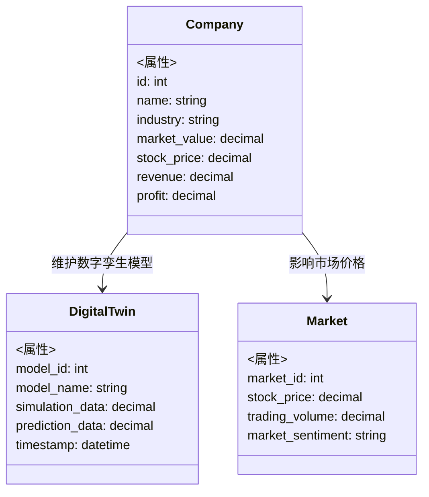
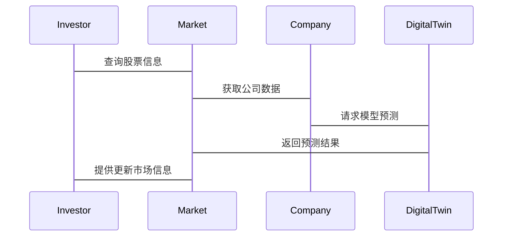

                 


# 特价股票与公司数字孪生技术应用水平的潜在联系

> 关键词：特价股票，数字孪生技术，公司应用，股价波动，技术影响

> 摘要：本文探讨了特价股票与公司数字孪生技术应用水平之间的潜在联系。通过分析数字孪生技术在公司运营中的作用，以及其对股价的影响，本文揭示了数字孪生技术如何通过优化公司表现来影响股价，从而为投资者提供新的视角。

---

# 第一部分：背景介绍

## 第1章：特价股票的基本概念与市场分析

### 1.1 特价股票的定义与特点

#### 1.1.1 特价股票的定义
特价股票是指价格低于面值的股票，通常在市场低迷或公司面临短期困境时出现。

#### 1.1.2 特价股票的市场特征
- 市场波动性高
- 投资者信心不足
- 公司基本面可能存在不确定性

#### 1.1.3 特价股票的投资价值分析
- 低价吸引投资者
- 潜在的回升空间
- 风险与机会并存

### 1.2 特价股票的分类与应用场景

#### 1.2.1 按行业分类的特价股票
- 制造业、科技行业常见
- 不同行业风险和潜力不同

#### 1.2.2 按公司规模分类的特价股票
- 小盘股和中盘股较多
- 大盘股较少，但稳定性较高

#### 1.2.3 特价股票的投资策略
- 价值投资：寻找被低估的公司
- 短期交易：利用市场波动获利

## 第2章：数字孪生技术的核心概念与应用

### 2.1 数字孪生技术的定义与特点

#### 2.1.1 数字孪生技术的定义
数字孪生技术通过数字模型实时模拟物理世界中的物体或系统，用于优化设计、预测性能和降低成本。

#### 2.1.2 数字孪生技术的核心特点
- 实时性：实时反映物理系统状态
- 预测性：基于模型预测未来状态
- 交互性：支持用户与模型的交互

#### 2.1.3 数字孪生技术与传统数字化技术的区别
| 特性 | 数字孪生技术 | 传统数字化技术 |
|------|--------------|----------------|
| 数据源 | 高度依赖实时数据 | 主要依赖历史数据 |
| 应用场景 | 设计、预测、优化 | 记录、分析、报告 |

### 2.2 数字孪生技术的应用场景

#### 2.2.1 在制造业中的应用
- 生产线优化
- 设备维护预测
- 产品设计模拟

#### 2.2.2 在服务业中的应用
- 客户体验优化
- 业务流程模拟
- 资源分配优化

#### 2.2.3 在金融领域的应用
- 风险评估
- 股票价格预测
- 投资组合优化

---

# 第二部分：特价股票与数字孪生技术的潜在联系

## 第3章：数字孪生技术对金融市场的潜在影响

### 3.1 数字孪生技术在金融建模中的应用

#### 3.1.1 金融建模的核心要素
- 数据采集：实时市场数据、公司基本面数据
- 模型构建：基于数字孪生的动态模型
- 预测分析：股票价格波动预测

#### 3.1.2 数字孪生技术对股票价格预测的贡献
- 提高预测精度
- 减少模型偏差
- 实现实时监控

### 3.2 数字孪生技术对风险评估的贡献

#### 3.2.1 风险评估的核心要素
- 市场风险
- 信用风险
- 操作风险

#### 3.2.2 数字孪生技术在风险评估中的应用
- 模拟不同市场条件下的公司表现
- 识别潜在风险点
- 提供实时风险预警

## 第4章：特价股票与数字孪生技术的关联性分析

### 4.1 特价股票市场的波动性特点

#### 4.1.1 特价股票波动的原因
- 市场情绪影响
- 公司基本面变化
- 外部经济环境

#### 4.1.2 数字孪生技术对特价股票市场的影响
- 提供新的投资工具
- 帮助投资者做出更明智的决策
- 改善市场流动性

### 4.2 数字孪生技术对特价股票投资的影响

#### 4.2.1 投资者视角
- 提供实时公司运营数据
- 支持价值评估
- 帮助识别潜在投资机会

#### 4.2.2 公司视角
- 提高运营效率
- 增强市场竞争力
- 优化资源配置

---

# 第三部分：系统分析与架构设计

## 第5章：数字孪生技术在金融市场的系统架构

### 5.1 系统功能设计

#### 5.1.1 领域模型类图


#### 5.1.2 系统架构设计


### 5.2 系统接口设计

#### 5.2.1 接口描述
- 公司层：提供实时运营数据
- 数字孪生层：接收数据，生成预测模型
- 市场层：接收预测结果，影响市场价格
- 投资者层：获取市场信息，做出投资决策

### 5.3 系统交互设计



---

# 第四部分：项目实战与案例分析

## 第6章：数字孪生技术在金融市场的应用案例

### 6.1 项目背景

#### 6.1.1 项目目标
- 分析数字孪生技术对股票价格的影响
- 优化投资策略

### 6.2 环境安装

#### 6.2.1 系统环境
- 操作系统：Linux
- 开发工具：Python、Jupyter Notebook
- 数据库：MySQL
- 三方库：Pandas、NumPy、Scikit-learn

### 6.3 核心代码实现

#### 6.3.1 数据采集
```python
import pandas as pd
import requests

url = 'https://api.example.com/stock_data'
data = requests.get(url).json()
df = pd.DataFrame(data)
print(df.head())
```

#### 6.3.2 模型构建
```python
from sklearn.linear_model import LinearRegression

# 假设df有'timestamp', 'stock_price'两列
X = df[['timestamp']]
y = df['stock_price']
model = LinearRegression()
model.fit(X, y)
```

#### 6.3.3 预测与分析
```python
# 预测未来价格
future_timestamp = [max(df['timestamp']) + 1]
future_price = model.predict(future_timestamp)
print(f'预测未来价格：{future_price[0]:.2f}')
```

### 6.4 案例分析

#### 6.4.1 案例背景
某科技公司股价近期波动较大，投资者怀疑公司数字孪生技术应用水平。

#### 6.4.2 数据分析
通过模型预测，发现公司数字孪生技术应用水平较高，未来股价有上升趋势。

#### 6.4.3 投资策略调整
建议投资者买入该公司的特价股票，预期股价回升。

---

# 第五部分：最佳实践与小结

## 第7章：数字孪生技术的应用建议

### 7.1 投资者建议
- 关注公司数字孪生技术的应用水平
- 结合模型预测结果做出投资决策

### 7.2 公司建议
- 加强数字孪生技术的应用
- 提高运营效率和市场竞争力

## 第8章：注意事项与未来展望

### 8.1 注意事项
- 技术应用有局限性，需结合实际情况
- 市场波动受多种因素影响，模型仅供参考

### 8.2 未来展望
- 数字孪生技术在金融领域的应用将更加广泛
- 技术与市场的深度融合将推动股价预测的准确性

---

# 作者：AI天才研究院/AI Genius Institute & 禅与计算机程序设计艺术 /Zen And The Art of Computer Programming

