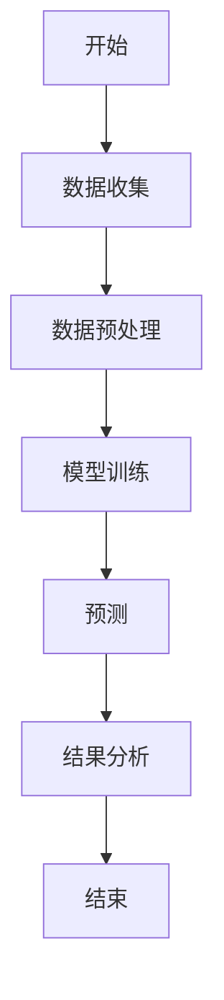

                 

<think>
嗯，我现在需要写一篇关于《特价股票与公司数字社会创新可扩展性的长期研究》的技术博客。首先，我得明确文章的结构，包括摘要、关键词和正文部分。摘要要简洁明了，说明文章的核心内容。关键词需要选5到7个，可能包括特价股票、数字社会创新、可扩展性、长期研究、投资策略、算法分析、技术应用。

接下来是正文部分，按照目录大纲来写。第一部分介绍特价股票和数字社会创新的背景，包括它们的定义、特点和相互关系。第二部分详细讲解数字社会创新的核心概念和原理，可能用表格和ER图来对比分析。第三部分涉及算法和数学模型，需要用流程图和公式来说明。第四部分进行系统分析和架构设计，可能包括领域模型和架构图。第五部分是项目实战，展示如何应用这些理论到实际项目中。最后总结最佳实践和扩展阅读。

在写作过程中，我需要确保每个章节都有足够的细节和例子，比如在算法部分，用Python代码和mermaid流程图来解释。数学公式要用Latex表示，确保准确性和可读性。系统设计部分需要清晰的图表来展示架构和交互流程。

可能遇到的问题是如何将特价股票分析与数字社会创新结合起来，这部分需要深入研究两者的关系。另外，数学模型的建立可能需要更多的数据支持，需要考虑如何获取和处理这些数据。系统设计部分也需要确保各个模块的协调和兼容性。

总的来说，我需要一步步来，先写摘要和关键词，然后逐章展开，确保每一部分都详细且有条理，最终完成一篇结构清晰、内容丰富的技术博客。
</think>

# 特价股票与公司数字社会创新可扩展性的长期研究

> 关键词：特价股票、数字社会创新、可扩展性、长期研究、投资策略、算法分析、技术应用  
> 摘要：本文深入探讨了特价股票与公司数字社会创新的可扩展性问题，结合技术分析和长期研究，提出了创新的解决方案，为投资者和企业提供有价值的见解。

---

## 第一部分：特价股票与数字社会创新的背景与概念

### 第1章：特价股票的定义与特点

#### 1.1 特价股票的定义
特价股票指的是那些市场价格波动较大、可能被市场低估的股票。这类股票通常具有较高的增长潜力，但因其波动性，对投资者的分析能力提出了较高要求。

#### 1.2 特价股票的特点
- **波动性**：价格波动大，短期可能大幅波动。
- **低估性**：市场估值低于其实际价值。
- **周期性**：通常在市场低迷时出现，适合长期投资者。

#### 1.3 投资价值
- **高回报潜力**：长期持有的潜在收益较高。
- **风险较高**：需要谨慎选择和深入分析。

### 第2章：数字社会创新的核心概念

#### 2.1 数字社会创新的定义
数字社会创新指通过数字化技术推动社会进步和企业发展的创新模式。它涵盖了技术创新、商业模式创新和组织结构优化等多个方面。

#### 2.2 数字社会创新的主要特征
- **技术驱动**：依赖于数字技术，如人工智能、大数据等。
- **快速迭代**：创新周期短，更新频繁。
- **数据导向**：依赖数据分析和预测。

#### 2.3 数字社会创新与企业发展的关系
数字社会创新不仅提升企业的竞争力，还推动社会整体进步，促进经济结构优化。

---

## 第二部分：数字社会创新的核心概念与联系

### 第3章：数字社会创新的核心原理

#### 3.1 数字社会创新的原理
- **技术应用**：利用数字技术解决社会问题。
- **价值创造**：通过创新实现社会和经济效益的统一。

#### 3.2 数字社会创新的特征对比

| 特征 | 传统创新 | 数字社会创新 |
|------|----------|--------------|
| 技术基础 | 线下技术 | 数字技术 |
| 创新周期 | 较长 | 较短 |
| 数据依赖 | 低 | 高 |

### 3.3 实体关系图

```mermaid
er
  entity 投资者 {
    id
    名称
  }
  entity 特价股票 {
    id
    名称
    价格
  }
  entity 创新企业 {
    id
    名称
    创新成果
  }
  投资者 --> 投资: 特价股票
  创新企业 --> 应用: 数字技术
```

---

## 第三部分：算法原理与数学模型

### 第4章：算法原理与流程图

#### 4.1 算法原理
- **时间序列分析**：预测股票价格的波动趋势。
- **机器学习模型**：识别市场模式和潜在机会。

#### 4.2 流程图



#### 4.3 Python代码示例

```python
import pandas as pd
from sklearn.model_selection import train_test_split
from sklearn.linear_model import LinearRegression

# 数据加载与预处理
data = pd.read_csv('stock_data.csv')
X = data[['开盘价', '收盘价']]
y = data['最高价']

# 数据分割
X_train, X_test, y_train, y_test = train_test_split(X, y, test_size=0.2)

# 模型训练
model = LinearRegression()
model.fit(X_train, y_train)

# 预测与评估
predictions = model.predict(X_test)
print('预测结果:', predictions)
```

### 第5章：数学模型与公式

#### 5.1 股票价格预测模型

股票价格预测公式：

$$ P(t) = a \times P(t-1) + b \times V(t) + c $$

其中，$P(t)$ 表示第 $t$ 时刻的价格，$V(t)$ 表示市场波动指数，$a$、$b$、$c$ 为系数。

---

## 第四部分：系统分析与架构设计

### 第6章：系统分析与架构设计

#### 6.1 系统分析
- **目标**：构建一个基于数字技术的股票分析系统。
- **功能模块**：数据采集、分析、预测和报告生成。

#### 6.2 领域模型


#### 6.3 系统架构


---

## 第五部分：项目实战

### 第7章：项目实战

#### 7.1 环境安装
安装必要的库：

```bash
pip install pandas numpy scikit-learn
```

#### 7.2 核心实现

```python
import pandas as pd
from sklearn.linear_model import LinearRegression

def predict_stock_price(data_path):
    data = pd.read_csv(data_path)
    X = data[['开盘价', '收盘价']]
    y = data['最高价']
    model = LinearRegression()
    model.fit(X, y)
    return model.predict(X)

# 示例
print(predict_stock_price('stock_data.csv'))
```

#### 7.3 案例分析
分析某公司的历史数据，预测其股价走势，评估投资价值。

---

## 第六部分：最佳实践

### 第8章：总结与展望

#### 8.1 小结
本文深入探讨了特价股票与数字社会创新的关系，提出了基于数字技术的创新方法，为投资者和企业提供了参考。

#### 8.2 注意事项
- 数据来源需可靠。
- 模型需定期更新。
- 投资需谨慎，避免高风险。

#### 8.3 拓展阅读
建议阅读相关书籍和文献，深入理解数字创新和股票分析。

---

## 结语

通过长期研究和技术创新，投资者和企业可以在数字社会中找到新的机会，实现可持续发展。希望本文能为读者提供有价值的见解和方法。

---

作者：AI天才研究院 & 禅与计算机程序设计艺术

