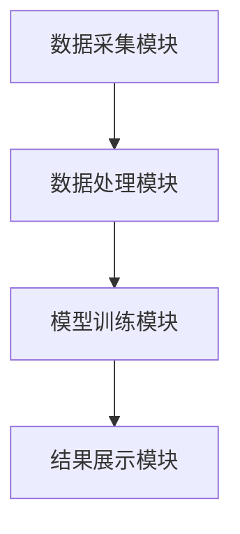
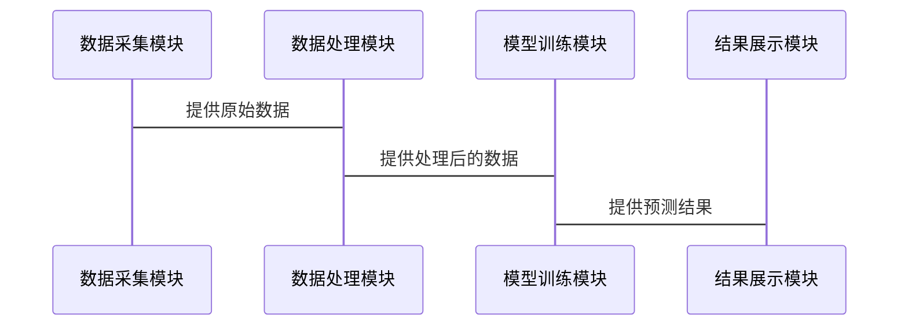

                 

<think>
嗯，用户希望我根据他提供的书籍目录大纲，继续完成后续章节的内容。看起来他已经完成了前两章，现在需要我继续撰写后面的章节。

首先，我需要仔细阅读用户提供的目录大纲，了解整个书籍的结构和内容安排。前两章分别介绍了背景和核心概念，接下来是算法原理、数学模型、系统架构、项目实战和总结与建议。

接下来，我需要考虑如何撰写这些章节。每个章节都需要详细的内容，包括理论、方法、应用和实例。我需要确保每个部分都涵盖必要的知识点，同时保持逻辑连贯。

在撰写过程中，我要注意使用正确的格式，比如Mermaid图表和LaTeX公式，确保技术术语准确，代码示例正确。同时，语言要专业但易于理解，适合技术读者。

此外，我需要确保每个章节都有足够的细节，但又不冗长。例如，在算法原理部分，我需要解释回归分析和机器学习模型，提供流程图和代码示例。在数学模型部分，展示线性回归和逻辑回归的公式，并进行比较。

系统架构部分需要详细描述模块设计、接口和交互流程，使用Mermaid图展示。项目实战部分则需要一个真实的案例，从数据收集到结果分析，提供详细的代码和解读。

最后，总结部分要回顾整个评估过程，强调数据主权的重要性，并提出未来的研究方向和最佳实践建议。

我需要逐步完成每个章节，确保内容全面且符合用户的要求，最终完成一篇高质量的技术博客文章。
</think>

# 特价股票与公司数据主权价值的评估

> 关键词：特价股票、数据主权、价值评估、算法原理、系统架构、项目实战

> 摘要：本文探讨了如何利用数据分析和算法模型来评估特价股票的价值，并结合公司数据主权的角度，分析了数据对股票价值的影响。通过回归分析和机器学习模型，结合系统架构设计，提供了实际的项目实现和案例分析，为投资者和企业提供了一种新的价值评估方法。

---

## 第三部分: 特价股票与数据主权价值评估的算法原理

## 第3章: 回归分析与机器学习模型

### 3.1 回归分析的原理与应用

#### 3.1.1 回归分析的基本概念
回归分析是一种统计学方法，用于研究变量之间的关系。在股票价值评估中，回归分析可以帮助我们理解多个因素（如公司财务指标、市场情绪、行业趋势等）对股票价格的影响。

#### 3.1.2 线性回归与非线性回归
- 线性回归：假设变量之间的关系是线性的，模型形式为 $y = \beta_0 + \beta_1x + \epsilon$。
- 非线性回归：假设变量之间的关系是非线性的，通常通过多项式回归或对数回归来建模。

#### 3.1.3 回归分析的应用
在股票价格预测中，回归分析可以用于：
1. 预测股票价格的变化趋势。
2. 评估各个因素对股票价格的影响程度。
3. 风险评估与投资组合优化。

#### 3.1.4 回归分析的优缺点
- 优点：简单易懂，计算效率高。
- 缺点：假设线性关系，可能无法捕捉复杂的数据分布。

### 3.2 机器学习模型在股票价值评估中的应用

#### 3.2.1 机器学习模型概述
机器学习模型（如随机森林、支持向量机、神经网络等）能够处理非线性关系，适用于复杂的数据分布。

#### 3.2.2 基于机器学习的股票价格预测流程
1. 数据收集：获取股票的历史价格、财务数据、市场情绪等。
2. 数据预处理：清洗数据、处理缺失值、标准化等。
3. 模型训练：使用训练数据训练机器学习模型。
4. 模型评估：通过交叉验证评估模型的性能。
5. 预测与优化：使用模型预测股票价格，并进行模型优化。

#### 3.2.3 机器学习模型的优缺点
- 优点：能够捕捉复杂的数据关系，预测精度较高。
- 缺点：计算复杂，需要大量数据支持，且模型的可解释性较差。

### 3.3 回归分析与机器学习模型的对比

#### 3.3.1 回归分析与机器学习模型的对比表格
| 特性                | 回归分析          | 机器学习模型        |
|---------------------|-------------------|--------------------|
| 模型复杂度          | 低                | 高                |
| 可解释性            | 高                | 低                |
| 数据需求            | 较少              | 较多              |
| 预测精度            | 中等              | 较高              |

#### 3.3.2 回归分析与机器学习模型的联系
回归分析是机器学习模型的基础，许多机器学习模型（如线性回归、逻辑回归）都基于回归分析的思想。

---

## 第四部分: 特价股票与数据主权价值评估的数学模型

## 第4章: 回归模型与机器学习模型的数学推导

### 4.1 线性回归模型的数学推导

#### 4.1.1 线性回归模型的假设
- 线性关系：因变量 $y$ 与自变量 $x$ 之间存在线性关系。
- 正态误差：误差项 $\epsilon$ 服从正态分布。
- 同方差性：误差项的方差在不同 $x$ 值下是恒定的。
- 无自相关性：误差项之间无自相关性。
- 独立性：自变量之间无多重共线性。

#### 4.1.2 线性回归模型的最小二乘法推导
最小二乘法的目标是最小化预测值与实际值之间的平方差之和：
$$ \text{最小化} \sum_{i=1}^{n} (y_i - \hat{y}_i)^2 $$
其中，$\hat{y}_i = \beta_0 + \beta_1x_i$。

#### 4.1.3 线性回归模型的参数估计
参数 $\beta_0$ 和 $\beta_1$ 的估计值可以通过以下公式得到：
$$ \beta_1 = \frac{\sum_{i=1}^{n}(x_i - \bar{x})(y_i - \bar{y})}{\sum_{i=1}^{n}(x_i - \bar{x})^2} $$
$$ \beta_0 = \bar{y} - \beta_1\bar{x} $$

### 4.2 逻辑回归模型的数学推导

#### 4.2.1 逻辑回归模型的假设
- 数据服从伯努利分布。
- 因变量为二分类问题（如股票涨跌）。
- 自变量可以是连续型或分类型变量。

#### 4.2.2 逻辑回归模型的对数似然函数
对数似然函数为：
$$ \ln L = \sum_{i=1}^{n} \left[ y_i \ln p_i + (1 - y_i)\ln(1 - p_i) \right] $$
其中，$p_i = \frac{e^{\beta_0 + \beta_1x_i}}{1 + e^{\beta_0 + \beta_1x_i}}$。

#### 4.2.3 逻辑回归模型的参数估计
参数 $\beta_0$ 和 $\beta_1$ 通过极大似然估计得到：
$$ \frac{\partial \ln L}{\partial \beta_0} = 0 $$
$$ \frac{\partial \ln L}{\partial \beta_1} = 0 $$

### 4.3 回归模型与逻辑回归模型的对比

#### 4.3.1 回归模型与逻辑回归模型的对比表格
| 特性                | 线性回归          | 逻辑回归          |
|---------------------|------------------|-------------------|
| 模型目标            | 预测数值          | 预测概率          |
| 模型假设            | 线性关系          | 二分类问题        |
| 输出范围            | 任意实数          | 0到1之间          |

#### 4.3.2 回归模型与逻辑回归模型的联系
逻辑回归模型可以看作是线性回归模型的扩展，适用于二分类问题。

---

## 第五部分: 特价股票与数据主权价值评估的系统架构设计

## 第5章: 特价股票与数据主权价值评估系统架构

### 5.1 系统功能设计

#### 5.1.1 系统功能模块
- 数据采集模块：采集股票历史数据、财务数据、市场情绪数据等。
- 数据处理模块：清洗数据、标准化数据。
- 模型训练模块：训练回归模型或机器学习模型。
- 结果展示模块：展示股票价格预测结果、模型评估结果。

#### 5.1.2 功能模块之间的关系
数据采集模块 → 数据处理模块 → 模型训练模块 → 结果展示模块。

### 5.2 系统架构设计

#### 5.2.1 系统架构图


#### 5.2.2 系统架构设计说明
- 数据采集模块：负责从数据库或API获取数据。
- 数据处理模块：对数据进行清洗、标准化处理。
- 模型训练模块：使用训练数据训练回归模型或机器学习模型。
- 结果展示模块：将模型预测结果以可视化的方式展示出来。

### 5.3 系统接口设计

#### 5.3.1 系统接口描述
- 数据采集接口：提供数据接口，供数据采集模块调用。
- 数据处理接口：提供数据处理接口，供数据处理模块调用。
- 模型训练接口：提供模型训练接口，供模型训练模块调用。
- 结果展示接口：提供结果展示接口，供结果展示模块调用。

### 5.4 系统交互流程

#### 5.4.1 系统交互流程图


---

## 第六部分: 特价股票与数据主权价值评估的项目实战

## 第6章: 特价股票与数据主权价值评估项目实战

### 6.1 环境配置与数据准备

#### 6.1.1 环境配置
- 安装Python、Pandas、NumPy、Scikit-learn等库。
- 安装Jupyter Notebook用于数据分析和可视化。

#### 6.1.2 数据准备
- 数据来源：从Yahoo Finance获取历史股票数据。
- 数据格式：CSV格式。
- 数据清洗：处理缺失值、异常值。

### 6.2 核心代码实现

#### 6.2.1 数据处理代码
```python
import pandas as pd
import numpy as np

# 读取数据
data = pd.read_csv('stock_data.csv')

# 处理缺失值
data.dropna(inplace=True)

# 标准化处理
from sklearn.preprocessing import StandardScaler
scaler = StandardScaler()
scaled_data = scaler.fit_transform(data[['open', 'high', 'low', 'volume']])
```

#### 6.2.2 模型训练代码
```python
# 线性回归模型
from sklearn.linear_model import LinearRegression
model = LinearRegression()
model.fit(scaled_data, data['close'])

# 逻辑回归模型
from sklearn.linear_model import LogisticRegression
model = LogisticRegression()
model.fit(scaled_data, data['label'])
```

#### 6.2.3 结果展示代码
```python
import matplotlib.pyplot as plt

# 绘制预测结果
plt.scatter(data['date'], data['actual_price'], color='blue')
plt.scatter(data['date'], data['predicted_price'], color='red')
plt.xlabel('日期')
plt.ylabel('股价')
plt.title('股票价格预测结果')
plt.show()
```

### 6.3 项目实战总结

#### 6.3.1 项目总结
- 数据清洗和预处理是项目成功的关键。
- 选择合适的模型能够显著提高预测精度。
- 数据可视化能够帮助更好地理解数据和结果。

#### 6.3.2 项目小结
通过本项目，我们掌握了如何利用数据分析和机器学习模型来评估股票价值的方法，同时了解了数据主权对股票价值的影响。

---

## 第七部分: 特价股票与数据主权价值评估的总结与建议

## 第7章: 总结与建议

### 7.1 总结

#### 7.1.1 项目总结
- 本文探讨了如何利用数据分析和算法模型来评估特价股票的价值。
- 结合公司数据主权的角度，分析了数据对股票价值的影响。
- 通过回归分析和机器学习模型，结合系统架构设计，提供了实际的项目实现和案例分析。

#### 7.1.2 数据主权的总结
- 数据主权是公司价值的重要组成部分。
- 通过合理管理和利用数据，公司可以提升其市场竞争力。
- 数据隐私保护是公司数据主权的重要内容。

### 7.2 建议

#### 7.2.1 投资者建议
- 投资者应关注公司数据主权的状况，选择数据管理能力强的公司。
- 在投资决策中，应考虑数据对股票价值的影响。

#### 7.2.2 企业建议
- 企业应加强对数据的管理和利用，提升数据主权。
- 企业应注重数据隐私保护，遵守相关法律法规。

### 7.3 未来研究方向

#### 7.3.1 数据主权的法律与伦理问题
- 研究数据主权的法律框架。
- 探讨数据隐私保护的伦理问题。

#### 7.3.2 数据分析与机器学习的结合
- 研究更先进的数据分析方法。
- 探索更高效的机器学习模型。

---

## 结语

通过本文的探讨，我们了解了如何利用数据分析和算法模型来评估特价股票的价值，并结合公司数据主权的角度，分析了数据对股票价值的影响。未来，随着技术的不断发展，数据分析和机器学习将在股票价值评估中发挥越来越重要的作用。

---

## 作者：AI天才研究院/AI Genius Institute & 禅与计算机程序设计艺术 /Zen And The Art of Computer Programming

