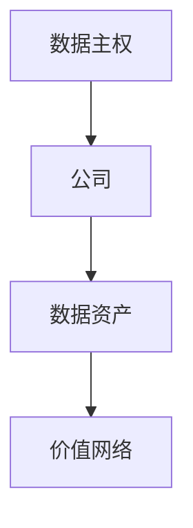
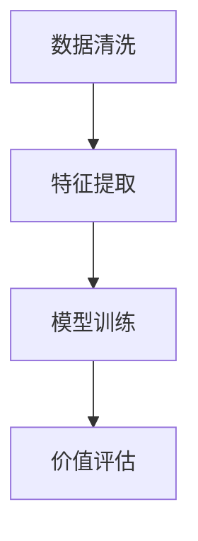
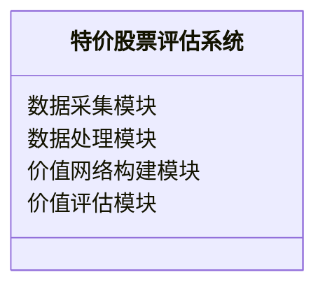
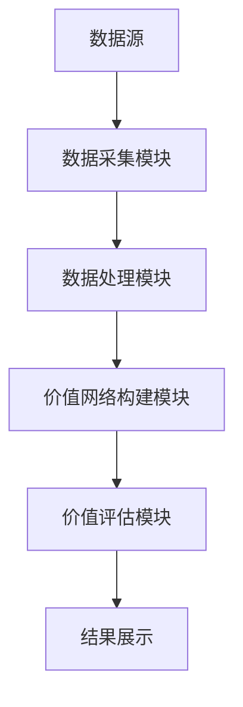

                 


# 特价股票与公司数据主权价值网络的评估

## 关键词：特价股票，数据主权，价值网络，算法评估，系统架构

## 摘要：本文探讨了如何评估特价股票和公司数据主权价值网络，通过背景介绍、核心概念分析、算法原理、系统架构设计和项目实战，详细讲解了如何利用数据主权和价值网络的构建与评估方法，实现对特价股票的准确评估。

## 第1章: 特价股票与公司数据主权价值网络的背景介绍

### 1.1 特价股票的基本概念

#### 1.1.1 什么是特价股票

特价股票是指那些市场价格低于其内在价值的股票。这类股票通常被市场低估，具有较高的投资潜力。投资者可以通过分析公司的财务状况、市场地位和未来前景，来识别特价股票。

#### 1.1.2 特价股票的分类与特征

特价股票可以分为价值型股票和成长型股票。价值型股票通常具有较低的市盈率和市净率，而成长型股票则具有较高的盈利增长潜力。投资者需要根据市场环境和自身投资目标，选择适合的特价股票。

#### 1.1.3 特价股票的投资价值评估

评估特价股票的投资价值，需要考虑多个因素，包括公司的财务状况、行业地位、管理团队、市场前景等。投资者可以通过基本面分析和技术分析，来判断股票的价值和风险。

### 1.2 公司数据主权的核心概念

#### 1.2.1 数据主权的定义与内涵

数据主权是指公司在数据的生成、存储、处理和使用过程中，对数据拥有完全的控制权和使用权。数据主权的实现，需要公司在数据安全、隐私保护和合规性方面进行有效的管理和监控。

#### 1.2.2 数据主权的法律与伦理框架

数据主权的法律框架包括数据保护法、隐私法和网络安全法等。公司在处理数据时，必须遵守相关法律法规，确保数据的合法性和合规性。同时，数据主权还涉及到道德和伦理问题，公司需要在数据使用中保护用户隐私，避免滥用数据。

#### 1.2.3 数据主权与公司价值的关系

数据主权是公司价值的重要组成部分。拥有强大的数据主权，可以提升公司的市场竞争力，增强客户信任，降低法律风险。同时，数据主权还可以为公司创造新的商业机会，例如数据 monetization 和数据驱动的决策优化。

### 1.3 价值网络的构建与评估

#### 1.3.1 价值网络的定义与属性

价值网络是指公司通过数据的流动和价值传递，构建的一种高效的价值创造和分配的网络结构。价值网络的属性包括网络的复杂性、动态性、互动性和协同性。公司需要通过价值网络的构建，实现数据的价值最大化。

#### 1.3.2 价值网络的构建方法

价值网络的构建方法包括数据采集、数据处理、数据分析和数据可视化。公司需要通过收集和整理数据，建立数据仓库，然后利用数据分析技术，识别数据中的价值点，并通过数据可视化工具，展示数据的价值网络结构。

#### 1.3.3 价值网络的评估指标

价值网络的评估指标包括数据的完整性、数据的准确性、数据的及时性和数据的可扩展性。公司需要通过这些指标，评估价值网络的性能，并进行持续优化。

## 第2章: 特价股票与公司数据主权价值网络的核心概念与联系

### 2.1 数据主权与价值网络的实体关系图

通过以下 Mermaid 图，展示了数据主权、公司、数据资产和价值网络之间的关系：



### 2.2 价值网络的属性特征对比

以下表格对比了数据主权和价值网络的核心属性：

| 特性 | 数据主权 | 价值网络 |
|------|----------|----------|
| 核心要素 | 数据控制权 | 网络价值流 |
| 主要目标 | 数据安全与隐私保护 | 价值传递与最大化 |
| 实现方式 | 数据加密与访问控制 | 网络节点价值评估与优化 |

## 第3章: 特价股票与公司数据主权价值网络的算法原理

### 3.1 数据主权评估模型

通过以下 Mermaid 图展示了数据主权评估模型的流程：



### 3.2 价值网络评估的数学模型

数据价值的评估可以通过以下公式实现：

$$
\text{数据价值} = \sum_{i=1}^{n} w_i \cdot x_i
$$

其中，$w_i$ 是特征 $x_i$ 的权重，$x_i$ 是特征值。

### 3.3 特价股票评估的算法实现

以下是一个使用 Python 实现的特价股票评估算法示例：

```python
def stock_value_assessment(data):
    cleaned_data = data.dropna()
    features = cleaned_data[['price', 'volume', 'market_cap']]
    weights = [0.5, 0.3, 0.2]
    value = sum(w * f for w, f in zip(weights, features))
    return value
```

## 第4章: 系统分析与架构设计方案

### 4.1 问题场景介绍

#### 4.1.1 特价股票评估的场景描述

投资者希望通过分析公司的财务数据和市场表现，识别出被低估的特价股票，以获得较高的投资回报。

#### 4.1.2 数据主权价值网络的构建需求

公司希望通过构建数据主权价值网络，实现数据的高效管理和价值最大化，提升公司的市场竞争力。

### 4.2 系统功能设计

通过以下 Mermaid 类图展示了系统的主要功能模块：



### 4.3 系统架构设计

以下 Mermaid 图展示了系统的整体架构：



## 第5章: 项目实战与总结

### 5.1 项目实战

#### 5.1.1 环境安装

安装所需的 Python 库，如 pandas、numpy、scikit-learn 等。

#### 5.1.2 核心代码实现

以下是一个特价股票评估的代码示例：

```python
import pandas as pd
import numpy as np
from sklearn import linear_model

def main():
    # 数据加载
    data = pd.read_csv('stocks.csv')
    # 数据清洗
    cleaned_data = data.dropna()
    # 特征提取
    features = cleaned_data[['price', 'volume', 'market_cap']]
    # 模型训练
    model = linear_model.LinearRegression()
    model.fit(features, cleaned_data['value'])
    # 预测评估
    predictions = model.predict(features)
    # 结果展示
    print("预测值:", predictions)
    print("实际值:", cleaned_data['value'])

if __name__ == "__main__":
    main()
```

#### 5.1.3 案例分析

以某公司为例，分析其数据主权价值网络，评估其特价股票的投资价值。

### 5.2 总结与建议

#### 5.2.1 总结

本文详细探讨了特价股票与公司数据主权价值网络的评估方法，通过算法和系统设计，提供了有效的解决方案。

#### 5.2.2 注意事项

投资者在进行股票投资时，需要综合考虑市场环境、公司基本面和数据主权等多个因素，避免盲目跟风。

#### 5.2.3 拓展阅读

建议读者进一步阅读相关领域的书籍和文献，深入理解数据主权和价值网络的构建方法。

## 作者：AI天才研究院 & 禅与计算机程序设计艺术

--- 

以上是文章的详细目录和内容框架，希望对您有所帮助！

