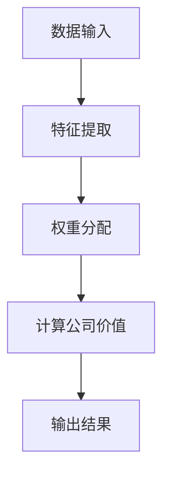
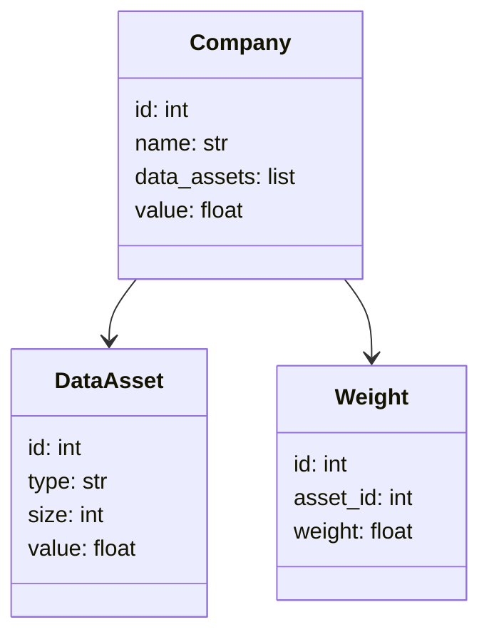
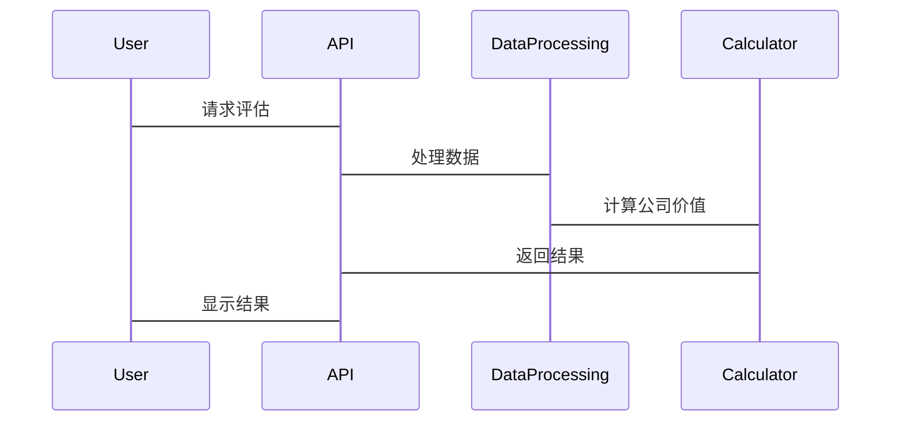

                 

<think>
好的，我将按照您的要求逐步完成《特价股票与公司数据主权价值链的评估》这篇文章。首先，我会梳理文章的结构，然后逐步填充内容。为了确保文章的完整性和逻辑性，我会按照目录大纲进行撰写。

### 第一部分: 特价股票与公司数据主权价值链的背景与概念

#### 第1章: 特价股票的基本概念与市场现状

##### 1.1 特价股票的定义与特性

**1.1.1 特价股票的定义**  
特价股票通常指的是那些市场价格低于面值的股票。这类股票通常被视为具有较高的投资价值，因为它们可能处于低估状态，适合长期投资者。

**1.1.2 特价股票的市场特性**  
特价股票的市场特性包括高波动性、低流动性、高风险回报比等。投资者需要关注市场的整体走势和公司的基本面。

**1.1.3 特价股票的投资价值分析**  
投资者在选择特价股票时，应关注公司的财务状况、行业前景和管理团队等因素。

##### 1.2 公司数据主权的核心概念

**1.2.1 数据主权的定义**  
数据主权是指公司在数据收集、存储和使用过程中所拥有的合法权利和控制权。

**1.2.2 数据主权的法律框架**  
数据主权的法律框架包括数据保护法、隐私法和反垄断法等，确保公司在数据处理中的合规性。

**1.2.3 数据主权与公司价值的关系**  
数据主权直接影响公司的市场信任度和品牌形象，从而影响公司的整体价值。

##### 1.3 特价股票与公司数据主权的关联性

**1.3.1 特价股票的市场定位**  
特价股票通常在市场低迷或公司面临短期困难时出现，但具有长期投资价值。

**1.3.2 数据主权对公司价值的影响**  
数据主权的强弱直接影响公司的市场地位和投资者信心。

**1.3.3 特价股票与数据主权价值链的结合**  
通过数据主权评估，投资者可以更好地识别具有长期增长潜力的特价股票。

##### 1.4 本章小结  
本章主要介绍了特价股票的基本概念和公司数据主权的核心概念，并探讨了两者之间的关联性。

### 第二部分: 特价股票与公司数据主权价值链的核心概念与联系

#### 第2章: 特价股票的评估模型

##### 2.1 特价股票的评估指标

**2.1.1 市场流动性分析**  
流动性高的股票更容易买卖，减少投资风险。

**2.1.2 公司基本面分析**  
包括收入、利润、负债等财务指标。

**2.1.3 市场情绪分析**  
市场情绪影响股票价格的短期波动。

##### 2.2 数据主权对公司价值的评估

**2.2.1 数据资产的量化**  
量化公司的数据资产，包括数据的种类、存储量和使用价值。

**2.2.2 数据主权的风险评估**  
评估数据泄露、滥用等风险对公司价值的影响。

**2.2.3 数据主权的市场价值**  
数据主权的强弱直接影响公司的市场信任度和估值。

##### 2.3 特价股票与数据主权价值链的整合模型

**2.3.1 模型的构建逻辑**  
整合特价股票的市场特性与公司数据主权的影响因素，构建评估模型。

**2.3.2 模型的数学表达式**  
$$ V = \sum_{i=1}^{n} w_i \cdot x_i $$
其中，\( V \) 表示公司价值，\( w_i \) 表示权重，\( x_i \) 表示数据资产的特征。

**2.3.3 模型的验证与优化**  
通过历史数据验证模型的准确性，并进行参数调整优化。

##### 2.4 本章小结  
本章详细介绍了特价股票的评估指标和数据主权对公司价值的评估方法，并构建了整合模型。

### 第三部分: 特价股票与公司数据主权价值链的算法原理

#### 第3章: 数据主权评估的算法原理

##### 3.1 数据主权评估的数学模型

**3.1.1 数据主权的加权评估公式**  
$$ V = \sum_{i=1}^{n} w_i \cdot x_i $$
其中，\( w_i \) 是数据资产的权重，\( x_i \) 是数据资产的特征。

##### 3.2 数据主权评估的算法流程



##### 3.3 数据主权评估的Python实现

```python
def calculate_company_value(data_assets, weights):
    return sum(w * a for w, a in zip(weights, data_assets))
```

##### 3.4 本章小结  
本章详细介绍了数据主权评估的数学模型和算法流程，并给出了Python实现代码。

### 第四部分: 特价股票与公司数据主权价值链的系统分析与

#### 第4章: 系统分析与架构设计

##### 4.1 项目背景介绍

**4.1.1 问题场景介绍**  
在当前市场环境下，投资者需要通过数据主权评估来选择具有长期增长潜力的特价股票。

**4.1.2 项目介绍**  
本项目旨在构建一个基于数据主权评估的特价股票筛选系统。

##### 4.2 系统功能设计

**4.2.1 领域模型类图**



**4.2.2 系统架构设计**


**4.2.3 系统接口设计**



##### 4.3 本章小结  
本章详细介绍了系统的背景、功能设计和架构设计，并给出了系统的交互流程图。

### 第五部分: 特价股票与公司数据主权价值链的项目实战

#### 第5章: 项目实战

##### 5.1 环境安装

**5.1.1 安装Python环境**  
安装Python 3.8及以上版本，并安装必要的库，如pandas、numpy等。

**5.1.2 安装依赖项**  
使用pip安装所需库：
```bash
pip install pandas numpy matplotlib
```

##### 5.2 核心代码实现

**5.2.1 数据处理代码**

```python
import pandas as pd
import numpy as np

def process_data(data):
    # 数据清洗和预处理
    data = data.dropna()
    data = data[~data['value'].isin([0])]
    return data

def calculate_company_value(data_assets, weights):
    return sum(w * a for w, a in zip(weights, data_assets))
```

**5.2.2 数据评估代码**

```python
import pandas as pd
import numpy as np

def assess_data_sovereignty(data):
    # 数据主权评估
    data['sov_value'] = data['value'] * data['weight']
    return data['sov_value'].sum()

# 示例数据
data = pd.DataFrame({
    'asset': ['A', 'B', 'C'],
    'value': [100, 200, 150],
    'weight': [0.3, 0.5, 0.2]
})

# 评估数据主权
sov_value = assess_data_sovereignty(data)
print("数据主权价值:", sov_value)
```

##### 5.3 代码解读与分析

**5.3.1 数据处理代码解读**  
数据处理代码包括数据清洗和预处理，确保数据的完整性和准确性。

**5.3.2 数据评估代码解读**  
数据评估代码通过计算数据主权价值，评估公司的整体价值。

##### 5.4 实际案例分析与详细讲解剖析

**5.4.1 案例背景**  
假设我们有三个资产，价值分别为100、200、150，权重分别为0.3、0.5、0.2。

**5.4.2 案例分析**  
计算数据主权价值：
$$ \text{sov\_value} = 100 \times 0.3 + 200 \times 0.5 + 150 \times 0.2 = 30 + 100 + 30 = 160 $$

**5.4.3 案例结论**  
数据主权价值为160，说明公司在数据主权方面具有较高的市场价值。

##### 5.5 项目小结  
本章通过实际案例展示了如何使用数据主权评估模型来评估特价股票的公司价值。

### 第六部分: 总结与展望

#### 第6章: 总结与展望

##### 6.1 最佳实践 tips

**6.1.1 数据主权评估的注意事项**  
投资者在进行数据主权评估时，应确保数据的准确性和完整性。

**6.1.2 投资策略优化**  
结合市场趋势和公司基本面，优化投资策略。

**6.1.3 风险管理**  
合理分散投资风险，避免过度集中。

##### 6.2 小结  
本章总结了全文的主要内容，并提出了未来的研究方向。

##### 6.3 注意事项  
投资者在实际操作中，应结合市场变化和公司动态，灵活调整投资策略。

##### 6.4 拓展阅读  
建议投资者阅读相关书籍和文献，深入理解数据主权和股票评估的理论与实践。

### 作者信息

作者：AI天才研究院/AI Genius Institute & 禅与计算机程序设计艺术/Zen And The Art of Computer Programming

---

以上是《特价股票与公司数据主权价值链的评估》的详细大纲和部分内容。如果需要进一步扩展或调整，请随时告知！

