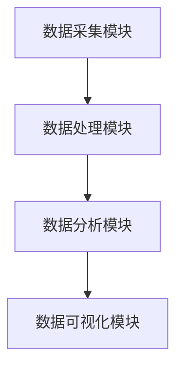
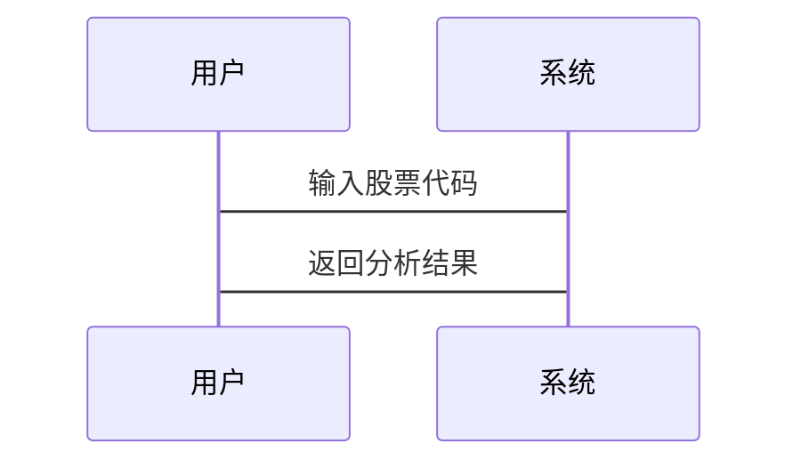

                 


# 特价股票与公司数据价值链优化能力的关系探讨

> 关键词：特价股票，数据价值链，公司优化，数据分析，机器学习，投资策略

> 摘要：本文探讨了特价股票与公司数据价值链优化能力之间的关系，分析了数据驱动在股票投资中的作用，提出了优化公司数据价值链的方法，并通过实际案例展示了如何利用数据分析和机器学习提升股票投资的决策能力。

---

## 第一部分: 特价股票与公司数据价值链优化能力的背景与概念

### 第1章: 特价股票的基本概念与背景

#### 1.1 特价股票的定义与特点
##### 1.1.1 特价股票的定义
特价股票是指在股票市场上价格相对较低的股票，通常具有较高的潜在增长空间。这类股票可能来自市值较小的公司，或者处于市场周期性低谷的行业。

##### 1.1.2 特价股票的特点
- 价格低廉：相比蓝筹股，特价股票的价格更低，适合中小投资者。
- 增长潜力：许多特价股票来自成长型企业，具有较高的增长潜力。
- 风险较高：由于公司规模较小或行业波动，特价股票的风险较高。

##### 1.1.3 特价股票的分类
- 按行业分类：如科技、医疗、能源等行业的特价股票。
- 按市值分类：小盘股、中盘股。
- 按增长潜力分类：高增长型和稳定型。

#### 1.2 特价股票的投资价值分析
##### 1.2.1 特价股票的投资价值
- 低价优势：投资者可以用较少的资金分散投资。
- 增长潜力：许多特价股票可能成为未来的蓝筹股。

##### 1.2.2 特价股票的市场定位
- 市场周期影响：市场低迷时，特价股票可能被低估。
- 投资者偏好：机构投资者和散户可能对特价股票的需求不同。

##### 1.2.3 特价股票的风险与收益
- 高风险：公司规模小，抗风险能力弱。
- 高收益：潜在的高增长回报。

#### 1.3 特价股票与公司数据价值链的关系
##### 1.3.1 特价股票与公司数据价值链的定义
- 特价股票：价格较低的股票。
- 数据价值链：从数据采集、处理到分析和应用的完整链条。

##### 1.3.2 特价股票与公司数据价值链的核心联系
- 数据驱动决策：通过数据分析优化投资策略。
- 价值发现：利用数据挖掘发现特价股票的投资价值。

##### 1.3.3 特价股票与公司数据价值链的优化目标
- 提升数据分析能力：优化投资决策。
- 增强数据驱动能力：通过数据挖掘发现潜在机会。

#### 1.4 本章小结
本章介绍了特价股票的基本概念、特点、分类及其投资价值，分析了特价股票与公司数据价值链的关系，并提出了优化的目标。

---

### 第2章: 公司数据价值链优化能力的构建

#### 2.1 数据价值链的基本概念
##### 2.1.1 数据价值链的定义
数据价值链是指从数据采集、处理、分析到应用的完整流程。

##### 2.1.2 数据价值链的核心要素
- 数据采集：获取高质量数据。
- 数据处理：清洗和预处理数据。
- 数据分析：通过技术手段挖掘数据价值。
- 数据应用：将分析结果应用于实际业务。

##### 2.1.3 数据价值链的优化目标
- 提高数据处理效率。
- 增强数据分析能力。
- 优化数据驱动的决策过程。

#### 2.2 数据价值链优化能力的构建
##### 2.2.1 数据采集与处理
- 数据来源：公开市场数据、公司财务报表、行业报告等。
- 数据清洗：去除噪声数据，确保数据质量。

##### 2.2.2 数据分析与挖掘
- 数据分析：使用统计方法和机器学习算法对数据进行分析。
- 数据挖掘：发现数据中的潜在模式和规律。

##### 2.2.3 数据驱动的决策优化
- 数据可视化：通过图表展示分析结果。
- 决策支持：基于数据分析结果优化投资策略。

#### 2.3 数据价值链优化能力的评估指标
##### 2.3.1 数据质量评估
- 数据完整性：数据是否完整。
- 数据准确性：数据是否准确。

##### 2.3.2 数据处理效率评估
- 数据处理时间：数据处理的速度。
- 数据处理成本：数据处理的资源消耗。

##### 2.3.3 数据驱动决策的效果评估
- 决策的准确率：基于数据分析的投资决策是否准确。
- 投资回报率：投资策略的回报情况。

#### 2.4 本章小结
本章详细探讨了数据价值链的核心要素和优化能力的构建方法，分析了数据价值链优化能力的评估指标。

---

## 第二部分: 特价股票与公司数据价值链优化能力的关系分析

### 第3章: 特价股票与公司数据价值链优化能力的关系分析

#### 3.1 特价股票与公司数据价值链优化能力的相互作用
##### 3.1.1 特价股票对数据价值链的影响
- 数据采集：特价股票的数据可能来自多个来源，需要高效的数据采集能力。
- 数据分析：特价股票的分析需要精准的数据挖掘能力。

##### 3.1.2 数据价值链优化对特价股票的影响
- 数据驱动决策：优化数据价值链可以提升特价股票的投资决策能力。
- 数据价值发现：通过数据分析发现特价股票的潜在价值。

#### 3.2 特价股票与公司数据价值链优化能力的协同效应
##### 3.2.1 数据驱动的特价股票分析
- 数据分析：通过数据分析筛选出具有投资价值的特价股票。
- 数据挖掘：发现特价股票的增长潜力。

##### 3.2.2 特价股票驱动的数据价值链优化
- 投资策略优化：基于特价股票的分析结果优化数据处理流程。
- 数据应用：将特价股票的分析结果应用于公司数据价值链的优化。

#### 3.3 特价股票与公司数据价值链优化能力的案例分析
##### 3.3.1 某公司数据价值链优化案例
- 数据采集与处理：该公司通过优化数据采集流程，提升了数据处理效率。
- 数据分析与挖掘：通过机器学习算法分析特价股票的潜在价值。

##### 3.3.2 案例中特价股票的作用分析
- 投资回报：通过数据分析，该公司成功投资于某只具有增长潜力的特价股票。
- 数据驱动决策：基于数据分析结果优化投资策略。

#### 3.4 本章小结
本章通过分析特价股票与公司数据价值链优化能力的关系，探讨了数据驱动在股票投资中的作用，并通过实际案例展示了两者协同效应的重要性。

---

## 第三部分: 数据驱动的特价股票投资策略与系统架构设计

### 第4章: 数据驱动的特价股票投资策略

#### 4.1 数据驱动的投资策略
##### 4.1.1 数据驱动的定义
- 数据驱动：基于数据分析和挖掘的结果进行决策。

##### 4.1.2 数据驱动的投资策略
- 数据分析：通过数据分析筛选出具有投资价值的特价股票。
- 数据挖掘：发现数据中的潜在模式和规律。

#### 4.2 数据驱动的特价股票投资算法
##### 4.2.1 机器学习算法的应用
- 线性回归：预测股票价格。
- 支持向量机：分类股票类型。
- 随机森林：预测股票波动性。

##### 4.2.2 算法实现
- 数据预处理：清洗和特征提取。
- 模型训练：使用机器学习算法训练模型。
- 模型评估：评估模型的准确率和稳定性。

#### 4.3 数据驱动的投资策略优化
##### 4.3.1 数据分析工具的选择
- Python：数据处理和分析的首选工具。
- Pandas：数据清洗和处理。
- Scikit-learn：机器学习算法实现。

##### 4.3.2 数据可视化
- Matplotlib：数据可视化的工具。
- Seaborn：数据分布和关系的可视化。

#### 4.4 本章小结
本章介绍了数据驱动的投资策略，探讨了机器学习算法在特价股票投资中的应用，并通过工具的选择和数据可视化的实现，展示了数据驱动投资策略的优化过程。

---

### 第5章: 数据驱动的特价股票投资系统架构设计

#### 5.1 系统架构设计
##### 5.1.1 系统功能模块设计
- 数据采集模块：采集股票市场数据。
- 数据处理模块：清洗和预处理数据。
- 数据分析模块：使用机器学习算法分析数据。
- 数据可视化模块：展示分析结果。

##### 5.1.2 系统架构图


#### 5.2 系统接口设计
##### 5.2.1 数据接口
- 数据输入接口：接收外部数据。
- 数据输出接口：输出分析结果。

##### 5.2.2 接口实现
- RESTful API：实现数据接口的调用。
- 数据格式：JSON格式。

#### 5.3 系统交互设计
##### 5.3.1 交互流程
- 用户输入：输入股票代码。
- 系统处理：分析股票数据。
- 系统输出：展示分析结果。

##### 5.3.2 交互流程图


#### 5.4 本章小结
本章设计了数据驱动的特价股票投资系统的架构，展示了系统功能模块、接口设计和交互流程。

---

## 第四部分: 项目实战与优化建议

### 第6章: 项目实战：基于数据驱动的特价股票投资系统实现

#### 6.1 环境安装与配置
##### 6.1.1 Python环境搭建
- 安装Python和pip。
- 安装相关库：pandas、numpy、scikit-learn、matplotlib。

##### 6.1.2 数据源获取
- 数据来源：股票市场数据（如Yahoo Finance）。
- 数据格式：CSV或Excel。

#### 6.2 系统核心实现
##### 6.2.1 数据预处理
```python
import pandas as pd

# 读取数据
data = pd.read_csv('stock_data.csv')

# 数据清洗
data.dropna(inplace=True)
data = data[~data['volume'].isin([0])]
```

##### 6.2.2 特征工程
```python
from sklearn.preprocessing import StandardScaler

# 特征提取
features = data[['open', 'high', 'low', 'close', 'volume']]
scaler = StandardScaler()
features_scaled = scaler.fit_transform(features)
```

##### 6.2.3 模型训练
```python
from sklearn.linear_model import LinearRegression

# 模型训练
model = LinearRegression()
model.fit(features_scaled, data['target'])
```

##### 6.2.4 模型评估
```python
from sklearn.metrics import mean_squared_error

# 模型预测
predictions = model.predict(features_scaled)
mse = mean_squared_error(data['target'], predictions)
print(f'Mean Squared Error: {mse}')
```

#### 6.3 实际案例分析与优化建议
##### 6.3.1 案例分析
- 数据来源：某公司特价股票的历史数据。
- 模型训练：使用线性回归模型预测股票价格。
- 模型评估：评估模型的准确性和稳定性。

##### 6.3.2 优化建议
- 数据特征优化：增加更多特征，如技术指标。
- 模型优化：尝试其他机器学习算法，如随机森林。
- 系统优化：提升数据处理速度，优化接口设计。

#### 6.4 本章小结
本章通过实际案例展示了数据驱动的特价股票投资系统的实现过程，分析了系统的优缺点，并提出了优化建议。

---

## 第五部分: 总结与展望

### 第7章: 总结与展望

#### 7.1 总结
- 数据驱动在特价股票投资中的重要性。
- 数据价值链优化能力的构建方法。
- 机器学习算法在股票分析中的应用。

#### 7.2 展望
- 数据驱动投资策略的未来发展趋势。
- 更多算法的应用：如深度学习在股票预测中的应用。
- 数据安全与隐私保护：数据驱动投资中的数据安全问题。

#### 7.3 投资建议
- 投资者应注重数据驱动的决策能力。
- 公司应优化数据价值链，提升数据分析能力。

#### 7.4 本章小结
本章总结了全文的主要内容，展望了数据驱动投资策略的未来发展方向，并提出了投资建议。

---

## 作者信息

作者：AI天才研究院/AI Genius Institute & 禅与计算机程序设计艺术 /Zen And The Art of Computer Programming

---

本文通过系统分析特价股票与公司数据价值链优化能力的关系，探讨了数据驱动在股票投资中的重要作用，并通过实际案例展示了如何利用数据分析和机器学习优化投资策略。希望本文能为投资者和公司提供有价值的参考和启示。

