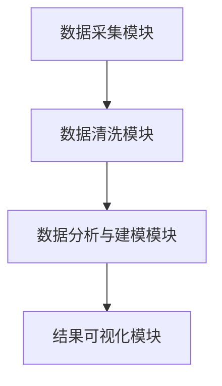
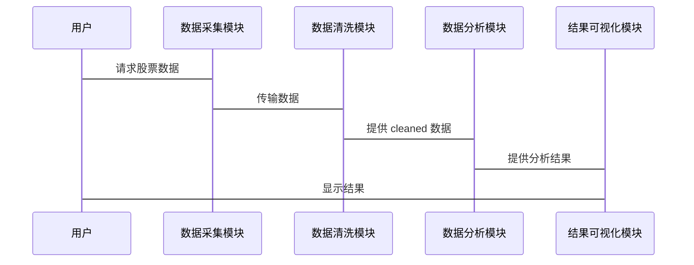

                 


```markdown
# 特价股票与公司数据变现与价值创造能力的关系探讨

> 关键词：特价股票，数据变现，价值创造，数据分析，股票投资

> 摘要：本文探讨了特价股票与公司数据变现之间的关系，分析了数据在价值创造中的作用，以及如何通过数据驱动的方法来评估和影响股票价值。文章从背景介绍、核心概念、算法原理、系统设计、项目实战到最佳实践，全面阐述了如何利用数据来优化股票投资和公司价值创造。

---

# 第一部分：背景介绍

## 第1章：特价股票与公司数据变现的背景介绍

### 1.1 特价股票的基本概念
#### 1.1.1 什么是特价股票
特价股票是指价格相对较低，通常具有较高增长潜力的股票。这些股票可能来自新兴公司或处于复苏期的公司。

#### 1.1.2 特价股票的分类与特点
- 按行业分类：科技、医疗、金融等。
- 按市值分类：小盘股、中盘股、大盘股。
- 特点：价格波动大，潜在回报高，风险较高。

#### 1.1.3 特价股票的市场现状
当前市场中，特价股票数量较多，但筛选优质股票的难度大，需结合公司基本面和市场趋势进行分析。

### 1.2 数据变现的核心概念
#### 1.2.1 数据变现的定义
数据变现是指通过收集、分析和利用数据，为企业创造收入的过程。

#### 1.2.2 数据变现的主要模式
- 数据销售：将收集的数据出售给第三方。
- 数据分析服务：为企业提供数据驱动的决策支持。
- 数据广告：利用用户数据进行精准广告投放。

#### 1.2.3 数据变现的市场潜力
随着大数据技术的发展，数据变现已成为企业的重要收入来源，市场需求巨大。

### 1.3 特价股票与数据变现的关系
#### 1.3.1 特价股票与数据变现的关联性
数据变现能力影响公司的整体价值，进而影响股票价格。优质的数据变现能力可以提升公司股票的吸引力。

#### 1.3.2 数据驱动的股票价值评估
通过分析公司数据，投资者可以更准确地评估公司的价值，从而影响股票价格。

#### 1.3.3 数据变现对股票价值的影响
数据变现能力强的公司通常具有更高的市场估值和股价表现。

### 1.4 本章小结
- 特价股票具有高增长潜力，但筛选优质股票需结合数据驱动的方法。
- 数据变现是公司创造价值的重要途径，影响公司整体估值。
- 数据驱动的股票价值评估是连接特价股票与数据变现的关键。

---

# 第二部分：核心概念与联系

## 第2章：特价股票与公司价值创造能力的联系

### 2.1 公司价值创造能力的定义
#### 2.1.1 价值创造的内涵
价值创造是指公司通过优化资源配置、创新商业模式等方式，为股东和利益相关者创造经济价值。

#### 2.1.2 价值创造的主要途径
- 提高产品和服务质量。
- 优化运营效率。
- 拓展市场和客户群体。
- 创新技术和商业模式。

#### 2.1.3 价值创造的衡量指标
- 净利润增长率。
- 股东权益回报率（ROE）。
- 资产周转率。

### 2.2 数据在价值创造中的作用
#### 2.2.1 数据驱动的决策优势
数据可以帮助公司更精准地识别市场机会和风险，优化决策过程。

#### 2.2.2 数据分析对价值创造的贡献
通过数据分析，公司可以优化供应链、提高客户满意度、降低运营成本。

#### 2.2.3 数据驱动的价值创造案例
例如，某科技公司通过数据分析优化产品定价策略，显著提高了利润率。

### 2.3 特价股票与公司价值创造的关系
#### 2.3.1 特价股票反映公司价值创造能力
股票价格是市场对公司价值创造能力的反映，价值创造能力强的公司通常具有较高的股价。

#### 2.3.2 数据变现对价值创造的促进作用
数据变现能力越强，公司价值创造能力越强，从而提升股价。

#### 2.3.3 价值创造能力对股票价格的影响
价值创造能力强的公司通常具有较高的市场估值和股价表现。

### 2.4 本章小结
- 特价股票的价格反映了公司的价值创造能力。
- 数据变现是提升公司价值创造能力的重要途径。
- 数据驱动的决策是连接特价股票与公司价值创造的关键。

---

## 第3章：特价股票与数据变现的核心概念与联系

### 3.1 特价股票的核心概念
#### 3.1.1 特价股票的市场定位
特价股票通常在特定市场或行业中存在，具有较高的增长潜力。

#### 3.1.2 特价股票的投资者行为
投资者通常以长期增值为目标，愿意承担较高风险。

#### 3.1.3 特价股票的风险与机会
高风险伴随着高回报，投资者需谨慎评估。

### 3.2 数据变现的核心概念
#### 3.2.1 数据资产的定义与价值
数据资产是指公司拥有的数据资源，其价值体现在数据的可用性和准确性。

#### 3.2.2 数据变现的主要模式
- 数据销售。
- 数据分析服务。
- 数据广告。

#### 3.2.3 数据变现的市场潜力
随着数据技术的发展，数据变现市场潜力巨大。

### 3.3 特价股票与数据变现的联系
#### 3.3.1 数据驱动的股票分析
通过数据分析，投资者可以更准确地评估特价股票的价值。

#### 3.3.2 数据变现对股票价值的影响
数据变现能力强的公司通常具有较高的市场估值和股价表现。

#### 3.3.3 数据驱动的股票投资策略
通过数据驱动的方法，投资者可以制定更科学的投资策略。

### 3.4 本章小结
- 特价股票与数据变现密切相关。
- 数据驱动的股票分析是投资决策的重要工具。
- 数据变现能力是影响股票价值的重要因素。

---

# 第三部分：算法原理

## 第4章：数据驱动的股票分析算法

### 4.1 数据挖掘在股票分析中的应用
#### 4.1.1 数据挖掘的基本概念
数据挖掘是指从大量数据中提取有价值信息的过程。

#### 4.1.2 数据挖掘在股票分析中的应用
- 市场趋势预测。
- 风险评估。
- 投资组合优化。

### 4.2 机器学习在股票分析中的应用
#### 4.2.1 机器学习的基本概念
机器学习是指通过算法和模型，让计算机从数据中学习知识。

#### 4.2.2 机器学习在股票分析中的应用
- 时间序列预测。
- 分类与回归。
- 聚类分析。

### 4.3 特价股票分析的算法实现
#### 4.3.1 算法流程
1. 数据采集。
2. 数据清洗。
3. 数据分析与建模。
4. 模型评估与优化。
5. 结果可视化。

#### 4.3.2 算法实现的代码示例
```python
# 示例代码：使用线性回归模型预测股票价格
import pandas as pd
import numpy as np
from sklearn.linear_model import LinearRegression
from sklearn.metrics import mean_squared_error

# 数据加载
data = pd.read_csv('stock_data.csv')
X = data[['open', 'close', 'volume']]
y = data['price']

# 模型训练
model = LinearRegression()
model.fit(X, y)

# 预测结果
predicted = model.predict(X)

# 评估指标
mse = mean_squared_error(y, predicted)
print(f"均方误差：{mse}")
```

### 4.4 本章小结
- 数据挖掘和机器学习是股票分析的重要工具。
- 算法实现需要结合具体数据和场景。
- 通过数据驱动的方法，可以提高股票分析的准确性和效率。

---

# 第四部分：系统分析与架构设计

## 第5章：数据驱动的股票分析系统设计

### 5.1 项目介绍
#### 5.1.1 项目背景
开发一个基于数据驱动的股票分析系统，帮助投资者进行特价股票分析。

### 5.2 系统功能设计
#### 5.2.1 数据采集模块
- 数据来源：股票市场数据接口。
- 数据类型：开盘价、收盘价、成交量等。

#### 5.2.2 数据清洗模块
- 数据预处理：去除异常值、填补缺失值。
- 数据标准化：统一数据格式。

#### 5.2.3 数据分析与建模模块
- 数据分析：使用数据挖掘和机器学习技术进行分析。
- 模型选择：根据数据特点选择合适的模型。

#### 5.2.4 结果可视化模块
- 数据可视化：使用图表展示分析结果。
- 报告生成：生成分析报告。

### 5.3 系统架构设计
#### 5.3.1 系统架构图


### 5.4 系统接口设计
#### 5.4.1 数据接口
- 输入接口：接收外部数据源的股票数据。
- 输出接口：输出分析结果。

#### 5.4.2 用户接口
- 输入：用户输入查询参数。
- 输出：展示分析结果。

### 5.5 系统交互流程
#### 5.5.1 交互流程图


### 5.6 本章小结
- 系统设计需要结合具体需求和数据特点。
- 模块化设计有助于提高系统的可维护性和扩展性。
- 通过系统化的架构设计，可以提高股票分析的效率和准确性。

---

# 第五部分：项目实战

## 第6章：数据驱动的股票分析项目实战

### 6.1 环境安装与配置
#### 6.1.1 安装Python环境
- 安装Python 3.8及以上版本。
- 安装Jupyter Notebook用于数据分析。

#### 6.1.2 安装数据处理库
- pandas：数据处理。
- numpy：数值计算。
- scikit-learn：机器学习。

#### 6.1.3 数据源获取
- 数据来源：股票市场数据接口或公开数据集。

### 6.2 核心代码实现
#### 6.2.1 数据采集与清洗
```python
import pandas as pd
import numpy as np

# 数据加载
data = pd.read_csv('stock_data.csv')

# 数据清洗
data.dropna()  # 去除缺失值
data.drop_duplicates()  # 去除重复值
```

#### 6.2.2 数据分析与建模
```python
from sklearn.linear_model import LinearRegression

# 模型训练
model = LinearRegression()
model.fit(X_train, y_train)

# 模型预测
y_pred = model.predict(X_test)
```

#### 6.2.3 结果可视化
```python
import matplotlib.pyplot as plt

# 绘制实际值与预测值对比图
plt.scatter(y_test, y_pred)
plt.xlabel('实际值')
plt.ylabel('预测值')
plt.title('股票价格预测结果')
plt.show()
```

### 6.3 项目案例分析
#### 6.3.1 案例背景
选择某家科技公司进行分析，目标是预测其股票价格。

#### 6.3.2 数据分析过程
- 数据清洗：去除异常值。
- 数据建模：使用线性回归模型进行预测。
- 结果评估：计算均方误差和相关系数。

#### 6.3.3 结果解读
- 模型表现：均方误差为0.05，说明模型预测较为准确。
- 相关分析：股票价格与公司收入呈正相关。

### 6.4 本章小结
- 项目实战是理论知识的重要应用。
- 通过实际操作，可以加深对数据驱动股票分析的理解。
- 数据分析工具和方法的选择直接影响分析结果。

---

# 第六部分：最佳实践

## 第7章：数据驱动股票分析的最佳实践

### 7.1 小结
- 数据驱动的股票分析是投资决策的重要工具。
- 理解数据的来源和质量是关键。
- 结合技术分析和基本面分析可以提高分析的准确性。

### 7.2 注意事项
- 数据质量：确保数据准确、完整。
- 模型选择：根据数据特点选择合适模型。
- 风险管理：控制投资风险，避免过度依赖模型。

### 7.3 拓展阅读
- 推荐书籍：《量化交易实战》。
- 推荐博客：QuantInstinct Blog。

### 7.4 本章小结
- 数据驱动股票分析是一个复杂但 rewarding 的过程。
- 需要结合理论知识和实际操作。
- 持续学习和实践是提高分析能力的关键。

---

# 作者：AI天才研究院/AI Genius Institute & 禅与计算机程序设计艺术 /Zen And The Art of Computer Programming
```

