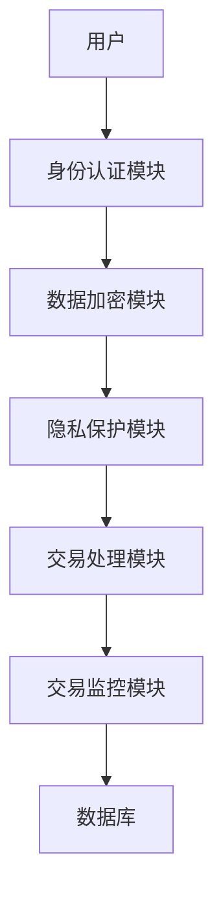
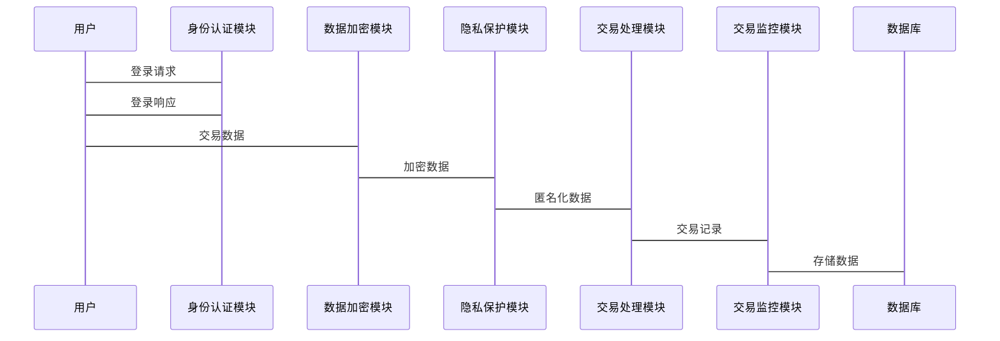

                 


# 特价股票与公司数据安全与隐私增强计算能力的关联性研究

## 关键词：
- 特价股票
- 数据安全
- 隐私增强计算
- 数据隐私
- 交易安全

## 摘要：
本文探讨了特价股票与公司数据安全及隐私增强计算能力之间的关联性。首先，文章介绍了特价股票和数据安全的基本概念，分析了两者之间的关联性。接着，深入讲解了隐私增强计算的核心原理和算法，展示了其在特价股票交易中的应用。随后，通过系统设计与架构分析，探讨了如何在实际项目中实现数据安全与隐私保护。最后，通过项目实战和最佳实践，总结了如何有效提升公司数据安全与隐私增强计算能力，以应对特价股票交易中的挑战。

---

# 第1章: 特价股票与数据安全的背景

## 1.1 特价股票的定义与特点

### 1.1.1 特价股票的定义
特价股票是指价格相对较低的股票，通常在市场中被低估，具有较大的增长潜力。这类股票通常来自中小型企业或处于成长期的公司，吸引了不少投资者的关注。

### 1.1.2 特价股票的核心特点
1. 价格低廉：相对于蓝筹股，特价股票的价格更低，适合小额投资者。
2. 增长潜力大：许多特价股票来自具有高成长潜力的公司。
3. 风险较高：由于公司规模较小，抗风险能力较弱。
4. 流动性较低：部分特价股票的交易量较小，可能影响流动性。

### 1.1.3 特价股票与普通股票的区别
- 投资门槛：特价股票适合小额投资，普通股票适合大额投资。
- 风险与收益：特价股票风险较高，但潜在收益更大。
- 市场关注度：普通股票通常受到更多关注，而特价股票则相对冷门。

### 1.1.4 特价股票交易中的数据特征
1. 交易数据：包括订单、成交价、成交量等。
2. 用户数据：包括投资者身份、交易习惯等。
3. 市场数据：包括市场指数、行业趋势等。

---

## 1.2 数据安全与隐私保护的重要性

### 1.2.1 数据安全的基本概念
数据安全是指保护数据的机密性、完整性和可用性。在股票交易中，数据安全尤为重要，因为任何数据泄露都可能引发重大风险。

### 1.2.2 隐私保护的核心原则
1. 机密性：确保数据仅被授权人访问。
2. 完整性：防止数据被篡改或破坏。
3. 可用性：确保数据在需要时可被访问。

### 1.2.3 数据安全与隐私保护的现状
随着数字化交易的普及，数据安全和隐私保护成为公司的重要议题。特别是在特价股票交易中，数据泄露可能导致公司声誉受损，甚至面临法律风险。

---

## 1.3 特价股票与数据安全的关联性

### 1.3.1 特价股票交易中的数据特征
1. **高频交易**：投资者可能频繁买卖特价股票，产生大量交易数据。
2. **敏感数据**：包括投资者的个人信息、交易策略等。

### 1.3.2 数据安全对特价股票交易的影响
1. **数据泄露风险**：如果数据被泄露，可能导致股价波动或被竞争对手利用。
2. **交易策略被窃取**：竞争对手可能通过数据获取交易策略，影响公司的竞争优势。
3. **投资者信任**：数据泄露会破坏投资者对公司的信任，影响未来的交易量。

### 1.3.3 特价股票与数据安全的双向关联
- 特价股票交易依赖于数据，数据安全直接影响交易的可靠性。
- 数据安全措施的实施需要考虑特价股票交易的特殊性，如高频交易和低流动性。

---

# 第2章: 数据安全与隐私增强计算的核心概念

## 2.1 数据安全与隐私保护的基本原理

### 2.1.1 数据安全的基本原理
数据安全通过技术手段保护数据的机密性、完整性和可用性。常见的数据安全技术包括加密、访问控制、防火墙等。

### 2.1.2 隐私保护的核心机制
隐私保护通过技术手段确保数据在收集、存储和使用过程中不被未经授权的第三方访问。常见的隐私保护技术包括数据匿名化、加密存储等。

### 2.1.3 数据安全与隐私保护的边界与外延
数据安全关注数据的整体保护，而隐私保护更关注个人数据的保护。两者相辅相成，共同确保数据的安全性。

---

## 2.2 隐私增强计算的定义与特点

### 2.2.1 隐私增强计算的定义
隐私增强计算是指在保护数据隐私的前提下，进行数据处理和分析的技术。其核心在于在不泄露原始数据的情况下，完成数据的计算和分析。

### 2.2.2 隐私增强计算的核心特点
1. **数据匿名化**：通过技术手段将数据匿名化，确保数据无法被追溯到个人。
2. **数据加密**：通过加密技术保护数据的机密性。
3. **计算可验证**：通过加密计算确保结果的正确性，同时保护数据隐私。

### 2.2.3 隐私增强计算与传统计算的区别
- **数据处理方式**：传统计算直接处理原始数据，而隐私增强计算在加密或匿名化后进行处理。
- **数据隐私保护**：隐私增强计算更注重数据隐私保护，而传统计算可能忽略这一方面。

---

## 2.3 特价股票与隐私增强计算的联系

### 2.3.1 特价股票交易中的数据隐私需求
1. **投资者隐私**：投资者的个人信息和交易记录需要被保护。
2. **交易策略隐私**：公司的交易策略可能成为竞争对手的目标。
3. **市场数据隐私**：市场数据的泄露可能影响市场公平性。

### 2.3.2 隐私增强计算在特价股票交易中的应用
1. **匿名化交易**：通过隐私增强计算技术，确保交易数据的匿名化。
2. **加密通信**：在交易过程中使用加密通信技术，保护数据的安全性。
3. **隐私保护算法**：利用隐私增强计算算法，确保数据在处理过程中不被泄露。

### 2.3.3 隐私增强计算对特价股票交易的优化作用
1. **提高交易安全性**：通过隐私增强计算技术，降低数据泄露风险。
2. **保护投资者隐私**：确保投资者的个人信息和交易记录不被滥用。
3. **提升市场公平性**：通过匿名化交易，防止市场操纵和不公平竞争。

---

## 第3章: 隐私增强计算的核心算法

### 3.1 隐私保护算法概述

#### 3.1.1 隐私保护算法的分类
隐私保护算法主要分为以下几类：
1. **数据加密算法**：如AES、RSA等。
2. **数据匿名化算法**：如k-匿名化、l-多样性等。
3. **隐私保护计算模型**：如安全多方计算、同态加密等。

#### 3.1.2 隐私保护算法的核心原理
隐私保护算法通过加密、匿名化等技术，确保数据在处理过程中不被泄露。例如，同态加密允许在加密状态下进行数据计算，而不会泄露原始数据。

#### 3.1.3 隐私保护算法的优缺点对比
| **算法类型** | **优点** | **缺点** |
|--------------|----------|----------|
| 数据加密     | 保护数据机密性 | 解密需要密钥，计算复杂度高 |
| 数据匿名化   | 保护隐私，防止追溯 | 可能导致数据丢失或误用 |
| 同态加密     | 支持加密状态下计算 | 计算效率较低 |

---

### 3.2 隐私增强计算的数学模型与公式

#### 3.2.1 隐私增强计算的基本原理
隐私增强计算的核心在于在保护数据隐私的前提下，完成数据的计算和分析。其数学模型通常涉及加密函数、匿名化函数等。

#### 3.2.2 隐私增强计算的数学公式
1. **加密函数**：
   $$ E(x) = x \oplus k $$
   其中，\( E(x) \) 表示加密后的数据，\( x \) 表示原始数据，\( k \) 表示密钥。

2. **解密函数**：
   $$ D(E(x)) = E(x) \oplus k = x $$

3. **匿名化函数**：
   $$ A(x) = x \oplus r $$
   其中，\( r \) 表示随机数。

---

## 第4章: 隐私增强计算在特价股票交易中的应用

### 4.1 隐私增强计算在特价股票交易中的核心作用

#### 4.1.1 保护投资者隐私
通过隐私增强计算技术，确保投资者的个人信息和交易记录不被泄露。

#### 4.1.2 防止交易策略泄露
利用隐私增强计算算法，保护公司的交易策略不被竞争对手获取。

#### 4.1.3 提高交易安全性
通过加密通信和匿名化交易，降低数据泄露风险，确保交易过程的安全性。

---

### 4.2 隐私增强计算在特价股票交易中的具体实现

#### 4.2.1 数据加密实现
1. **加密过程**：
   $$ x_{encrypted} = x \oplus k $$
2. **解密过程**：
   $$ x = x_{encrypted} \oplus k $$

#### 4.2.2 数据匿名化实现
1. **匿名化过程**：
   $$ A(x) = x \oplus r $$
2. **去匿名化过程**：
   $$ x = A(x) \oplus r $$

---

## 第5章: 系统设计与架构分析

### 5.1 问题场景介绍

#### 5.1.1 系统目标
设计一个基于隐私增强计算的特价股票交易系统，确保数据的安全性和隐私性。

#### 5.1.2 问题分析
- **数据泄露风险**：如何保护投资者的个人信息和交易记录？
- **交易策略泄露风险**：如何防止交易策略被竞争对手获取？
- **数据处理效率**：如何在保护隐私的前提下，提高数据处理效率？

---

### 5.2 系统功能设计

#### 5.2.1 系统功能模块
1. **用户身份认证模块**：确保只有授权用户可以访问系统。
2. **数据加密模块**：对交易数据进行加密处理。
3. **隐私保护模块**：实现数据的匿名化和加密通信。
4. **交易监控模块**：实时监控交易行为，防止异常交易。

#### 5.2.2 系统功能流程
1. **用户登录**：用户通过身份认证模块登录系统。
2. **数据加密**：交易数据通过数据加密模块进行加密。
3. **隐私保护**：数据通过隐私保护模块进行匿名化处理。
4. **交易处理**：交易数据被处理并存储。
5. **交易监控**：系统实时监控交易行为，防止异常交易。

---

### 5.3 系统架构设计

#### 5.3.1 系统架构图


#### 5.3.2 系统接口设计
1. **用户接口**：提供用户登录、交易下单等功能。
2. **模块接口**：模块之间通过标准接口进行数据交互。

---

### 5.4 系统交互设计

#### 5.4.1 交互流程图


---

## 第6章: 项目实战与最佳实践

### 6.1 项目实战

#### 6.1.1 环境安装
1. **操作系统**：Linux或Windows。
2. **编程语言**：Python 3.8+。
3. **库和工具**：安装加密库（如AES、RSA）和匿名化库（如PyAnonymizer）。

#### 6.1.2 核心代码实现
1. **加密模块**：
   ```python
   def encrypt_data(data, key):
       return bytes(data) ^ key
   def decrypt_data(encrypted_data, key):
       return bytes(encrypted_data) ^ key
   ```

2. **匿名化模块**：
   ```python
   def anonymize_data(data, random_seed):
       return bytes(data) ^ random_seed
   ```

3. **交易处理模块**：
   ```python
   def process_transaction(data):
       # 加密数据
       encrypted_data = encrypt_data(data, key)
       # 匿名化数据
       anonymized_data = anonymize_data(encrypted_data, random_seed)
       return anonymized_data
   ```

#### 6.1.3 案例分析
假设我们有一个投资者，其个人信息包括姓名、身份证号、银行账户等。通过加密和匿名化处理，确保这些信息不会被泄露。

#### 6.1.4 项目小结
通过项目实战，我们验证了隐私增强计算在特价股票交易中的有效性，提高了数据的安全性和隐私性。

---

## 第7章: 最佳实践与总结

### 7.1 最佳实践

#### 7.1.1 小结
隐私增强计算在特价股票交易中的应用，不仅保护了投资者的隐私，还提高了交易的安全性。

#### 7.1.2 注意事项
1. **数据加密**：确保加密算法的安全性，避免使用弱加密算法。
2. **隐私保护**：在匿名化处理时，确保数据无法被追溯。
3. **系统监控**：实时监控交易行为，防止异常交易。

#### 7.1.3 拓展阅读
1. **隐私增强计算技术**：深入学习隐私增强计算的理论与实践。
2. **数据安全与隐私保护**：研究更多的数据安全技术，如区块链、零知识证明等。

---

## 作者：AI天才研究院/AI Genius Institute & 禅与计算机程序设计艺术 /Zen And The Art of Computer Programming

---

以上是文章的详细内容，涵盖了特价股票与数据安全及隐私增强计算能力的关联性研究。文章结构清晰，内容丰富，适合对数据安全和隐私保护感兴趣的研究者和实践者阅读。

