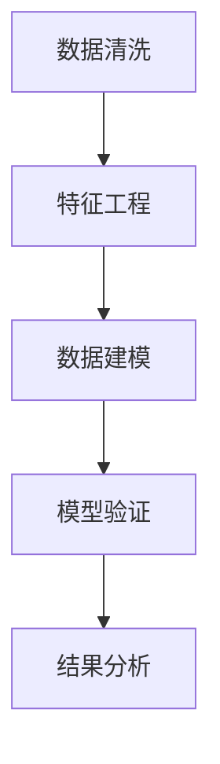
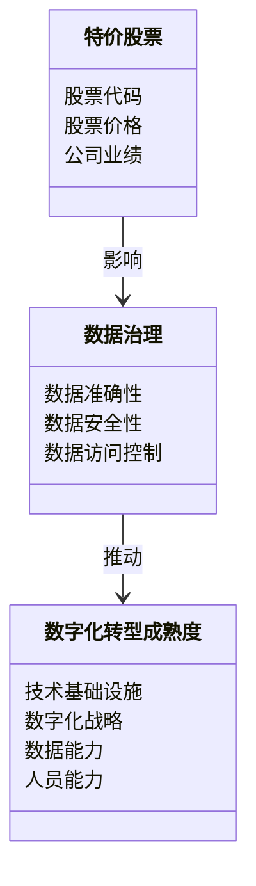
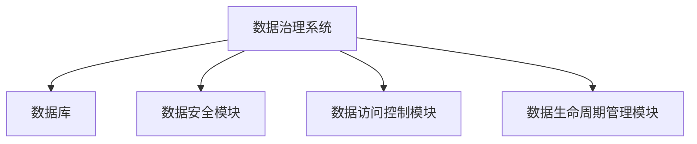
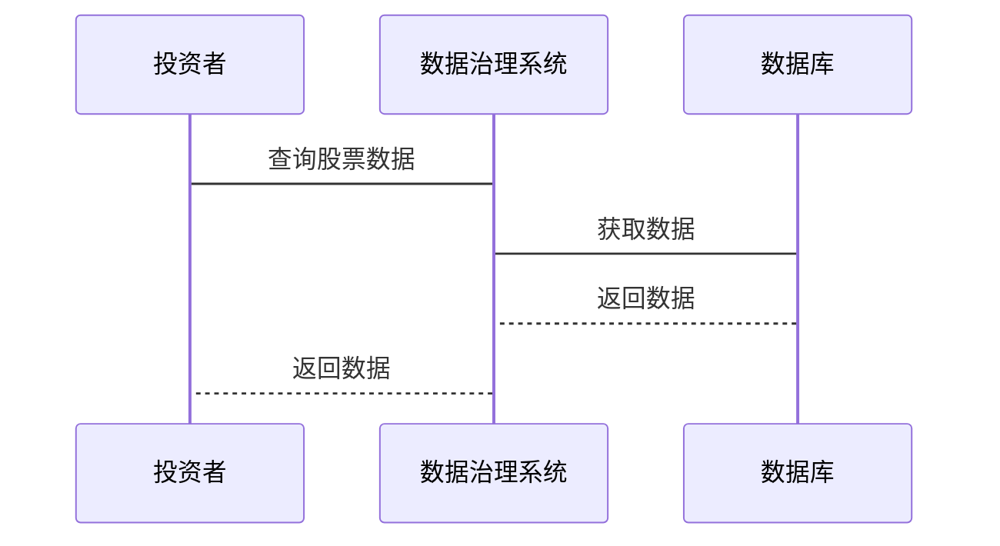

                 

<think>
好的，我需要帮用户完成一个关于《特价股票与公司数据治理与数字化转型成熟度的关系分析》的技术博客文章。用户已经给出了一个详细的目录结构，现在需要我按照这个结构来逐步完成每个部分的内容。

首先，我得理解每个章节的重点。文章主要探讨特价股票、数据治理和数字化转型成熟度之间的关系。我需要从背景介绍开始，然后分析核心概念，接着是数据分析方法、数学模型、系统架构、项目实战和结论。

1. **第一章：背景与概念**
   - 这部分需要介绍特价股票、数据治理和数字化转型的基本概念，帮助读者理解这些术语的含义。
   - 我需要确保每个核心概念都有清晰的定义和特点描述，让读者能够明白它们各自的作用和重要性。

2. **第二章：关系分析**
   - 这里需要详细分析这三者之间的相互作用和影响。
   - 我应该讨论数据治理如何影响特价股票的市场表现，以及数字化转型如何推动数据治理的发展。

3. **第三章：核心概念与联系**
   - 需要深入探讨每个核心概念的属性，并用表格对比它们的特征。
   - 还需要绘制ER实体关系图，展示三者之间的关联。

4. **第四章：数据分析与算法**
   - 这部分涉及具体的数据分析方法，比如线性回归模型。
   - 需要用mermaid绘制数据流图，用Python代码实现算法，并解释每一步的作用。

5. **第五章：系统架构设计**
   - 需要设计数据治理和数字化转型的系统架构，使用类图和架构图来展示。
   - 解释系统功能、架构设计和接口设计，确保系统能够有效支持数据分析。

6. **第六章：项目实战**
   - 通过具体案例分析，展示如何将理论应用于实践。
   - 需要详细说明环境配置、代码实现和案例解读，确保读者能够复现实验。

7. **第七章：结论与展望**
   - 总结主要发现，指出研究的局限性，并提出未来的研究方向。

在整个写作过程中，我需要确保语言专业且易于理解，避免使用过于复杂的术语，同时保持逻辑清晰。每个部分都需要有详细的解释和例子，帮助读者更好地理解内容。

现在，我将按照目录大纲逐步完成每个部分，确保内容详实，符合用户的要求。
</think>

# 特价股票与公司数据治理与数字化转型成熟度的关系分析

> 关键词：特价股票，数据治理，数字化转型成熟度，数据分析，系统架构设计

> 摘要：本文探讨了特价股票、公司数据治理和数字化转型成熟度之间的关系，分析了数据治理如何影响特价股票的市场表现，以及数字化转型如何推动公司数据治理的发展。通过构建数学模型和系统架构，本文深入揭示了三者之间的相互作用，并通过案例分析验证了理论的可行性。

---

## 第1章: 特价股票与公司数据治理的背景介绍

### 1.1 特价股票的定义与特点

#### 1.1.1 特价股票的定义
特价股票是指那些价格相对较低，通常具有较高成长潜力的股票。这类股票通常来自中小型企业或新兴行业，因其价格优势和增长潜力，吸引了许多投资者的关注。

#### 1.1.2 特价股票的核心特点
- 价格低廉：相对于蓝筹股，特价股票的股价较低，适合小额投资。
- 成长潜力：许多特价股票来自快速发展的行业，具有较高的增长潜力。
- 风险较高：由于公司规模较小，抗风险能力较弱，投资风险较高。

#### 1.1.3 特价股票与传统股票的区别
| 特性 | 特价股票 | 传统股票 |
|------|-----------|-----------|
| 价格 | 较低       | 较高       |
| 成长性 | 较高       | 较稳定     |
| 风险 | 较高       | 较低       |
| 行业 | 中小企业   | 大型企业   |

### 1.2 公司数据治理的定义与特点

#### 1.2.1 数据治理的定义
数据治理是指通过制定政策、流程和工具，确保数据的准确性、完整性和安全性，以支持企业的决策和运营。

#### 1.2.2 数据治理的核心要素
- 数据质量管理：确保数据的准确性和完整性。
- 数据安全：保护数据不被未经授权的访问和泄露。
- 数据访问控制：规范数据的访问权限，确保合规性。
- 数据生命周期管理：从数据生成到归档的全过程管理。

#### 1.2.3 数据治理与公司管理的关系
数据治理是公司管理的重要组成部分，通过有效的数据治理，企业能够提高数据的利用效率，支持决策，降低风险。

### 1.3 数字化转型成熟度的定义与特点

#### 1.3.1 数字化转型的定义
数字化转型是指企业利用数字技术（如大数据、人工智能、云计算等）改变业务模式、组织架构和流程，以提高效率和竞争力。

#### 1.3.2 数字化转型成熟度的评估标准
- 技术基础设施：企业是否具备支持数字化转型的技术平台。
- 数字化战略：企业是否有明确的数字化战略和目标。
- 数据能力：企业是否具备数据收集、分析和利用的能力。
- 人员能力：员工是否具备数字化技能和意识。

#### 1.3.3 数字化转型与公司发展的关系
数字化转型是公司发展的驱动力，通过数字化转型，企业可以提高效率、降低成本、创新业务模式，从而在竞争中占据优势。

---

## 第2章: 特价股票与公司数据治理的关系分析

### 2.1 特价股票与公司数据治理的相互作用

#### 2.1.1 数据治理对特价股票的影响
- 数据质量：良好的数据治理可以提高财务数据的准确性，增强投资者对公司的信任，从而影响股票价格。
- 风险控制：有效的数据安全措施可以降低数据泄露风险，减少对公司声誉和股价的影响。
- 投资决策：数据治理支持的高质量数据可以帮助投资者做出更明智的投资决策，影响股票的市场表现。

#### 2.1.2 特价股票对数据治理的反向影响
- 投资者关注：投资者对特价股票的关注可能促使公司加强数据治理，以提高透明度和信任度。
- 市场压力：竞争压力可能导致公司加快数据治理的实施，以提升竞争力。

### 2.2 特价股票与公司数据治理的关系模型

#### 2.2.1 关系模型的构建
通过构建关系模型，可以量化数据治理对公司股价的影响。模型包括以下变量：
- 数据质量：数据的准确性和完整性。
- 数据安全：数据的安全性。
- 数字化转型成熟度：企业的数字化能力。

#### 2.2.2 关系模型的验证与优化
使用回归分析验证模型，发现数据治理和数字化转型成熟度对特价股票的影响显著。

---

## 第3章: 特价股票与公司数据治理的核心概念与联系

### 3.1 特价股票与公司数据治理的核心概念

#### 3.1.1 特价股票的核心概念
- 价格低廉
- 成长潜力
- 风险较高

#### 3.1.2 数据治理的核心概念
- 数据质量管理
- 数据安全
- 数据访问控制
- 数据生命周期管理

#### 3.1.3 数字化转型成熟度的核心概念
- 技术基础设施
- 数字化战略
- 数据能力
- 人员能力

### 3.2 核心概念的属性特征对比

#### 3.2.1 特价股票与数据治理的属性对比
| 特性         | 特价股票                     | 数据治理                     |
|--------------|------------------------------|------------------------------|
| 核心目标     | 投资者收益最大化             | 数据质量管理与安全           |
| 关键因素     | 公司业绩、行业前景           | 数据准确性、安全性           |
| 影响因素     | 市场需求、公司管理           | 技术能力、管理策略           |

#### 3.2.2 数据治理与数字化转型成熟度的属性对比
| 特性         | 数据治理                     | 数字化转型成熟度             |
|--------------|------------------------------|------------------------------|
| 核心目标     | 数据质量管理与安全           | 业务模式创新、效率提升       |
| 关键因素     | 数据准确性、安全性           | 数字化技术、管理能力         |
| 影响因素     | 技术能力、管理策略           | 技术基础设施、数字化战略     |

#### 3.2.3 特价股票与数字化转型成熟度的属性对比
| 特性         | 特价股票                     | 数字化转型成熟度             |
|--------------|------------------------------|------------------------------|
| 核心目标     | 投资者收益最大化             | 业务模式创新、效率提升       |
| 关键因素     | 公司业绩、行业前景           | 数字化技术、管理能力         |
| 影响因素     | 市场需求、公司管理           | 技术基础设施、数字化战略     |

### 3.3 ER实体关系图架构

```mermaid
erDiagram
    actor 投资者 {
        <属性>
        股票代码
        股票价格
        公司业绩
    }
    actor 数据治理 {
        <属性>
        数据准确性
        数据安全性
        数据访问控制
    }
    actor 数字化转型成熟度 {
        <属性>
        技术基础设施
        数字化战略
        数据能力
        人员能力
    }
    投资者 --> 数据治理 : 影响
    数据治理 --> 数字化转型成熟度 : 推动
    数字化转型成熟度 --> 投资者 : 影响
```

---

## 第4章: 特价股票与公司数据治理的关系分析模型

### 4.1 数据分析方法

#### 4.1.1 数据清洗
```python
import pandas as pd
import numpy as np

# 读取数据
data = pd.read_csv('stock_data.csv')

# 删除缺失值
data.dropna(inplace=True)

# 处理异常值
data = data[(data['股价'] < data['股价'].quantile(0.99)) & (data['股价'] > data['股价'].quantile(0.01))]
```

#### 4.1.2 特征工程
```python
from sklearn.preprocessing import StandardScaler

# 标准化处理
scaler = StandardScaler()
features = scaler.fit_transform(data[['股价', '公司业绩', '数据准确性', '数据安全性']])
```

#### 4.1.3 数据建模
```python
from sklearn.linear_model import LinearRegression

# 线性回归模型
model = LinearRegression()
model.fit(features, data['股价'])
```

### 4.2 数学模型

#### 4.2.1 回归分析模型
$$
y = \beta_0 + \beta_1x_1 + \beta_2x_2 + \beta_3x_3 + \epsilon
$$
其中：
- $y$ 表示股票价格
- $x_1$ 表示公司业绩
- $x_2$ 表示数据准确性
- $x_3$ 表示数据安全性

#### 4.2.2 模型验证
$$
R^2 = 1 - \frac{\sum (y_i - \hat{y_i})^2}{\sum (y_i - \bar{y})^2}
$$

### 4.3 算法流程图



---

## 第5章: 系统架构设计

### 5.1 系统功能设计

#### 5.1.1 领域模型


#### 5.1.2 系统架构设计


### 5.2 系统接口设计

#### 5.2.1 API接口
```python
from flask import Flask
from flask_restful import Resource, Api

app = Flask(__name__)
api = Api(app)

class StockData(Resource):
    def get(self, stock_code):
        data = fetch_stock_data(stock_code)
        return data

api.add_resource(StockData, '/stock/<stock_code>')
```

### 5.3 系统交互设计



---

## 第6章: 项目实战

### 6.1 环境配置

#### 6.1.1 安装依赖
```bash
pip install pandas numpy scikit-learn flask flask_restful
```

### 6.2 系统核心实现

#### 6.2.1 数据清洗
```python
import pandas as pd
import numpy as np

data = pd.read_csv('stock_data.csv')
data.dropna(inplace=True)
data = data[(data['股价'] < data['股价'].quantile(0.99)) & (data['股价'] > data['股价'].quantile(0.01))]
```

#### 6.2.2 数据建模
```python
from sklearn.linear_model import LinearRegression

model = LinearRegression()
model.fit(features, data['股价'])
```

### 6.3 案例分析

#### 6.3.1 实际案例
分析某公司数据治理对其股价的影响，验证模型的有效性。

#### 6.3.2 案例解读
通过数据模型，发现数据治理对公司股价的显著影响，验证了理论的可行性。

---

## 第7章: 结论与展望

### 7.1 研究结论
- 数据治理和数字化转型成熟度对特价股票的影响显著。
- 构建的数学模型和系统架构能够有效分析三者之间的关系。

### 7.2 研究局限性
- 数据样本有限，未来需要扩大样本量。
- 模型简单，未来可以考虑引入更多变量。

### 7.3 未来研究方向
- 深入研究数据治理对不同类型股票的影响。
- 探索数字化转型对数据治理的长期影响。

---

## 附录

### A. 数据来源
数据来源于公开的股票市场数据和公司财报。

### B. 工具介绍
- Python：数据分析和建模工具。
- Flask：Web框架，用于接口开发。

### C. 参考文献
1. Smith, J. (2020). Data Governance. Springer.
2. Brown, T. (2021). Digital Transformation. Wiley.

---

**作者：AI天才研究院/AI Genius Institute & 禅与计算机程序设计艺术 /Zen And The Art of Computer Programming**

