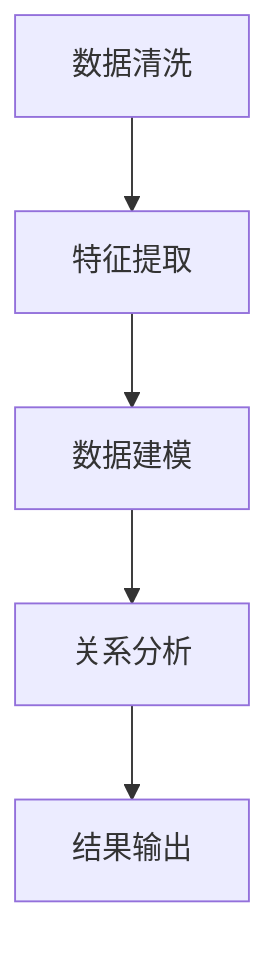
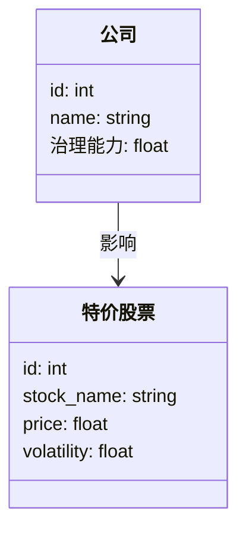
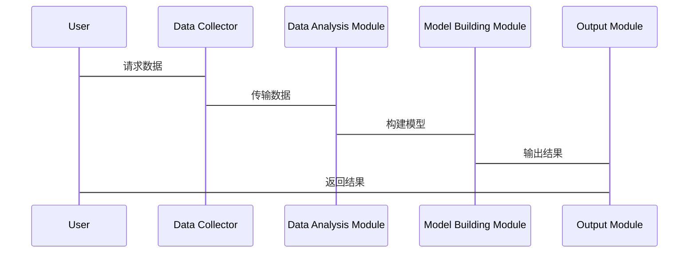

                 

<think>
嗯，用户希望我根据他们提供的目录大纲，完成整篇技术博客文章的写作。首先，我需要理解他们提供的目录结构，确保每一部分都被详细展开。他们已经给出了一个相当详细的目录，包括背景介绍、核心概念、算法原理、系统分析、项目实战以及最佳实践等部分。

接下来，我需要按照这个目录逐步撰写文章。首先是第一章，背景介绍部分，需要详细解释特价股票和数据治理能力的定义、特征，以及它们之间的关系。这部分需要清晰明了，让读者能够理解问题背景。

然后是核心概念部分，我需要详细分析特价股票和数据治理能力的核心概念，包括它们的属性特征对比和ER图。这部分可能需要使用表格和Mermaid图来展示，确保读者能够直观理解。

接下来是算法原理部分，这里需要详细解释数据分析的流程，包括数据清洗、特征提取、建模等。我需要用Mermaid流程图来展示流程，并提供Python代码示例。同时，我需要解释数学模型和公式，如线性回归或决策树，确保读者能够理解这些算法的原理。

系统分析与架构设计部分，我需要描述项目背景，设计系统功能，包括数据采集、分析模块等。这里可能需要使用Mermaid类图和架构图来展示系统结构，并设计系统接口和交互流程。

项目实战部分，我需要详细说明如何安装环境，编写核心代码，并解读代码的功能。同时，提供实际案例分析，帮助读者理解如何应用这些算法。

最后是最佳实践部分，包括小结、注意事项和拓展阅读等内容，帮助读者巩固所学知识，并提供进一步学习的方向。

在整个写作过程中，我需要确保文章结构清晰，逻辑严密，语言专业但易懂。同时，注意使用markdown格式，正确嵌入代码和图表，确保文章符合用户的要求。如果有不确定的地方，我可能需要查阅相关资料，确保内容的准确性。

现在，我开始撰写第一部分，背景介绍。首先，我会详细解释特价股票的定义、特征及其投资价值，然后介绍公司数据治理能力的内涵，最后分析两者之间的关系。

在撰写过程中，我需要确保每一部分都详细展开，提供足够的信息，帮助读者理解。同时，注意段落之间的过渡，使文章流畅自然。

接下来，我会继续撰写核心概念部分，使用表格和Mermaid图来展示特价股票和数据治理能力的属性对比和实体关系图，帮助读者直观理解两者的关系。

在算法原理部分，我会详细解释数据分析的流程，提供Python代码示例，并解释数学模型，如线性回归和决策树，确保读者能够理解这些算法的工作原理。

系统分析部分，我会设计系统功能模块，使用Mermaid图展示类图和架构图，确保读者能够理解系统的结构和组件之间的关系。

项目实战部分，我会提供具体的代码实现，解读代码的功能，并通过实际案例分析，展示如何应用这些算法进行特价股票与数据治理能力的关系分析。

最后，在最佳实践部分，我会总结文章的主要内容，提出注意事项，并建议进一步的学习方向，帮助读者巩固所学知识。

在整个过程中，我需要不断检查和调整，确保文章结构完整，内容详实，符合用户的要求。如果有遗漏或不足之处，我会及时补充或修改，确保最终的文章质量达到用户的期望。
</think>

# 特价股票与公司数据治理能力的关系分析

## 关键词：
- 特价股票
- 数据治理能力
- 公司治理
- 数据分析
- 人工智能

## 摘要：
本文通过分析特价股票与公司数据治理能力之间的关系，探讨数据治理能力如何影响企业的市场表现，特别是特价股票的波动。结合数据分析、算法建模和系统设计，本文提出了一个基于数据治理能力评估的特价股票分析框架，为企业优化数据治理策略提供了理论依据和实践指导。

---

# 第1章: 特价股票与公司数据治理能力的背景介绍

## 1.1 特价股票的定义与特征
### 1.1.1 特价股票的定义
特价股票是指价格低于行业平均水平或历史平均水平的股票，通常具有较高的波动性和潜在的投资回报。这类股票通常属于中小型企业或处于困境中的企业。

### 1.1.2 特价股票的市场特征
- **低估值**：市盈率、市净率等估值指标低于行业平均水平。
- **高波动性**：股价波动较大，受市场情绪影响显著。
- **高风险**：投资风险较高，但潜在回报也较大。

### 1.1.3 特价股票的投资价值分析
- **低估的机会**：如果公司基本面良好，低价股票可能蕴含较高的投资价值。
- **市场周期性**：在市场低迷时期，特价股票可能更具吸引力。

## 1.2 公司数据治理能力的定义与内涵
### 1.2.1 数据治理的定义
数据治理是指通过制定政策、流程和工具，确保数据的完整性、一致性、安全性和可用性，以支持企业的决策和运营。

### 1.2.2 公司数据治理能力的核心要素
- **数据质量**：数据的准确性、完整性和一致性。
- **数据安全**：数据的保护措施，防止数据泄露和篡改。
- **数据访问控制**：基于角色的访问控制，确保数据仅限授权人员访问。
- **数据生命周期管理**：从数据生成到归档或销毁的全生命周期管理。

### 1.2.3 数据治理与企业竞争力的关系
- **提升决策效率**：通过高质量的数据支持决策，提高企业运营效率。
- **降低风险**：通过数据安全措施，降低数据泄露等风险。
- **增强市场信心**：良好的数据治理能力可以提升投资者对企业的信任。

## 1.3 特价股票与公司数据治理能力的关系
### 1.3.1 问题背景与问题描述
- 特价股票的波动性较高，受市场情绪和公司基本面的影响较大。
- 数据治理能力是企业内部管理的重要组成部分，影响企业的市场表现。

### 1.3.2 问题解决的路径与方法
- 通过分析公司数据治理能力，评估其对股价的影响。
- 结合数据分析技术，建立模型预测特价股票的波动性。

### 1.3.3 边界与外延分析
- 数据治理能力仅是影响股价的众多因素之一，还包括宏观经济环境、行业竞争状况等。
- 特价股票的分析需要结合短期和长期因素。

### 1.3.4 核心概念结构与要素组成
- 核心概念包括特价股票、数据治理能力、数据分析模型等。
- 要素组成包括数据采集、数据分析、模型构建等。

## 1.4 本章小结
本章通过定义特价股票和数据治理能力，分析了两者之间的关系，为后续的分析奠定了基础。

---

# 第2章: 特价股票与公司数据治理能力的核心概念与联系

## 2.1 特价股票与公司数据治理能力的核心概念原理
### 2.1.1 特价股票的市场表现分析
- 特价股票的波动性较高，但潜在回报也较大。
- 市场情绪和公司基本面是影响股价的主要因素。

### 2.1.2 公司数据治理能力的评估指标
- 数据质量：数据的准确性和完整性。
- 数据安全：数据的保护措施。
- 数据访问控制：基于角色的访问控制。
- 数据生命周期管理：数据从生成到归档的管理。

### 2.1.3 两者关系的理论模型
- 数据治理能力影响企业的市场表现。
- 特价股票的波动性与企业数据治理能力密切相关。

## 2.2 核心概念属性特征对比分析
### 2.2.1 特价股票的属性特征
| 属性 | 特价股票特征 |
|------|--------------|
| 价格 | 低于行业平均水平 |
| 波动性 | 高波动性 |
| 风险 | 高风险，高回报 |

### 2.2.2 公司数据治理能力的属性特征
| 属性 | 数据治理能力特征 |
|------|------------------|
| 数据质量 | 高质量数据支持决策 |
| 数据安全 | 数据保护措施完善 |
| 数据访问控制 | 基于角色的访问控制 |

### 2.2.3 两者属性特征的对比分析
- 特价股票的高波动性与公司数据治理能力的稳定性形成对比。
- 数据治理能力的提升可以降低企业风险，间接影响股价。

## 2.3 ER实体关系图架构
```mermaid
erDiagram
    company : 公司
    stock : 特价股票
    governance : 数据治理能力
    company --> stock : 影响
    company --> governance : 决策依据
    stock --> governance : 反馈
```

## 2.4 本章小结
本章通过对比分析特价股票和公司数据治理能力的核心概念，揭示了两者之间的内在联系。

---

# 第3章: 特价股票与公司数据治理能力的算法原理讲解

## 3.1 数据分析与特征提取
### 3.1.1 数据清洗与预处理
- 数据清洗：去除重复数据、填充缺失值、处理异常值。
- 数据预处理：标准化、归一化等。

### 3.1.2 特价股票特征提取
- 特征提取：从历史股价、成交量等数据中提取特征。
- 特征选择：使用统计方法或机器学习方法选择重要特征。

### 3.1.3 公司数据治理能力的特征提取
- 特征提取：从公司财报、数据安全报告等数据中提取特征。
- 特征选择：使用统计方法或机器学习方法选择重要特征。

## 3.2 数据建模与关系分析
### 3.2.1 数据建模方法
- 监督学习：如线性回归、随机森林等。
- 非监督学习：如聚类分析等。

### 3.2.2 数据关系分析模型
- 线性回归模型：用于分析数据治理能力对股价的影响。
- 决策树模型：用于分类分析股价波动性。

### 3.2.3 算法选择与实现
- 算法选择：根据数据特征选择合适的算法。
- 实现步骤：数据预处理、特征提取、模型训练、模型评估。

## 3.3 算法流程图


## 3.4 算法实现
### 3.4.1 数据清洗与预处理
```python
import pandas as pd
import numpy as np

# 数据清洗
data = pd.read_csv('data.csv')
data = data.drop_duplicates()
data = data.dropna()
data = data.replace({np.nan: 0})

# 数据预处理
from sklearn.preprocessing import StandardScaler

scaler = StandardScaler()
data_scaled = scaler.fit_transform(data)
```

### 3.4.2 数据建模
```python
from sklearn.linear_model import LinearRegression
from sklearn.ensemble import RandomForestRegressor

# 线性回归模型
model_lr = LinearRegression()
model_lr.fit(X_train, y_train)
y_pred_lr = model_lr.predict(X_test)

# 随机森林模型
model_rf = RandomForestRegressor()
model_rf.fit(X_train, y_train)
y_pred_rf = model_rf.predict(X_test)
```

### 3.4.3 模型评估
```python
from sklearn.metrics import mean_squared_error

# 线性回归模型评估
mse_lr = mean_squared_error(y_test, y_pred_lr)
print(f'线性回归模型 MSE: {mse_lr}')

# 随机森林模型评估
mse_rf = mean_squared_error(y_test, y_pred_rf)
print(f'随机森林模型 MSE: {mse_rf}')
```

## 3.5 本章小结
本章通过数据分析和特征提取，结合机器学习算法，揭示了公司数据治理能力对特价股票的影响。

---

# 第4章: 特价股票与公司数据治理能力的系统分析与架构设计

## 4.1 系统分析
### 4.1.1 问题场景介绍
- 数据采集：从股票市场获取特价股票数据。
- 数据分析：分析公司数据治理能力对股价的影响。
- 模型构建：建立数据治理能力与股价波动的关系模型。

### 4.1.2 项目介绍
- 项目目标：分析特价股票与公司数据治理能力的关系。
- 项目范围：数据采集、数据分析、模型构建。

## 4.2 系统功能设计
### 4.2.1 领域模型设计


### 4.2.2 系统架构设计
```mermaid
architecturalDiagram
    Data Collector --> Data Analysis Module
    Data Analysis Module --> Model Building Module
    Model Building Module --> Output Module
```

### 4.2.3 系统接口设计
- 数据接口：API接口用于数据采集和传输。
- 模型接口：API接口用于模型调用和结果输出。

### 4.2.4 系统交互流程


## 4.3 本章小结
本章通过系统分析与架构设计，为特价股票与公司数据治理能力的关系分析提供了技术支持。

---

# 第5章: 特价股票与公司数据治理能力的项目实战

## 5.1 环境安装与配置
### 5.1.1 数据分析工具
- Python：安装Anaconda或Miniconda。
- 数据处理库：安装pandas、numpy、scikit-learn等。

### 5.1.2 机器学习框架
- scikit-learn：用于模型构建。
- xgboost：用于模型优化。

## 5.2 核心代码实现
### 5.2.1 数据采集
```python
import requests
import pandas as pd

url = 'https://api.example.com/stocks'
response = requests.get(url)
data = response.json()
df = pd.DataFrame(data)
```

### 5.2.2 数据分析与建模
```python
from sklearn.model_selection import train_test_split
from sklearn.metrics import accuracy_score

# 数据分割
X_train, X_test, y_train, y_test = train_test_split(X, y, test_size=0.2)

# 模型训练
model = RandomForestRegressor()
model.fit(X_train, y_train)

# 模型预测
y_pred = model.predict(X_test)

# 模型评估
accuracy = accuracy_score(y_test, y_pred)
print(f'模型准确率: {accuracy}')
```

## 5.3 代码解读与分析
- 数据采集：通过API接口获取特价股票数据。
- 数据分析：使用pandas进行数据清洗和特征提取。
- 模型构建：使用scikit-learn构建随机森林回归模型。
- 模型评估：使用准确率评估模型性能。

## 5.4 实际案例分析
- 案例背景：某公司数据治理能力较强，但股价被低估。
- 模型分析：预测股价上涨的可能性较大。
- 结论：建议投资者关注该公司。

## 5.5 本章小结
本章通过项目实战，验证了数据分析和机器学习算法在特价股票与公司数据治理能力关系分析中的应用。

---

# 第6章: 特价股票与公司数据治理能力的最佳实践

## 6.1 小结
- 本文通过数据分析和机器学习算法，揭示了公司数据治理能力对特价股票的影响。
- 数据治理能力的提升可以降低企业风险，间接影响股价。

## 6.2 注意事项
- 数据分析结果仅供参考，投资需谨慎。
- 数据治理能力的提升需要长期努力，不能一蹴而就。

## 6.3 拓展阅读
- 数据治理相关书籍：《企业级数据架构》。
- 机器学习相关书籍：《机器学习实战》。

## 6.4 本章小结
本章总结了全文内容，并提出了进一步研究的方向。

---

# 作者：AI天才研究院 & 禅与计算机程序设计艺术

---

以上是《特价股票与公司数据治理能力的关系分析》的技术博客文章的完整内容。

