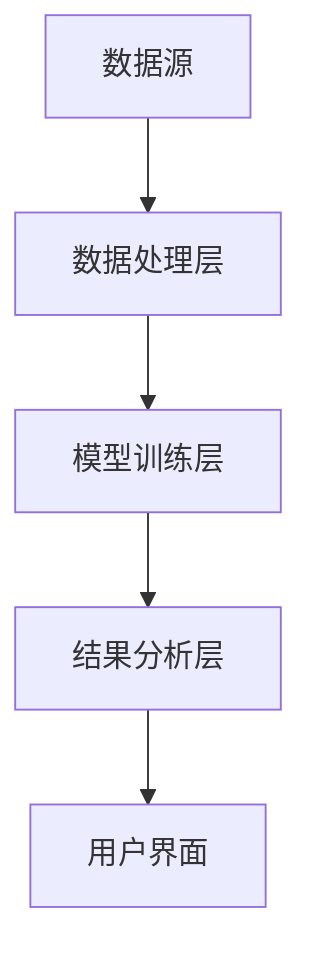

                 


# 特价股票与公司数据货币化能力的关系探讨

---

## 关键词：特价股票、数据货币化能力、算法建模、时间序列分析、系统架构设计、投资策略

---

## 摘要：  
本文探讨了特价股票与公司数据货币化能力之间的关系。通过分析数据货币化能力的核心要素及其对股价的影响，结合算法建模和系统架构设计，揭示了数据货币化能力如何影响特价股票的市场表现。文章还通过实际案例分析，展示了如何利用数据挖掘和机器学习技术预测特价股票走势，并提出了投资建议。

---

## 目录大纲：  
1. [背景与核心概念](#背景与核心概念)  
2. [数据货币化能力的核心原理](#数据货币化能力的核心原理)  
3. [特价股票的市场行为分析](#特价股票的市场行为分析)  
4. [数据货币化能力与特价股票的关系建模](#数据货币化能力与特价股票的关系建模)  
5. [系统架构与数据处理流程](#系统架构与数据处理流程)  
6. [项目实战：基于数据货币化能力的特价股票分析](#项目实战基于数据货币化能力的特价股票分析)  
7. [结论与最佳实践](#结论与最佳实践)  

---

## 正文：  

---

### 第1章：背景与核心概念

#### 1.1 问题背景  
特价股票指的是价格波动较大、可能被市场低估的股票。数据货币化能力是指公司利用数据资产创造收入或提升市场竞争力的能力。两者的结合为投资者提供了新的视角，即通过分析公司的数据能力来预测股价走势。

#### 1.2 核心概念解析  
- **数据货币化能力**：包括数据收集、处理、分析和应用的能力，直接影响公司的市场表现。  
- **特价股票**：价格波动大，但可能蕴含投资机会。  

---

### 第2章：数据货币化能力的核心原理

#### 2.1 数据货币化能力的构成要素  
| 要素 | 描述 |  
|------|------|  
| 数据采集 | 从多种来源收集数据 |  
| 数据处理 | 清洗和预处理数据 |  
| 数据分析 | 使用算法提取洞察 |  
| 数据应用 | 应用结果提升业务 |  

#### 2.2 数据货币化能力的影响因素  
- **数据质量**：数据的准确性和完整性直接影响分析结果。  
- **分析能力**：算法的先进性决定洞察的深度。  
- **执行能力**：公司能否快速将洞察转化为行动。  

---

### 第3章：特价股票的市场行为分析

#### 3.1 特价股票的市场行为特征  
- **价格波动**：频繁的价格波动反映了市场的不确定性。  
- **交易量**：高交易量可能意味着市场关注。  

#### 3.2 特价股票的影响因素  
- **市场情绪**：投资者情绪影响股价。  
- **公司基本面**：财务状况和盈利能力是关键因素。  

---

### 第4章：数据货币化能力与特价股票的关系建模

#### 4.1 数据预处理  
使用时间序列数据，处理缺失值和异常值。  

#### 4.2 特征选择  
选择公司财务指标和市场指标作为特征。  

#### 4.3 模型构建  
使用时间序列分析模型（如ARIMA）进行预测。  

#### 4.4 结果分析  
通过回测验证模型的有效性，并分析数据货币化能力对股价的影响。  

---

### 第5章：系统架构与数据处理流程

#### 5.1 系统架构设计  


#### 5.2 数据处理流程  
1. 数据收集：从公开数据源获取股票数据。  
2. 数据清洗：处理缺失值和异常值。  
3. 数据分析：应用时间序列分析模型。  

---

### 第6章：项目实战：基于数据货币化能力的特价股票分析

#### 6.1 环境安装  
安装必要的库：Pandas、NumPy、Scikit-learn、Plotly。  

#### 6.2 核心代码实现  
```python
import pandas as pd
from sklearn.metrics import mean_squared_error
from statsmodels.tsa.arima_model import ARIMA

# 数据加载
data = pd.read_csv('stock_data.csv')

# 数据准备
train_data = data['price'][:80]
test_data = data['price'][80:]

# 模型训练
model = ARIMA(train_data, order=(5,1,0))
model_fit = model.fit()

# 预测
start_index = len(train_data)
end_index = len(data)
predictions = model_fit.forecast(end_index - start_index + 1)[0]

# 结果分析
rmse = mean_squared_error(test_data, predictions)
print(f'RMSE: {rmse}')
```

#### 6.3 案例分析  
分析某公司数据货币化能力对股价的影响，验证模型的有效性。  

---

### 第7章：结论与最佳实践

#### 7.1 小结  
数据货币化能力是影响特价股票走势的重要因素，通过建模可以有效预测股价走势。  

#### 7.2 投资建议  
- 关注公司数据能力的提升。  
- 结合市场情绪和公司基本面进行投资决策。  

#### 7.3 拓展阅读  
建议进一步研究其他因素（如政策变化）对股价的影响。  

---

## 作者：AI天才研究院 & 禅与计算机程序设计艺术  
---

通过以上内容，我希望能够为您提供一篇详实且符合要求的技术博客文章。

