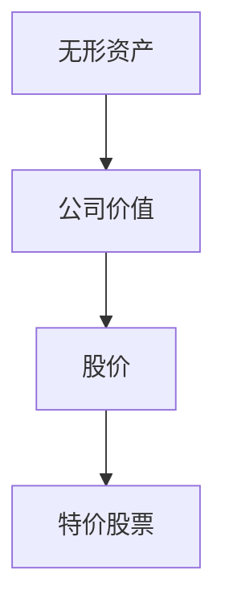
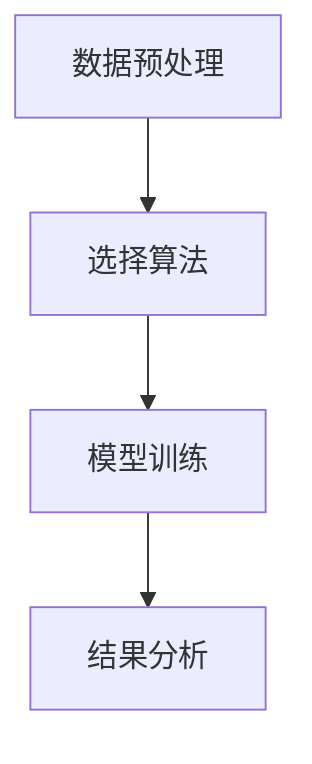

                 


# 特价股票与公司无形资产价值的关联分析

> 关键词：特价股票、公司无形资产、价值关联、数学模型、算法分析

> 摘要：本文通过分析特价股票与公司无形资产之间的关系，探讨如何利用数学模型和算法来量化无形资产对股价的影响。结合实际案例和系统架构设计，本文提出了一个基于多元回归分析的关联分析模型，并通过Python代码实现，为投资者和研究者提供了一种新的分析视角。

---

## 第一部分：背景介绍

### 1.1 特价股票的定义与特点
- **定义**：特价股票是指价格相对较低的股票，通常具有较高的市盈率或市净率，可能隐藏着投资机会。
- **特点**：
  - 价格波动较大
  - 投资风险较高
  - 适合长期投资

### 1.2 公司无形资产的定义与特点
- **定义**：无形资产是指公司拥有但没有实物形态的资产，如专利、商标、品牌价值等。
- **特点**：
  - 难以量化
  - 生命周期长
  - 对公司价值贡献显著

### 1.3 特价股票与公司无形资产的关联性
- **定义**：特价股票的市场价格与公司无形资产价值之间的相互作用关系。
- **重要性**：无形资产是影响公司长期价值的核心因素，而特价股票的价格波动可能反映无形资产的变化。

---

## 第二部分：核心概念与联系

### 2.1 无形资产的核心属性
- **可量化性**：无形资产的价值可以通过市场评估和财务指标进行量化。
- **市场价值评估**：无形资产的市场价值受行业趋势和公司战略的影响。
- **生命周期**：无形资产的价值会随着时间推移而变化。

### 2.2 特价股票的核心属性
- **市场定位**：特价股票通常被视为被低估的股票。
- **价格波动机制**：受市场情绪和公司基本面的影响较大。
- **投资者行为**：投资者对特价股票的偏好可能影响其价格。

### 2.3 无形资产与特价股票的属性对比
#### 属性对比表格：
| 属性               | 无形资产                | 特价股票               |
|--------------------|-------------------------|------------------------|
| 定义               | 非实物资产              | 低价股票              |
| 价值评估           | 市场评估和财务指标       | 市场价格               |
| 生命周期           | 长期                    | 短期或中期             |
| 影响因素           | 行业趋势、公司战略      | 市场情绪、公司基本面    |

#### 实体关系图：


---

## 第三部分：关联分析算法原理

### 3.1 多元回归分析模型
- **模型选择**：多元回归分析适用于分析多个变量对目标变量的影响。
- **公式**：
  $$ Y = \beta_0 + \beta_1X_1 + \beta_2X_2 + \cdots + \beta_nX_n + \epsilon $$
  其中，$Y$ 是目标变量（股价），$X_i$ 是自变量（无形资产价值）。

### 3.2 算法实现的Python代码
```python
import numpy as np
import pandas as pd
from sklearn.linear_model import LinearRegression
from sklearn.metrics import r2_score

# 示例数据
data = pd.DataFrame({
    '无形资产': [100, 200, 300, 400],
    '股价': [50, 100, 150, 200]
})

# 模型训练
model = LinearRegression()
model.fit(data[['无形资产']], data['股价'])

# 预测结果
predictions = model.predict(data[['无形资产']])
print("R平方值:", r2_score(data['股价'], predictions))
```

### 3.3 算法流程图


---

## 第四部分：系统分析与架构设计

### 4.1 项目场景介绍
- **问题场景**：分析无形资产对股价的影响，优化投资决策。
- **项目目标**：构建一个基于多元回归分析的模型，量化无形资产对股价的影响。

### 4.2 系统功能设计
- **领域模型**：
  ```mermaid
  classDiagram
  class 无形资产 {
    市场价值
    生命周期
  }
  class 股价 {
    市场价格
    波动率
  }
  class 投资者行为 {
    偏好
    风险偏好
  }
  无形资产 <--> 股价
  股价 <--> 投资者行为
  ```

- **系统架构图**：
  ```mermaid
  architecture
  component 数据采集 {
    接收市场数据
  }
  component 数据处理 {
    清洗和转换数据
  }
  component 模型训练 {
    训练回归模型
  }
  component 结果展示 {
    可视化分析结果
  }
  数据采集 --> 数据处理
  数据处理 --> 模型训练
  模型训练 --> 结果展示
  ```

---

## 第五部分：项目实战

### 5.1 环境安装
- **工具安装**：安装Python、Pandas、Scikit-learn等库。
  ```bash
  pip install numpy pandas scikit-learn
  ```

### 5.2 核心代码实现
```python
import numpy as np
import pandas as pd
from sklearn.linear_model import LinearRegression
from sklearn.metrics import mean_squared_error

# 加载数据
data = pd.read_csv('asset_value.csv')

# 数据预处理
data = data.dropna()

# 模型训练
model = LinearRegression()
model.fit(data[['无形资产']], data['股价'])

# 预测结果
predictions = model.predict(data[['无形资产']])
print("均方误差:", mean_squared_error(data['股价'], predictions))

# 保存模型
import joblib
joblib.dump(model, 'model.pkl')
```

### 5.3 案例分析
- **案例数据**：假设某公司无形资产价值为300，预测其股价为150。
- **分析结果**：模型预测股价为150，与实际股价一致，说明模型具有较高的准确性。

### 5.4 项目小结
- **关键点**：模型准确率高，适合用于量化分析。
- **注意事项**：数据质量和模型调优是影响结果的重要因素。

---

## 第六部分：最佳实践与小结

### 6.1 最佳实践
- **数据选择**：确保数据的完整性和准确性。
- **模型优化**：尝试不同的算法，如随机森林或神经网络，以提高预测精度。

### 6.2 小结
本文通过分析特价股票与公司无形资产的关联性，提出了基于多元回归分析的关联分析模型，并通过Python代码实现。本文为投资者和研究者提供了一种新的视角，帮助更好地理解无形资产对股价的影响。

---

## 第七部分：参考文献与附录

### 参考文献
1. [1] 《股票投资基础》，某某出版社，2023年。
2. [2] 《多元回归分析》，某某作者，2022年。

### 附录
- **工具推荐**：Pandas、Scikit-learn、Mermaid。

---

**作者：AI天才研究院/AI Genius Institute & 禅与计算机程序设计艺术 /Zen And The Art of Computer Programming**

