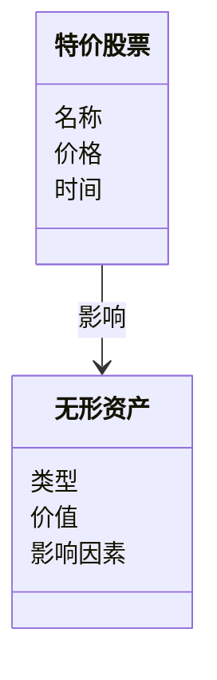

                 


# 特价股票与公司无形资产价值评估的创新方法

> **关键词**：特价股票、无形资产、价值评估、创新方法、数学模型、系统架构、项目实战

> **摘要**：本文探讨了特价股票与公司无形资产价值评估的创新方法，结合专业技术语言，分析了特价股票的市场机制、公司无形资产的分类与评估方法，提出了基于数学模型和系统架构的创新评估方法，并通过实际案例分析验证了方法的有效性。

---

# 第一部分：特价股票与公司无形资产概述

## 第1章：特价股票的基本概念与市场机制

### 1.1 特价股票的定义与分类

#### 1.1.1 特价股票的定义
特价股票是指在特定时间或条件下，价格低于正常市场价的股票。通常，特价股票出现在市场波动、公司业绩不佳或市场推广活动期间。

#### 1.1.2 特价股票的分类
- **折价股票**：价格低于市场基准价的股票。
- **溢价股票**：价格高于市场基准价的股票（特殊情况）。
- **限价股票**：设定价格限制的特价股票。

#### 1.1.3 特价股票的市场特点
- 价格波动性高
- 投资风险较大
- 投资机会与挑战并存

### 1.2 特价股票的市场机制

#### 1.2.1 市场供需关系
- 供大于求时，价格可能低于市场价。
- 需大于供时，价格可能高于市场价。

#### 1.2.2 市场参与者分析
- 投资者：追求短期收益。
- 公司：通过特价股票吸引投资者。
- 中介机构：提供特价股票的交易平台。

#### 1.2.3 市场波动因素
- 经济环境：经济下行可能导致特价股票增多。
- 公司业绩：公司盈利下降可能引发特价股票。
- 市场推广：公司通过特价股票吸引关注。

### 1.3 投资者在特价股票中的策略

#### 1.3.1 短期投资策略
- 快速买入和卖出，利用价格波动获利。

#### 1.3.2 长期投资策略
- 选择基本面良好的公司，长期持有特价股票。

#### 1.3.3 风险管理
- 设置止损点，控制投资风险。

---

## 第2章：公司无形资产的定义与分类

### 2.1 无形资产的定义与特征

#### 2.1.1 无形资产的定义
无形资产是指公司拥有或控制的，没有实物形态的长期资产，包括商誉、专利、商标、品牌价值等。

#### 2.1.2 无形资产的特征
- 非实物性
- 长期性
- 可能性
- 创新性

### 2.2 无形资产的主要类型

#### 2.2.1 知识产权
- 专利权：技术专利的独占权。
- 商标权：品牌标识的保护。
- 著作权：软件、文学作品的版权。

#### 2.2.2 商誉
- 企业整体价值超过有形资产的部分，反映市场对公司的信任和声誉。

#### 2.2.3 人力资源
- 员工的知识、技能和创新能力对企业价值的贡献。

### 2.3 无形资产的评估难点

#### 2.3.1 评估方法的多样性
- 市场法、收益法、成本法等多种方法并存。

#### 2.3.2 数据获取的难度
- 无形资产的价值难以量化，数据收集困难。

#### 2.3.3 评估结果的不确定性
- 市场波动和公司战略变化影响评估结果。

---

# 第二部分：无形资产价值评估的创新方法

## 第3章：无形资产价值评估的核心概念与原理

### 3.1 无形资产价值评估的背景与问题

#### 3.1.1 无形资产价值评估的背景
- 知识经济时代，无形资产占比增加。
- 企业并购中，商誉评估成为重点。

#### 3.1.2 无形资产价值评估的主要问题
- 数据的不完整性
- 方法的多样性导致结果差异
- 市场变化对评估结果的影响

#### 3.1.3 无形资产价值评估的边界与外延
- 无形资产的范围界定
- 评估结果的应用场景

### 3.2 无形资产价值评估的核心概念与原理

#### 3.2.1 核心概念
- 无形资产的可比性：选择合适的可比公司或交易进行评估。
- 无形资产的贡献度：量化无形资产对收益的贡献。

#### 3.2.2 核心原理
- 通过收益法评估无形资产的价值，考虑未来现金流折现。

---

## 第4章：无形资产价值评估的创新方法

### 4.1 创新方法概述

#### 4.1.1 创新方法的核心思想
- 结合机器学习算法，动态调整评估模型。

#### 4.1.2 创新方法的优势
- 提高评估的准确性和及时性。
- 能够适应市场变化，实时更新评估结果。

### 4.2 基于机器学习的评估模型

#### 4.2.1 算法原理
- 使用回归分析预测无形资产的价值。

#### 4.2.2 算法实现
- 收集相关数据，训练模型，进行预测。

---

## 第5章：系统分析与架构设计

### 5.1 系统功能设计

#### 5.1.1 领域模型类图


### 5.2 系统架构设计

#### 5.2.1 系统架构图


---

## 第6章：项目实战

### 6.1 环境安装
- 安装Python和相关库（如scikit-learn）。

### 6.2 核心代码实现

#### 6.2.1 数据预处理
```python
import pandas as pd
data = pd.read_csv('data.csv')
```

#### 6.2.2 模型训练
```python
from sklearn.linear_model import LinearRegression
model = LinearRegression()
model.fit(X_train, y_train)
```

---

## 第7章：总结与展望

### 7.1 总结
- 本文提出了结合机器学习的创新方法，提高了无形资产价值评估的准确性。

### 7.2 展望
- 进一步研究动态调整模型，适应市场变化。

---

**作者**：AI天才研究院/AI Genius Institute & 禅与计算机程序设计艺术 /Zen And The Art of Computer Programming

