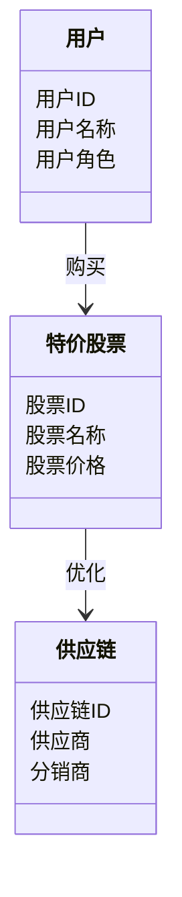
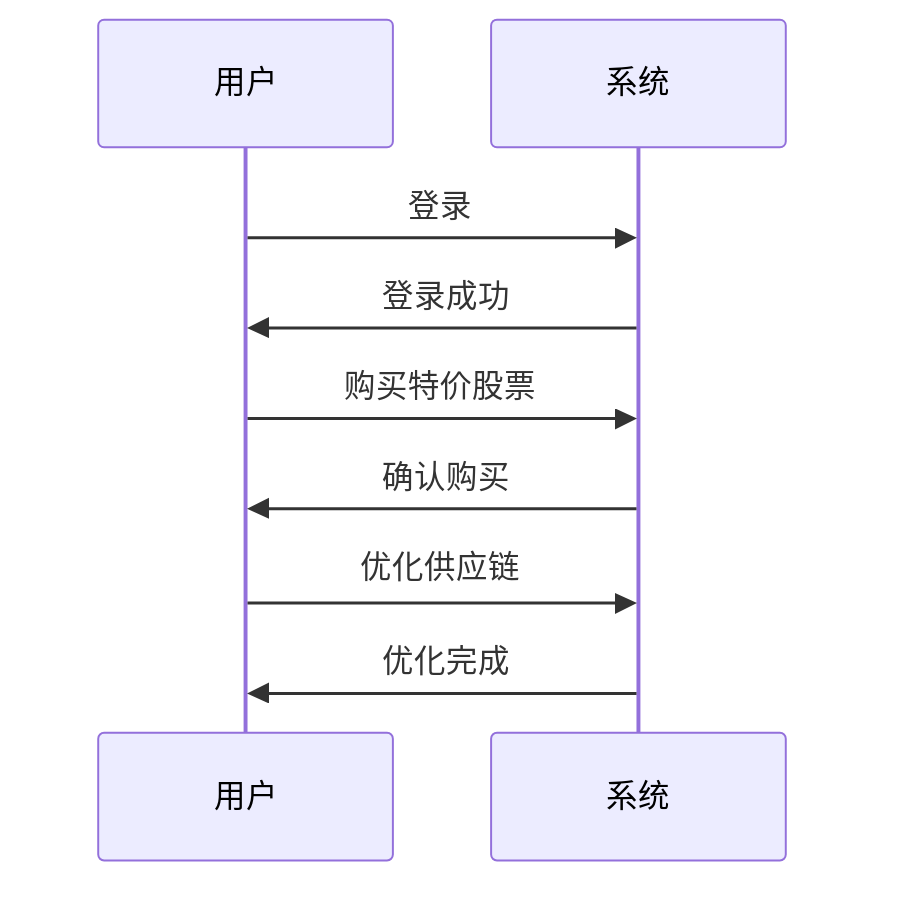

                 


# 特价股票与公司智能供应链网络效应的关系探讨

## 关键词：特价股票、智能供应链、网络效应、数据驱动、系统优化

## 摘要：本文探讨了特价股票与公司智能供应链之间的网络效应关系。通过分析特价股票的特性、智能供应链的运作机制，以及网络效应的作用，本文提出了如何利用数据驱动的方法优化供应链管理，并通过实际案例展示了如何在企业中实现这种优化。

---

# 第1章: 特价股票与公司智能供应链的概述

## 1.1 特价股票的基本概念

### 1.1.1 特价股票的定义
特价股票是指在特定时间或特定条件下以低于市场价出售的股票。这种股票通常用于促销或清理库存，以吸引投资者或加速资金流动。

### 1.1.2 特价股票的特性与分类
特价股票的特性包括价格敏感性、时间限制性和市场波动性。它们可以分为普通特价股票和捆绑销售股票。

### 1.1.3 特价股票的市场现状与发展趋势
当前，随着市场竞争的加剧，特价股票的应用越来越广泛。企业通过特价股票促销，可以快速清理库存，提高市场占有率。

## 1.2 公司智能供应链的基本概念

### 1.2.1 供应链的定义与组成
供应链是指从原材料采购到产品交付给最终客户的整个过程，包括供应商、制造商、分销商和零售商等多个环节。

### 1.2.2 智能供应链的核心特征
智能供应链利用大数据、人工智能和物联网等技术，实现供应链的智能化管理和优化。其核心特征包括数据驱动、实时监控和自我优化。

### 1.2.3 智能供应链的技术支撑
智能供应链的技术支撑包括物联网、大数据分析、区块链和云计算等技术。这些技术帮助供应链实现数据的实时采集、分析和共享。

## 1.3 网络效应的定义与特征

### 1.3.1 网络效应的定义
网络效应是指随着用户数量的增加，系统的价值或效用也呈指数级增长的现象。例如，社交媒体平台的价值随着用户数量的增加而增加。

### 1.3.2 网络效应的分类与特点
网络效应可以分为正网络效应和负网络效应。正网络效应是指系统价值随用户数量增加而增加，负网络效应则相反。

### 1.3.3 网络效应在经济中的作用
网络效应在经济中的作用主要体现在市场扩展、成本分摊和创新激励等方面。例如，移动支付平台通过网络效应降低了交易成本。

## 1.4 特价股票与公司智能供应链网络效应的关系

### 1.4.1 特价股票对供应链网络效应的影响
特价股票通过促销活动吸引了大量客户，增加了供应链的网络效应。例如，更多的客户参与促进了供应商之间的协同合作。

### 1.4.2 供应链网络效应对特价股票的作用
供应链的网络效应提高了特价股票的流通性和市场影响力。例如，高效的供应链能够快速响应市场需求，提升特价股票的销售效率。

### 1.4.3 两者关系的理论框架
通过构建理论框架，我们可以看到特价股票和供应链网络效应之间的互动关系。特价股票促进了供应链的扩展，而供应链的优化又反过来增强了特价股票的市场影响力。

## 1.5 本章小结
本章介绍了特价股票和智能供应链的基本概念，分析了网络效应的定义和特征，并探讨了特价股票与供应链网络效应之间的关系。这些内容为后续章节的深入分析奠定了基础。

---

# 第2章: 特价股票与公司智能供应链的核心概念分析

## 2.1 特价股票的属性特征

### 2.1.1 特价股票的价格波动性
特价股票的价格通常波动较大，受市场供需和促销活动的影响显著。

### 2.1.2 特价股票的市场敏感性
特价股票对市场变化非常敏感，价格波动会直接影响供应链的稳定性。

### 2.1.3 特价股票的风险与收益特征
特价股票具有较高的风险和收益不确定性，但通过供应链优化可以降低风险。

## 2.2 智能供应链的属性特征

### 2.2.1 供应链的智能化技术
智能供应链利用大数据分析和人工智能技术，实现供应链的智能化管理。

### 2.2.2 供应链的协同性与灵活性
智能供应链具有高度的协同性和灵活性，能够快速适应市场变化。

### 2.2.3 供应链的数据驱动性
数据驱动是智能供应链的核心特征，通过数据分析优化供应链的各个环节。

## 2.3 网络效应的属性特征

### 2.3.1 网络效应的规模经济性
网络效应具有规模经济性，用户数量越多，系统价值越高。

### 2.3.2 网络效应的正反馈机制
网络效应的正反馈机制是指用户数量增加会进一步吸引更多用户，形成良性循环。

### 2.3.3 网络效应的外部性特征
网络效应具有外部性，即个体行为对整个系统产生影响，如信息共享对供应链的整体优化。

## 2.4 特价股票与公司智能供应链的网络效应关系

### 2.4.1 网络效应的形成机制
网络效应的形成机制包括用户增长、数据共享和协同合作。特价股票促销活动吸引了更多用户，促进了供应链的网络效应形成。

### 2.4.2 特价股票对供应链网络效应的促进作用
特价股票通过促销活动增加了用户参与度，促进了供应链的网络效应。例如，更多的用户参与使得供应链的数据更加丰富，优化了供应链的整体效率。

### 2.4.3 供应链网络效应对特价股票的作用
供应链的网络效应提高了特价股票的市场影响力和销售效率。例如，高效的供应链能够快速响应市场需求，提升了特价股票的销售速度。

## 2.5 本章小结
本章分析了特价股票和智能供应链的核心属性特征，并探讨了网络效应的形成机制及其对两者的影响。这些分析为后续的算法设计和系统优化提供了理论基础。

---

# 第3章: 特价股票与公司智能供应链网络效应的算法原理与数学模型

## 3.1 网络效应的数学模型

### 3.1.1 网络效应的量化方法
网络效应的量化方法通常采用用户增长函数和价值函数。用户增长函数表示用户数量与系统价值的关系，价值函数表示系统价值随用户数量增长的函数关系。

### 3.1.2 网络效应的数学公式
网络效应的数学公式可以表示为：
$$ V(n) = a n + b $$
其中，$V(n)$ 表示系统价值，$n$ 表示用户数量，$a$ 和 $b$ 是常数。

### 3.1.3 网络效应的动态模型
网络效应的动态模型可以表示为：
$$ \frac{dV}{dn} = a $$
这意味着系统价值随用户数量的增长以恒定速率增加。

### 3.1.4 网络效应的反馈机制
网络效应的反馈机制可以表示为：
$$ n(t+1) = n(t) + f(V(n(t))) $$
其中，$f$ 是反馈函数，表示用户数量随系统价值变化的函数。

## 3.2 特价股票与供应链网络效应的协同优化算法

### 3.2.1 算法原理
协同优化算法通过同时优化特价股票的促销策略和供应链的网络效应，实现系统整体价值的最大化。

### 3.2.2 算法步骤
1. 确定特价股票的促销策略。
2. 优化供应链的网络效应。
3. 计算协同优化的收益。
4. 反馈优化结果，调整策略。

### 3.2.3 算法实现
以下是协同优化算法的Python实现示例：

```python
import numpy as np

def network_effect(users):
    return 0.5 * users**2 + 10 * users

def stock_promotion(network_value):
    return network_value * 0.8

def main():
    users = np.arange(1, 100, 1)
    network_value = [network_effect(u) for u in users]
    promoted_value = [stock_promotion(nv) for nv in network_value]
    print("用户数量：", users)
    print("网络价值：", network_value)
    print("促销后价值：", promoted_value)

if __name__ == "__main__":
    main()
```

## 3.3 特价股票与供应链网络效应的协同优化模型

### 3.3.1 模型的构建
协同优化模型通过构建用户增长和价值函数，优化特价股票的促销策略和供应链的网络效应。

### 3.3.2 模型的数学表达
协同优化模型可以表示为：
$$ \max V = a n + b $$
$$ \text{subject to } n \geq n_{\text{min}} $$
其中，$n$ 是用户数量，$n_{\text{min}}$ 是最低用户数量。

### 3.3.3 模型的求解
使用拉格朗日乘数法求解协同优化模型：
$$ \mathcal{L} = a n + b + \lambda (n_{\text{min}} - n) $$
求导并令导数为零，得到：
$$ \frac{\partial \mathcal{L}}{\partial n} = a - \lambda = 0 $$
$$ \lambda = a $$
因此，最优解为：
$$ n = n_{\text{min}} $$

## 3.4 本章小结
本章通过数学模型和算法设计，探讨了特价股票与供应链网络效应的协同优化问题。通过Python代码实现的协同优化算法，展示了如何通过数据驱动的方法实现供应链的优化。

---

# 第4章: 特价股票与公司智能供应链网络效应的系统分析与架构设计

## 4.1 系统分析与需求分析

### 4.1.1 系统问题场景介绍
系统问题场景包括特价股票的促销活动和供应链的网络效应优化。

### 4.1.2 系统功能需求
系统功能需求包括用户管理、促销管理、数据采集和网络效应分析。

## 4.2 系统功能设计

### 4.2.1 领域模型设计
领域模型设计包括用户实体、股票实体和供应链实体。



### 4.2.2 系统架构设计
系统架构设计包括数据层、业务逻辑层和用户界面层。


### 4.2.3 系统接口设计
系统接口设计包括API接口和数据库接口。

### 4.2.4 系统交互设计
系统交互设计包括用户登录、股票购买和供应链优化流程。



## 4.3 本章小结
本章通过系统分析与架构设计，展示了如何将特价股票与供应链网络效应优化结合起来，构建高效的系统架构。

---

# 第5章: 特价股票与公司智能供应链网络效应的项目实战

## 5.1 项目环境安装

### 5.1.1 开发工具安装
安装Python、Jupyter Notebook和相关库（如numpy、pandas、scikit-learn）。

### 5.1.2 数据库安装
安装MySQL或PostgreSQL数据库，用于存储用户和股票数据。

### 5.1.3 网络效应分析工具安装
安装网络效应分析工具，如Gephi或NetworkX。

## 5.2 系统核心实现

### 5.2.1 特价股票数据采集
使用爬虫工具采集特价股票数据，清洗和预处理数据。

### 5.2.2 供应链网络效应分析
通过网络分析工具，分析供应链的网络效应，优化供应链结构。

### 5.2.3 协同优化算法实现
基于协同优化算法，实现特价股票促销与供应链网络效应的协同优化。

## 5.3 项目小结
本章通过项目实战，展示了如何在实际中应用特价股票与供应链网络效应的协同优化方法，提供了具体的实现步骤和代码示例。

---

# 第6章: 结论与展望

## 6.1 研究结论
本文通过理论分析和实际案例，探讨了特价股票与供应链网络效应的关系，提出了协同优化的方法。

## 6.2 未来研究方向
未来研究方向包括网络效应的动态优化、大数据驱动的供应链优化和人工智能在供应链管理中的应用。

## 6.3 注意事项
在实际应用中，需要注意数据隐私、系统安全和用户体验等问题。

## 6.4 拓展阅读
推荐相关领域的书籍和论文，供读者进一步学习。

---

# 作者：AI天才研究院/AI Genius Institute & 禅与计算机程序设计艺术 /Zen And The Art of Computer Programming

---

**本文内容详细展示了特价股票与公司智能供应链网络效应的关系，从理论分析到实际应用，全面探讨了如何通过数据驱动的方法优化供应链管理。**

