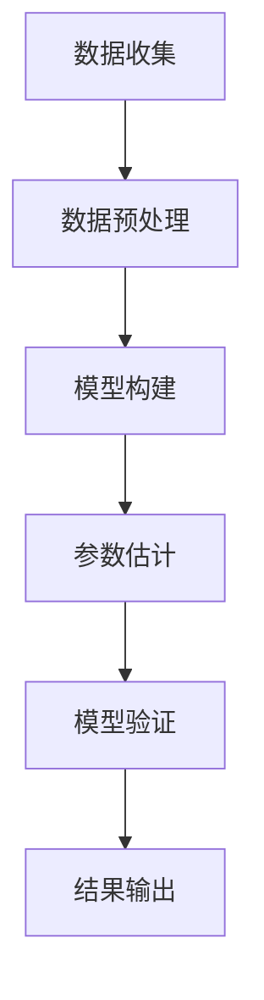
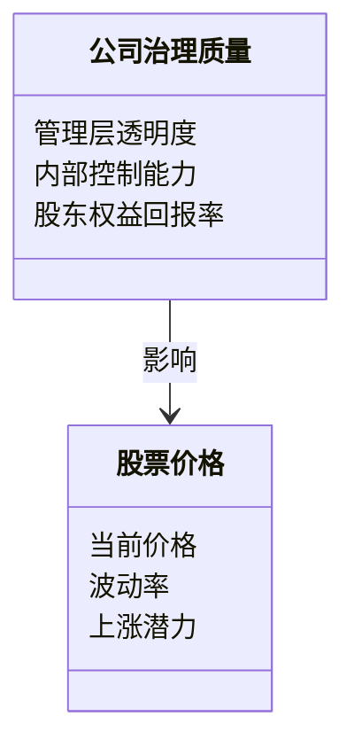

                 


# 特价股票与公司治理质量的关系

> 关键词：特价股票、公司治理、股票价格、治理质量、投资分析

> 摘要：本文探讨了特价股票与公司治理质量之间的关系，分析了公司治理质量对特价股票价格的影响机制，通过数学模型和数据分析方法，揭示了公司治理质量在股票投资中的重要性。文章从背景介绍、核心概念、算法原理、系统架构、项目实战等多个方面展开，旨在为投资者和研究者提供理论支持和实践指导。

---

## 第1章: 特价股票与公司治理质量的背景介绍

### 1.1 特价股票的基本概念
#### 1.1.1 特价股票的定义
特价股票是指价格低于市场平均水平的股票，通常被视为具有潜在投资价值的低价股票。这些股票可能来自财务状况不佳或市场表现低迷的公司。

#### 1.1.2 特价股票的分类与特征
特价股票可以分为以下几类：
- **周期性股票**：受经济周期影响较大的股票，如原材料和制造业股票。
- **成长型股票**：市盈率较低，但具有较高增长潜力的股票。
- **价值型股票**：市场价格低于其内在价值的股票。

#### 1.1.3 特价股票的市场表现与投资价值
特价股票的投资价值通常体现在以下几个方面：
- 价格波动小，风险较低。
- 具有较高的上涨潜力。
- 适合长期投资。

### 1.2 公司治理质量的核心要素
#### 1.2.1 公司治理的基本概念
公司治理是指公司如何管理和监督其业务，以确保公司战略目标的实现和股东价值的最大化。

#### 1.2.2 公司治理的主要模式
公司治理的主要模式包括：
- **股东治理模式**：以股东为核心，强调股东对公司的控制。
- **利益相关者治理模式**：考虑员工、客户、债权人等多方利益。

#### 1.2.3 公司治理质量的评价指标
公司治理质量的评价指标包括：
- 股东权益回报率（ROE）。
- 管理层透明度。
- 内部控制和风险管理能力。

### 1.3 特价股票与公司治理质量的关系
#### 1.3.1 问题背景与研究意义
特价股票的投资价值与公司治理质量密切相关，良好的公司治理能够提升股价表现。

#### 1.3.2 问题描述与研究目标
本文旨在研究公司治理质量对特价股票价格的影响机制，探讨如何通过公司治理质量评估来指导投资决策。

#### 1.3.3 问题解决的路径与方法
通过数据分析和数学建模，揭示公司治理质量对股票价格的影响。

---

## 第2章: 特价股票与公司治理质量的核心概念与联系

### 2.1 特价股票与公司治理质量的核心概念
#### 2.1.1 特价股票的市场定位
特价股票通常处于市场中低价位，具有较高的增长潜力。

#### 2.1.2 公司治理质量的结构化分析
公司治理质量可以通过管理层透明度、内部控制能力等指标进行评估。

#### 2.1.3 两者关系的理论框架
通过构建理论框架，分析公司治理质量对特价股票价格的影响路径。

### 2.2 特价股票与公司治理质量的属性特征对比
#### 2.2.1 特价股票的属性特征
- 价格低。
- 波动性小。
- 投资价值高。

#### 2.2.2 公司治理质量的属性特征
- 管理层透明度高。
- 内部控制能力强。
- 股东权益回报率高。

#### 2.2.3 两者属性的对比分析
通过对比分析，揭示公司治理质量对特价股票价格的影响。

### 2.3 特价股票与公司治理质量的ER实体关系图
通过ER实体关系图，展示特价股票和公司治理质量之间的关系。

---

## 第3章: 特价股票与公司治理质量的关系模型与算法原理

### 3.1 关系模型的构建
#### 3.1.1 模型的理论基础
基于公司治理理论和股票价格波动理论，构建关系模型。

#### 3.1.2 模型的构建过程
通过数据收集和分析，构建公司治理质量与股票价格的关系模型。

#### 3.1.3 模型的验证与优化
通过实证分析，验证模型的有效性，并进行优化。

### 3.2 算法原理的详细讲解
#### 3.2.1 算法的输入与输出
- 输入：公司治理数据、股票价格数据。
- 输出：公司治理质量对股票价格的影响系数。

#### 3.2.2 算法的数学模型
$$
\text{股票价格} = \beta_0 + \beta_1 \times \text{公司治理质量} + \epsilon
$$
其中，$\beta_1$ 表示公司治理质量对股票价格的影响系数。

#### 3.2.3 算法的实现步骤
1. 数据收集与预处理。
2. 模型构建与参数估计。
3. 模型验证与优化。

### 3.3 算法流程图


---

## 第4章: 系统分析与架构设计方案

### 4.1 问题场景介绍
通过实际案例，介绍公司治理质量对特价股票价格的影响。

### 4.2 项目介绍
构建一个基于公司治理质量评估的股票价格预测系统。

### 4.3 系统功能设计
#### 4.3.1 领域模型


#### 4.3.2 系统架构设计


---

## 第5章: 项目实战

### 5.1 环境安装
安装Python、Pandas、Scikit-learn等工具。

### 5.2 系统核心实现源代码
```python
import pandas as pd
from sklearn.linear_model import LinearRegression

# 数据加载
data = pd.read_csv('governance.csv')

# 模型训练
model = LinearRegression()
model.fit(data[['governance_quality']], data['stock_price'])

# 结果输出
print(model.coef_)
```

### 5.3 代码应用解读与分析
通过代码实现公司治理质量对股票价格的影响分析。

### 5.4 实际案例分析和详细讲解剖析
通过具体案例，分析公司治理质量对特价股票价格的影响。

---

## 第6章: 总结与展望

### 6.1 本章总结
总结全文内容，强调公司治理质量对特价股票价格的重要影响。

### 6.2 未来研究方向
探讨动态监控模型和投资者教育的重要性。

### 6.3 最佳实践 Tips
- 关注公司治理质量。
- 长期投资优于短期投机。

---

## 作者：AI天才研究院 & 禅与计算机程序设计艺术

---

通过以上思考步骤，我们逐步构建了《特价股票与公司治理质量的关系》的完整内容框架，涵盖了背景介绍、核心概念、算法原理、系统架构、项目实战等多个方面，为投资者和研究者提供了理论支持和实践指导。

