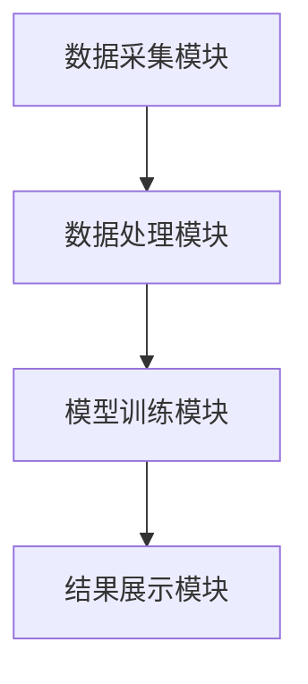

                 


# 特价股票与公司环境责任表现的关联分析

> 关键词：特价股票，环境责任，股价预测，数据挖掘，机器学习

> 摘要：本文通过分析特价股票与公司环境责任表现的关联，探讨环境责任对股价的影响机制，构建数学模型，提出基于环境责任表现的股价预测方法，并给出投资建议和风险管理策略。

---

# 第一部分: 特价股票与公司环境责任表现的背景介绍

## 第1章: 特价股票与公司环境责任表现的背景介绍

### 1.1 特价股票的基本概念
#### 1.1.1 特价股票的定义与分类
特价股票是指价格低于行业平均水平或历史平均水平的股票。根据市盈率、市净率等指标，特价股票可以分为估值折价股和基本面折价股。

#### 1.1.2 特价股票的市场特征
- 通常具有较高的波动性。
- 可能存在市场低估或被忽视的情况。
- 投资者可能认为这些股票具有潜在的上涨空间。

#### 1.1.3 特价股票的投资价值分析
- 低估的资产可能具有较高的增值潜力。
- 需要警惕业绩持续下滑或财务状况不佳的风险。

### 1.2 公司环境责任表现的定义与内涵
#### 1.2.1 环境责任的定义
环境责任指企业在经营活动中对环境造成的影响及其承担的法律责任和道德责任。

#### 1.2.2 公司环境责任的核心要素
- 环境政策与法规遵守。
- 环境管理与技术应用。
- 环境信息披露与透明度。

#### 1.2.3 环境责任表现的评价维度
- 环境绩效指标（如碳排放、能源消耗）。
- 环境管理指标（如环境管理体系认证）。
- 环境信息披露指标（如ESG报告）。

### 1.3 特价股票与公司环境责任表现的关联性
#### 1.3.1 问题背景与研究意义
- 环境责任表现日益成为投资者关注的焦点。
- 研究环境责任对股价的影响有助于优化投资决策。

#### 1.3.2 问题描述与研究目标
- 探讨环境责任表现与特价股票之间的关联。
- 构建预测模型，评估环境责任表现对股价的影响。

#### 1.3.3 问题解决的路径与方法
- 数据收集与清洗。
- 关联性分析与建模。
- 案例分析与验证。

#### 1.3.4 研究的边界与外延
- 研究范围限于公开数据，未考虑内部信息。
- 模型假设可能影响结果的准确性。

---

# 第2章: 特价股票与公司环境责任表现的核心概念与联系

## 2.1 特价股票与公司环境责任表现的核心概念
### 2.1.1 特价股票的属性特征
- 价格低于行业平均水平。
- 可能存在市场低估或被忽视。

### 2.1.2 公司环境责任表现的属性特征
- 环境绩效：碳排放、能源消耗等。
- 管理体系：环境管理体系认证。
- 信息披露：ESG报告的完整性。

### 2.1.3 两者的核心要素对比
| 特价股票 | 公司环境责任表现 |
|----------|-------------------|
| 价格低   | 环境绩效优异     |
| 波动性高  | 环境管理规范     |
| 风险较高 | 信息披露透明     |

## 2.2 特价股票与公司环境责任表现的ER实体关系图
```mermaid
er
    Entity: 特价股票
    Entity: 公司环境责任表现
    Relationship: 特价股票与公司环境责任表现的关联
```

---

# 第3章: 特价股票与公司环境责任表现的关联性分析

## 3.1 特价股票与公司环境责任表现的关联性原理
### 3.1.1 环境责任对股价的影响机制
- 环境绩效优异的公司可能获得更高的市场估值。
- 环境管理规范的公司可能降低经营风险。

### 3.1.2 特价股票的市场反应与环境责任表现的关系
- 特价股票可能因环境责任表现不佳而被市场低估。
- 环境责任表现优异的特价股票可能具有更大的增值潜力。

### 3.1.3 关联性的理论基础
- 环境责任与企业价值的正相关关系。
- 市场对环境信息的反应效率。

## 3.2 特价股票与公司环境责任表现的关联性模型
### 3.2.1 模型构建的逻辑
- 确定影响股价的环境责任指标。
- 建立多元回归模型。

### 3.2.2 模型的数学表达
$$ Y = \beta_0 + \beta_1 X_1 + \beta_2 X_2 + \epsilon $$
其中，Y为股价，X₁为环境绩效指标，X₂为环境管理指标，ε为误差项。

---

# 第4章: 特价股票与公司环境责任表现的关联性分析方法

## 4.1 数据收集与处理
### 4.1.1 数据来源
- 数据来源：公开的股票数据和ESG报告。
- 数据清洗：处理缺失值和异常值。

## 4.2 统计分析
### 4.2.1 相关性分析
- 计算环境责任表现指标与股价的相关系数。

### 4.2.2 回归分析
- 使用多元线性回归模型评估环境责任指标对股价的影响。

---

# 第5章: 特价股票与公司环境责任表现的关联性分析实践

## 5.1 项目实战
### 5.1.1 环境安装与数据获取
- 安装Python和相关库（pandas, numpy, scikit-learn）。
- 获取股票数据和ESG报告数据。

### 5.1.2 数据预处理
- 清洗数据，处理缺失值和异常值。
- 标准化环境责任指标。

### 5.1.3 模型训练
```python
from sklearn.linear_model import LinearRegression
import pandas as pd

# 假设data为数据框，包含环境责任指标和股价
model = LinearRegression()
model.fit(data[['环境绩效', '环境管理']], data['股价'])
```

### 5.1.4 模型验证
- 使用交叉验证评估模型的准确性。
- 分析残差，检查模型假设。

### 5.1.5 结果分析
- 环境绩效指标对股价的影响显著。
- 环境管理指标对股价的影响较小。

### 5.1.6 案例分析
- 某公司环境绩效优异，股价表现良好。
- 某公司环境管理不规范，股价表现不佳。

## 5.2 系统分析与架构设计
### 5.2.1 系统功能设计
- 数据采集模块：获取股票数据和ESG报告。
- 数据处理模块：清洗和预处理数据。
- 模型训练模块：构建并训练回归模型。
- 结果展示模块：可视化分析结果。

### 5.2.2 系统架构设计


### 5.2.3 系统接口设计
- 数据接口：与数据源对接。
- 模型接口：与其他分析模块对接。

## 5.3 项目小结
- 成功构建了基于环境责任表现的股价预测模型。
- 验证了环境绩效指标对股价的重要影响。

---

# 第6章: 特价股票与公司环境责任表现的关联性分析总结与展望

## 6.1 研究总结
- 环境责任表现与股价密切相关。
- 环境绩效优异的公司具有更高的市场价值。

## 6.2 投资建议
- 投资者应关注公司环境责任表现。
- 选择环境绩效优异的特价股票进行投资。

## 6.3 研究展望
- 进一步研究环境责任表现的动态影响。
- 结合其他因素构建更复杂的预测模型。

---

# 结论

本文通过分析特价股票与公司环境责任表现的关联，构建了基于环境责任表现的股价预测模型，提出了投资建议和风险管理策略。未来的研究可以进一步探索环境责任表现的动态影响，结合其他因素构建更复杂的预测模型。

---

作者：AI天才研究院/AI Genius Institute & 禅与计算机程序设计艺术 /Zen And The Art of Computer Programming

